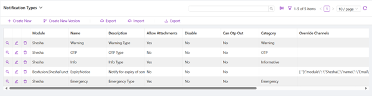
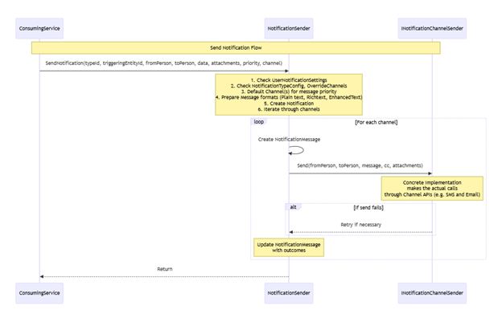
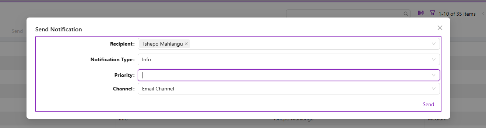
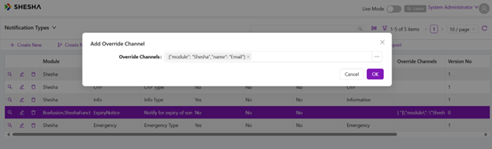
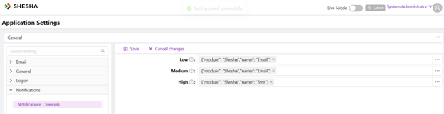

# New Notification Framework Implementation

## Overview
The new notification framework addresses the limitations of the current system by providing a more robust, extensible, and configurable solution. It ensures flexibility in notification channels, supports user preferences, and simplifies integration with consuming applications.

## Key Features

### Default Channels
- SMS and Email supported by Shesha Core

### Extensible Architecture
- Ease of configuration for new channels (e.g., Slack, Teams, WhatsApp)

### Channel Determination
- Based on user preferences, system defaults, or explicit application settings

### Multiple Notification Mechanisms
- Direct messaging is currently supported
- Ease of configuration for new notification mechanisms (bulk; broadcast)

### Asynchronous Message Sending
- Includes optional synchronous mode for time-sensitive messages

## Key Entities

### NotificationChannelConfig
The NotificationChannelConfig entity plays a critical role in the notification framework by defining the capabilities, limitations, and configurations of each notification channel. It ensures the system can manage various channels (like SMS, Email, Slack, Teams, etc.) effectively and consistently while providing flexibility for future channel additions.

The Notification framework comes standard with 2 per-configured channels: SMS and Email.


#### Registering a channel into a project
To integrate a notification channel into your project, you need to register it in the `Startup.cs` file. This ensures that the dependency injection (DI) system recognizes and can use the channel.

For example, to register channels such as email and SMS, you can add the following lines in the `ConfigureServices` method:

    ```csharp
        services.AddTransient<INotificationChannelSender, EmailChannelSender>();
        services.AddTransient<INotificationChannelSender, SmsChannelSender>();
    ```

### NotificationTypes
The NotificationTypeConfig entity is a key component in the notification framework. It defines the configuration for specific types of notifications, allowing the system to handle various notification requirements based on type. This ensures flexibility, consistency, and the ability to override defaults for specific use cases.



### UserNotificationPreference
Stores user-specific preferences for notification types and default channels.

### NotificationTopic
Represents a group or topic for broadcast notifications.

### NotificationTemplate
The NotificationTemplate is a key entity in the notification framework responsible for defining reusable message templates. These templates ensure consistency and efficiency in creating notification content across various channels and formats. By using templates, the system can dynamically generate messages with placeholders replaced by real-time data.

**NOTE:** It is important to configure a template for the type to be used on the notification! This template should be consistent with the type of notification being sent, and the Message Format acceptable by the channel that it will be sent through.

Example: In cases where an Expiry Notice is to be sent through the `Email` Channel, which has a message format of `Rich Text`, an accompanying `template` should be created. If the Expiry Notice notification can also be sent by the `SMS` channel, which has a message format of `Plain Text`, a separate `template` should be created.


## Process Flow



## Implementation Guide

### Prerequisites
1. Inject `INotificationSender` as part of your dependency list:

```csharp
private readonly INotificationSender _notificationSender;

public NotificationAppService(INotificationSender notificationSender)
{
    _notificationSender = notificationSender;
}
```

2. Create an object that inherits from the `NotificationData` class (these are the dynamic `mustache` values that would've been added as part of your created templates `title or body template`)
E.g. titleTemplate = `Dear {{name}}`

```csharp
public class TestData : NotificationData
{
    public string subject { get; set; }
    public string name { get; set; }
    public string body { get; set; }
}
```

This allows for extensibility for different notification scenarios
- **Purpose:** Different types of notifications may need unique data models while still being treated uniformly by the system.
- **Example:**
  - `TestData` for testing purposes with `subject`, `name`, and `body`
  - Another data class might inherit from `NotificationData` for error alerts and include properties like `ErrorCode` and `ErrorMessage`
- **How Inheritance Helps:**
  - These specialized classes can coexist within the system while benefiting from shared logic defined in the base `NotificationData`

3. Your dtos can look like this depending on wether you are sending to an individual or bulk, with the only difference being the type of person, it can either be a list or a single person

    ```csharp
    public class NotificationDto
    {
        public NotificationTypeConfig type { get; set; }
        /// <summary>
        /// 
        /// </summary>
        public NotificationChannelConfig channel { get; set; } = null;
        /// <summary>
        /// 
        /// </summary>
        public long priority { get; set; }
        /// <summary>
        /// 
        /// </summary>
        public Person recipient { get; set; }
        /// <summary>
        /// 
        /// </summary>
        public GenericEntityReference triggeringEntity { get; set; } = null;
    }

    public class BulkNotificationDto
    {
        public NotificationTypeConfig type { get; set; }
        /// <summary>
        /// 
        /// </summary>

        public NotificationChannelConfig channel { get; set; } = null;
        /// <summary>
        /// 
        /// </summary>
        public long priority { get; set; }
        /// <summary>
        /// 
        /// </summary>
        public List<Person> recipients { get; set; }
        /// <summary>
        /// 
        /// </summary>
        public GenericEntityReference triggeringEntity { get; set; } = null;
    }
    ```

### Implementation Example


#### Individual Send
```csharp
 public async Task TestNotificationAsync(NotificationDto notification)
 {
     // Fetch notification type details
     var type = await _notificationTypeRepository.FirstOrDefaultAsync(notification.type.Id);
     if (type == null)
         throw new ArgumentException($"Notification type with ID {notification.type.Id} does not exist.");
     // Get recipient details
     var recipient = await _personRepository.FirstOrDefaultAsync(notification.recipient.Id);
     if (recipient == null)
         throw new ArgumentException($"Recipient with ID {notification.recipient.Id} does not exist.");
     // Get channel details
     var channel = notification.channel != null  ? await _notificationChannelRepository.FirstOrDefaultAsync(notification.channel.Id) : null;
     // Prepare notification data
     var data = new TestData()
     {
         name = recipient.FullName,
         subject = type.Name,
         body = type.Description
     };

     var getAttachments = await _storedFileService.GetAttachmentsAsync(recipient.Id, "Shesha.Domain.Person");
     var attachments = getAttachments.Select(x => new NotificationAttachmentDto()
     {
         FileName = x.FileName,
         StoredFileId = x.Id,
     }).ToList();

     var sender = await GetCurrentPersonAsync();
     if (sender == null)
         throw new InvalidOperationException("Current person could not be determined. Ensure the user is logged in.");

     await _notificationService.SendNotification(
         type,
         sender,
         recipient,
         data,
         (RefListNotificationPriority)notification.priority,
         attachments,
         null,
         channel
     );
 }
```

#### Bulk Send 
```csharp
public async Task BulkPublishAsync (BulkNotificationDto notification)
{
    if(notification.recipients == null || notification.recipients.Count == 0)
        throw new ArgumentException("Recipients must not be null or empty.");
    // Fetch notification type details
    var type = await _notificationTypeRepository.FirstOrDefaultAsync(notification.type.Id);
    if (type == null)
        throw new ArgumentException($"Notification type with ID {notification.type.Id} does not exist.");
    // Get channel details
    var channel = notification.channel != null ? await _notificationChannelRepository.FirstOrDefaultAsync(notification.channel.Id) : null;
    // Prepare notification data
    var data = new TestData()
    {
        name = "Test Name",
    };

    // Get the current person
    var sender = await GetCurrentPersonAsync();
    if (sender == null)
        throw new InvalidOperationException("Current person could not be determined. Ensure the user is logged in.");


    // Send notification to each recipient
    foreach (var reciever in notification.recipients)
    {
        var recipient = await _personRepository.FirstOrDefaultAsync(reciever.Id);
        if (recipient == null)
            throw new Exception($"{nameof(recipient)} must not be null");

        await _notificationService.SendNotification(
            type,
            sender,
            recipient, 
            data,
            (RefListNotificationPriority)notification.priority,
            null,
            null,
            channel
         );
    }
}
```

### Front end Implementation

1. Configure a sending form with properties like recipient, notificationType, channel, and priority.
- If `channel` or `priority` is not explicitly specified, the fallback model will be used




2. Trigger the API call on a button click:

    ```Javascript
    const executeScriptAsync = async (): Promise<any> => {

        const payload ={
            type: data.notificationType,
            priority: data.priority,
            recipients: data.recipients,
            channel: data.channel,
        }
        const PATH = '/api/services/app/Notification/BulkPublish'
            http.post(PATH, payload).then(onSuccess).catch(onError);
    
        function onSuccess(response) {
            console.log(response);
            message.success('Sent!')
        }

        function onError(error) { 
            message.error('No No No!') 

        }
    };
    ```


`NotificationChannel` is an optional parameter on the SendNotification method. More on how the relevant channels are determined below…

## Channel Selection
Relevant channels to send the specified `NotificationType` and priority is determined from a hierarchy of decisions:

1. If a `NotificationChannel` is passed in as one of the parameters on the SendNotification method, the notification will only be sent through this channel.

If no channel is passed as a parameter:
1. User has specified own `UserNotificationSettings` to determine which channel should be used for the `NotificationType`
2. If the specified `NotificationType` has preconfigured `Override Channels`

3. System level `Notification Settings` which specify the default channel(s) for the message priority



#### 
## Asynchronous Message Sending

### How It Works

#### Asynchronous Mode (Default)
- Messages are queued for background processing
- This mode is designed for non-urgent notifications where immediate delivery is not a priority (e.g., marketing emails or reminders)
- Background jobs handle the delivery process, freeing up the main application thread

#### Synchronous Mode (Optional)
- Used for time-sensitive messages (e.g., OTPs, system alerts)
- Messages are sent immediately without being queued
- Ensures real-time communication for scenarios where delays could compromise user experience or system integrity

#### Determining Time Sensitivity
- The NotificationType entity includes an `IsTimeSensitive` flag which defines whether a message is time-sensitive
