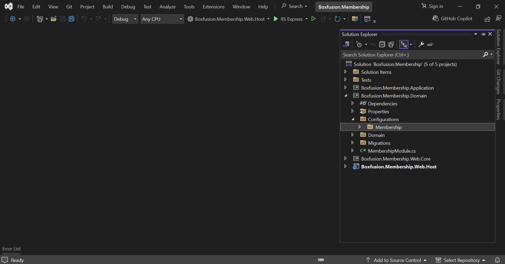
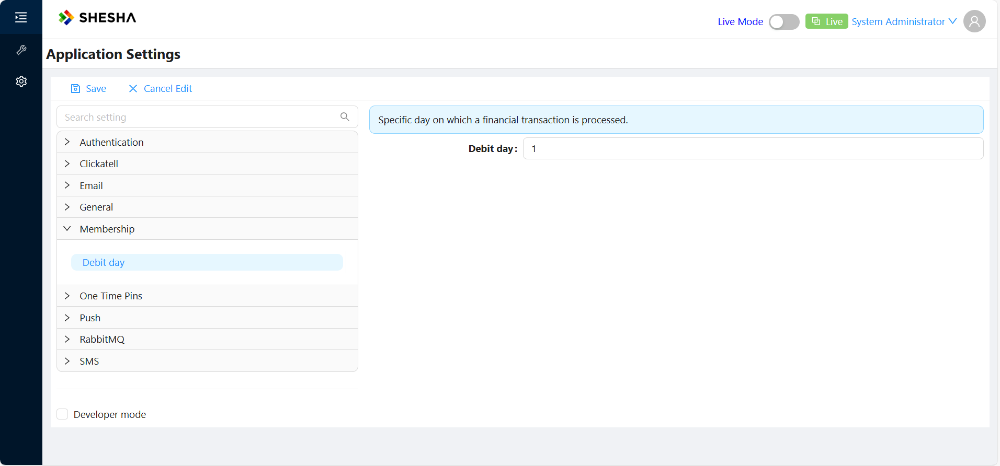
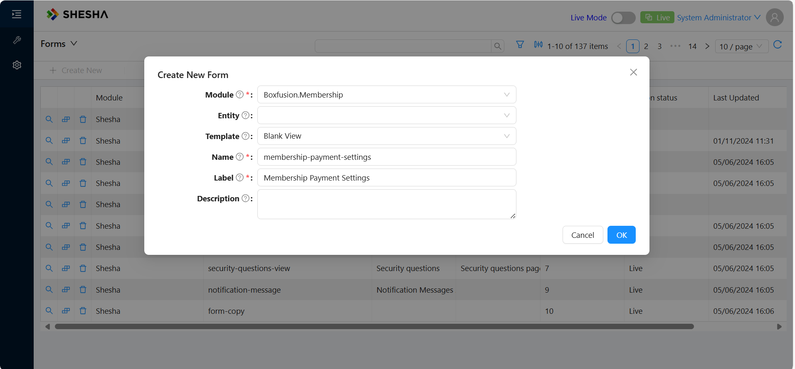
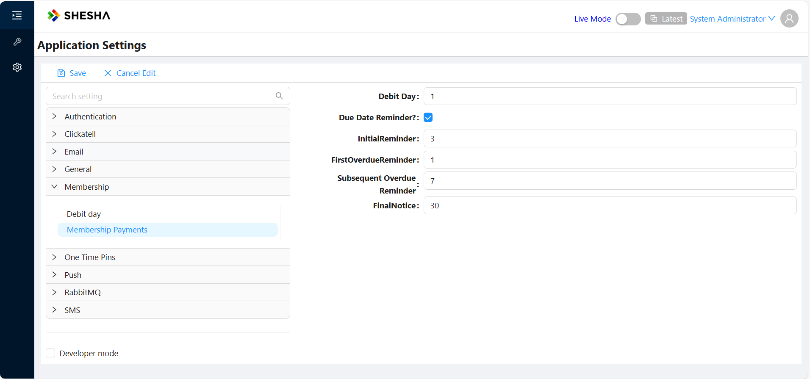

# App Settings

# TODO:
- Start with Admin Panel

---
Shesha uses custom implementation of the application settings. Key features:
1. Settings are strongly typed on the back-end, a developer doesn't need to serialize/deserialize values from strings
2. Auto-registration of setting accessors
3. Setting definitions are stored in the DB
4. Settings defined in the code gets saved to the DB at the application start
4. Support of client specific settings
5. Unlimited length of the setting value

# How to define a setting
A setting must be defined before its use, it should be done in two steps:
1. Define a settings accessor.
2. Register accessors and provide default values.

### Define a settings accessor
Settings accessor is an interface that provides an access to settings values, also it's used to define setting details (display name, description etc.).
You just need to create and interface that extends `ISettingAccessors` and add property for each setting as `ISettingAccessor<T>` where T - type of the setting.

```cs
    /// <summary>
    /// Email settings
    /// </summary>
    [Category("Email")]
    public interface IEmailSettings : ISettingAccessors
    {
        /// <summary>
        /// Emails enabled
        /// </summary>
        [Display(Name = "Emails enabled", Description = "If true, all emails are enabled")]
        [Setting(SheshaSettingNames.Email.EmailsEnabled)]
        ISettingAccessor<bool> EmailsEnabled { get; }

        /// <summary>
        /// Redirect all emails to
        /// </summary>
        [Display(Name = "Redirect all emails to", Description = "If not null or empty the all outgoing emails will be sent to this email address, is used for testing only")]
        [Setting(SheshaSettingNames.Email.RedirectAllMessagesTo)]
        ISettingAccessor<string> RedirectAllMessagesTo { get; }

        /// <summary>
        /// SMTP Settings
        /// </summary>
        [Display(Name = "SMTP Settings")]
        [Setting(SheshaSettingNames.Email.SmtpSettings, EditorFormName = "smtp-settings")]
        ISettingAccessor<SmtpSettings> SmtpSettings { get; }
    }
``` 

On the example above you can see the `IEmailSettings` interface, it has 3 strongly types properties:
1. EmailEnabled - bool
2. RedirectAllMessagesTo - string
3. SmtpSettings - complex object of type `SmtpSettings`

Properties and the interface itself are decorated with the following attributes:
1. `DisplayAttribute` - is used to define a `Display Name`, `Description` and `Category` (using `GroupName` property)
2. `Category` - defines `Category` of the setting, can be applied on the interface level. Note: if the `CategoryAttribute` and `DisplayAttribute` are defined at the same time on the property level the value from `CategoryAttribute` will be applied.
3. `Setting` - defines setting-specific properties:
3.1 `Name` - name of the setting. Property name is used when attribute is missing
3.2 `IsClientSpecific` - indicates that the setting is a client-specific
3.3 `EditorFormName` - name of the custom form that is used as a setting editor

### Register a settings accessor
After creating a settings accessor, we must register it in the PreInitialize method of our module:
```cs
IocManager.RegisterSettingAccessor<IEmailSettings>(s => {
        // set default value
	s.SmtpSettings.WithDefaultValue(new SmtpSettings
	{
		Port = 25,
		UseSmtpRelay = false,
		EnableSsl = false,
	});
});
```

# Read and write setting values on back-end
To read and write setting values you just need to resolve your settings interface (`IEmailSettings` from the example above) and use it's properties. Shesha generates an implementation of the interface automatically when you call `RegisterSettingAccessor`.

In the example below we resolve `IEmailSettings` using constructor injection. The `TestSetting` method reads and writes the `SmtpSetting`, the value is strongly typed and we needn't perform any conversions manually.

```cs
private readonly IEmailSettings _emailSettings;
public SheshaEmailSender(IEmailSettings emailSettings)
{
	_emailSettings = emailSettings;
}

public async Task TestSetting() 
{ 
	// get value
	var smtpSettings = await _emailSettings.SmtpSettings.GetValueAsync();

	// update setting
	smtpSettings.Host = "localhost";
	await _emailSettings.SmtpSettings.SetValueAsync(smtpSettings);
}
```

Note: client-specific settings are handled automatically and you can use the same methods `GetValueAsync` and `SetValueAsync` for reading and writing. Shesha recognizes a current application automatically using the `sha-frontend-application`, see details [here](https://dev.azure.com/boxfusion/Shesha%20Web%20v3.0/_wiki/wikis/Shesha-Web-v3.0.wiki/791/Multiple-front-end-applications-support)

# Read setting values on front-end
`SettingsProvider` is responsibel for reading settings on the front-end. You can use one of these react hooks: 
1. `useSettings` - provides an access to the `SettingsProvider` context
2. `useSettingValue` - reads a single setting from the back-end, see example of the usage below

```ts
const autoLogoffTimeoutSettingId: ISettingIdentifier = { name: 'Shesha.Security.AutoLogoffTimeout', module: 'Shesha' };

export const IdleTimerRenderer: FC<PropsWithChildren<IIdleTimerRendererProps>> = ({ children }) => {
  const { 
    value: autoLogoffTimeout, // contains undefined when setting is not loaded and setting value when loaded
    loadingState, // contains loadingstate ('waiting' | 'loading' | 'ready' | 'failed')
    error // contains error returned by the back-end if http request are failed 
  } = useSettingValue<number>(autoLogoffTimeoutSettingId);

  // note: autoLogoffTimeout contains `undefined` when settings is not yet loaded
  const timeoutSeconds = autoLogoffTimeout ?? 0;
```

# Settings storage and SettingsBootstrapper
Setting definitions and values are stored in the DB, see the diagram below. Shesha saves all settings defined in code to the DB at the application startup using `SettingsBootstrapper`.


# Migrations

`Shesha.FluentMigrator` provides a fluent interface that allows to addition, updating and deletion of application settings.
All migrator expressions are available using `this.Shesha()` extension:
1. `SettingCreate` - create setting configuration
2. `SettingUpdate` - update setting configuration and/or set value
3. `SettingDelete` - delete setting configuration

Examples provided below:

```cs
    [Migration(20230313090500)]
    public class M20230313090500 : AutoReversingMigration
    {
        public override void Up()
        {
            // create a `Greeting` setting in the current module
            this.Shesha().SettingCreate("Greeting", "Login greeting template")
                .WithCategory("Logon") // set category, is unsed in the generic settings UI
                .IsClientSpecific() // mark setting as application specific 
                .AsString(); // set datatype of the setting

            // update value of the `Greeting` setting for the `admin-portal` application
            this.Shesha().SettingUpdate("Greeting")
                .SetValueForApplication("admin-portal", "Welcome!");

            // create a `AutoLogoffTimeout` setting on module `TestModule`
            this.Shesha().SettingCreate("AutoLogoffTimeout", "Auto logoff timeout")
                .OnModule("TestModule")
                .WithDescription("Auto logoff timeout (seconds)")
                .AsInt64();

            // update value of the `AutoLogoffTimeout` setting
            this.Shesha().SettingUpdate("AutoLogoffTimeout")
                // define a module explicitly
                .OnModule("TestModule")
                .SetValue("300");

            // delete setting
            this.Shesha().SettingDelete("AutoLogoffTimeout").FromModule("TestModule");
        }
    }
```

**Note**: if the module is not specified explicitly, Shesha automatically populates it based on the assembly the Migrator file is defined in.

# Settings Administration UI

Shesha provides default Settings Administration UI as part of the application template. It's available here: http://localhost:3000/shesha/settings/


# Simple Application Settings

We'll kick off this section by configuring a simple setting that defines a **Debit day** , which is the day a customer's membership payment is debited from their bank account.

In your Shesha Backend Application, Navigate to the `domain` layer and create a folder called `Configurations`. Then while in the `Configurations` folder, add another folder called `Membership` which gives us some flexibility, in case we want to add other types of settings



In the `Membership` folder, create a new file called `MembershipSettingNames` and add the below code snippet to it 

```cs
    public class MembershipSettingNames
    {
        public const string DebitDay = "Shesha.Membership.DebitDay";
    }
```

This file will store our **Debit day** setting, as well as an additional setting we want to add to the module.

Next, create an Interface class called `IMembershipSettings` that extends the [ISettingAccessors](#define-a-settings-accessor) class and then add the code below to it; 

```cs
    [Category("Membership")]
    public interface IMembershipSettings : ISettingAccessors
    {
        ///<summary>
        ///
        ///</summary>
        [Display(Name = "Debit day", Description = "Specific day on which a financial transaction is processed.")]
        [Setting(MembershipSettingNames.DebitDay)]   
        ISettingAccessor<int> DebitDay { get; set; }

    }
```

Next is to head over to your Module file, depending on what your application name is;


And then in the `PreInitialize` method, add the following code;

```cs
    public override void PreInitialize()
    {
        base.PreInitialize();
        IocManager.RegisterSettingAccessor<IMembershipSettings>(x => x.DebitDay.WithDefaultValue(1));
    }
```

Here, we have registered the **Debit day** setting and given it a default value of One(1), which means we want the debit to occur on the first day of each month.

Now, run your backend and head over to your local build to see the setting we've just created.

Under `Configurations` and then `Settings` you should see the new **Debit day** setting under the module `Membership`.



# Compound Application Settings

Let's create some more settings to give the user more control of the application. We're going to create some Compound settings that will handle more of the payment model. This section builds upon the Simple settings section to help differentiate and understand both more easily, so please review that that section first if you haven’t already.

First thing is to create a new `MembershipSettingName` called `MembershipPayments`, like so;

```cs
    public class MembershipSettingNames
    {
        public const string DebitDay = "Shesha.Membership.DebitDay";

        public const string MembershipPayments = "Shesha.Membership.Payments";
    }
```

**MembershipPayments** is the name of the Compound Setting, similar to how **Debit day** was the name of our simple setting. 

Next, in the Domain Layer, under the **Configuration** and then **Membership** folders, create a new class called `MembershipPaymentSettings` with this piece of code added.

```cs
    public class MembershipPaymentSettings
    {
        /// <summary>
        /// Specific day on which a financial transaction is processed, resulting in the withdrawal of funds from an account.
        /// </summary>
        public int DebitDay { get; set; }

        /// <summary>
        /// Sent a few days before the payment due date to remind the debtor of upcoming payment.
        /// </summary>
        public int InitialReminder { get; set; }

        /// <summary>
        /// Sent on the due date to remind the debtor that the payment is due today.
        /// </summary>
        public bool DueDateReminder { get; set; }

        /// <summary>
        /// Sent immediately after the payment is overdue, typically 1-3 days after the due date.
        /// </summary>
        public int FirstOverdueReminder { get; set; }

        /// <summary>
        /// Sent at regular intervals (e.g every 7, 14, or 30 days) until the payment is made or further action is taken.
        /// </summary>
        public int SubsequentOverdueReminder { get; set; }

        /// <summary>
        /// A stern reminder sent when the payment is significantly overdue, often indicating potential legal action.
        /// </summary>
        public int FinalNotice {  get; set; }
    }
```

Now, let's add a new property to the `IMembershipSettings` class;

```cs
    [Category("Membership")]
    public interface IMembershipSettings : ISettingAccessors
    {

        ......

        ///<summary>
        ///
        ///</summary>
        [Display(Name = "Membership Payments", Description = "Membership Payment debit days and reminder frequencies.")]
        [Setting(MembershipSettingNames.MembershipPayments, EditorFormName = "membership-payment-settings")]
        ISettingAccessor<MembershipPaymentSettings> MembershipPayments { get; set; }
    }
```

We have created a new property `MembershipPayments`, with its `ISettingAccessor<T>` type set to the `MembershipPaymentSettings` class we just created.

Please take note of the `EditorFormName` property, as with Compound settings, we'll need to bind that particular property to a configurable Form on the frontend, so the `EditorFormName` property name must match the exact form name that was configured.

Just like the Simple Settings before, the last step is to register our new Compound Settings in the module file with default values, so modify the `PreInitialize` method so it looks like this;

```cs
        public override void PreInitialize()
        {
            base.PreInitialize();
            IocManager.RegisterSettingAccessor<IMembershipSettings>(x =>
            {
                x.DebitDay.WithDefaultValue(1);
                x.MembershipPayments.WithDefaultValue(new MembershipPaymentSettings
                {
                    DebitDay = 1,
                    InitialReminder = 3,
                    DueDateReminder = true,
                    FirstOverdueReminder = 1,
                    SubsequentOverdueReminder = 7,
                    FinalNotice = 30
                });
            });
        }
```

To be able to check out the new Compound setting, create a new form and set its name to the same name as the `EditorFormName` we discussed earlier. 



Next, add all the properties in `MembershipPaymentSettings` class to the new form. Make sure to camelCase the property name and add a tool description so that the end user has an idea what a property does.


When you navigate to `Configurations` and then `Settings` you should see the new **Membership Payments** compound settings under the module `Membership`.


