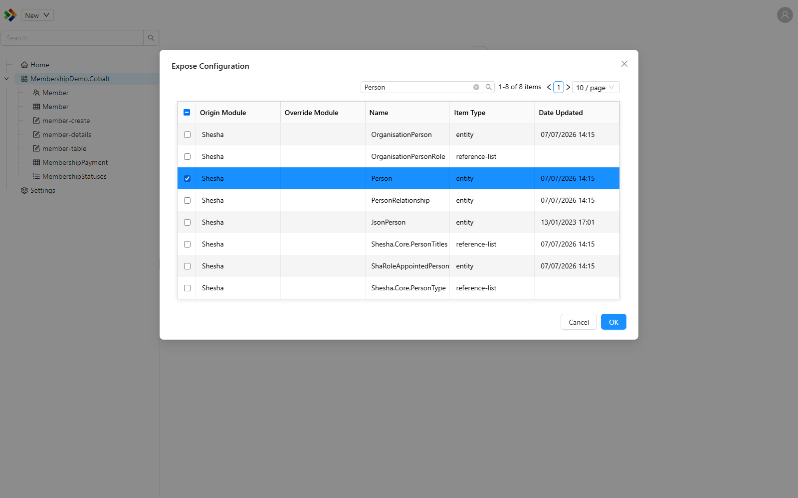
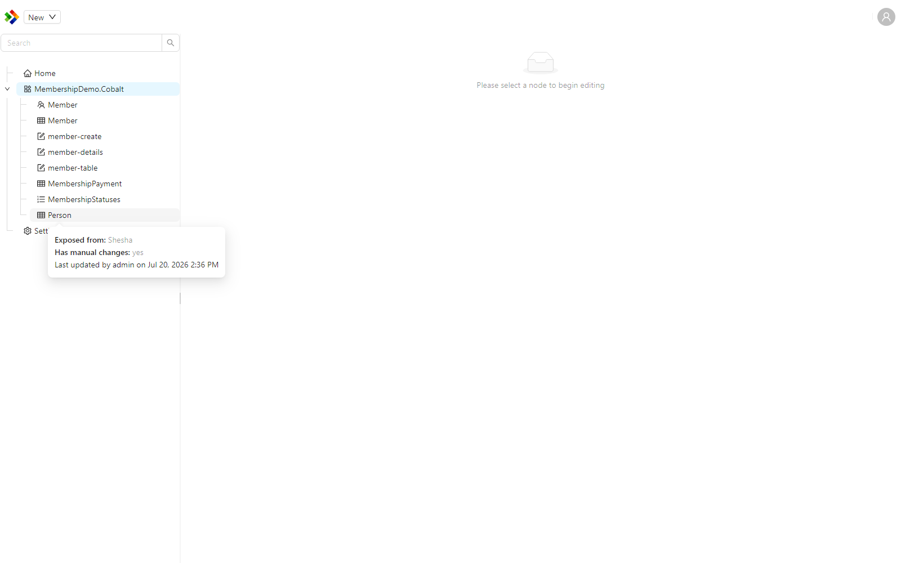

# Expose and Module Hierarchy

Shesha applications are built on top of base modules, such as the framework's own modules and any shared product modules your organisation maintains. Those base modules ship their own configuration items, like forms, reference lists, and entities. The Expose mechanism lets you customise those base items inside your own application without changing the base module, and the module hierarchy decides which version of an item wins at runtime.

---

## Exposing a configuration item

By default, configuration items from a base module are hidden in the [Solution Explorer](./configuration-studio/solution-explorer.md) and are used exactly as the base module defines them. When you want to customise one, you **Expose** it.

Exposing an item creates a protected copy of it inside your own module. You then edit that copy. The original item in the base module is left untouched, which means a future upgrade to the base module cannot overwrite your changes. The exposed copy records which item and which version it was exposed from, so the link back to the original is preserved.

To expose an item, right-click a module or folder in the Solution Explorer and choose **Expose Existing**. A dialog titled "Expose Configuration" lets you pick the base module item to bring into your module. Once exposed, the item appears in your module with an indicator showing it originated in a base module.





:::info
An exposed item is marked as an override of the base item. The Studio shows the message "Configuration originally defined in a base module which has been exposed" when you hover over its indicator.
:::

---

## The module inheritance hierarchy

An application can define an ordered hierarchy of modules. Each module declares the base modules it builds on, and Shesha works out the full chain at startup. A typical hierarchy reads from most specific to most general, for example:

```
MyApp > ProductA > Shesha.Enterprise > Shesha.Core
```

In this example, `MyApp` is the most specific module and `Shesha.Core` is the most general.

---

## How an item is resolved at runtime

When the application needs a configuration item, it does not simply take the first item with a matching name. Instead, it walks the module hierarchy from the most specific module to the most general and returns the first matching item it finds.

This means the most project-specific version of an item always wins. If `MyApp` has exposed and customised a form, that customised version is used. If it has not, Shesha falls back to the version in the next module down the chain, and so on until it reaches the base.

:::note
This resolution order is what makes the Expose mechanism safe. Your exposed copy sits higher in the hierarchy than the base item, so it takes precedence, while the base item remains available as the fallback for everything that has not been customised.
:::

---

## See also

- [Configuration Studio](./configuration-studio/index.md)
- [Shesha Modules](./modules.md)
