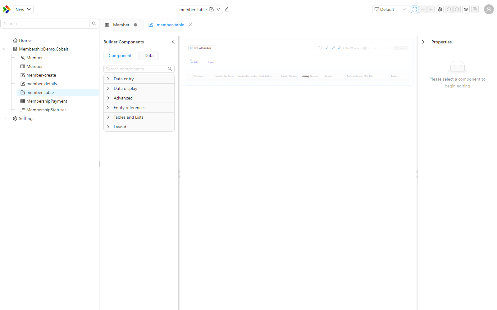
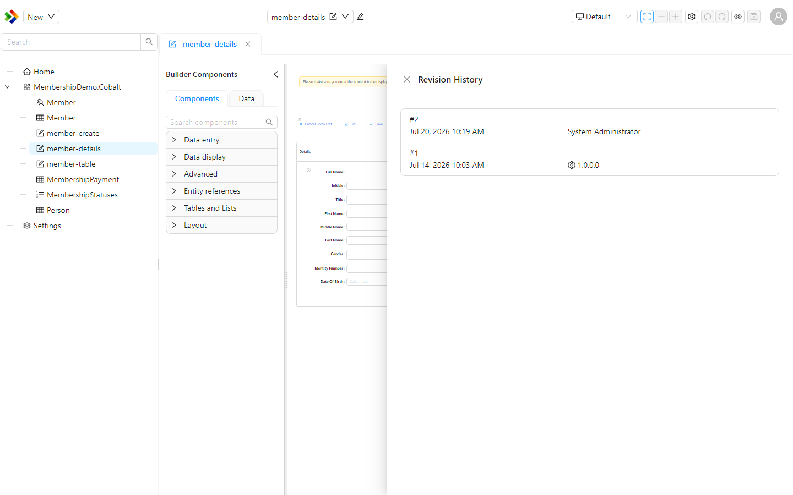

# Editing items

The Work Area is the main part of the Configuration Studio, to the right of the Solution Explorer. It is where configuration items open for editing. When you open an item, the right designer for its type loads inside the Work Area, so editing a form looks different from editing a reference list, but they all open in the same place.

You can have several items open at the same time, each in its own tab, and switch between them without losing your place.

---

## Opening an item

To open an item, find it in the [Solution Explorer](./solution-explorer.md) and double-click it, or right-click it and choose `Open`. The item opens as a tab in the Work Area. Opening another item adds another tab, so you can keep several items open while you work across them.

---

## Working in tabs

The tabs across the top of the Work Area work much like tabs in a web browser.

- Click a tab to switch to that item.
- Drag a tab to reorder the open items.
- Close a tab when you are finished with it.

This makes it easy to work on related items together. For example, you can keep a form and the entity it is based on open at the same time and move between them as you configure both.

:::tip
Keeping related items open in tabs saves you from hunting through the tree each time you switch between them. Open everything you need for a task up front, then work across the tabs.
:::

---

## Saving and unsaved changes

When an open item has changes you have not saved yet, its tab marks itself so you can see at a glance which items still need saving.

If you try to leave the Studio, close the browser tab, or navigate away while you have unsaved changes, the Studio warns you first so your work is not lost by accident. Save each item before you leave to keep your changes.

:::warning
The unsaved-changes warning is your safety net, but it is still good practice to save often. Save an item once you finish a meaningful change rather than leaving many edits unsaved across several tabs.
:::

---

## Versioning is automatic

Configuration items are versioned automatically. Each time you save, the Studio records a new revision for you. You do not have to do anything to create a version.

The older `Draft -> Save as Ready -> Publish` lifecycle used in previous versions has been removed. There is no longer a manual step to mark an item as ready or to publish it before it can be used. Saving is all you need to do.

---

## Reviewing and restoring versions

Because every save is recorded, each item keeps a history you can look back on. To see it, right-click the item in the Solution Explorer and choose `Version History`. From there you can review the saved revisions of the item, and restore an earlier revision if you need to roll a change back.

:::info
Restoring a revision does not erase the history. The restore itself is recorded as a new revision, so you can always move forward again if needed.
:::
