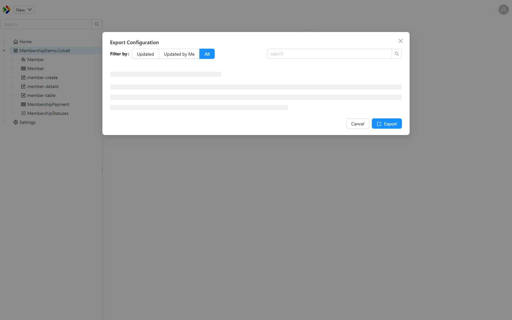
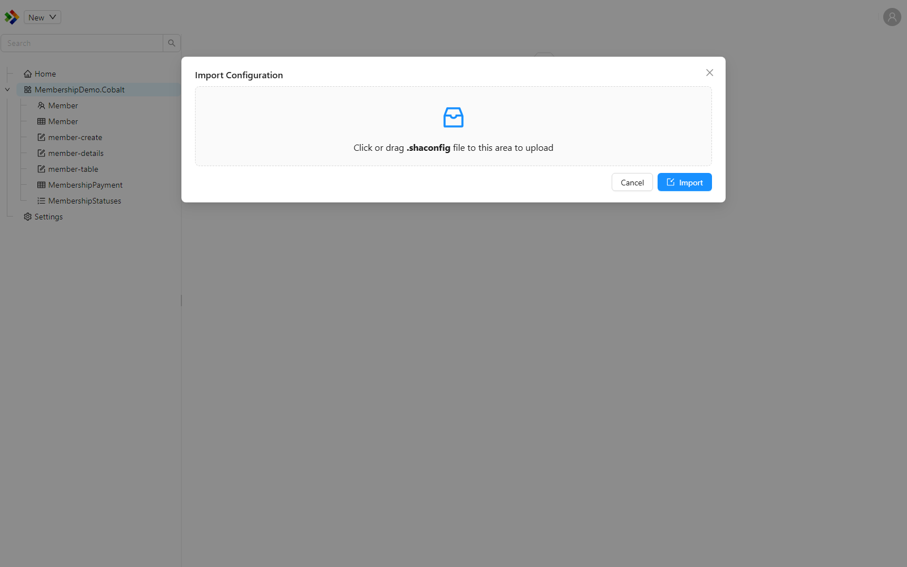

# Importing and exporting

Configuration lives as data inside each environment, so moving a change from one environment to another is not automatic. Importing and exporting is how you carry configuration items between environments, for example promoting work from a development environment to test, and then to production.

Both actions are available straight from the Configuration Studio. Right-click a module or a folder in the [Solution Explorer](./solution-explorer.md) and choose the import or export action. You can also reach them from the toolbar when a module or folder is selected.

The unit you move is a **package**: a single file that bundles the selected configuration items together.

---

## Exporting to a package

The `Export to Package` action produces a configuration package from the items you select. The package is a zip file with a `.shaconfig` extension, named in the format `package[yyyyMMdd]_[HHmm].shaconfig`, for example `package20260613_0930.shaconfig`. Inside, each configuration item is stored in JSON form.

The same `.shaconfig` format is used whether you move configuration by hand, as described here, or embed it in a module for automatic deployment on startup. The automatic option is covered in [Configuration](../configuration.md).

---

## Importing from a package

The `Import from Package` action takes a previously exported `.shaconfig` package and brings its items into the current environment.

Importing is a two-step process by design, so you are never surprised by what an import does:

1. **Preview.** The Studio analyses the package and shows you what each item in it will do to the current environment. Nothing is changed yet.
2. **Confirm.** After you have reviewed the preview and chosen the items to bring in, you confirm the import to apply it.

### The preview

In the preview, every item in the package is given one of the following statuses. The status compares the item in the package against the matching item already in this environment.

| Status | Meaning |
|---|---|
| `Unchanged` | The item in the package matches the item already in this environment, so importing it changes nothing. |
| `New` | The item does not exist in this environment yet and will be created. |
| `Updated` | The item already exists and differs from the package, so importing it will update the existing item. |
| `Error` | The item cannot be analysed or applied. Review the detail shown against the item before importing. |

You can select which items to import from the preview, then confirm to apply the package.

:::warning
Items shown as `Updated` will overwrite the matching items in the current environment with the versions from the package. Review the preview carefully before confirming, especially when importing into production. Anything you want to keep should be exported first.
:::

---

## A typical workflow

A common way to use packages across environments looks like this:

1. Make and save your configuration changes in the development environment.
2. Export the affected items with `Export to Package`.
3. In the target environment, run `Import from Package` and select the package.
4. Review the preview, checking the `New` and `Updated` items.
5. Confirm the import.

:::tip
Export in small, focused packages rather than one large package built up over a long period. Smaller packages are easier to review in the preview, easier to trace back to the change they belong to, and easier to deploy alongside related code changes.
:::

---

## See also

- [Configuration](../configuration.md) - including how to embed a package in a module for automatic deployment on startup.
- [Solution Explorer](./solution-explorer.md) - where the import and export actions live.
