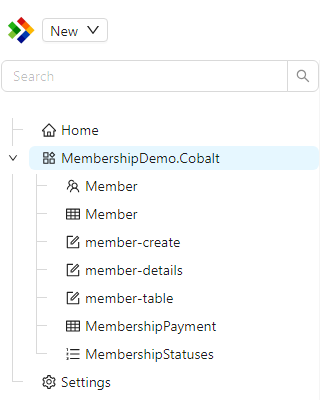
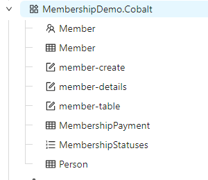
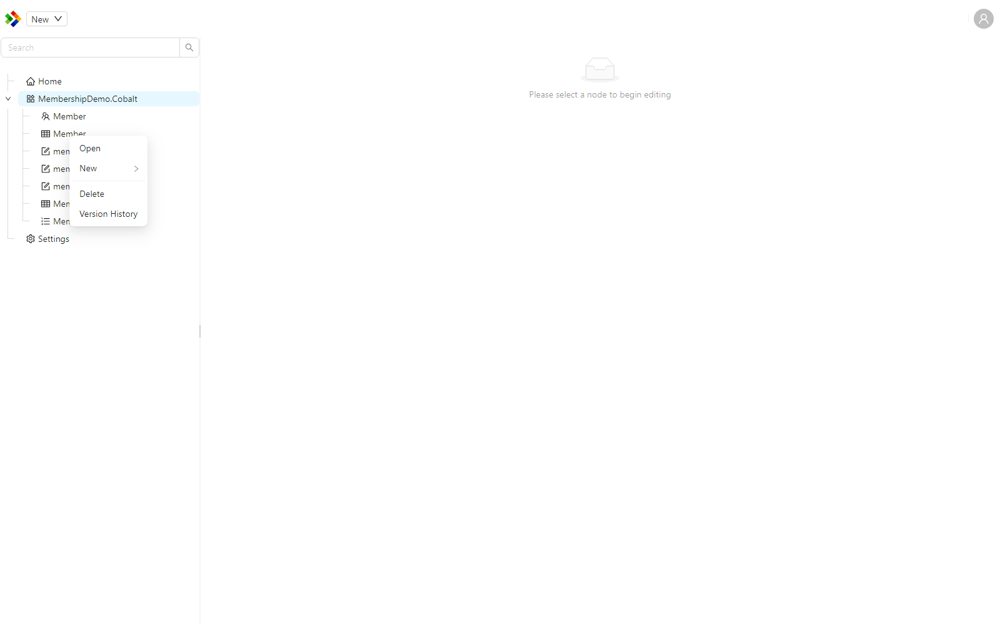
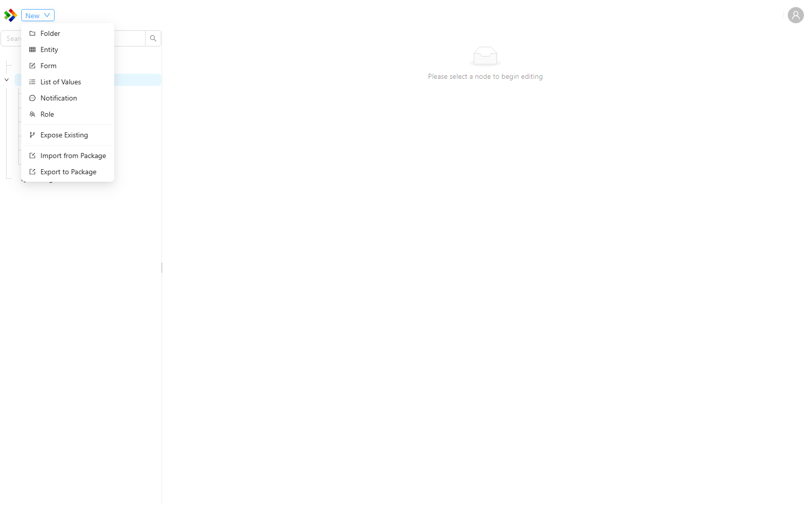

# Solution Explorer

The Solution Explorer is the tree on the left side of the Configuration Studio. It is your starting point for almost everything you do in the Studio. It organises every configuration item by the module it belongs to, so you can browse your whole application's configuration in one place, find the item you need, and create new items.

A search box at the top of the tree lets you filter items by name, which is the quickest way to locate something in a large application.

---

## How the tree is organised

The tree is made up of a few different kinds of nodes. Understanding what each one represents makes the tree much easier to navigate.

| Node | What it represents |
|---|---|
| Module | A top-level grouping. Every configuration item lives inside a module. Modules are usually expanded to reveal the items they contain. |
| Folder | An optional grouping you create inside a module to keep related items together. Folders are for organisation only and do not change how items behave. |
| Configuration item | An individual item such as a form, entity, or reference list. These are the things you actually open and edit. |
| Special node | Built-in entries provided by the Studio, such as Home and Settings, that give quick access to common areas. |

The usual shape of the tree is **Module, then Folder, then Configuration item**. A module can contain items directly, or group them inside folders.

---

## Base module items

Most applications build on top of one or more base modules, such as the modules that ship with Shesha. Configuration items that belong to a base module are hidden from the tree by default. This keeps your tree focused on the items your own application defines, rather than filling it with everything inherited from the framework.

When you need to change a base module item, you first **Expose** it. Exposing makes a protected copy of the item in your own module, which you can then customise without affecting the original. Use the `Expose Existing` action on a module or folder to choose a base item to expose.

Once an item has been exposed, it appears in your module with a small indicator showing where it came from. Hovering over the indicator shows the message "Configuration originally defined in a base module which has been exposed", along with the name of the base module it was exposed from. See [Expose and module hierarchy](../configuration-expose-and-module-hierarchy.md) for the full explanation of how this protects your work during upgrades.

---

## Item indicators

Items in the tree can carry small icons that tell you something important about their state at a glance. You do not have to memorise these, but knowing what they mean helps you understand what you are looking at.

| Indicator | Meaning |
|---|---|
| Branches icon | The item was originally defined in a base module and has been exposed into this module. |
| Code icon | The item is code based, or has a matching code based portion defined in the back-end project. |
| Exclamation icon | The matching code based configuration is waiting on a back-end change that has not been applied yet. |
| Edit icon | The current revision contains manual changes you made, rather than a revision that came in from an imported package. |

---

## Working with items

Right-clicking a node opens a context menu. The actions available depend on the kind of node you click, because not everything makes sense for every node. The same actions are also available from the toolbar at the top of the Studio when the node is selected.

The `New` action opens a submenu listing the item types you can create, such as Folder, Entity, Form, List of Values, Notification, and Role.

### Configuration item actions

These actions appear when you right-click an individual configuration item.

| Action | What it does |
|---|---|
| `Open` | Opens the item in the Work Area so you can edit it. Double-clicking the item does the same thing. |
| `New` | Creates a new item. The submenu lists the types you can create. |
| `Rename` | Changes the item's name. |
| `Duplicate` | Creates a copy of the item, which is useful as a starting point for a similar item. |
| `Delete` | Removes the item. |
| `Version History` | Shows the saved revisions of the item, so you can review or restore an earlier one. See [Editing items](./editing-items.md). |

___

### Module and folder actions

These actions appear when you right-click a module or a folder.

| Action | What it does |
|---|---|
| `New` | Creates a new item or a new folder inside the module or folder. |
| `Expose Existing` | Brings an item from a base module into this module so it can be customised. |
| `Import from Package` | Imports configuration items from a `.shaconfig` package into this location. |
| `Export to Package` | Exports the contents to a `.shaconfig` package. |
| `Rename` | Renames the folder. Folders only. |
| `Delete` | Removes the folder. Folders only. |

Importing and exporting are covered in detail in [Importing and exporting](./import-export.md).

:::tip
Use folders to keep large modules tidy. Grouping related forms, entities, and reference lists into folders makes the tree far easier to scan, especially as an application grows.
:::
