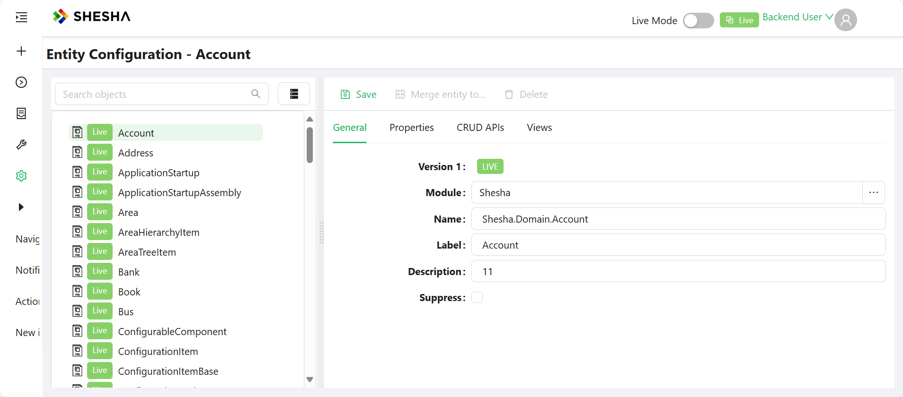
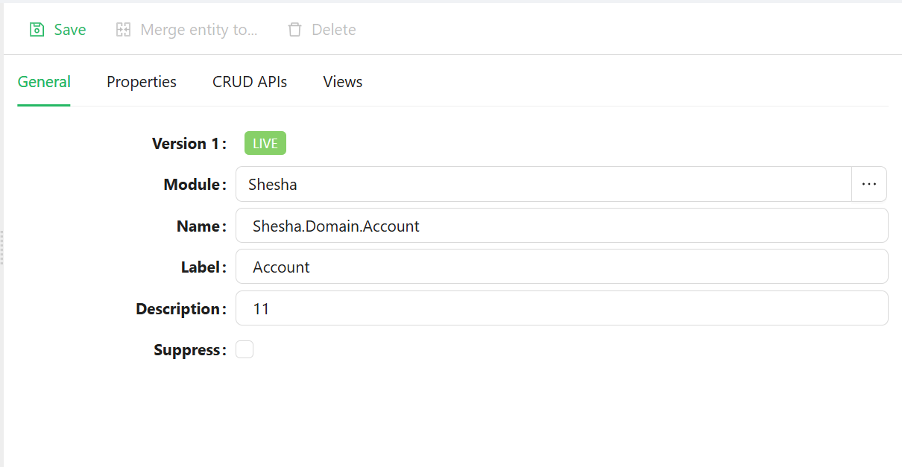
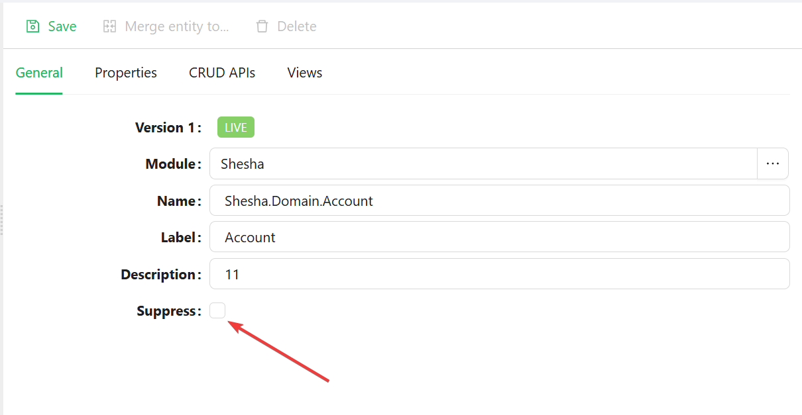
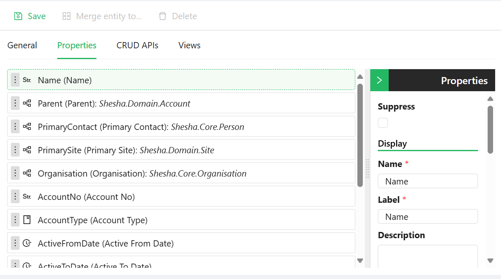
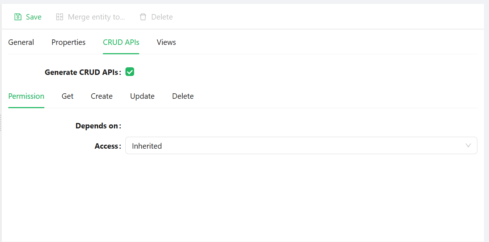
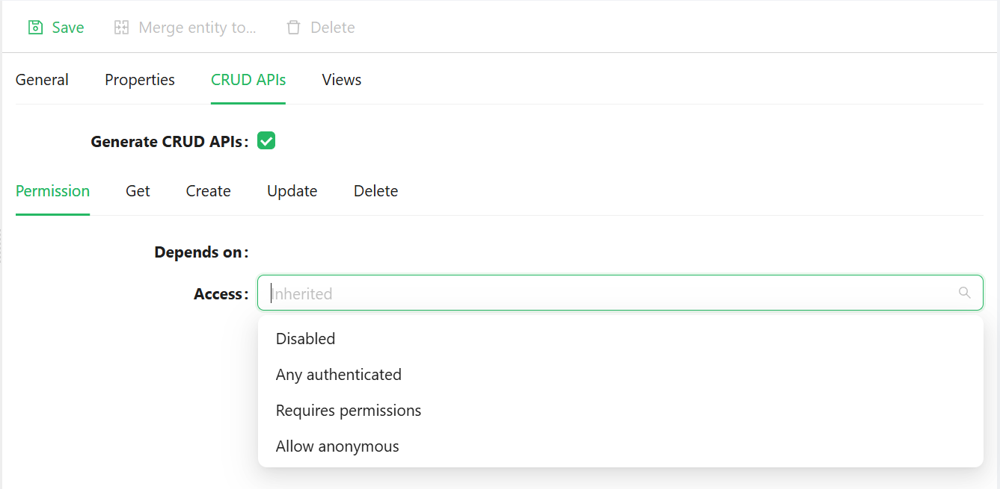
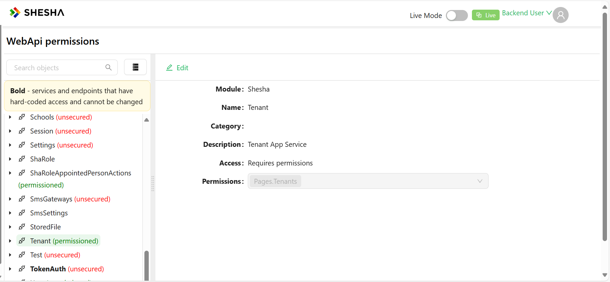
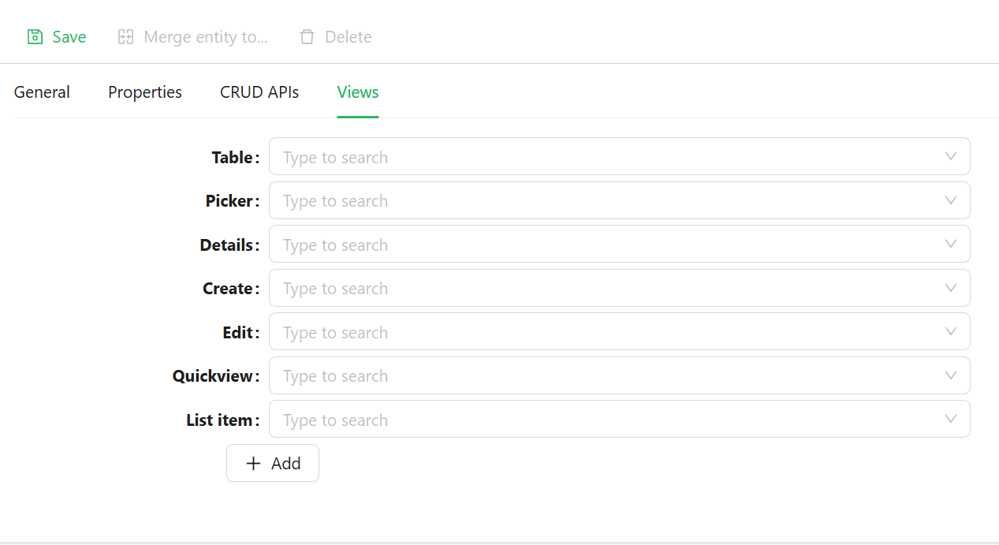

# Entity Configuration

Entity Configuration lists every entity in the system and lets you adjust how each one behaves directly from the front-end, without changing code. These configurations are configurable items, which means they can be exported and imported between environments in the same way as other Shesha configuration items.

The list includes both Dynamic Entities and JsonEntities, with a dropdown that lets you filter the entities by predefined grouping options.

---

## General

The General tab displays the basic information for the entity.

It also includes a **Suppress** option, which removes the entity from the list.

---

## Properties

The Properties tab lists every property on the entity and lets you configure them quickly, without developer involvement.

From this tab you can:

- Mark fields as **Required**, **ReadOnly**, or **Audited**.
- Configure cascading behaviour for **Create**, **Update**, and **Delete** actions on unreferenced entities.
- Change **date formats** and **number formats** based on the data type of the property.

---

## CRUD APIs

The CRUD APIs tab shows the CRUD actions available for the selected entity and lets you set the permissions required to access each one.

There are five access levels.

| Access level | Meaning |
|---|---|
| `Inherited` | The endpoint follows the rules defined for the parent configuration. |
| `Disabled` | The application does not expose the service or endpoint. |
| `Any Authenticated User` | Any authenticated user can access the endpoint. |
| `Requires Permissions` | The Required Permissions component is shown, and you must select one or more permissions. |
| `Allow Anonymous` | No authentication is required for access. |

:::note
These access levels also apply to [Custom APIs](/docs/back-end-basics/custom-apis). Custom APIs can be accessed from `dynamic/Shesha/permissioned-objects`.
:::

---

## Views

The Views tab supports dynamic rendering of subforms. You can define views for an entity so that components call the correct form configuration when they render.

For example, if a subform is bound to the **Address** entity and rendered within the **Person** entity, and the subform is configured to dynamically call the **QuickView** of **Address**, then when it renders:

1. The subform checks the **ClassName** and **View Type**.
2. It retrieves and applies the configured form accordingly.

