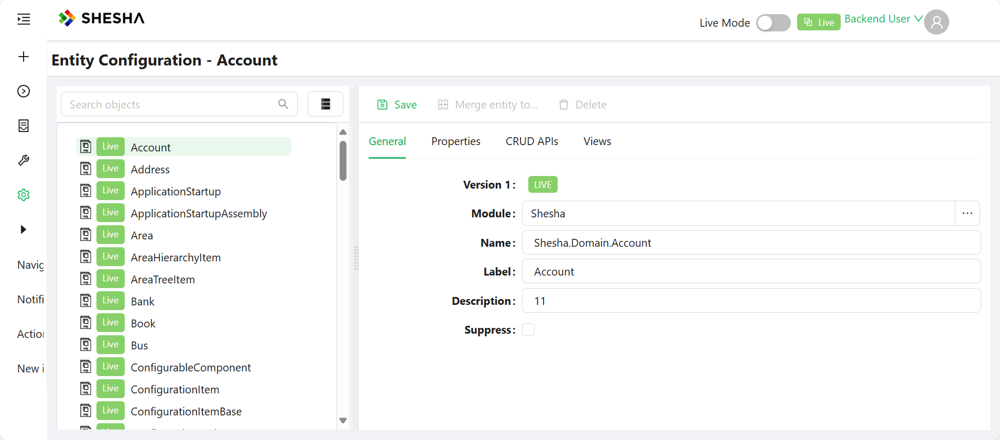
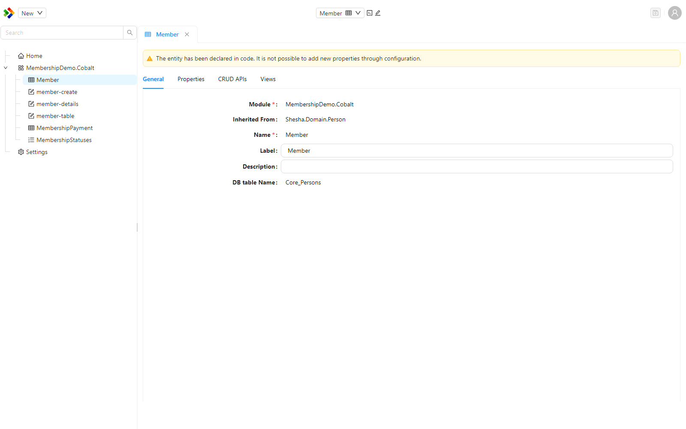
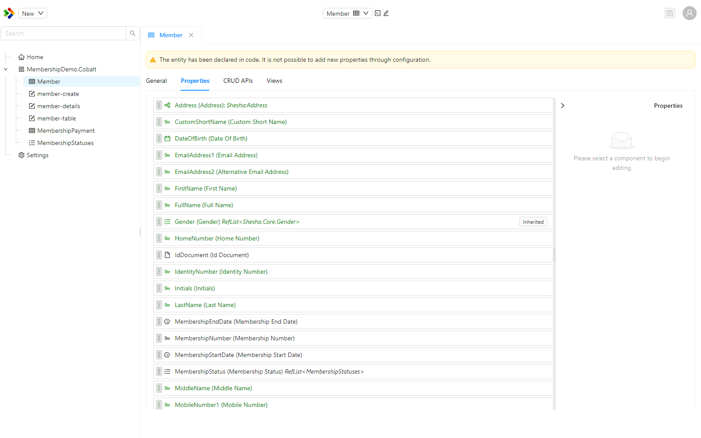
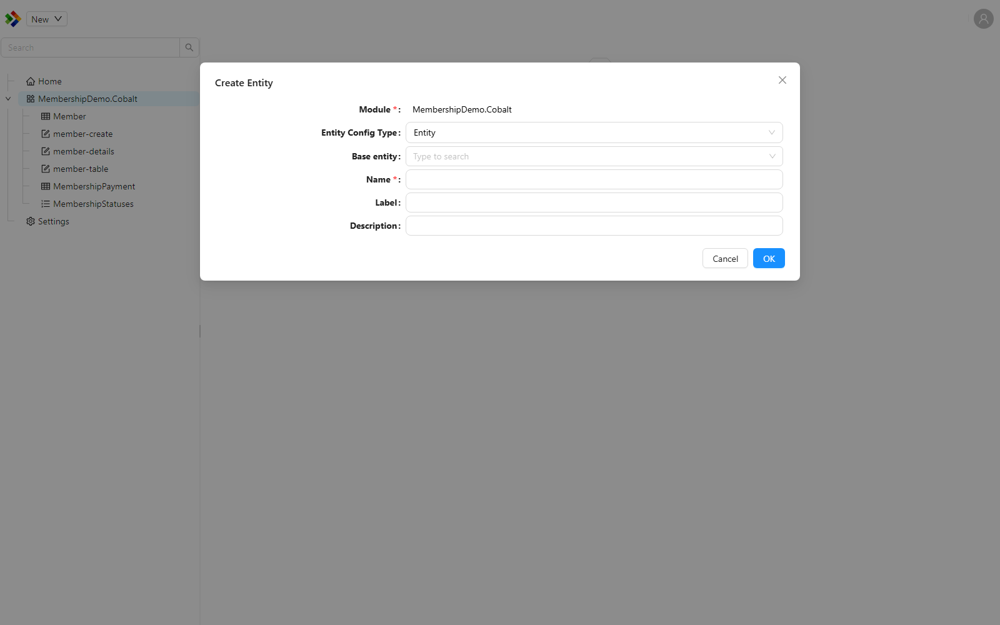
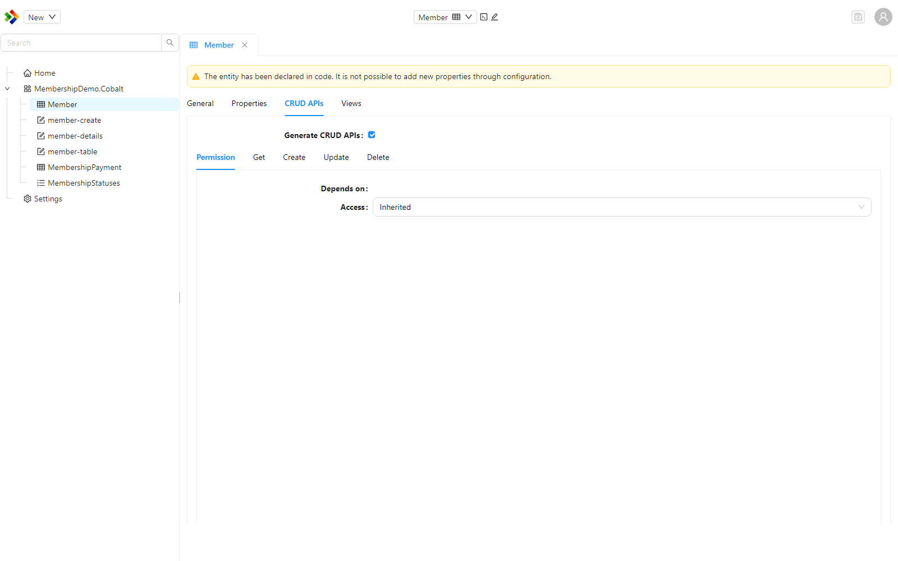
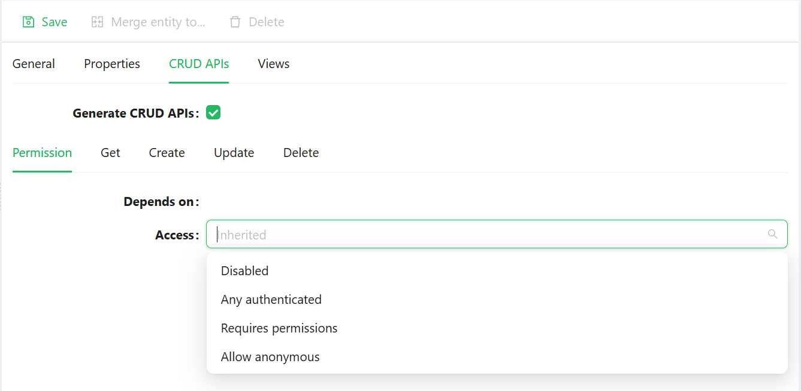
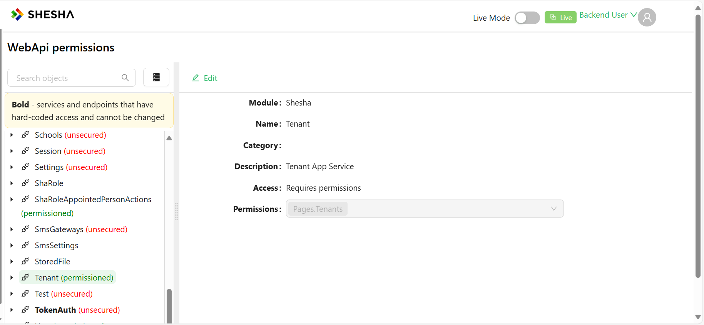
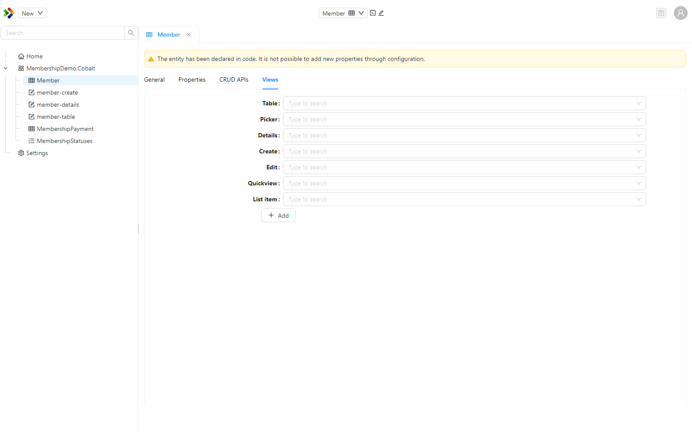

# Entity Configuration

Entity Configuration lets you control how each entity in your application behaves directly from the front-end, without changing code. Entities are one of the configuration item types managed in the [Configuration Studio](configuration-studio), alongside forms, reference lists, roles, and permissions. Because they are configuration items, entity configurations can be exported and imported between environments in the same way as other Shesha configuration items.

The configurator works for both entities declared in code and entities created entirely through configuration. When an entity is declared in code, you can adjust how it behaves but you cannot add new properties to it through configuration.

The list includes both Dynamic Entities and JsonEntities, with a dropdown that lets you filter the entities by predefined grouping options.

---

## General

The General tab holds the basic information that identifies the entity.

| Field | Description |
|---|---|
| `Module` | The module the entity belongs to. Read-only once the entity has been created. |
| `Inherited From` | The base entity this entity inherits from, if any. Labelled `Base entity` for a normal entity and `Base Part of entity` for a Part of Entity. Read-only once the entity has been created. |
| `Name` | The class name of the entity. Read-only once the entity has been created. |
| `Label` | A friendly display name for the entity. |
| `Description` | A short description of what the entity represents. |
| `DB table Name` | The database table the entity maps to. Read-only. |

:::note
If an entity has been declared in code, the configurator shows a warning explaining that new properties cannot be added to it through configuration. You can still adjust the behaviour of its existing properties.
:::

---

## Properties

The Properties tab lists every property on the entity and lets you configure it without developer involvement.

Each property in the list carries a visual indicator that tells you where it comes from and whether it needs attention.

| Indicator | Meaning |
|---|---|
| `Inherited` tag (green) | The property is inherited from a base entity. |
| `APP` tag | The property is defined in application code rather than through configuration. |
| Eye-with-a-slash icon (silver text) | The property is hidden. |
| Red information or warning icon | The property has pending changes that require an application restart, an initialization error, or a configuration error. Hover over the icon to read the detail. |

From this tab you can:

- Mark properties as **Required**, **ReadOnly**, or **Audited**.
- Configure cascading behaviour for **Create**, **Update**, and **Delete** actions on referenced entities.
- Change **date formats** and **number formats** based on the data type of the property.

The data type you can assign to a property is one of the following.

| Type | Use for |
|---|---|
| `string` | Text values. Exposes a `Min Length` field to set the minimum number of characters. |
| `number` | Numeric values, with formats for currency, double, round, thousand separator, and integer. |
| `boolean` | True or false values. |
| `date` | A calendar date. |
| `time` | A time of day. |
| `date time` | A combined date and time. |
| `entity` | A reference to another entity. |
| `reference list item` | A value drawn from a reference list. Exposes a `Reference List namespace` field. |
| `file` | A stored file. |
| `array` | A list of values. |
| `object` | A nested object. |

---

## Creating an entity

You can create a brand new entity from the configurator, either from scratch or by inheriting from an existing entity. The create dialog asks for the following.

| Field | Description |
|---|---|
| `Entity Config Type` | Choose `Entity` for a standalone entity, or `Part of entity` for a type that exists only as a property of another entity. |
| `Base entity` | The entity to inherit from. Leave it empty to create the entity from scratch. The field is labelled `Base Part of entity` when the config type is `Part of entity`. |
| `Module` | The module the new entity belongs to. |
| `Name` | The class name of the new entity. |
| `Label` | A friendly display name. |
| `Description` | A short description of the entity. |

:::note
A `Part of entity` can only be used as the type of a `Part of Entity` property on another entity. Application services are not generated for this entity type.
:::

---

## CRUD APIs

The CRUD APIs tab shows the CRUD actions available for the selected entity and lets you set the permissions required to access each one.

There are five access levels.

| Access level | Meaning |
|---|---|
| `Inherited` | The endpoint follows the rules defined for the parent configuration. |
| `Disabled` | The application does not expose the service or endpoint. |
| `Any Authenticated User` | Any authenticated user can access the endpoint. |
| `Requires Permissions` | The Required Permissions component is shown, and you must select one or more permissions. |
| `Allow Anonymous` | No authentication is required for access. |

:::note
These access levels also apply to [Custom APIs](/docs/back-end-basics/custom-apis). Custom APIs can be accessed from `dynamic/Shesha/permissioned-objects`.
:::

---

## Views

The Views tab supports dynamic rendering of subforms. You can define views for an entity so that components call the correct form configuration when they render.

For example, if a subform is bound to the **Address** entity and rendered within the **Person** entity, and the subform is configured to dynamically call the **QuickView** of **Address**, then when it renders:

1. The subform checks the **ClassName** and **View Type**.
2. It retrieves and applies the configured form accordingly.

