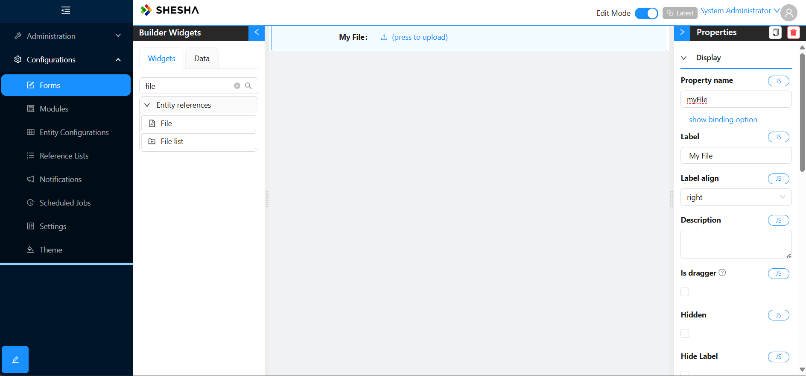
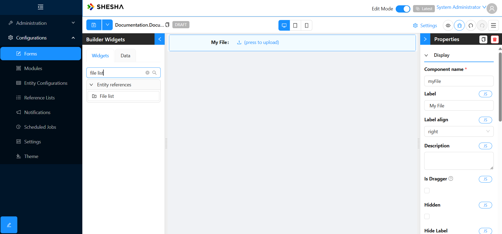
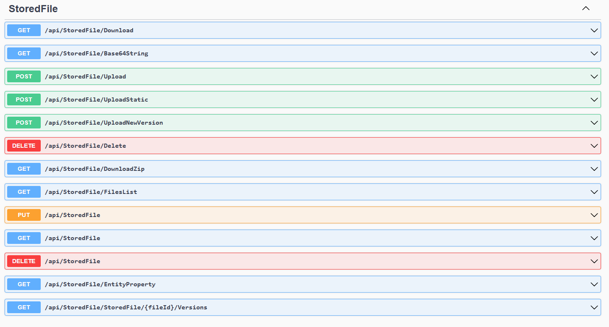

# File Storage

File storage, display, and management are common needs in many business applications. Shesha caters to these needs with its built-in file management features. These include:

1. APIs for the uploading, downloading, deletion, updating (incl. version management) of files
1. UI components that can bind to entities and allow uploading, downloading and viewing of files
1. Storage providers that allow files to be stored in various types of storage locations. Currently, local file storage and Azure Blob Storage are supported, with the option for custom providers to be implemented.
1. Metadata management for all files uploaded

# Adding a file to an entity

If you wish to be able to upload a file against an entity, simply add a property of type `StoredFile` to the entity as follows:

```csharp
public class MyEntityWithFile : Entity
{
    ...

    public virtual StoredFile MyFile { get; set; }

    ...
}
```

On the front-end you can then use the `File` form component and bind it to your new `StoredFile` property as illustrated below:



Refer for the [File form component](../front-end-basics/form-components/Entity-References/files.md) for more details on how to configure the component.

# Adding a list of files to an entity

If you wish to be able to upload a list of files against an entity, no changes are required to your domain model. Simply add the `FileList` form component to your form and bind it to your entity as illustrated below:



The `FileList` component will automatically track which files are part of the list using the `OwnerType`, `OwnerId` and `Category` properties of the `StoredFile` entity.
Note that the `FileList` component will only be able to update these properties accurately if properly configured. Refer for the [FileList form component](/front-end-basics/form-components/Entity-References/files.md) for more details on how to configure the component.

**Note:** In cases where files are upload files before the owner entity has been persisted and therefore assigned an Id, the dynamically generated Create end-point will automatically the update of `OwnerType`, `OwnerId` and `Category` properties for all previously created `StoredFile` entities created once the owner entity has been persisted and assigned an Id.

# StoredFile Entity and File Metadata

The `StoredFile` entity is used to store metadata about files uploaded into the application and has the following properties:

| Property            | Type       | Description                                                                                                                                                                                                     |
| ------------------- | ---------- | --------------------------------------------------------------------------------------------------------------------------------------------------------------------------------------------------------------- |
| OwnerId             | string     | The ID of the owner of the file.                                                                                                                                                                                |
| OwnerType           | string     | The type of the owner of the file.                                                                                                                                                                              |
| FileName            | string     | The original name of the file. When saved in the system's storage location the original file name is replaced by a Guid to avoid name clashes. This therefore provides a view of the original name of the file. |
| FileType            | string     | The type of the file.                                                                                                                                                                                           |
| Category            | string     | The category of the file.                                                                                                                                                                                       |
| Description         | string     | The description of the file.                                                                                                                                                                                    |
| SortOrder           | int        | The sort order of the file.                                                                                                                                                                                     |
| ParentFile          | StoredFile | The parent file of the current file. Used to reference related files, such as a template used to generate this file.                                                                                            |
| Folder              | string     | The folder where the file is stored relative to root location of the file storage location.                                                                                                                     |
| IsVersionControlled | bool       | Indicates whether the file is version controlled.                                                                                                                                                               |
| TenantId            | int?       | The ID of the tenant.                                                                                                                                                                                           |

### StoredFileVersion

| Property    | Type       | Description                                                                                                                                                            |
| ----------- | ---------- | ---------------------------------------------------------------------------------------------------------------------------------------------------------------------- |
| File        | StoredFile | The StoredFile this version relates to.                                                                                                                                |
| VersionNo   | int        | The version number.                                                                                                                                                    |
| FileSize    | Int64      | The size of the file stored in Bytes.                                                                                                                                  |
| FileName    | string     | The name of the file on the storage location. Note this will differ from the original name of the file as it is replaced with a Guid when stored to ensure uniqueness. |
| FileType    | string     | The type of the file as per the file extension of the file when uploaded.                                                                                              |
| Description | string     | An optional description for the file version.                                                                                                                          |
| IsLast      | bool       | If true, indicates that this is the latest version for the file.                                                                                                       |

# File management API



# Storage of files

Uploaded files are not stored in the database, but rather as separate binary files in a file storage location. Shesha provides for the storage of files in the following types of locations:

- Local disk
- Azure Blob Storage

Additional storage locations can be added by implementing the `IFileStorageProvider` interface.

## Local file storage

Uploaded files will be stored on the local file system. To use local file storage, update your appsettings.json as follows:

```json
{
  ...
  "ConnectionStrings": {
    "Default": "Data Source=.; Initial Catalog=<your-project-name>;Integrated Security=True; TrustServerCertificate=True"
  },
  ...
}

```

## Azure Blob Storage

Uploaded files will be store Azure Blob Storage. To use Azure Blob Storage:
update the configuration `AppSettings.json` as follows

```json
{
"ConnectionStrings": {
 "Default": "Data Source=...; Initial Catalog=...;",
 "BlobStorage": "<your-azure-storage-connection-string>"
},
"CloudStorage": {
 "ContainerName": "files",
 "DirectoryName": "your-subdirectory-name" // optional
},
"IsAzureEnvironment": true,
...
}

```

## `AzureStoredFileService` Class

This service is responsible for managing file storage in Azure Blob Storage and implements the `IStoredFileService` interface. It extends the `StoredFileServiceBase` class.

📄 [View source on GitHub](https://github.com/shesha-io/shesha-framework/blob/2ddea0edf1eadb19af0043521311c5baeded110a/shesha-core/src/Shesha.Framework/Services/StoredFiles/AzureStoredFileService.cs#L16)

## Key Features:

- **Uploads**, **downloads**, and **deletes** file versions to/from Azure Blob Storage.
- Uses dependency injection to resolve environment configuration and repositories.
- Automatically creates blob containers if not present.
- Stores file metadata (such as size) alongside physical files.

### Configuration

- Uses the connection string named `"BlobStorage"` from `appsettings.json`.
- Container and directory names are configured under the `CloudStorage` section.
- Defaults to `"files"` as the container name if none is provided.

### Configuration

- Uses the connection string named `"BlobStorage"` from `appsettings.json`.
- Container and directory names are configured under the `CloudStorage` section:

  - `"ContainerName"` – defaults to `"files"` if not specified.
  - `"DirectoryName"` – optional; used to organize files within a subfolder in the container.

- The setting `"IsAzureEnvironment": true` enables Azure-specific configuration loading behavior.
- Configuration is resolved using the environment (e.g., `Development`, `Production`) via `IWebHostEnvironment`.

### Important Methods

- `GetStreamAsync(StoredFileVersion version)`: Retrieves the content stream of a file asynchronously.
- `UpdateVersionContentAsync(version, stream)`: Uploads a stream to Azure and updates file metadata.
- `CopyFile(source, destination)`: Copies a blob from one version to another using its URI.
- `DeleteFromStorageAsync(version)`: Deletes a file from Azure Blob Storage.
- `FileExistsAsync(id)`: Checks whether a file exists.

### Internal Helpers

- `GetBlobClient(blobName)`: Resolves the correct blob path using the configured directory.
- `GetAzureFileName(version)`: Constructs the blob file name using the version’s ID and extension.
- `BlobContainerClient`: Ensures a singleton container client and sets public access policy.


# See Also
- Configuring the [File/FileList form component](/front-end-basics/form-components/Entity-References/files.md)


