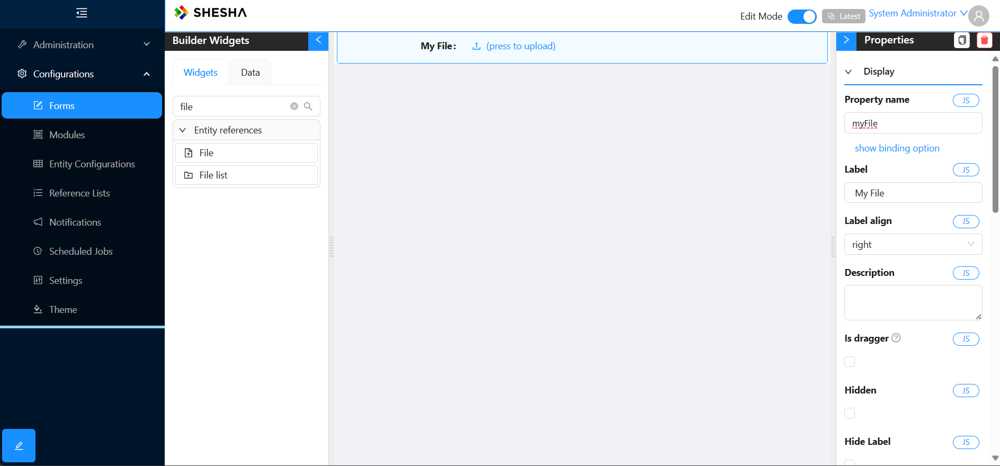
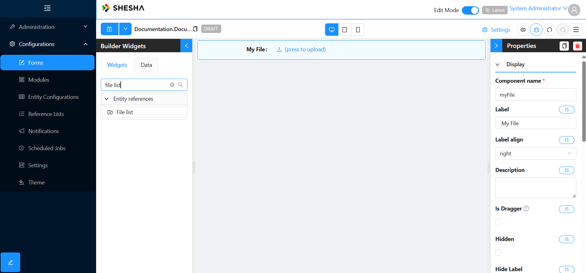

# File Storage

File storage, display, and management are common needs in many business applications. Shesha caters to these needs with its built-in file management features. These include:

1. APIs for the uploading, downloading, deletion, updating (incl. version management) of files
1. UI components that can bind to entities and allow uploading, downloading and viewing of files
1. Storage providers that allow files to be stored in various types of storage locations. Currently, local file storage and Azure Blob Storage are supported, with the option for custom providers to be implemented.
1. Metadata management for all files uploaded

# Adding a file to an entity

If you wish to be able to upload a file against an entity, simply add a property of type `StoredFile` to the entity as follows:

```csharp
public class MyEntityWithFile : Entity
{
    ...

    public virtual StoredFile MyFile { get; set; }

    ...
}
```

On the front-end you can then use the `File` form component and bind it to your new `StoredFile` property as illustrated below:



Refer to the [File form component](../front-end-basics/form-components/Entity-References/files.md) for more details on how to configure the component.

# Adding a list of files to an entity

If you wish to be able to upload a list of files against an entity, no changes are required to your domain model. Simply add the `FileList` form component to your form and bind it to your entity as illustrated below:



The `FileList` component will automatically track which files are part of the list using the `Owner` and `Category` properties of the `StoredFile` entity.
Note that the `FileList` component will only be able to update these properties accurately if properly configured. Refer to the [FileList form component](/front-end-basics/form-components/Entity-References/files.md) for more details on how to configure the component.

**Note:** In cases where files are uploaded before the owner entity has been persisted and therefore assigned an Id, the dynamically generated Create end-point will automatically update the `Owner` and `Category` properties for all previously created `StoredFile` entities once the owner entity has been persisted and assigned an Id. See [Temporary Files and Delayed Binding](#temporary-files-and-delayed-binding) for more details.

# The `[StoredFile]` Property Attribute

The `[StoredFile]` attribute can be applied to `StoredFile` properties on your entities to control file storage behavior. It supports the following parameters:

| Parameter              | Type   | Description                                                                                          |
| ---------------------- | ------ | ---------------------------------------------------------------------------------------------------- |
| `IsVersionControlled`  | bool   | If `true`, uploading a new file creates a new version instead of overwriting. Default is `false`.    |
| `IsEncrypted`          | bool   | If `true`, the file content will be encrypted when stored. Default is `false`.                       |
| `Accept`               | string | A file type filter (e.g., `".pdf,.docx"`) that restricts which file types can be uploaded.           |

**Example:**

```csharp
public class ContractEntity : Entity
{
    [StoredFile(IsVersionControlled = true, Accept = ".pdf,.docx")]
    public virtual StoredFile ContractDocument { get; set; }
}
```

# StoredFile Entity and File Metadata

The `StoredFile` entity is used to store metadata about files uploaded into the application and has the following properties:

| Property            | Type                     | Description                                                                                                                                                                                                     |
| ------------------- | ------------------------ | --------------------------------------------------------------------------------------------------------------------------------------------------------------------------------------------------------------- |
| Owner               | GenericEntityReference   | A generic reference to the owning entity of the file. Stores both the owner's Id and type, allowing a file to be linked to any entity in the system. See [GenericEntityReference](../back-end-basics/generic-entity-references.md) for more details. |
| FileName            | string                   | The original name of the file. When saved in the system's storage location the original file name is replaced by a Guid to avoid name clashes. This therefore provides a view of the original name of the file. |
| FileType            | string                   | The type of the file.                                                                                                                                                                                           |
| Category            | string                   | The category of the file. Used to group files when multiple file lists are attached to the same entity.                                                                                                         |
| Description         | string                   | The description of the file.                                                                                                                                                                                    |
| SortOrder           | int                      | The sort order of the file.                                                                                                                                                                                     |
| ParentFile          | StoredFile               | The parent file of the current file. Used to reference related files, such as a template used to generate this file.                                                                                            |
| Folder              | string                   | The folder where the file is stored relative to the root location of the file storage location.                                                                                                                 |
| IsVersionControlled | bool                     | Indicates whether the file is version controlled. See [File Versioning](#file-versioning) for details.                                                                                                          |
| Temporary           | bool                     | If `true`, indicates the file was uploaded before being linked to an owner entity. See [Temporary Files and Delayed Binding](#temporary-files-and-delayed-binding).                                              |
| TenantId            | int?                     | The ID of the tenant.                                                                                                                                                                                           |

### StoredFileVersion

Each upload creates a `StoredFileVersion` record. When version control is enabled, previous versions are preserved; otherwise the existing version is overwritten.

| Property    | Type       | Description                                                                                                                                                            |
| ----------- | ---------- | ---------------------------------------------------------------------------------------------------------------------------------------------------------------------- |
| File        | StoredFile | The StoredFile this version relates to.                                                                                                                                |
| VersionNo   | int        | The version number.                                                                                                                                                    |
| FileSize    | Int64      | The size of the file stored in Bytes.                                                                                                                                  |
| FileName    | string     | The name of the file on the storage location. Note this will differ from the original name of the file as it is replaced with a Guid when stored to ensure uniqueness. |
| FileType    | string     | The type of the file as per the file extension of the file when uploaded.                                                                                              |
| Description | string     | An optional description for the file version.                                                                                                                          |
| IsLast      | bool       | If true, indicates that this is the latest version for the file.                                                                                                       |
| IsSigned    | bool       | If true, indicates that this file version has been digitally signed.                                                                                                   |

# File Versioning

File versioning controls whether uploading a new file replaces the existing content or creates a new version in the history.

### Version-controlled files (`IsVersionControlled = true`)

- Each upload creates a **new version** with an incremented `VersionNo`.
- All previous versions are preserved and can be retrieved.
- The `IsLast` flag on `StoredFileVersion` marks the most recent version.

### Non-version-controlled files (default)

- Uploading a new file **overwrites** the existing version.
- Only the latest content is available.

You can enable version control in two ways:

1. **Via the `[StoredFile]` attribute** on the entity property (recommended for design-time configuration):
   ```csharp
   [StoredFile(IsVersionControlled = true)]
   public virtual StoredFile MyDocument { get; set; }
   ```

2. **At runtime** by calling the `UploadNewVersion` API endpoint, which automatically enables version control on the file.

# File Management API

The `StoredFile` API provides endpoints for uploading, downloading, managing, and deleting files. All endpoints are available under `/api/StoredFile/`.

## Upload

| Endpoint         | Method | Description                                                                                                |
| ---------------- | ------ | ---------------------------------------------------------------------------------------------------------- |
| `/Upload`        | `POST` | Upload a file. Supports three upload modes via the `filesCategory` parameter (see below).                  |
| `/UploadNewVersion` | `POST` | Upload a new version of an existing file. Automatically enables version control if not already enabled.  |

### Upload modes

The `filesCategory` parameter on the upload endpoint determines how the file is linked:

| Mode             | Description                                                                                               |
| ---------------- | --------------------------------------------------------------------------------------------------------- |
| **property**     | The file is linked to a specific `StoredFile` property on an entity. Specify `ownerType`, `ownerId`, and `propertyName`. |
| **attachment**   | The file is added as a categorized attachment to an entity. Specify `ownerType`, `ownerId`, and optionally `filesCategory`. |
| **temporary**    | The file is uploaded without an owner. The `Temporary` flag is set to `true`. See [Temporary Files and Delayed Binding](#temporary-files-and-delayed-binding). |

### Common upload parameters

| Parameter      | Description                                                          |
| -------------- | -------------------------------------------------------------------- |
| `ownerType`    | The full class name of the owning entity.                            |
| `ownerId`      | The Id of the owning entity.                                         |
| `propertyName` | The name of the `StoredFile` property on the entity (property mode). |
| `filesCategory`| A category label to group related files (attachment mode).           |

## Download

| Endpoint          | Method | Description                                                                                       |
| ----------------- | ------ | ------------------------------------------------------------------------------------------------- |
| `/Download`       | `GET`  | Download a file by `id`. Optionally specify `versionNo` to download a specific version.           |
| `/DownloadZipped` | `GET`  | Download multiple files as a single ZIP archive. Pass a list of file `id`s.                       |
| `/GetThumbnail`   | `GET`  | Get a thumbnail image for a stored file. Specify `id`, `width`, and `height`.                     |

:::note
Downloads are tracked by the framework. Each download records which user accessed the file and when.
:::

## File Information

| Endpoint            | Method | Description                                                           |
| ------------------- | ------ | --------------------------------------------------------------------- |
| `/Get`              | `GET`  | Retrieve metadata for a specific file by `id`.                        |
| `/GetFileVersions`  | `GET`  | Get all versions for a version-controlled file by `id`.               |

## Delete

| Endpoint     | Method   | Description                                |
| ------------ | -------- | ------------------------------------------ |
| `/Delete`    | `DELETE` | Delete a file and all its versions by `id`.|
| `/DeleteFile`| `DELETE` | Delete a file by `ownerType`, `ownerId`, and `fileId`. |

# Temporary Files and Delayed Binding

In many UI workflows, a user uploads files while filling in a form for a **new entity** that has not yet been saved. Since the entity does not yet have an Id, the file cannot be immediately linked to an owner.

Shesha handles this with **temporary files**:

1. The file is uploaded using the **temporary** upload mode. The `Temporary` flag on `StoredFile` is set to `true`.
2. The user completes the form and saves the entity, which creates it in the database and assigns an Id.
3. The dynamically generated **Create endpoint** automatically detects any temporary files associated with the form and updates their `Owner` reference and `Category` to link them to the newly created entity.

This process is transparent when using the `File` and `FileList` form components — the front-end handles the temporary upload and deferred binding automatically.

# Storage of Files

Uploaded files are not stored in the database, but rather as separate binary files in a file storage location. Shesha provides for the storage of files in the following types of locations:

- Local disk
- Azure Blob Storage

Additional storage locations can be added by implementing the `IFileStorageProvider` interface.

## Storage Provider Selection

The `IsAzureEnvironment` setting in `appsettings.json` controls which storage provider is used:

| `IsAzureEnvironment` | Provider              | Description                                      |
| --------------------- | --------------------- | ------------------------------------------------ |
| `true`                | Azure Blob Storage    | Files are stored in Azure Blob Storage.          |
| `false` (default)     | Local file storage    | Files are stored on the local file system.       |

## Local File Storage

When `IsAzureEnvironment` is `false` (or not set), files are stored on the local file system.

The upload folder is controlled by the **`Shesha.UploadFolder`** setting. This can be configured in the application's settings or in `appsettings.json`. If not specified, the framework uses a default folder within the application's directory.

Files are stored using the pattern:
```
{UploadFolder}/{StoredFileVersionGuid}.{extension}
```

Each file version is saved with a unique Guid-based filename to avoid name clashes.

## Azure Blob Storage

When `IsAzureEnvironment` is `true`, files are stored in Azure Blob Storage. Update your `appsettings.json` as follows:

```json
{
  "ConnectionStrings": {
    "Default": "Data Source=...; Initial Catalog=...;",
    "BlobStorage": "<your-azure-storage-connection-string>"
  },
  "CloudStorage": {
    "ContainerName": "files",
    "DirectoryName": "your-subdirectory-name"
  },
  "IsAzureEnvironment": true
}
```

| Setting                              | Description                                                                                      |
| ------------------------------------ | ------------------------------------------------------------------------------------------------ |
| `ConnectionStrings:BlobStorage`      | The Azure Storage connection string.                                                             |
| `CloudStorage:ContainerName`         | The name of the blob container. Defaults to `"files"` if not specified.                          |
| `CloudStorage:DirectoryName`         | Optional. A subdirectory within the container to organize files.                                 |
| `IsAzureEnvironment`                 | Must be set to `true` to enable Azure Blob Storage.                                              |

The blob container is automatically created if it does not exist.

## Custom Storage Providers

If you need to store files in a different environment (e.g., Amazon S3, Google Cloud Storage, SFTP), you can implement a custom storage provider by extending `StoredFileServiceBase`. The base class handles all metadata, versioning, and attachment logic — your implementation only needs to handle the physical storage I/O.

See [Implementing a Custom File Storage Provider](../how-to-guides/custom-file-provider.md) for a full walkthrough with a sample implementation.

# Backend File Services

Shesha provides the `IStoredFileService` interface for working with files in your backend code. This service is automatically injected via dependency injection and handles all file operations including upload, download, versioning, and attachment management.

## Injecting the service

```csharp
using Shesha.Services;

public class MyAppService : ApplicationService
{
    private readonly IStoredFileService _fileService;

    public MyAppService(IStoredFileService fileService)
    {
        _fileService = fileService;
    }
}
```

## Common operations

### Creating a new file

```csharp
// Create a file from a stream
using var stream = new MemoryStream(fileBytes);
var version = await _fileService.CreateFileAsync(stream, "report.pdf", file =>
{
    file.SetOwner(myEntity); // Link to an entity
    file.Category = "Reports";
    file.Description = "Monthly report";
});
```

### Uploading / updating file content

```csharp
// Update an existing file with new content
using var stream = new MemoryStream(newContent);
var version = await _fileService.UpdateFileAsync(existingFile, stream, "updated-report.pdf");

// Or update a specific version's content directly
var latestVersion = await _fileService.GetLastVersionAsync(existingFile);
using var stream2 = new MemoryStream(newContent);
await _fileService.UpdateVersionContentAsync(latestVersion, stream2);
```

### Downloading / reading file content

```csharp
// Get file content as a stream
var stream = await _fileService.GetStreamAsync(storedFile);

// Get a specific version's content
var version = await _fileService.GetLastVersionAsync(storedFile);
var versionStream = await _fileService.GetStreamAsync(version);

// Track that the current user downloaded the file
await _fileService.MarkDownloadedAsync(version);
```

### Working with attachments

```csharp
// Get all files attached to an entity
var attachments = await _fileService.GetAttachmentsAsync(myEntity);

// Get files in a specific category
var invoices = await _fileService.GetAttachmentsOfCategoryAsync(myEntity, "Invoices");

// Check if an entity has attachments in a category
bool hasPhotos = await _fileService.HasAttachmentsOfCategoryAsync(myEntity, "Photos");

// Get all attachment categories for an entity
var categories = await _fileService.GetAttachmentsCategoriesAsync(myEntity);

// Get the latest version of each attachment
var latestVersions = await _fileService.GetLastVersionsOfAttachmentsAsync(
    myEntity.Id, "MyModule.MyEntity", "Documents");
```

### Copying files between entities

```csharp
// Copy a single file to a new owner
var copiedFile = await _fileService.CopyToOwnerAsync(sourceFile, destinationEntity);

// Copy all attachments from one entity to another
await _fileService.CopyAttachmentsToAsync(sourceEntity, destinationEntity);
```

### Version management

```csharp
// Get all versions of a file
var versions = await _fileService.GetFileVersionsAsync(storedFile);

// Get or create a new version
var newVersion = await _fileService.GetNewOrDefaultVersionAsync(storedFile);
```

### Deleting files

```csharp
// Delete a file and all its versions (from both DB and storage)
await _fileService.DeleteAsync(storedFile);
```

### Renaming files

```csharp
await _fileService.RenameFileAsync(storedFile, "new-name.pdf");
```

## Key service methods reference

| Method | Description |
| ------ | ----------- |
| `CreateFileAsync(stream, fileName, prepareAction?)` | Create a new file and return the created version. |
| `UpdateFileAsync(file, stream, fileName)` | Update an existing file with new content and name. |
| `GetStreamAsync(file)` | Get the content stream of the latest version. |
| `GetStreamAsync(fileVersion)` | Get the content stream of a specific version. |
| `GetLastVersionAsync(file)` | Get the most recent version of a file. |
| `GetFileVersionsAsync(file)` | Get all versions of a file. |
| `GetNewOrDefaultVersionAsync(file)` | Create a new version or return the default (for non-versioned files). |
| `UpdateVersionContentAsync(version, stream)` | Update the binary content of a specific version. |
| `GetAttachmentsAsync(owner)` | Get all files attached to an entity. |
| `GetAttachmentsOfCategoryAsync(owner, category)` | Get files attached to an entity filtered by category. |
| `HasAttachmentsOfCategoryAsync(owner, category)` | Check if an entity has any files in a category. |
| `GetAttachmentsCategoriesAsync(owner)` | Get distinct category names for an entity's files. |
| `CopyToOwnerAsync(file, newOwner)` | Copy a file to a different owner entity. |
| `CopyAttachmentsToAsync(source, destination)` | Copy all attachments from one entity to another. |
| `MarkDownloadedAsync(fileVersion)` | Record that the current user downloaded a version. |
| `RenameFileAsync(file, fileName)` | Rename a file. |
| `DeleteAsync(storedFile)` | Delete a file and all its versions from storage and database. |
| `FileExistsAsync(id)` | Check whether a file exists. |
| `GetOrNullAsync(id)` | Get a file by Id, or `null` if not found. |

# See Also
- Configuring the [File/FileList form component](/front-end-basics/form-components/Entity-References/files.md)
- [GenericEntityReference](../back-end-basics/generic-entity-references.md)
- [Implementing a Custom File Storage Provider](../how-to-guides/custom-file-provider.md)
