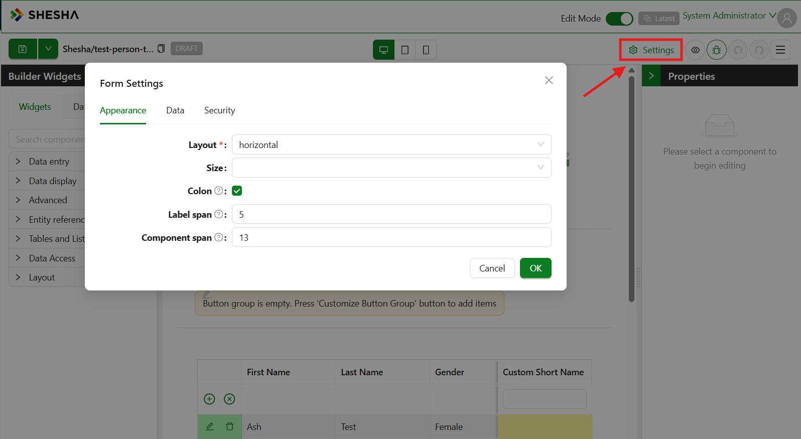
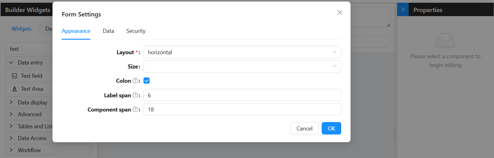
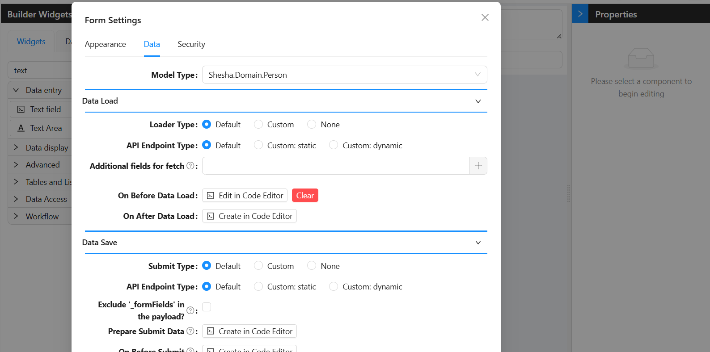
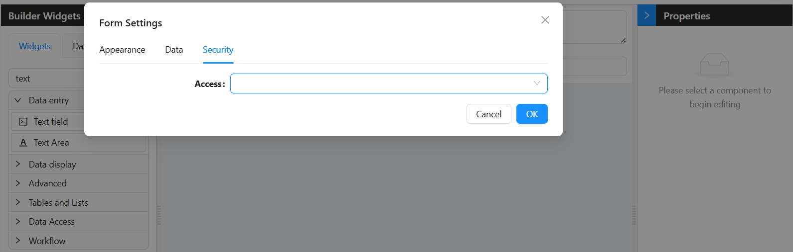

# Form Settings


Every form in Shesha has a set of **Form Settings** that control three things: how the form looks, how it loads and saves data, and who is allowed to use it.


*Click **Settings** to open the Form Settings.*

---

## Form Settings Groups

To access the lifecycle settings, open a form in the designer and click **Form Settings**. You will see three groups:

| Group | What it controls |
|---|---|
| **Appearance** | How the form looks - layout, size, styling |
| **Data** | How the form loads and saves data (the lifecycle) |
| **Security** | Who is allowed to view or use the form |

This guide covers all three tabs with explanations and code examples using the `Person` entity.

---

## Appearance Tab

The Appearance tab controls how the form is laid out and how much space each part takes up. These settings apply to the whole form - they are not per-component.



---

### Layout

**Layout** is required and has two options:

| Option | What it does |
|---|---|
| `vertical` | Labels appear above their inputs, stacked. This is the default and works well for most forms. |
| `horizontal` | Labels appear to the left of their inputs, on the same line. Use this for compact data-entry forms. |

---

### Size

**Size** sets the overall density of all form items at once. If left blank, the default Ant Design size is used.

| Option | When to use |
|---|---|
| `Small` | Dense admin interfaces with many fields |
| `Middle` | Standard forms - the most common choice |
| `Large` | Accessible or touch-friendly forms that need more spacing |

:::tip
You can clear the Size setting entirely by clicking the X next to the dropdown. This lets the form inherit the application-level size setting.
:::

---

### Colon

A toggle. When turned on, Shesha appends a colon after every field label (for example, "First Name:"). This only has a visible effect when **Layout** is set to `horizontal`.

---

### Label Span

A number from 0 to 24. This uses the Ant Design raster grid, where 24 is the full width of the row. Label Span sets how wide the label column is.

For example, a Label Span of `6` makes the label take up 25% of the row. Setting it to `0` hides the label column entirely.

:::info
Label Span only has an effect when Layout is `horizontal`. In vertical layout, labels always take the full row width.
:::

---

### Component Span

The same 0-24 raster grid as Label Span. This sets how wide the input column is.

If you set Label Span to `6`, set Component Span to `18` so the input fills the remaining 75% of the row. The two values do not need to add up to 24, but leaving gaps or overlapping them will affect the layout.

---

## Data Tab

The Data tab is split into three sections:

- **Data Load** - controls how data is fetched and placed onto the form when it opens
- **Data Save** - controls how data is sent to the server when the user submits the form
- **Events** - contains handlers that fire in response to user interactions while the form is open, such as a field value changing



---
## Model Type

Before configuring any of the Data settings, you should set the **Model Type**. This is the most fundamental setting on the form - it tells Shesha which entity the form is working with.

For example, if you are building a form to view or edit a person's details, you would set the Model Type to `Person`. Once this is set, Shesha knows which API endpoints to use for loading and saving, which fields are available for selection throughout the designer, and how to handle default CRUD operations automatically.

You will find the Model Type setting at the top of the **Data** tab in Form Settings. Type the name of your entity (e.g. `Shesha.Domain.Person`) and select it from the list.

:::info Why it matters
Almost everything in the Data group - the Default Loader, Default Submit, `form.defaultApiEndpoints`, and even field pickers - depends on the Model Type being set correctly. If data is not loading or saving as expected, the Model Type is the first thing to check.
:::

---
## Data Load

When a form opens, Shesha needs to know where to get the data to display. The Data Load section is where you configure that.

---

### Loader Type

The **Loader Type** is the first thing you set. It tells Shesha how to fetch data for the form. There are three options:

|   Option | Use this when... |
|---|---|
|   `Default`   | Your form is for a standard Shesha entity (like `Person`) and you want Shesha to handle fetching automatically. |
|   `Custom`   | You need to write your own code to fetch the data, for example from a non-standard API. |
|   `None`   | The form is a create form - there is no existing record to load, so the form should start empty. |

---

#### Default Loader

This is the simplest option. You tell Shesha which entity the form is for, and it automatically calls the right API to fetch the record. The record ID is taken from the URL (e.g. `?id=abc123`).

When Loader Type is set to `Default`, an additional **API Endpoint Type** setting appears.

---

#### Custom Loader

Use this when the Default loader is not enough - for example, when your data comes from a custom API, or when you need to combine data from more than one source before the form can display it.

You write an `async` JavaScript function in the code editor. Whatever object you `return` from that function becomes the data on the form.

**Example - Fetch a Person by ID from a custom endpoint:**

```js
const response = await http.get(`/api/dynamic/Shesha/Person/Crud/Get?id=${query.id}`);
return response.data.result;
```
---

#### None (No Loader)

Choose `None` when the form is used to create a brand new record. Since there is no existing record to fetch, the form starts completely empty and the user fills everything in themselves.

To set up: Set **Loader Type** to `None`.

---

### API Endpoint Type 

This setting appears when **Loader Type** is set to `Default`. It controls which URL Shesha calls to fetch the record.

| Option | When to use |
|---|---|
| `Default` | Shesha uses its built-in `GET` endpoint for the entity. This is the right choice for most forms. |
| `Custom: static` | You type a URL yourself. The same URL is used every time the form opens. Only `GET` is supported. |
| `Custom: dynamic` | You write a JavaScript function that returns the URL and HTTP method at runtime. |

#### Default

Leave the endpoint type on `Default` for any standard entity form. Shesha automatically calls `/api/dynamic/{Namespace}/{Entity}/Crud/Get?id={id}` using the record ID from the URL.

#### Custom (Static)

Use this when you want to fetch from a specific fixed endpoint - for example, a custom backend action that returns a shaped response rather than the standard entity fields. You type the URL directly into the Endpoint field. It does not change at runtime.

**Form type to use:** Details View or Edit Form - use when loading an existing record from a fixed endpoint.

**Example - Load a Person using a custom read action:**

```
/api/dynamic/Shesha/Person/Crud/Get?id=${query.id}
```
:::note
Custom (Static) only supports `GET` requests in the Data Load section. If you need runtime logic or a different HTTP method, use Custom (Dynamic).
:::

--- 

#### Custom (Dynamic)

Use this when the URL needs to be calculated at runtime - for example, when it depends on a query parameter, a field value, or a user role.

You write an `async` JavaScript function that returns an object with a `url` and `httpVerb` property:

```ts
{ url: string; httpVerb: string }
```

**Form type to use:** Edit Form or Details View - use when the endpoint changes depending on context.

---

### Additional Fields for Fetch

By default, Shesha only fetches the fields that are actually placed on your form as components. If your lifecycle code needs a field that is not displayed on the form, you need to tell Shesha to include it in the fetch.

For example, if you have a `Person` form but your `On After Data Load` script needs `address.addressLine1` even though there is no address field on the form, you would add `address.addressLine1` here. Use the field picker to choose the fields you need. Use a dot (`.`) to navigate into nested or related fields (e.g. `address.addressLine1`).

---

### On Before Data Load

This event runs **before** Shesha fetches any data. It is the very first thing that happens in the form lifecycle.

Use it when you need to do something before the data arrives - for example, checking that the URL contains a valid ID, setting up some initial state, or stopping the form from loading if a condition is not met.

When this event runs, no data has been fetched yet. Your code runs first, and only once it finishes does Shesha move on to fetch the data. If you call `throw new Error(...)` inside this event, the data load stops completely - nothing gets fetched.

**Example - Stop the details form from loading if the person has no address:**

This is a common scenario when drilling into a Person details form from a table view. Before the form loads, fetch the person record and check whether they have an address. If they do not, show an error and stop the load.

```js
const response = await http.get(`/api/dynamic/Shesha/Person/Crud/Get?id=${query.id}`);
const person = response.data.result;

if (!person.address?.id) {
  message.error('This person does not have an address. Cannot open details.');
  throw new Error('Person has no address.');
}
```

**Example - Show a placeholder name while data is being fetched:**

```js
form.setFieldsValue({ fullName: 'Loading name...' });
```

---

### On After Data Load

This event runs **after** Shesha has fetched the data and placed it on the form, but before the user sees it. This is your chance to adjust, add to, or override the data before it is displayed.

Use it when you need to set a computed value based on the loaded data (like combining first and last name into a display name), fill in a default value for a field that came back empty, or fetch extra related data that was not included in the main load.

Your code runs after the data is on the form. You can use `form.setFieldsValue({ ... })` to add or change values. The form waits for your code to finish before showing anything to the user.

**Example - Build a display name from the loaded Person's first and last name:**

```js
const fullName = `${data.firstName} ${data.lastName}`;
form.setFieldsValue({ fullName });
```

**Example - Set a default value if the field came back empty from the server:**

```js
if (!data.preferredContactMethod) {
  form.setFieldsValue({ preferredContactMethod: 1});
}
```
---

## Data Save

When the user fills in the form and clicks Save, Shesha needs to know how to send that data to the server. The Data Save section is where you configure that.

---

### Submit Type

The **Submit Type** tells Shesha how to submit data when the form is saved. The options mirror those of the Loader Type:

| Option | Use this when... |
|---|---|
| `Default` | Your form is for a standard Shesha entity and you want Shesha to handle saving automatically. |
| `Custom` | You need to write your own code to control how the data is saved. |
| `None` | The form is read-only and should never submit any data. |

---

#### Default Submit

This is the simplest option. Shesha looks at the form data and automatically decides whether to create or update the record:

- If the data has an `id` field, Shesha sends a `PUT` request to update the existing record.
- If there is no `id`, Shesha sends a `POST` request to create a new record.

When Submit Type is set to `Default`, an additional **API Endpoint Type** setting appears.

---

#### Custom Submit

Use this when the Default submit is not enough - for example, when you need to call a non-standard API, split the data across multiple endpoints, or apply conditional logic before saving.

You write the entire submission logic yourself in an `async` JavaScript function.

:::warning 
Custom submit currently does not work 
:::

---

#### None (No Submit)

Choose `None` when the form is purely for viewing data. No data will be sent to the server when the user interacts with the form.

---

### API Endpoint Type 

This setting appears when **Submit Type** is set to `Default`. It controls which URL Shesha posts the data to when the form is saved.

| Option | When to use |
|---|---|
| `Default` | Shesha uses its built-in create or update endpoint for the entity. This is the right choice for most forms. |
| `Custom: static` | You type a URL yourself and choose the HTTP method. The same URL and method are used every time the form submits. |
| `Custom: dynamic` | You write a JavaScript function that returns the URL and HTTP method at runtime. |

#### Default

Leave the endpoint type on `Default` for any standard entity form. Shesha automatically selects `POST` for new records (no `id`) and `PUT` for existing ones (has an `id`).

---

#### Custom (Static)

Use this when you want to submit to a fixed custom endpoint - for example, a backend action rather than the standard CRUD endpoint. You type the URL directly and choose the HTTP verb (POST, PUT, PATCH, or DELETE).

**Form type to use:** Edit Form or Create Form - use when always posting to the same custom endpoint.

**Example - Submit to a custom registration action:**

```
POST /api/dynamic/Shesha/Person/RegisterAndNotify
```

:::note
Unlike the Data Load static endpoint (which is always GET), the Data Save static endpoint lets you choose any HTTP verb: POST, PUT, PATCH, or DELETE.
:::

#### Custom (Dynamic)

Use this when the endpoint needs to be calculated at runtime - for example, picking between create and update based on the form data, or building a URL that includes a calculated value.

You write an `async` JavaScript function that returns an object with a `url` and `httpVerb` property:

```ts
{ url: string; httpVerb: string }
```

**Form type to use:** Edit Form or Create Form - use when the endpoint or HTTP method changes depending on the data.

**Example - Pick the right endpoint based on whether the record already has an ID:**

```js
return data?.id
  ? { url: `/api/dynamic/Shesha/Person/Crud/Update`, httpVerb: 'put' }
  : { url: `/api/dynamic/Shesha/Person/Crud/Create`, httpVerb: 'post' };
```

**Example - Use `form.defaultApiEndpoints` to avoid hardcoding the URL:**

```js
// form.defaultApiEndpoints gives you the standard endpoints for the form's entity
return data?.id
  ? form.defaultApiEndpoints.update
  : form.defaultApiEndpoints.create;
```

:::tip
If you need to do something unusual - like submitting a deletion confirmation with a reason field - you can point the form at a custom endpoint using `Custom (Static)` or `Custom (Dynamic)`.
:::

---

### Exclude `_formFields` in the Payload

Shesha normally includes a `_formFields` list in the payload when submitting. This tells the server which fields were actually present on the form, enabling partial updates - only those fields get written on the server, and the rest are left untouched.

**Turn this on when:**
- You are calling a non-Shesha or custom API that does not understand the `_formFields` convention and may reject or ignore it.
- You want a full replace - you want the server to overwrite all fields in the payload rather than only the ones listed in `_formFields`.
- You are using **Prepare Submit Data** to manually build the payload, so `_formFields` no longer accurately reflects what you are sending.

**Leave it off (the default) when:**
- You are using Default Submit on a standard Shesha entity form.
- Your form only shows a subset of the entity's fields - `_formFields` protects the fields that are not on the form from being accidentally nulled out on save.

---

### Prepare Submit Data

This handler lets you **reshape or clean up the data** right before it is sent to the server. It runs after `On Before Submit` but before the actual API call is made.

Use it when the form's data structure does not match what the API expects - for example, when the form has UI-only fields that should not be sent, or when the API expects a flat structure but the form has nested objects.

Your code **must return the complete data object** you want to send. Shesha will use exactly what you return - it will not add anything back from the original form data. Think of it as: "what you return here is what gets posted to the server."

**Example - Strip out UI-only fields and reshape the address before saving:**

```js
return {
  id: data.id,
  firstName: data.firstName,
  lastName: data.lastName,
  emailAddress1: data.emailAddress1,
  mobileNumber1: data.mobileNumber1,
  address: data.address?.addressLine1,
};
```
---

### On Before Submit

This event runs **before** the form sends any data to the server. It is your last chance to check the data and stop the submission if something is wrong.

Use it to validate what the user entered, ask the user to confirm before saving, or log what is about to be submitted.

If you call `throw new Error(...)` inside this event, the submission stops and nothing is sent to the server. The user stays on the form and can correct any issues.

**Example - Check that required field is filled before saving:**

```js
if (!data.firstName) {
  message.error('First name is required.');
  throw new Error('Validation failed: missing required field.');
}
```

:::note
Pre-submission confirmation dialogs (e.g. "Are you sure?") are not available directly in lifecycle scripts. Configure a **Confirmation Dialog** step in your form's action button settings in the designer instead.
:::

---

### On Submit Success

This event runs **after** the data has been successfully saved to the server. Use it to tell the user that their save worked, send them to another page, or trigger any follow-up actions.

At this point the save is complete. You have access to the submitted data via `data` and the server's response via `response`..

**Example - Show a success message**

```js
message.success(`${data.firstName} ${data.lastName} has been saved successfully.`);

```

:::note
The server response is not available in `On Submit Success` when using the Default submit type. If you need the response (e.g. to get the ID of a newly created record), use **Custom Submit** and handle the response yourself in the submit code.
:::

---

### On Submit Failed

This event runs **when the save fails** - for example, if the server returns an error or the network is unavailable. Use it to show the user a clear, helpful error message instead of leaving them with a blank or confusing screen.

When using the Default submit type, this handler is called with no arguments — the error object is not passed in. Use it to show a generic failure message or display validation errors on the form.

**Example - Show a generic failure message:**

```js
message.error('Could not save the person record. Please check your input and try again.');
```

:::note
If you need access to the specific server error (e.g. to show the error message text or branch on HTTP status codes), use **Custom Submit** and wrap your `http.put` / `http.post` call in a `try/catch` block. That way the error is available directly in your own code.
:::

---

## Events

The Events section of the Data group contains handlers that fire in response to things the user does while the form is open - not just when it loads or saves. These are useful for reacting to changes in real time, such as recalculating a value when a field changes or triggering a lookup when a selection is made.

---

### On Values Update

This event fires **every time a field value changes** on the form - whether the user types something, selects an option, clears a field, or a script updates a value programmatically.

Use it when you want the form to react instantly to what the user is doing. Common examples include:

- Recalculating a derived field (e.g. computing a full name when first or last name changes)
- Triggering a lookup when a reference field is selected (e.g. loading an address when a person is picked)
- Showing or hiding parts of the form based on a selected value
- Keeping a running total or summary up to date as the user edits fields

This event receives the **updated values** as they are after the change. You can use `data` to read the current state of all fields on the form, and `setFormData` to push updates back.

:::warning Avoid infinite loops
If your `On Values Update` code calls `setFormData`, that will trigger `On Values Update` again. Only update fields that are different from what you are reacting to, and always guard your `setFormData` calls with a condition check.
:::

**Example - Automatically build a full name whenever first or last name changes:**

```js
// Rebuild the display name any time either name field changes
const fullName = `${data.firstName ?? ''} ${data.lastName ?? ''}`.trim();

if (fullName !== data.fullName) {
  form.setFieldsValue({ fullName });
}
```

--- 

## Security Tab

The Security tab controls who is allowed to open the form. Access is checked before the form loads.



---

### Access
**Access** determines which users can view and use the form. There are three options:
| Option | Value | Who can open the form |
|---|---|---|
| Any authenticated | `3` | Any user who is logged in |
| Requires permissions | `4` | Only users who hold at least one of the listed permissions |
| Allow anonymous | `5` | Anyone, including users who are not logged in |
When you select **Requires permissions**, the Permissions field appears below.
:::warning
Setting Access to **Allow anonymous** means the form is publicly accessible without a login. Only use this for genuinely public-facing forms, such as a contact or registration form.
:::
