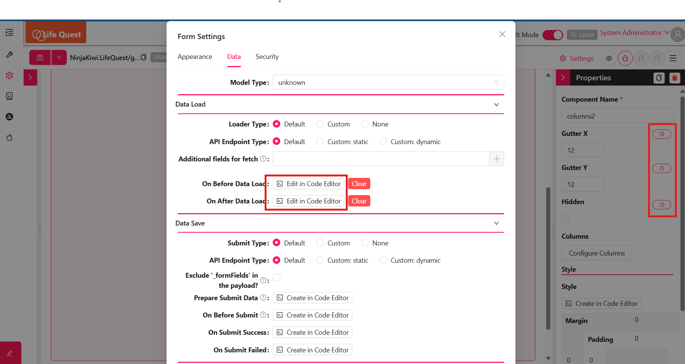

# GlobalState

GlobalState in Shesha is a shared store of values that any part of your application can read from or write to. It is useful when one component needs to react to something that happened in another, without passing values through every component in between.

You can set and read GlobalState from any code editor or JavaScript expression in the designer.



---

## Setting GlobalState

To set a global state value, call `setGlobalState` with a key and the data to store.

**Example - Store a value under a key:**

```js
setGlobalState({ key: "hidden", data: true });
```

Values are stored as key-value pairs. Here the key `"hidden"` is given the value `true`. The `data` value can be of any type, including booleans, objects, arrays, and strings.

---

## Consuming GlobalState

To read a global state value, reference its key on the `globalState` object.

**Example - Read a value by key:**

```js
globalState?.hidden;
```

This returns the value that was previously stored under that key.

---

## Benefits of GlobalState

GlobalState is helpful for a few reasons:

1. **Simplicity** - Set and read shared state across components with a single call.
2. **Reusability** - Use one state value in many places without passing props through intermediate components.
3. **Flexibility** - Store any type of value, including complex objects.
4. **Dynamic UI control** - Drive UI behaviour, such as conditionally hiding or showing sub-forms based on state.

---

## Using GlobalState with tables

GlobalState can also be used to work with data exposed by table and list components, such as `indexTable` and its `tableData`. Common use cases include:

1. **Calculations** - Summing total values for specific columns.
2. **Index access** - Reading values at specific indexes from table data.
3. **Selected row** - Reading the selected row's id or data through global state.

:::note
When the page is refreshed the global state is cleared and starts empty. Do not rely on a value persisting across a page reload.
:::
