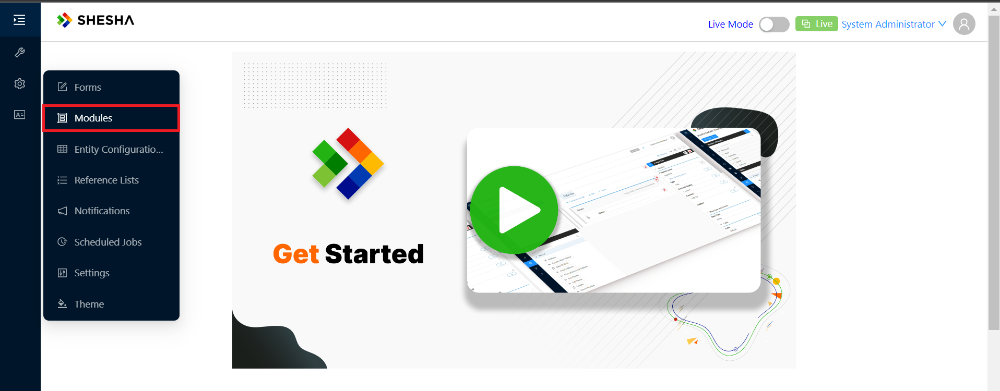
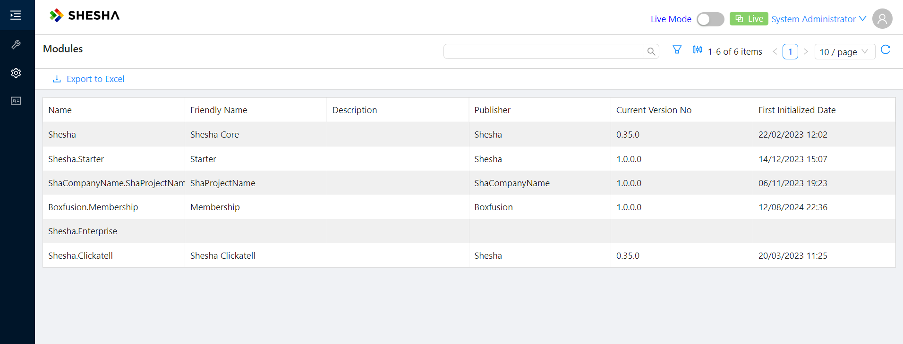

# Modules

Shesha promotes a modular approach to building applications. Instead of building everything from scratch, you package reusable functionality as Shesha modules and assemble those modules to deliver solutions efficiently. Shesha modules are distributed as regular NuGet packages and implement the `SheshaModule` class.

Shesha's modular approach builds on top of the [ASP.NET Boilerplate module system](https://aspnetboilerplate.com/Pages/Documents/Module-System) and uses its initialization, dependency, and plug-in management capabilities. On top of this, Shesha lets a module embed and distribute configuration (such as form configurations) and initialize key module parameters during application startup.

A Shesha module can include a domain model, services, APIs, form configurations, reference lists, and other NuGet-like artifacts. If the module relies on custom front-end components and pages, the NuGet package should be accompanied by a matching NPM package containing the required front-end components.

---

## View installed modules

To view the modules installed in the application, open the Admin portal and select the Modules menu item.



You then see the list of installed modules.



---

## Create a new module

### Add the SheshaModule class

Creating a module involves creating a new class library project and implementing the `SheshaModule` class. A Shesha module can be made up of one or more ASP.NET Boilerplate modules and assemblies. Whether to make an assembly a Shesha module depends on whether you need to associate configuration with it for distribution. If configuration distribution is not required, the assembly can be a regular ASP.NET Boilerplate module.

:::tip ASP.NET Boilerplate module system
It helps to be familiar with the basics of the ASP.NET Boilerplate module system. Refer to the [ASP.NET Boilerplate documentation](https://aspnetboilerplate.com/Pages/Documents/Module-System).
:::

A typical Shesha module class looks like this:

```csharp
[DependsOn(
    typeof(CrmDomainModule),
    typeof(SheshaCoreModule),
    typeof(AbpAspNetCoreModule)
)]
public class CrmApplicationModule : SheshaModule
{
    public override SheshaModuleInfo ModuleInfo => new SheshaModuleInfo("AcmeCorp.Crm") {
        FriendlyName = "Customer Relationship Management",
        Description = "Module to help manage customer relationships and interactions.",
        Publisher = "AcmeCorp"
    };

    public override async Task<bool> InitializeConfigurationAsync()
    {
        // Import any configuration embedded as resources in this assembly on application startup.
        return await ImportConfigurationAsync();
    }

    public override void Initialize()
    {
        var thisAssembly = Assembly.GetExecutingAssembly();

        // Register IoC services
        IocManager.RegisterAssemblyByConvention(thisAssembly);

        // Scan the assembly for classes which inherit from AutoMapper.Profile
        Configuration.Modules.AbpAutoMapper().Configurators.Add(
            cfg => cfg.AddMaps(thisAssembly)
        );
    }

    public override void PreInitialize()
    {
        var thisAssembly = Assembly.GetExecutingAssembly();

        // Create controllers for all AppService classes in the assembly
        Configuration.Modules.AbpAspNetCore().CreateControllersForAppServices(
            typeof(CrmApplicationModule).Assembly,
            moduleName: "Crm",      // Module name used for the controller route
            useConventionalHttpVerbs: true);
    }
}
```

The value passed to the `SheshaModuleInfo` constructor is the module's globally unique `Name`. The options available on `SheshaModuleInfo` are shown below.

| Name | Description |
|---|---|
| Name | A globally unique name that follows a convention similar to .NET namespaces, for example `MyOrg.MyModuleName`. This is the constructor argument. |
| FriendlyName | A short, user-friendly name, for example "My Module Name". |
| Description | More detail about the module. |
| Publisher | The name of the publisher, typically your organisation name. |
| VersionNo | Version number. Used for manual versioning. For automatic versioning, use `UseAssemblyVersion` instead. |
| UseAssemblyVersion | If `true`, the module version matches the assembly file version. |

___

### Specify the database prefix

If your module also contains domain classes, specify the [database prefix](/docs/back-end-basics/domain-model#module-database-prefix) by adding the following lines to the `AssemblyInfo.cs` file:

```csharp title="/Properties/AssemblyInfo.cs"
...
// Shesha specific attributes
// highlight-start
// Specifying the prefix to use for database objects belonging to this project
[assembly: TablePrefix("Crm_")]
// highlight-end
...
```

___

### Embed configuration

To embed configuration in the module so it is distributed automatically during application startup, refer to the [configuration distribution documentation](configuration).

---

## Install a module

To install a module, follow these steps:

1. Install the module as you would any regular NuGet package.
2. If the module depends on custom front-end components, also install the matching NPM package or packages on the front-end.
3. Any configuration embedded in the module is imported automatically during application startup. For more on how this works, refer to the [configuration distribution documentation](configuration).
4. Update the module classes of any project that depends on the new module to include it in the `DependsOn` attribute. This ensures the module is loaded and initialized when the application starts. See the example below.

```csharp
[DependsOn(
// highlight-start
    typeof(SomeUsefulModule),
// highlight-end
    typeof(SheshaCoreModule),
    typeof(AbpAspNetCoreModule)
)]
public class CrmApplicationModule : SheshaModule
{
    ...
}
```

---

## See also

- [ASP.NET Boilerplate module system](https://aspnetboilerplate.com/Pages/Documents/Module-System)
- [Shesha configurations and how to distribute them](configuration)
