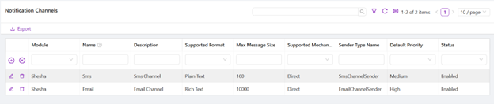
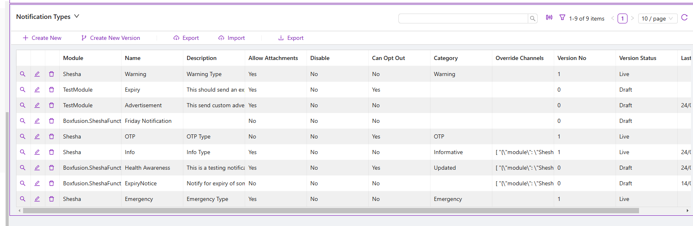
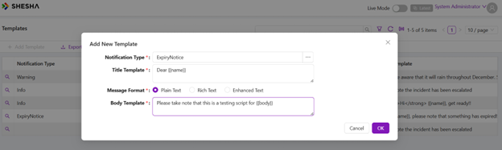
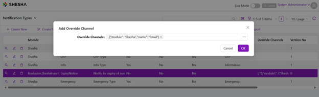
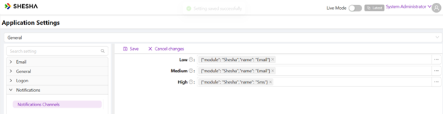

# Notifications

Shesha provides a built-in notification framework for sending messages through multiple channels such as **Email**, **SMS**, and **Push notifications**. The framework is designed to be:

- **Multi-channel** — SMS and Email are included out of the box, with a plugin architecture that makes it straightforward to add custom channels (e.g. Slack, Teams, WhatsApp).
- **Reliable** — Notifications are queued for background processing with automatic retries (up to 3 attempts) on failure.
- **Auditable** — Every notification sent is recorded with full details including status, timestamps, and error messages.
- **Configurable** — An admin UI allows you to manage notification types, templates, and channel settings without code changes.
- **Flexible** — Supports both asynchronous (queued) and synchronous (immediate) delivery for time-sensitive messages like OTPs.

## Key Concepts

### Channels

A **channel** represents a delivery mechanism (e.g. Email, SMS). Each channel is defined by a `NotificationChannelConfig` entity with the following key properties:

| Property | Description |
|---|---|
| **Name** | Display name (e.g. "Email", "SMS") |
| **SupportedFormat** | Message format the channel accepts: `PlainText`, `RichText`, or `EnhancedText` |
| **SupportedMechanism** | `Direct`, `BulkSend`, or `Broadcast` |
| **MaxMessageSize** | Maximum message length (useful for SMS) |
| **SupportsAttachment** | Whether the channel supports file attachments |
| **Status** | `Enabled`, `Disabled`, or `Suppressed` |

Shesha ships with two pre-configured channels: **SMS** and **Email**.



#### Registering a channel

Channels are registered in `Startup.cs` via dependency injection:

```csharp
services.AddTransient<INotificationChannelSender, EmailChannelSender>();
services.AddTransient<INotificationChannelSender, SmsChannelSender>();
```

To add a custom channel, implement the `INotificationChannelSender` interface and register it in the same way.

### Notification Types and Templates

A **notification type** (`NotificationTypeConfig`) defines a category of notification (e.g. "Welcome Email", "Password Reset"). Each type has one or more **templates** that define the actual message content for different channels.

**Notification type properties:**

| Property | Description |
|---|---|
| **Name** | Unique name identifying the notification type |
| **Description** | Human-readable description |
| **Disable** | Globally disable this notification type |
| **CanOptOut** | Whether users can opt out of receiving this notification |
| **IsTimeSensitive** | If `true`, sends immediately (synchronously) instead of queuing |
| **AllowAttachments** | Whether attachments can be included |
| **OverrideChannels** | Force specific channels, bypassing the default channel selection logic |
| **Category** | Optional grouping label for analysis |

**Template properties:**

| Property | Description |
|---|---|
| **TitleTemplate** | Subject/title using Mustache syntax (e.g. `Dear {{FullName}}`) |
| **BodyTemplate** | Message body using Mustache syntax |
| **MessageFormat** | `PlainText` or `RichText` (HTML) — must match the channel's supported format |





:::tip Admin UI
Notification types and templates can be managed through the admin UI. Navigate to the **Notification Types** configuration section to create, edit, or disable notification types and their associated templates.
:::

:::note Template-channel matching
Each template's **MessageFormat** must be compatible with the channel it will be used on. For example, an Email channel typically supports `RichText` (HTML), while an SMS channel supports `PlainText`. If a notification type can be sent through both Email and SMS, create separate templates — one with `RichText` for Email and one with `PlainText` for SMS.
:::

### Channel Selection Logic

When a notification is sent, the framework determines which channel(s) to use through this priority hierarchy:

1. **Explicit channel** — If a channel is passed directly in the `SendNotificationAsync` call, only that channel is used.
2. **User preferences** — If the recipient has set a `UserNotificationPreference` for this notification type, that channel is used.
3. **Override channels** — If the notification type has `OverrideChannels` configured, those are used.
   
4. **System defaults** — Falls back to the default channels configured per priority level (High / Medium / Low) in the notification settings.
   

### Application-Level Settings

Global notification settings are configured under the **Notifications** settings category (`Shesha.Notification.Settings`). The settings editor form (`notification-settings`) allows you to configure:

| Setting | Description |
|---|---|
| **Low priority channels** | Default channel(s) for low-priority notifications |
| **Medium priority channels** | Default channel(s) for medium-priority notifications |
| **High priority channels** | Default channel(s) for high-priority notifications |
| **Test channel** | Channel used for testing notifications |

Additionally, each channel type has its own settings:

- **Email settings** — SMTP configuration, enable/disable flag, and a `RedirectAllMessagesTo` option for routing all emails to a test address during development.
- **SMS settings** — Gateway configuration, enable/disable flag, and a similar `RedirectAllMessagesTo` option for testing.

### INotificationSender Service

`INotificationSender` is the primary service for sending notifications from your application code. It provides two overloads of `SendNotificationAsync`:

#### Overload 1 — Person-based (simplest)

The most common usage: pass `Person` entities for sender and recipient.

```csharp
Task SendNotificationAsync<TData>(
    NotificationTypeConfig type,        // The notification type to send
    Person? sender,                     // Sender (nullable)
    Person receiver,                    // Recipient
    TData data,                         // Template data (extends NotificationData)
    RefListNotificationPriority priority,
    List<NotificationAttachmentDto>? attachments = null,
    string? cc = null,                  // CC addresses (semicolon-delimited)
    GenericEntityReference? triggeringEntity = null,
    NotificationChannelConfig? channel = null,  // Force a specific channel
    string? category = null
) where TData : NotificationData;
```

#### Overload 2 — Participant-based (advanced)

For scenarios where you need to send to a raw address (e.g. an email or phone number not linked to a `Person` entity), use `IMessageSender` / `IMessageReceiver` participants:

```csharp
Task SendNotificationAsync<TData>(
    NotificationTypeConfig type,
    IMessageSender? sender,
    IMessageReceiver receiver,
    TData data,
    RefListNotificationPriority priority,
    List<NotificationAttachmentDto>? attachments = null,
    string? cc = null,
    GenericEntityReference? triggeringEntity = null,
    NotificationChannelConfig? channel = null,
    string? category = null
) where TData : NotificationData;
```

**Message participants:**

- `PersonMessageParticipant` — wraps a `Person` entity. The channel extracts the address (e.g. `EmailAddress1` for email, `MobileNumber1` for SMS) automatically.
- `RawAddressMessageParticipant` — wraps a raw address string (e.g. `"user@example.com"` or `"+27821234567"`). Useful when you don't have a `Person` record.

```csharp
// Example: sending to a raw email address
var receiver = new RawAddressMessageParticipant("user@example.com");
await _notificationSender.SendNotificationAsync(type, null, receiver, data, priority);
```

---

## Implementation Guide

### Project Structure

Place notification-related classes in a `Notifications` folder within your Application project:

```
MyProject.Application/
└── Services/
    └── Notifications/
        ├── IOrderNotificationSender.cs      // Interface
        ├── OrderNotificationSender.cs        // Implementation
        └── OrderNotificationModel.cs         // Template data model
```

### Step 1 — Define the Template Data Model

Create a class extending `NotificationData` with properties that map to your template placeholders:

```csharp
using Abp.Notifications;

namespace MyProject.Services.Notifications
{
    public class OrderNotificationModel : NotificationData
    {
        public string CustomerName { get; set; }
        public string OrderNumber { get; set; }
        public string OrderDate { get; set; }
    }
}
```

The property names must match the Mustache placeholders in your templates (e.g. `{{CustomerName}}`).

:::tip Simple alternative
For simple cases you can skip creating a model class and use `NotificationData` directly as a dictionary:

```csharp
var data = new NotificationData();
data["CustomerName"] = "John Smith";
data["OrderNumber"] = "ORD-001";
```
:::

### Step 2 — Create Notification Types and Templates

Notification types and templates are stored in the database. You have two options:

#### Option A — Admin UI

Create them directly through the admin UI (recommended for non-developers or when you want to iterate on template text without redeploying).

#### Option B — Database Migration

Use FluentMigrator with Shesha's helper methods to seed notification types and templates as part of your deployment:

```csharp
using FluentMigrator;
using Shesha.FluentMigrator;

[Migration(20250226120000)]
public class M20250226120000 : Migration
{
    public override void Up()
    {
        // Create a notification type with an Email template
        this.Shesha().NotificationCreate("MyModule", "Order Confirmed")
            .SetDescription("Sent when a customer's order is confirmed.")
            .AddEmailTemplate(
                "A1B2C3D4-E5F6-7890-ABCD-EF1234567890".ToGuid(),
                "Order Confirmation Email",                          // Template name
                "Your order {{OrderNumber}} has been confirmed",     // Subject template
                @"<p>Dear {{CustomerName}},</p>
                  <p>Your order <strong>{{OrderNumber}}</strong> placed on {{OrderDate}}
                  has been confirmed.</p>");

        // Add an SMS template for the same notification type
        this.Shesha().NotificationUpdate("MyModule", "Order Confirmed")
            .AddSmsTemplate(
                "B2C3D4E5-F6A7-8901-BCDE-F12345678901".ToGuid(),
                "Order Confirmation SMS",
                "Hi {{CustomerName}}, your order {{OrderNumber}} is confirmed.");
    }

    public override void Down()
    {
        throw new NotImplementedException();
    }
}
```

**Available migration helper methods:**

| Method | Description |
|---|---|
| `NotificationCreate(module, name)` | Create a new notification type |
| `NotificationUpdate(module, name)` | Update an existing notification type |
| `.SetDescription(text)` | Set the type's description |
| `.AddEmailTemplate(id, name, subject, body)` | Add an email template (RichText format) |
| `.AddSmsTemplate(id, name, body)` | Add an SMS template (PlainText format) |
| `.AddPushTemplate(id, name, subject, body)` | Add a push notification template |
| `NotificationTemplateUpdate(id)` | Update an existing template |
| `NotificationTemplateDelete(id)` | Delete a template |

Template IDs are GUIDs that must be unique. Generate them with any GUID generator.

### Step 3 — Implement the Notification Sender

Create an interface and implementation class that encapsulates the notification logic for your domain:

**Interface:**

```csharp
namespace MyProject.Services.Notifications
{
    public interface IOrderNotificationSender
    {
        Task NotifyOrderConfirmedAsync(Guid orderId);
    }
}
```

**Implementation:**

```csharp
using Abp.Dependency;
using Abp.Domain.Repositories;
using Shesha.Domain;
using Shesha.Domain.Enums;
using Shesha.Notifications;

namespace MyProject.Services.Notifications
{
    public class OrderNotificationSender : IOrderNotificationSender, ITransientDependency
    {
        private readonly INotificationSender _notificationSender;
        private readonly IRepository<NotificationTypeConfig, Guid> _notificationTypeRepo;
        private readonly IRepository<Person, Guid> _personRepo;
        private readonly IRepository<Order, Guid> _orderRepo;

        public OrderNotificationSender(
            INotificationSender notificationSender,
            IRepository<NotificationTypeConfig, Guid> notificationTypeRepo,
            IRepository<Person, Guid> personRepo,
            IRepository<Order, Guid> orderRepo)
        {
            _notificationSender = notificationSender;
            _notificationTypeRepo = notificationTypeRepo;
            _personRepo = personRepo;
            _orderRepo = orderRepo;
        }

        public async Task NotifyOrderConfirmedAsync(Guid orderId)
        {
            var order = await _orderRepo.GetAsync(orderId);
            var notificationType = await _notificationTypeRepo.FirstOrDefaultAsync(
                x => x.Name == "Order Confirmed");

            if (notificationType == null)
                return;

            var data = new OrderNotificationModel
            {
                CustomerName = order.Customer.FullName,
                OrderNumber = order.OrderNumber,
                OrderDate = order.OrderDate.ToString("dd MMM yyyy")
            };

            await _notificationSender.SendNotificationAsync(
                notificationType,
                sender: null,
                receiver: order.Customer,
                data: data,
                priority: RefListNotificationPriority.Medium);
        }
    }
}
```

### Step 4 — Call the Notification Sender

Inject your notification sender and call it from your application service or workflow:

```csharp
public class OrderAppService : SheshaAppServiceBase
{
    private readonly IOrderNotificationSender _orderNotificationSender;

    public OrderAppService(IOrderNotificationSender orderNotificationSender)
    {
        _orderNotificationSender = orderNotificationSender;
    }

    public async Task ConfirmOrderAsync(Guid orderId)
    {
        // ... order confirmation logic ...

        await _orderNotificationSender.NotifyOrderConfirmedAsync(orderId);
    }
}
```

### Sending to Multiple Recipients

To notify multiple people, loop through the recipients:

```csharp
foreach (var person in recipients)
{
    await _notificationSender.SendNotificationAsync(
        notificationType, sender: null, receiver: person, data, priority);
}
```

### Forcing a Specific Channel

Pass a `NotificationChannelConfig` to override the default channel selection:

```csharp
var emailChannel = await _channelRepo.FirstOrDefaultAsync(x => x.Name == "Email");

await _notificationSender.SendNotificationAsync(
    notificationType, sender: null, receiver: person, data,
    RefListNotificationPriority.Medium,
    channel: emailChannel);
```

### Including Attachments

Pass a list of `NotificationAttachmentDto` referencing stored files:

```csharp
var attachments = new List<NotificationAttachmentDto>
{
    new NotificationAttachmentDto
    {
        FileName = "invoice.pdf",
        StoredFileId = storedFile.Id
    }
};

await _notificationSender.SendNotificationAsync(
    notificationType, sender: null, receiver: person, data,
    RefListNotificationPriority.Medium, attachments: attachments);
```

:::note
Attachments are only sent if the notification type has `AllowAttachments` set to `true` **and** the channel supports attachments (`SupportsAttachment = true`).
:::

### Linking a Triggering Entity

Use `GenericEntityReference` to link the notification to the entity that triggered it, useful for audit trails:

```csharp
await _notificationSender.SendNotificationAsync(
    notificationType, sender: null, receiver: person, data,
    RefListNotificationPriority.Medium,
    triggeringEntity: new GenericEntityReference(order));
```

## Asynchronous vs Synchronous Delivery

By default, notifications are **queued** for background processing. This is suitable for most cases (e.g. confirmations, reminders).

For **time-sensitive** messages (e.g. OTPs, security alerts), set `IsTimeSensitive = true` on the notification type. This causes the notification to be sent immediately in the current thread, bypassing the background queue.

## Retry Behaviour

Failed notifications are automatically retried up to **3 times** with delays of 10, 20, and 20 seconds respectively. The `NotificationMessage` entity tracks:

- `RetryCount` — number of attempts made
- `Status` — `Preparing`, `Sent`, `WaitToRetry`, or `Failed`
- `ErrorMessage` — details of the last failure

