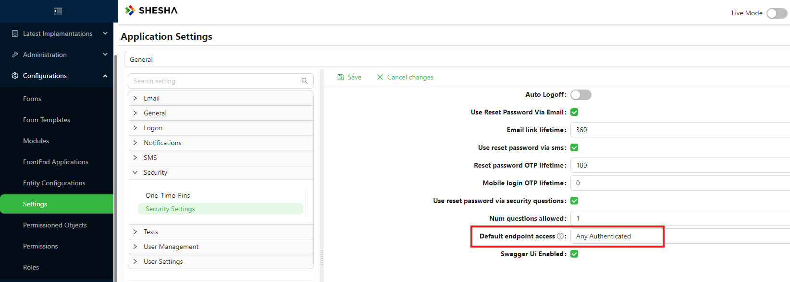
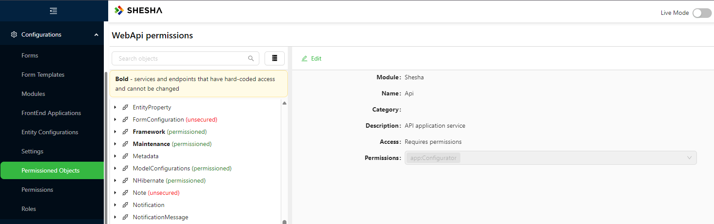

# Endpoint Permissions

Every API endpoint in a Shesha application has a permission level that controls who can call it. By default, Shesha scans your application on startup and registers all endpoints in a central store called Permissioned Objects. From there, you can control access through code attributes, a system-wide default setting, or the Permissioned Objects configuration UI. Understanding how these three mechanisms interact - and which one takes priority - is essential for building secure APIs.

---

## Access Levels

Every endpoint is assigned one of five access levels. These are the same options you see in the Permissioned Objects UI and in code via the `RefListPermissionedAccess` enum.

| Level | What it means |
|---|---|
| `Allow Anonymous` | Anyone can call the endpoint, whether or not they are logged in. |
| `Any Authenticated` | Any logged-in user can call the endpoint, regardless of their permissions. |
| `Requires Permissions` | Only users who hold at least one of the specified permissions can call the endpoint. |
| `Inherited` | The endpoint defers to its parent service. If the parent is also `Inherited`, it falls back to the `DefaultEndpointAccess` system setting. |
| `Disable` | The endpoint is turned off entirely. Callers receive an error response. |

---

## Controlling Access in Code

When Shesha scans your application on startup, it reads any attributes on your AppService classes and methods to determine the initial access level for each endpoint. There are two categories of attribute: hardcoded and configurable.

### Hardcoded Attributes

The following attributes lock an endpoint's access level permanently. Shesha marks any endpoint decorated with one of these as `Hardcoded`, which means the Permissioned Objects UI will display the value but will not let you change it. The code value always wins, on every startup.

| Attribute | Effect |
|---|---|
| `[AllowAnonymous]` | Sets access to `Allow Anonymous`. |
| `[AbpAllowAnonymous]` | Sets access to `Allow Anonymous`. |
| `[AbpAuthorize]` | Sets access to `Requires Permissions` (or `Any Authenticated` if no permissions are listed). |
| `[AbpMvcAuthorize]` | Sets access to `Requires Permissions` (or `Any Authenticated` if no permissions are listed). |

```csharp
// This endpoint can never be locked down via the UI - it is always public.
[AllowAnonymous]
[HttpGet, Route("public-status")]
public async Task<StatusDto> GetPublicStatus()
{
    // ...
}
```

### Configurable Attributes

`[SheshaAuthorizeAttribute]` sets the endpoint's initial access level in the database without marking it as hardcoded. This means the value can later be overridden through the Permissioned Objects UI.

```csharp
using Shesha.Domain.Enums;

[SheshaAuthorize(RefListPermissionedAccess.RequiresPermissions, "WorkOrder-View")]
[HttpGet, Route("{id}")]
public async Task<WorkOrderDto> GetWorkOrder(Guid id)
{
    // ...
}
```

Use this attribute when you want to ship a sensible default from code but still allow a system administrator to adjust the setting without a deployment.

### No Attribute

If you do not apply any attribute, Shesha registers the endpoint in the database with an access level of `Inherited`. The endpoint will then defer to its parent service's access level, or to the `DefaultEndpointAccess` system setting if the parent is also `Inherited`.

---

## Controlling Access via Configuration

### Default Endpoint Access



The `Default Endpoint Access` setting under **System Settings > Security** controls the fallback access level for any endpoint whose database record has an access level of `Inherited`. It applies system-wide, so changing it affects every endpoint that has not been explicitly configured.

:::warning
The `Default Endpoint Access` setting only applies to endpoints that are still set to `Inherited` in the database. Any endpoint that has been explicitly configured - either through the Permissioned Objects UI or because it carries a hardcoded attribute - is not affected by this setting.
:::

### Permissioned Objects UI



The Permissioned Objects UI in the Configuration Studio shows every registered endpoint in your application, organised by module and service. From here you can see the current access level and permissions for each endpoint and change them without touching code.

Endpoints marked as `Hardcoded` are shown with a lock indicator. Their values reflect the code attribute and cannot be edited.

All other endpoints can be updated directly in the UI. When you save a change, Shesha writes the new value to the database. After that point, the endpoint's access level is controlled by that database record.

---

## How Updates Work

`[SheshaAuthorizeAttribute]` and the `DefaultEndpointAccess` system setting are both used exactly once: during initial setup. After that, the database is the source of truth and all permission changes must be made through the Permissioned Objects UI or the Security Settings page.

This is intentional. Once a system is running, there is no way to tell whether a difference between a code value and a database value means the developer changed the code, or the administrator changed the setting in the UI. Rather than risk overwriting a deliberate UI change, Shesha treats the database as authoritative after initialization.

On every application startup, Shesha compares each registered endpoint against its database record and applies the following rules:

| Condition | What happens on startup |
|---|---|
| Endpoint is new (no DB record) | The code attribute value is written to the database. |
| Endpoint carries a hardcoded attribute | The code value always overwrites the database record, regardless of what the database says. |
| DB record exists with a non-`Inherited` access level | The database record is kept. The code attribute value is ignored. |
| DB record exists and is `Inherited` | The code attribute value is applied. This only occurs if the attribute itself specifies `Inherited`, or if a user has explicitly reset the endpoint to `Inherited` in the UI. |

:::warning
Changing `[SheshaAuthorizeAttribute]` in code after an endpoint has been initialized will have no effect. The initial seed writes a non-`Inherited` value to the database. On all subsequent startups, that non-`Inherited` database value is kept and the code is not re-applied. To change permissions on an already-initialized endpoint, use the Permissioned Objects UI.

The same applies to `DefaultEndpointAccess`: once the value has been saved in the database through the Security Settings page, changing the code-level default has no effect. Configure it through the UI.
:::

---

## Priority Summary

When a request arrives, Shesha resolves the endpoint's effective access level in the following order:

1. If the endpoint carries a hardcoded attribute (`[AllowAnonymous]`, `[AbpAuthorize]`, etc.), that value is used. No database lookup is needed.
2. If a database record exists with an explicit (non-`Inherited`) access level, that value is used.
3. If the database record is `Inherited`, Shesha walks up the parent service hierarchy.
4. If the parent hierarchy is fully `Inherited`, the `DefaultEndpointAccess` system setting is used as the final fallback.
