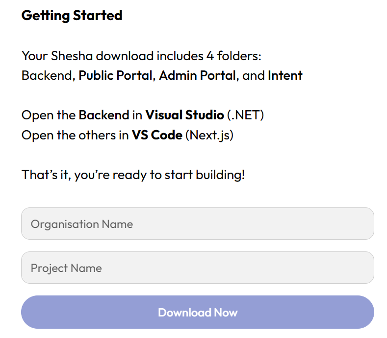
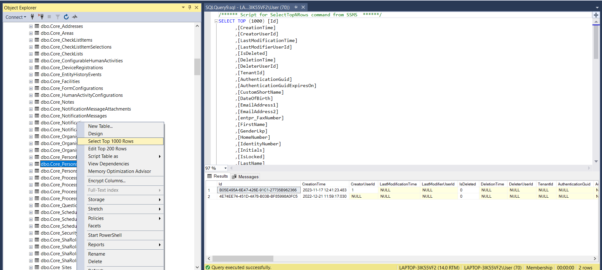
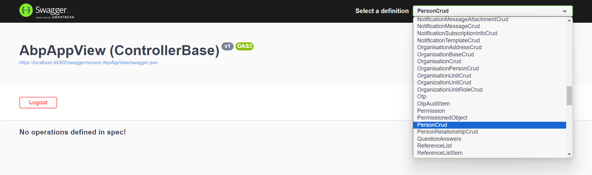
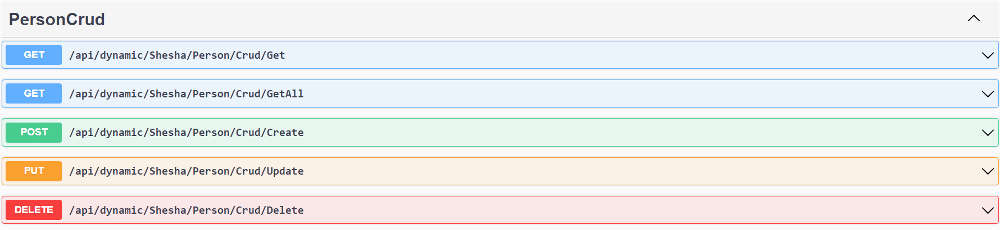
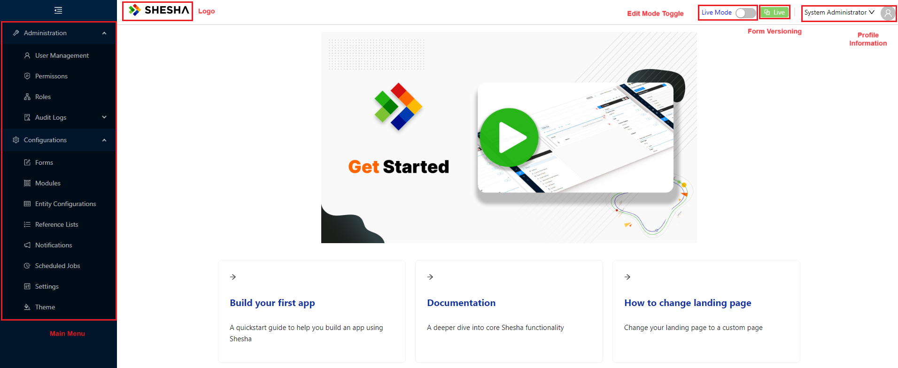

# Setting Up

This guide walks you through getting a Shesha application running on your Windows machine for the first time. By the end you will have the starter project's backend, frontend, and seeded database all running locally, and you will be able to log in to your first Shesha app.

If you are on Mac OS or Linux, follow [Mac OS / Linux Setup](./shesha-mac-setup-getting-started.md) instead.

:::info What you will need
- **SQL Server** with SQL Server Management Studio (SSMS) installed and a local instance you can connect to.
- **Visual Studio 2022** (Community edition is fine) for the backend.
- **Visual Studio Code** for the frontend.
- **Node.js version 20.11.1** installed and available on your PATH.
:::

---

## 1. Download the Shesha Starter Template

The starter template is a pre-configured solution that includes the backend, the frontend, and a seeded SQL Server database.

1. Click the **Get Started** button on [shesha.io](https://www.shesha.io/download-shesha).
2. Provide the namespace parameters. No spaces are allowed in either input:

| Field | Example |
|---|---|
| `Organisation Name` | Contoso |
| `Project Name` | Membership |

The resulting namespace will start with `Contoso.Membership`.

:::warning Organisation Name cannot be "Shesha"
The Organisation Name cannot be `Shesha`, since that name is reserved for the framework's own namespaces. Use your real organisation name instead.
:::



3. Unzip the generated folder to your preferred destination.

The zip file contains three pieces:

| Piece | What it is |
|---|---|
| `Adminportal (Frontend)` | A React.js (Next.js) solution that hosts the designer and configured pages. |
| `Backend` | An ASP.NET Core solution with the API host, application layer, and domain layer. |
| `Database` | A seeded SQL database with sample data |

---

## 2. Setup the Database

The starter ships its database as a `.bacpac` file. You restore it through SQL Server Management Studio.

1. Open **Microsoft SQL Server Management Studio**.
2. Connect to your local server (typically `localhost`).
3. Right-click **Databases**.
4. Select **Import Data-tier Application...** and click **Next**.
5. Click **Browse**, locate your `Membership.bacpac` file, and click **Next**.
6. In the **New database name** field, type `Membership` and click **Next**.
7. Click **Finish** on the Summary step.
8. Verify the import succeeded by expanding the new database, navigating to `Tables > dbo.Core_Persons`, and selecting the top 1000 rows.



:::tip Pick a database name you can remember
If you change the database name from `Membership`, you will need to update the connection string in the backend's `appsettings.json` to match.
:::

---

## 3. Run the Backend

The backend is an ASP.NET Core solution that you open and run in Visual Studio 2022.

1. Open the starter project folder.
2. Navigate to the `backend` folder.
3. Double-click `Shesha.Membership.sln` (or the equivalent name for your project) to open it in Visual Studio 2022.
4. Update the connection string only if you used a database name other than `Membership`:

**Example - Updating the connection string in appsettings.json:**

```json
{
  "ConnectionStrings": {
    "Default": "Server=localhost;Database=Membership;Trusted_Connection=True;TrustServerCertificate=True;"
  }
}
```

The file lives in the `Shesha.Membership.Web.Host` project.

5. Run the application by selecting **Debug > Start Debugging**, or by pressing **F5**.

The application should open in your browser on the default Swagger API page.





:::info First run may take a minute
The first time the backend starts up, it applies all migrations and bootstraps the configuration items. Subsequent runs are much faster.
:::

---

## 4. Run the Frontend

The frontend is a Next.js application that you run from Visual Studio Code.

1. Open **Microsoft Visual Studio Code**.
2. Choose **File > Open Folder** and open the `adminportal` folder from your downloaded starter project.
3. Open a new terminal via **Terminal > New Terminal**.
4. Confirm Node.js version 20.11.1 is installed:

**Example - Checking the Node.js version:**

```bash
node -v
```

5. Install the dependencies:

**Example - Installing frontend dependencies:**

```bash
npm install
```

6. Start the development server:

**Example - Running the frontend:**

```bash
npm run dev
```

7. Log in to the admin portal using the default credentials:

| Field | Value |
|---|---|
| `Username` | admin |
| `Password` | 123qwe |

Once logged in you have your first Shesha application running. The home page should look like this:



:::warning Change the default password before deploying
The default `admin / 123qwe` credentials are intended for local development only. Change them before deploying any Shesha application to a shared environment.
:::

---

## Next Steps

Now that the starter is running, head over to the [Tutorial: The Basics](./tutorial/the-basics/index.md) to walk through configuring your first view, extending the domain model, adding a child table, and calling a custom API.
