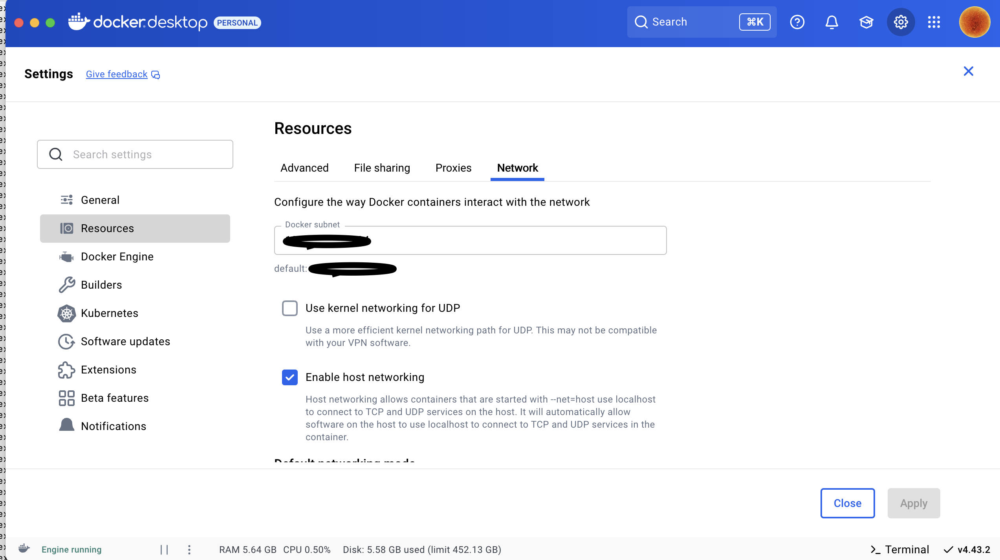

# Mac OS / Linux Setup

This guide walks you through getting a Shesha application running on Mac OS or Linux. Because Visual Studio is not supported on these operating systems, you run the backend with the .NET CLI and host SQL Server in Docker. By the end of the guide you will have the starter project's backend, frontend, and seeded database all running locally.

If you are on Windows, follow [Setting Up](./setting-up.md) instead.

:::info Tools you will need
- **Git** - for cloning repositories.
- **Docker** - to run Microsoft SQL Server in a container.
- **.NET 8 SDK and Runtime** - for the backend and for SQL-Package.
- **Node.js 22** - for the frontend.
- **SQL-Package** - to import the starter database from a `.bacpac` file.
- **Visual Studio Code** (or an AI-infused fork) - the recommended editor for both frontend and backend code.
- **Database Client extension for VS Code** - to connect to SQL Server. [Download extension](https://marketplace.visualstudio.com/items?itemName=cweijan.vscode-mysql-client2).
:::

:::tip Commands that need elevated permissions
Some commands may require administrator privileges. In that case, prefix them with `sudo`:

```bash
sudo <command>
```
:::

---

## 1. Install and Run SQL Server in Docker

Download Docker Desktop for Mac from [docker.com](https://www.docker.com) and install it. Once Docker is running, you can use `docker` commands in the terminal to create, start, stop, and manage containers.

For additional context, see Microsoft's [Quickstart: Install and connect to SQL Server in Docker](https://learn.microsoft.com/en-us/sql/linux/quickstart-install-connect-docker?view=sql-server-ver17&tabs=cli).

### 1.1 Pull the SQL Server Image

**Example - Pulling the SQL Server 2022 image:**

```bash
docker pull --platform linux/amd64 mcr.microsoft.com/mssql/server:2022-latest
```

### 1.2 Run the Container

**Example - Running SQL Server in a container:**

```bash
docker run --platform linux/amd64 -d \
  -e "ACCEPT_EULA=Y" -e "MSSQL_SA_PASSWORD=@123Shesha" \
  -p 1433:1433 --name SQL_Server_Docker \
  mcr.microsoft.com/mssql/server:2022-latest
```

After running this command, SQL Server is running in a container with the following credentials:

| Field | Value |
|---|---|
| `User ID` | sa |
| `Password` | @123Shesha |
| `Port` | 1433 |

:::warning Change the default SA password
The `@123Shesha` password is fine for local development but must be changed before exposing this container to any shared environment.
:::

### 1.3 Enable Host Networking

In Docker Desktop, enable **host networking** so that your machine's network calls can reach the container's network.



---

## 2. Import the Starter Database

On Windows, SQL Server Management Studio's *Import Data-tier Application* wizard handles this. On Mac OS or Linux, you use **SQL-Package** instead.

### 2.1 Install .NET 8

If you do not already have it, download the Arm64 (Apple Silicon) or x64 (Intel) version from the [.NET 8 download page](https://dotnet.microsoft.com/en-us/download/dotnet/8.0).

### 2.2 Install SQL-Package

**Example - Installing SQL-Package as a global .NET tool:**

```bash
dotnet tool install -g microsoft.sqlpackage
```

Follow the terminal instructions to add SQL-Package to your `PATH`, then close and reopen your terminal.

For full details, see Microsoft's [Install SQL-Package](https://learn.microsoft.com/en-us/sql/tools/sqlpackage/sqlpackage-download?view=sql-server-ver17) guide.

### 2.3 Download the Starter Project

1. Download the [Shesha Starter Template](https://www.shesha.io/download-shesha). The download contains:

| Piece | What it is |
|---|---|
| `Adminportal` | React.js (Next.js) frontend |
| `Backend` | ASP.NET Core backend |
| `Database` | Seeded SQL Server `.bacpac` file |

2. Unzip the project and note the directory path.

:::note Replace placeholders in commands
Replace `OrganisationName` and `ProjectName` in the commands below with the actual names you chose when generating the starter project.
:::

### 2.4 Import the Database

In the unzipped project directory you will find a `.bacpac` file at a path like:

```
~/Downloads/<OrganisationName.ProjectName>/<ProjectName>.bacpac
```

**Example - Restoring the bacpac into SQL Server:**

```bash
sqlpackage /Action:Import \
  /SourceFile:"./Downloads/<OrganisationName.ProjectName>/<ProjectName>.bacpac" \
  /TargetConnectionString:"Server=localhost,1433;Initial Catalog=ProjectName;Persist Security Info=False;User ID=sa;Password=@123Shesha;MultipleActiveResultSets=False;Encrypt=True;TrustServerCertificate=True;Connection Timeout=30;"
```

Once the import completes, use any SQL Server client to verify that the database exists.

---

## 3. Run the Backend

### 3.1 Open the Backend in VS Code

Open the `backend` directory in your code editor.

### 3.2 Update the Connection String

Edit `src/OrganisationName.ProjectName.Web.Host/appsettings.json` and replace the `Default` connection string with one that points at your Docker SQL Server:

**Example - appsettings.json connection string for Docker SQL Server:**

```json
{
  "ConnectionStrings": {
    "Default": "Server=localhost,1433;Initial Catalog=ProjectName;Persist Security Info=False;User ID=sa;Password=@123Shesha;MultipleActiveResultSets=False;Encrypt=True;TrustServerCertificate=True;Connection Timeout=30;"
  }
}
```

### 3.3 Build and Run

The backend directory looks roughly like this:

```
backend
├── src
├── nupkg
├── .nuget
├── test
└── ...
```

**Example - Building the backend:**

```bash
dotnet build
```

**Example - Running the backend:**

```bash
dotnet run --project src/OrganisationName.ProjectName.Web.Host \
  --urls "http://localhost:21021;https://localhost:44362"
```

:::tip Install a development HTTPS certificate
If you do not already have a local development certificate, install and trust one:

```bash
dotnet dev-certs https --trust
```
:::

---

## 4. Run the Frontend

**Example - Installing and running the frontend:**

```bash
cd adminportal
npm install
npm run dev
```

The frontend is now running locally and connected to your backend.

---

## You're Ready to Go

Log in to the admin portal using the default credentials:

| Field | Value |
|---|---|
| `Username` | admin |
| `Password` | 123qwe |

:::warning Change the default password before deploying
The default `admin / 123qwe` credentials are intended for local development only. Change them before deploying any Shesha application to a shared environment.
:::

From here, head over to the [Tutorial: The Basics](./tutorial/the-basics/index.md) to walk through configuring your first view.
