# Configuring Your First View

In this section, we are configuring the most common types of views taking advantage of the base domain model and the drag-and-drop form configuration interface. We are going to take you through the process of configuring some basic views to allow the user to:

- View a list of people
- Register a new person
- View the details of the registered person
- Access the list view of the persons from the main menu

## Form Versioning

Form versioning refers to the practice of managing different versions of a form. Each version represents a distinct state of the form, and organizations often use multiple versions to handle changes, updates, or different stages of the form's life cycle. The three versions available —Live, Ready, and Draft— suggest a common workflow for form versioning. Let's break down their meanings:

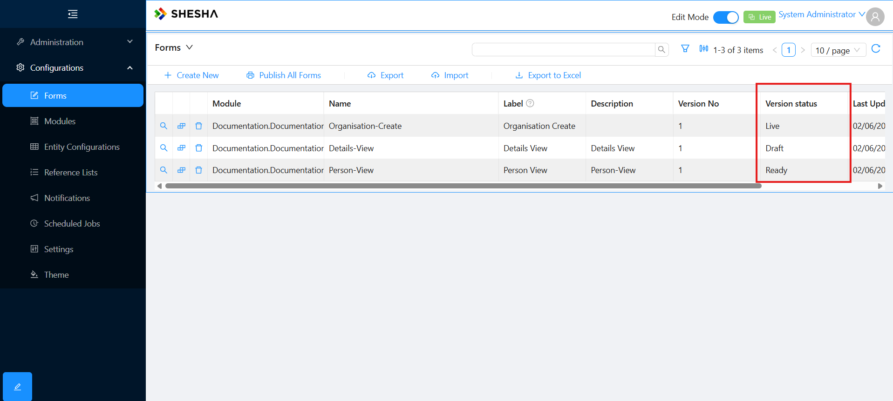

### Draft

- A "Draft" version is a work in progress. It is a form that is being created or modified but is not yet ready for use or publication. During this stage, form designers can make changes, add new fields, or update existing ones without affecting the live version.

### Ready

- The "Ready" version is a form that has been finalized and is ready for deployment. It represents a snapshot of the form that is stable and complete. Once a form is marked as "Ready," it indicates that the form has undergone necessary reviews and is considered suitable for use. The system displays ready versions where available with fallback to live.

### Live

- The "Live" version is the actively used form that is accessible to users or respondents. It represents the current version of the form that people interact with. When a form is moved from the "Ready" state to "Live," it becomes the version that is deployed for public use.

The typical workflow involves creating or modifying a form in the "Draft" state, reviewing and finalizing it in the "Ready" state, and then deploying it as the "Live" version for users to fill out. If further changes are needed, a new draft can be created, and the cycle continues.

This versioning system helps organizations manage changes to forms in a controlled manner, preventing unintended modifications to live forms and allowing for a structured development and deployment process. It also provides a clear distinction between the different stages of a form's life cycle, making it easier to track and manage changes.

## Creating a New Form

- On the `Main Menu`, navigate to `Configurations > Forms`.
- Click on the `Create New` button on the toolbar.

### Form Fields

- **Module:** Specifies the application module the new form configuration will be saved under.
- **Entity:** Specifies the type of `Model Type` you want the form to bind to. This determines the information that the form will be able to access and display.
- **Template:** Specifies the default layout to use for the new form (e.g. table or form view).
- **Name:** This forms part of the form path. This should be unique within the module selected and may only contain alpha-numeric characters and '-'.
- **Label:** Label of the item, can be used as a user friendly name.
- **Description:** Additional information about the form.

## Table View

To manage the information of the people registered onto the system, we need to create a table view.

1. **Create a new form with the following information:**

   - Module: `Shesha.Membership`
   - Entity: `Shesha.Domain.Person`
   - Template: `table-view`
   - Name: `members-table`
   - Label: `Members Table`
   - Description: `This table view is used to display a list of all members`

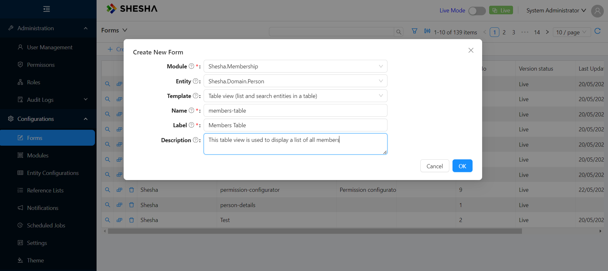

2. You will then be redirected to the **Form Designer**, which should have basic table components readily configured for your convenience based on the selected template. All that’s left to do is to configure the columns you want visible, and add a title!

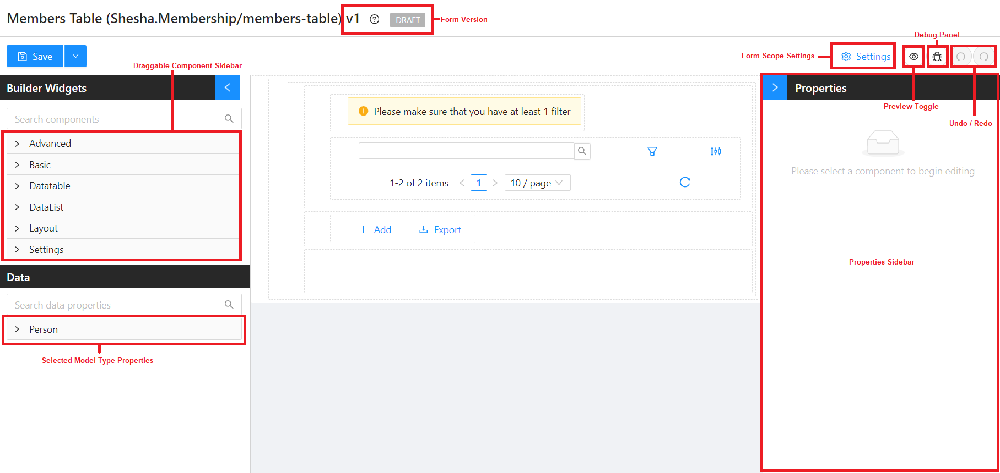

- ### Configuring Table Columns

  - First, click the `Tables and Lists` dropdown and then hover over the `datatable` component handle on your form's components and click it to see the properties of the `datatable` component in the `Properties` sidebar.

    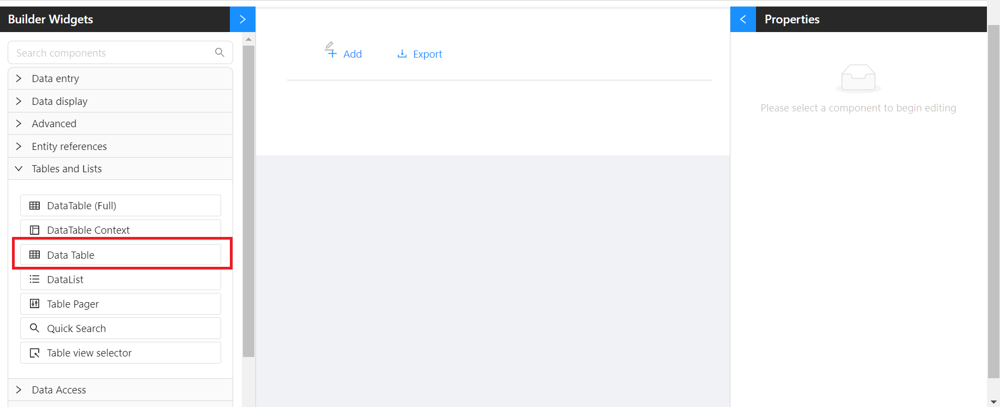

  - Click on `Configure Columns` > `Add Column`

    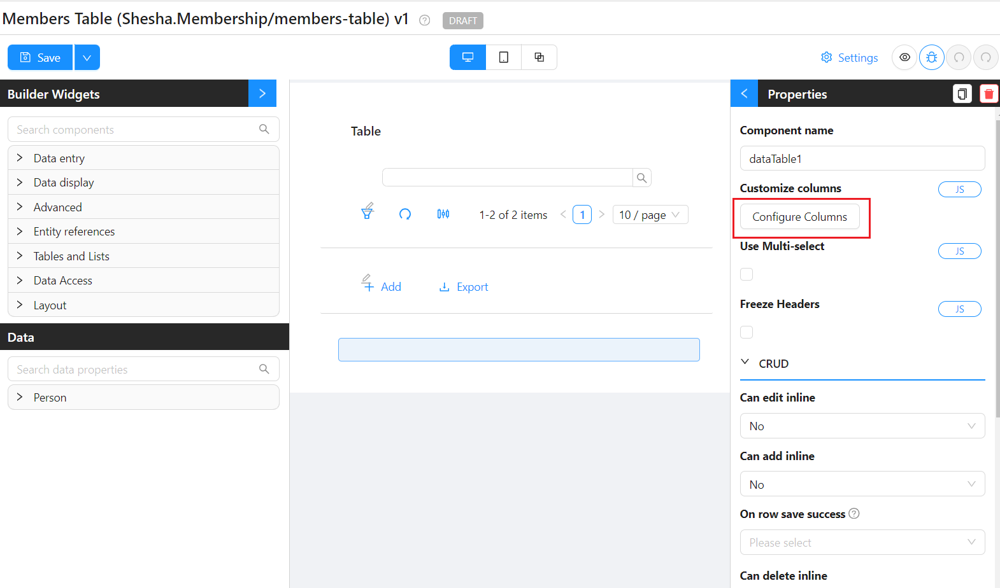

  - On the Property Name setting on the Properties sidebar, this provides an autocomplete of all the properties available on the chosen `Model Type`. If the property name selected is what you would like your caption to be, you can use the suffixed lightning bolt icon button to autocomplete the column caption to match the property name. You also have the option to modify the caption if need be.

  - Add the following columns by searching and selecting on the `Property Name`:

    - title
    - firstName
    - lastName
    - mobileNumber1
    - emailAddress1
    - gender

    

  - Click `save` on the `configure columns` modal.

- The `member-table` should now be populated with pre-populated data from the `Person` entity, which is part of the base Shesha Model as included in the Starter Project database.

  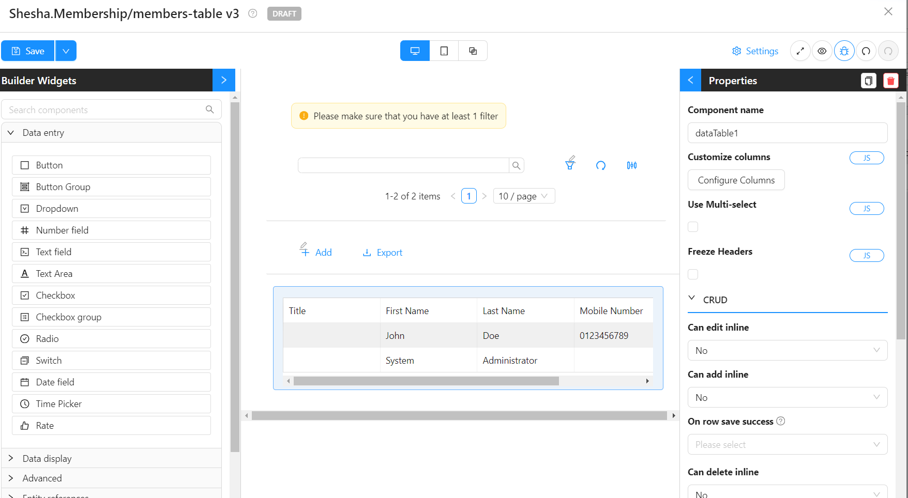

- ### Adding Title

  - The `Table View Selector` can be used as a table heading.

    - Select the `Table View Selector` component > `Add filter Item`

    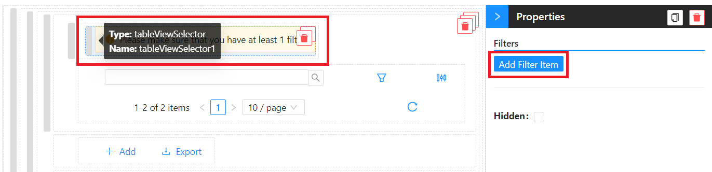

    - Rename the title of the filter to `All Members`

    

    - Save the form. Read more on form versioning [here](#form-versioning)

- ### Accessing our Form

  - Now that we have saved our form, where do we access it?
    - For this tutorial, we will be creating a `direct link from the main menu`

## Updating the Main Menu

- Toggle Edit Mode

      - This mode allows you to make changes to your form configuration, data bindings, and layout.
      - During this mode, form designers can make changes, add new fields, or update existing ones.

- 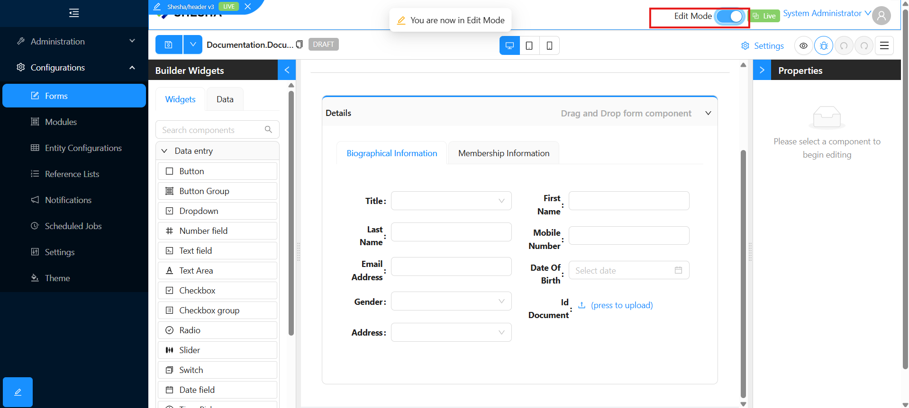

- Click the now `highlighted` main menu to toggle the `Main Menu Configuration` dialog box
- Click on `Add New Item`
- Configure your new menu item with the following information:

  - Item Type - The type of menu item to create.
    - Select Button
  - Title - The title for the menu item.
    - E.g. Members
  - Icon - The icon to display for the menu item.
    - E.g. IdcardOutlined
  - Button Action - The action to be performed when the user selects the menu item.
    - Select Navigate
  - Target Url - The URL to navigate to when the user selects the menu item. The URL for configured forms needs to follow this convention: `/dynamic/{Module name}/{Form name}` where:
    - `dynamic` - standard segment that indicates the URL is for a configured (dynamic) form
    - `{Module name}` - The name of the module the form to navigate to belongs to.
    - `{Form name}` - The name of the configured form to navigate to.
    - The value should therefore be `/dynamic/Shesha.Membership/members-table`

  

  - Toggle the switch to go back to live mode
  - Since our `table-view` has not been published and is still on `Draft` mode, it is **important** to toggle the `form versioning` from `Live` to `Latest` to be able to view the form since it has not been published. Read more on form versioning [here](#form-versioning).

  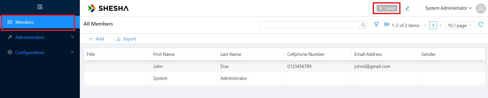

## Create View

Now that we have a way to view a list of our Members in a table and can access the table, we will need a way to create new members.

1. **Create a new form with the following information:**

   - Module: `Shesha.Membership`
   - Entity: `Shesha.Domain.Person`
   - Template: `blank-view`
   - Name: `member-create`
   - Label: `Member Create`
   - Description: `This create view is used to register a new member`

2. Once on the form designer, on the `Data Panel`, drag and drop properties onto the `Edit Area` and autocomplete or change the labels accordingly:

   - firstName
   - lastName
   - mobileNumber1
   - emailAddress1
   - dateOfBirth
   - gender

   You will notice that Shesha automatically binds the different properties to a component compatible for data entry based on the properties defined `data type` in the backend.

   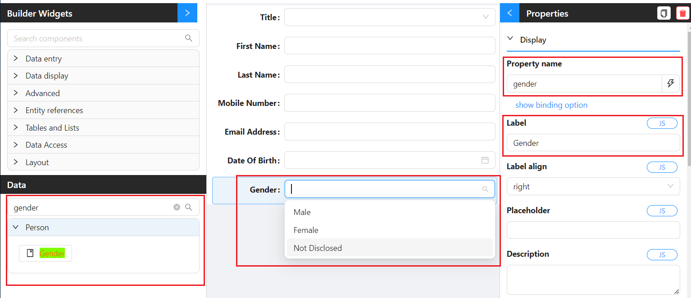

3. In cases where you want to use a different component than the one that is bound to your property by default, you have the choice of searching for a component on the `Builder Widgets`, bind to the relevant property, and modify accordingly. To showcase:

   - Search for `dropdown` on the `Builder Widgets` and drag it onto the edit area.
   - Bind it to the `Title` property in your `Person` entity by searching and selecting from the `Property Name` autocomplete.
   - Autocomplete the caption by clicking on the suffixed lightning bolt.

   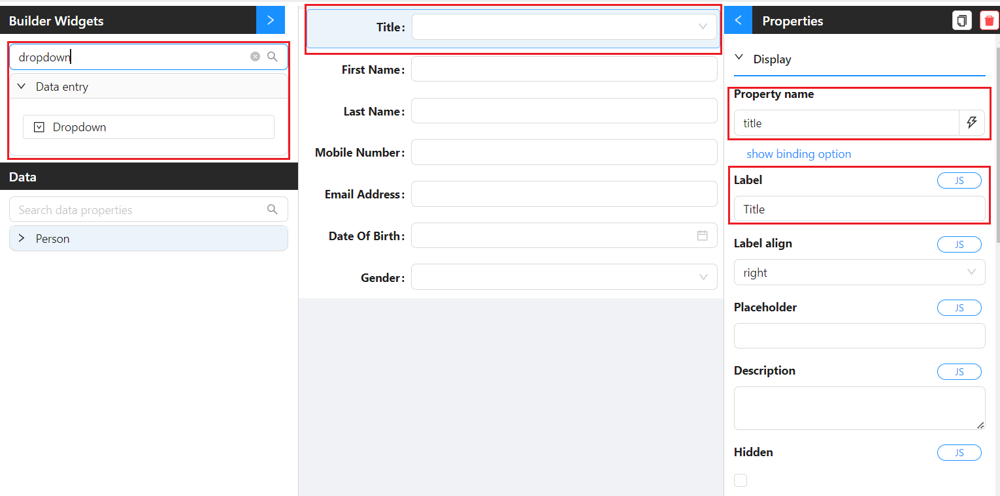

   - Scroll down to populate the `Reference List` that the dropdown should source its information from. E.g. `Shesha.Core.PersonTitles`

   

## Custom Validations

For Custom Validations, please see the How-To guide [Adding custom validations](../../../how-to-guides/adding-custom-validation-on-the-frontend.md).

### Disabling Dates before year 2000

1. In the spirit of discriminating against people born before 1990 :), we will be disabling dates before then. On the `Datetime` component, navigate to the `Disabled Date Mode` > `Custom function`.
2. On the `Disabled Date func` code editor, copy the code and paste inside the given isDateDisabled function to execute the following JavaScript expression.

   ```javascript
   // disabling before year 1900
   var year1990 = moment("1990-01-01");
   return current && current < year1990;
   ```

### Required Properties

Toggle the `Required` property on the `Date Of Birth` component

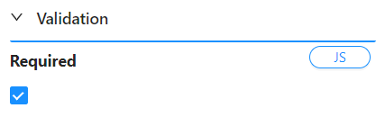

Save your form

## Adding a Button to Display the Create View

We now need to go back and update the configuration of the `member-table` to add a toolbar button that will display the Member Create View so that users can create new members.

### Accessing Form Designer

Navigate to the `member-table` form designer to start making your changes. This can be achieved in multiple ways:

- Navigate to the rendered `member-table` view by using the menu item created earlier > Select the `versioning toggle` > Toggle `Show form Info` on. This will provide a shortcut to the form designer of all forms available in the view using an icon next to the form information.

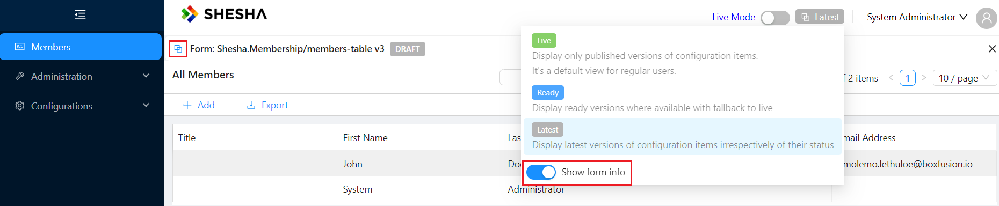

- Navigate to `Configurations` > `Forms` using the main menu. Search for your form. In this case, it is `members-table`. Navigate to the form designer by clicking the `form designer icon`.

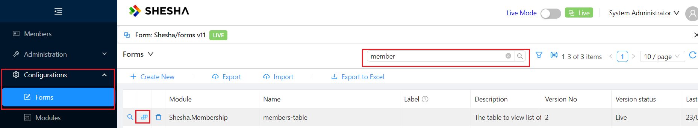

1. Click on the `Button Group` component > `Customize Button Group`.

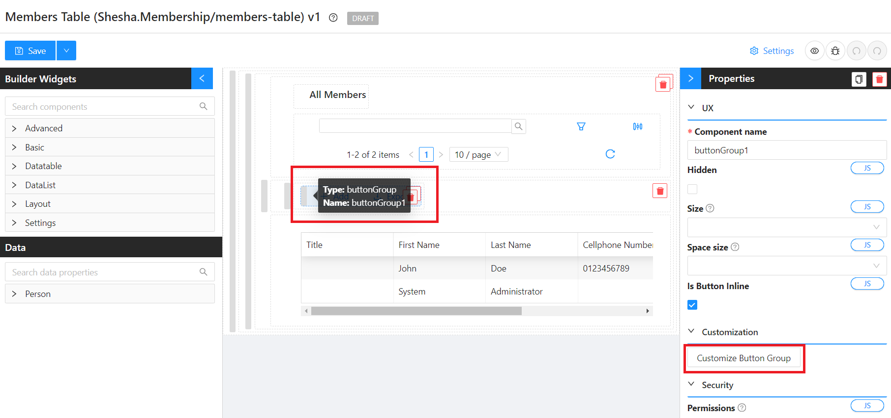

2. Edit the `Add` button to have the following configurations:

   - Label: `Create Member`
   - Button Type: `Link`
   - Action Name: `Common` > `Show Dialog`
   - Title: `Add New Member`
   - Modal Form: `member-create`
   - Show Modal Buttons: `True`
   - Submit HTTP Verb: `POST`
   - Handle Success: `True`
   - Action Name: `indexTable: Refresh table`


3. Save `Button Group` customization.
4. Save your form.
5. Using the main menu, navigate to the `members-table` and refresh your page if the changes have not taken effect.
6. Click on `Create Member` > Fill in member details > Click `Ok`.

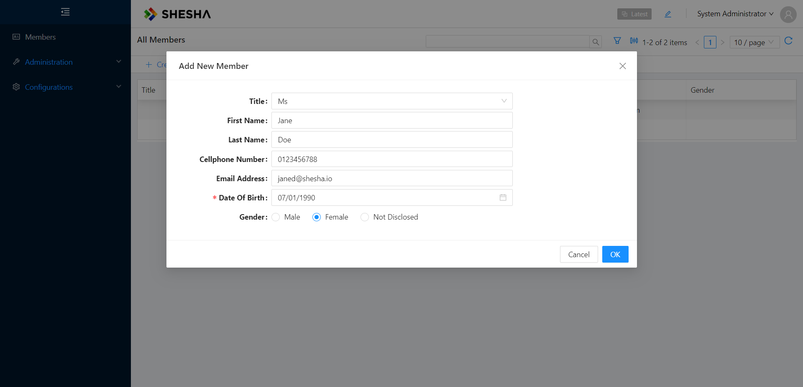

7. Once the table refreshes, you should now be able to see the record of your newly created member.

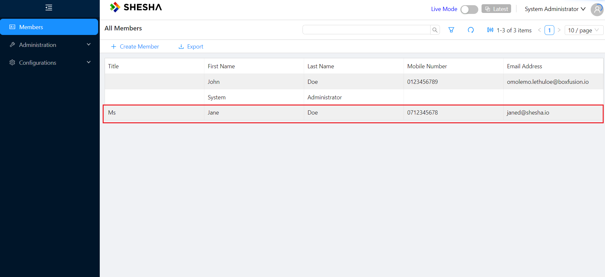

## Details View

Let’s create a form to enable viewing and editing of our newly registered members.

1. **Create a new form with the following information:**

   - Module: `Shesha.Membership`
   - Entity: `Shesha.Domain.Person`
   - Template: `details-view`
   - Name: `member-details`
   - Label: `Member Details`
   - Description: `This details view is used to view the details of a member`

2. You will then be redirected to the **Form Designer**, which should have basic details view components readily configured for your convenience based on the selected template. Let’s drag-and-drop all the properties we want visible!
3. Delete the default `name` text field that comes standard with the `details-view`.
4. To create a cleaner UI, search and drag in the `column` from the `Builder Widgets` into the existing `Panel` component.

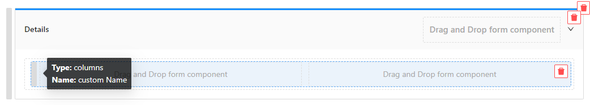

5. Since we want to create a 2-column layout, the default settings fit our specifications. There is also an option to configure the columns to fit your UI requirements. Read more about the implementation [here](../../../front-end-basics/form-components/Layouts/columns.md).

6. On the `Data Panel`, drag and drop properties onto the `Edit Area` and autocomplete or change the labels accordingly:

   - title
   - firstName
   - lastName
   - mobileNumber1
   - emailAddress1
   - dateOfBirth
   - gender

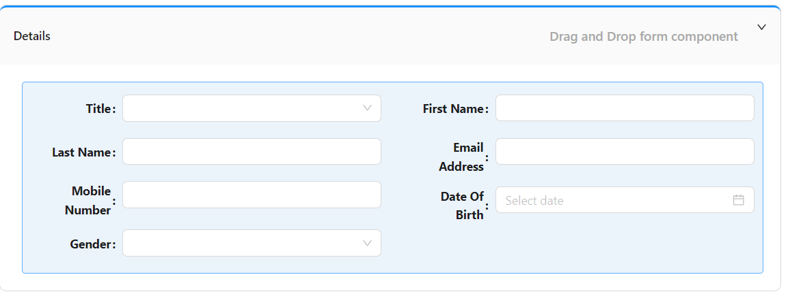

### Adding a Dynamic Title

We can make the title of the view dynamic to give it a more personal touch. To display dynamic text Shesha uses mustache templating as its templating syntax. It works by simply inserting 'tags' where dynamic text should be inserted, E.g. `My template text {{propertyName}}`.

1. Select the `text` component > Set the component's `Content` property to `Membership for: {{fullName}}`.

That should enable the text component to have access to the `data` object and display its contents dynamically based on whose membership we are going to be viewing.

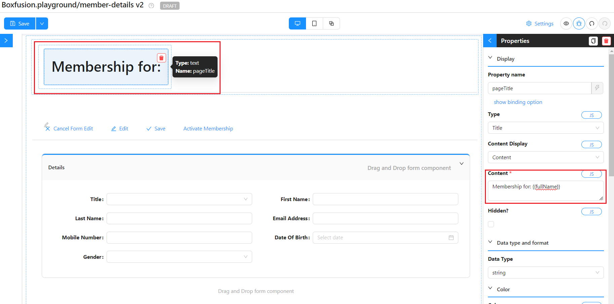

## Navigation from Table to Details View

To navigate to the newly created details form, we now have to go back to the `members-table` to add a column that allows us to drill-down into the details of a particular Member.

1. Navigate to the `members-table` form designer using one of the methods mentioned above.
2. Select the `Datatable` component > `Customize Columns`.

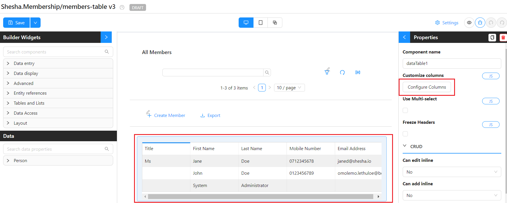

3. Add a new column with the following information:

   - Type – `Action`
   - Caption - _leave empty_
   - Icon – `SearchOutlined`
   - Min Width – `50`
   - Max Width - `50`
   - Action Name - `Common` > `Navigate`
   - Target Url - `/dynamic/Shesha.Membership/member-details?id={{selectedRow.id}}`

   **Understanding the Target URL:**

   - `dynamic` - standard URL segment indicating that the form to navigate to is a configured (dynamic) form.
   - `Shesha.Membership` - is the name of the module the form to navigate to lives in.
   - `member-details` - is the name of the form to navigate to.
   - `?id={{selectedRow.id}}` - queries the row that was selected. A more detailed explanation is provided [here](#) (TODO: Link selected row object).


4. Save `Column Customization`.
5. Save your form.
6. Using the main menu, navigate to the `members-table` and refresh your page if the changes have not taken effect.

Once on the new and updated Members Table View read-only mode with the additional column, when you click on the search icon for a relevant row, you will be redirected to the details view for the selected member.

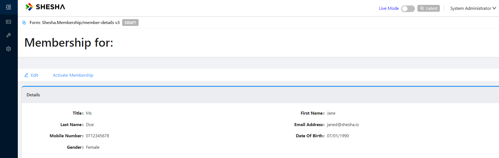
