# Configuring Your First View

This step walks you through configuring three views against the built-in `Person` entity: a table to list people, a create form to register a new person, and a details view to display and edit an existing record. You will also wire a menu item so the table view is reachable from the main menu.

By the end of this step you will have a fully working CRUD experience without writing any backend code - everything is configured in the Shesha designer.

---

## Form Versioning

Forms in Shesha have three versions, which together support a simple draft -> ready -> live workflow. Knowing how versioning works will help when you publish your first form.

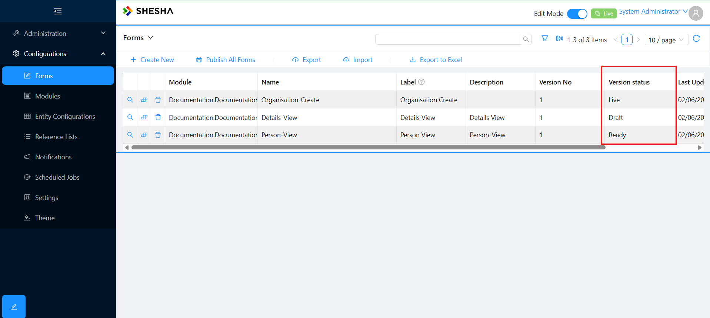

| Version | Purpose |
|---|---|
| `Draft` | Work in progress. Designers can change fields and layout without affecting the version in use. |
| `Ready` | Stable and reviewed. The system displays the Ready version where available, with a fallback to Live. |
| `Live` | The version currently in use by end users. |

The typical flow is: build in **Draft**, finalise to **Ready**, then promote to **Live**. To make further changes, create a new draft. This keeps live forms protected from accidental edits while giving designers room to iterate.

---

## Creating a New Form

Every form starts the same way: from the **Forms** configuration page.

1. From the **Main Menu**, open **Configurations > Forms**.
2. Click **Create New** on the toolbar.
3. Fill in the form metadata.

| Field | What it means |
|---|---|
| `Module` | The application module the configuration is saved under. |
| `Entity` | The model type the form binds to. Determines which properties the form can read and write. |
| `Template` | Default layout to start from (e.g. `table-view`, `blank-view`, `details-view`). |
| `Name` | Part of the form's URL path. Must be unique within the module. Alphanumeric and dashes only. |
| `Label` | Friendly name shown in lists. |
| `Description` | Free-text notes about the form. |

---

## Table View

You will start by building a table that lists everyone in the database.

### 1. Create the Table Form

Create a new form with the following values:

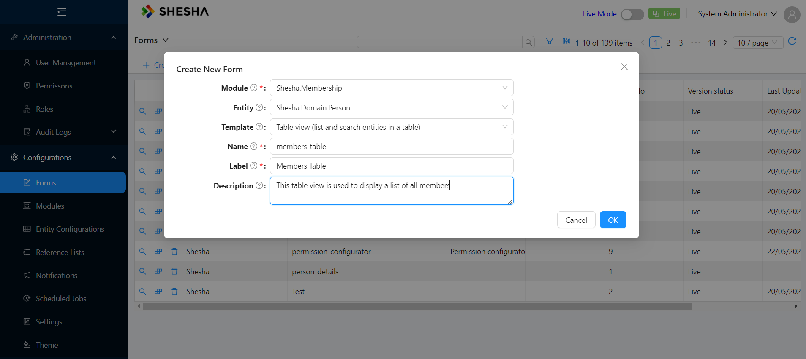

The designer opens with a pre-configured table layout based on the template. All you need to do is choose which columns to show and give the table a title.

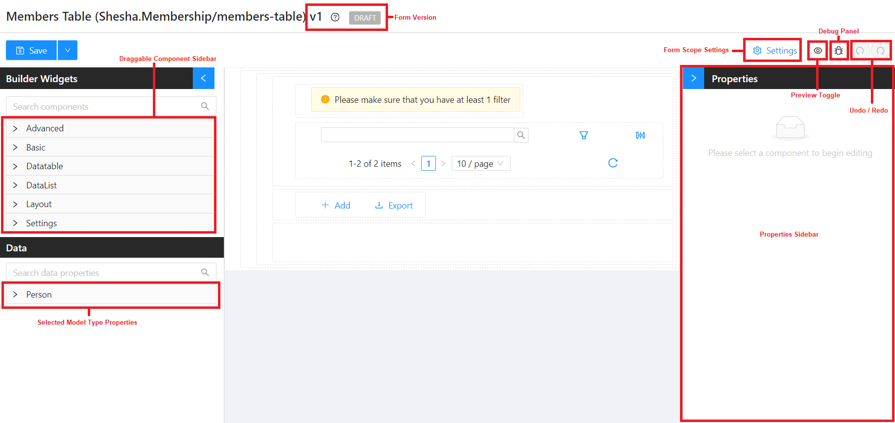

### 2. Configure the Columns

1. Open the **Tables and Lists** group in the toolbox and select the **datatable** component on the canvas to see its properties.

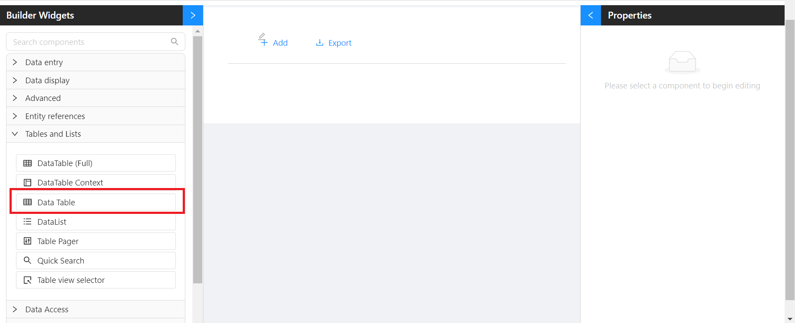

2. Click **Configure Columns > Add Column**.

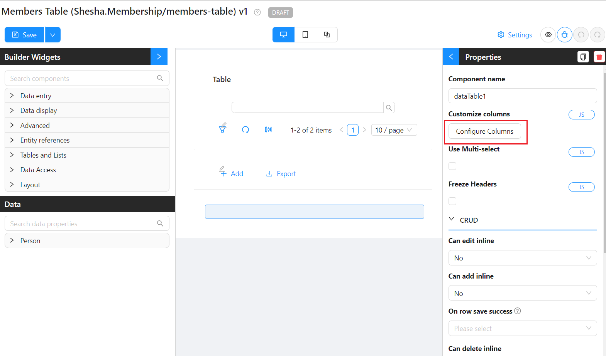

3. On the **Property Name** setting, type to autocomplete from the properties available on the selected model. The lightning bolt button to the right copies the property name into the caption.

4. Add the following columns:

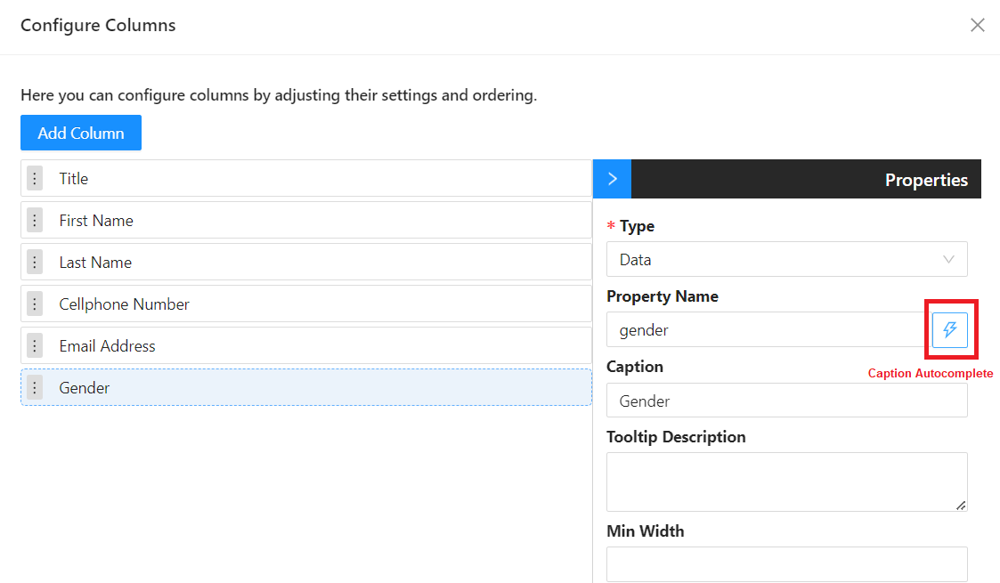

5. Click **Save** on the **Configure Columns** modal.

The table now displays seeded `Person` records from the starter database.

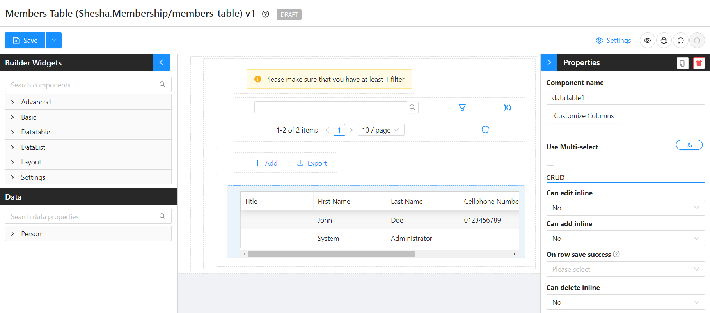

### 3. Add a Title via the Table View Selector

The **Table View Selector** component doubles as a heading at the top of the table.

1. Select the **Table View Selector** component, then click **Add Filter Item**.

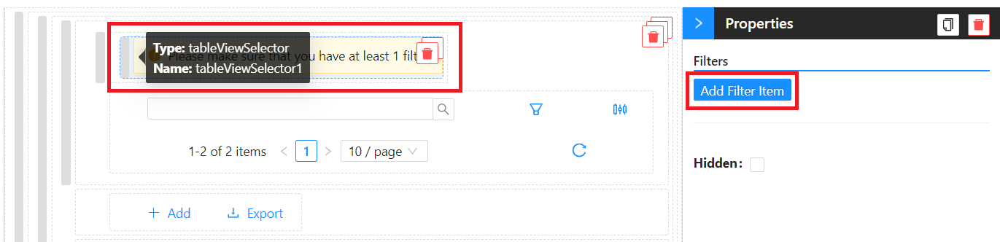

2. Rename the filter to `All Members`.

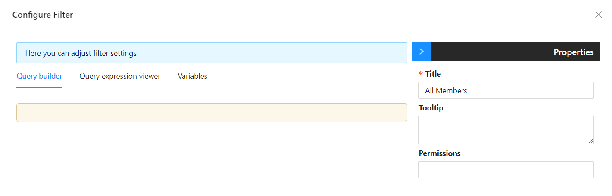

3. Save the form.

---

## Updating the Main Menu

To reach the new form, add it to the main menu.

1. Toggle **Edit Mode** to allow changes to the menu.

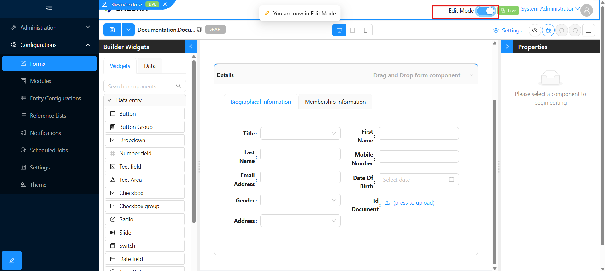

2. Click the now-highlighted main menu to open the **Main Menu Configuration** dialog.
3. Click **Add New Item** and set:

| Field | Value |
|---|---|
| `Item Type` | `Button` |
| `Title` | `Members` |
| `Icon` | `IdcardOutlined` |
| `Button Action` | `Navigate` |
| `Target Url` | `/dynamic/Shesha.Membership/members-table` |

**How the Target URL is built:**

| Segment | What it means |
|---|---|
| `dynamic` | Tells Shesha this URL points at a configured (dynamic) form. |
| `Shesha.Membership` | The module the form lives in. |
| `members-table` | The configured form's `Name`. |

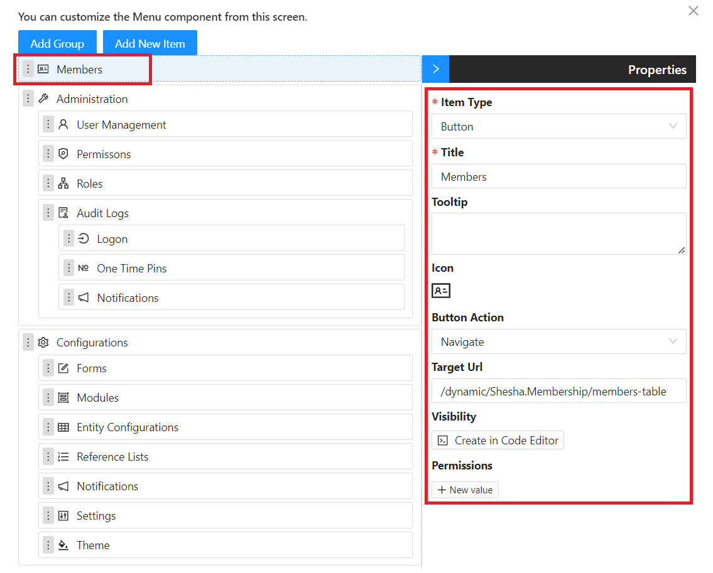

4. Toggle the switch to go back to live mode.

:::warning Switch form versioning to Latest while iterating
If your form is still in **Draft**, navigating to the menu item will not find it unless you switch the form versioning toggle from **Live** to **Latest**. Once published, switch it back.
:::

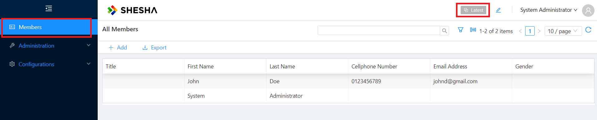

---

## Create View

Now add a form that lets users register new members.

### 1. Create the Form

Create a new form with these values:

| Field | Value |
|---|---|
| `Module` | `Shesha.Membership` |
| `Entity` | `Shesha.Domain.Person` |
| `Template` | `blank-view` |
| `Name` | `member-create` |
| `Label` | `Member Create` |
| `Description` | `This create view is used to register a new member` |

### 2. Add Fields

On the **Data Panel**, drag the following properties onto the Edit Area, autocompleting or changing labels as needed:

| Property |
|---|
| `firstName` |
| `lastName` |
| `mobileNumber1` |
| `emailAddress1` |
| `dateOfBirth` |
| `gender` |

Shesha automatically binds each property to a sensible default component (text fields for strings, date pickers for dates, etc.) based on the property's data type.

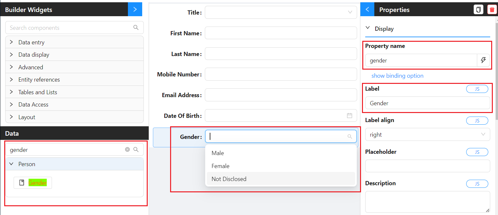

### 3. Swap a Default Component for a Dropdown

To show how to replace the default component, swap the `title` field for a dropdown bound to a reference list.

1. Search for `dropdown` in the **Builder Widgets** and drag it onto the edit area.
2. Set its `Property Name` to `title`.
3. Click the lightning bolt next to the caption to autocomplete.

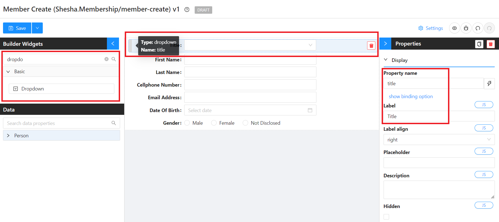

4. Set the **Reference List** the dropdown sources its options from, for example `Shesha.Core.PersonTitles`.

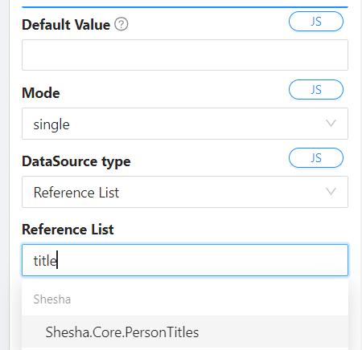

---

## Custom Validations

For a full walkthrough of writing custom validation rules, see the [Adding custom validations](../../../how-to-guides/adding-custom-validation-on-the-frontend.md) how-to guide. The example below shows a quick property-level validation rule.

### Disabling Dates Before 1990

On the **dateOfBirth** component:

1. Set **Disabled Date Mode** to **Custom function**.
2. In the **Disabled Date func** editor, return a boolean indicating whether the current date should be disabled.

**Example - Disabling all dates before 1990:**

```javascript
const year1990 = moment("1990-01-01");
return current && current < year1990;
```

### Marking the Field Required

Toggle the **Required** property on the **Date Of Birth** component.

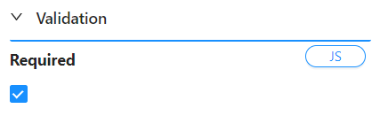

Save your form.

---

## Adding a Button to Open the Create View

Now wire up a toolbar button on the members table so users can open the create form from there.

### Accessing the Form Designer

There are two ways to get back to a form's designer:

| Method | How |
|---|---|
| `From the rendered view` | Open the menu item, toggle **Show form Info** on the versioning toggle, then click the shortcut icon next to the form info. |
| `From the Forms list` | Open **Configurations > Forms**, search for your form, and click the form designer icon. |

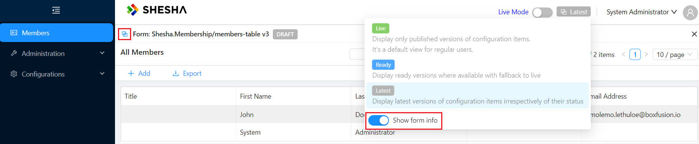

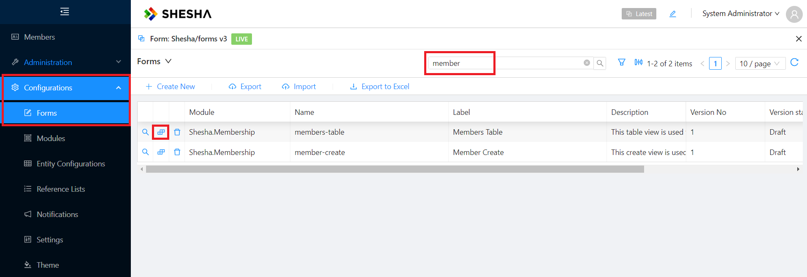

### Configure the Button

1. Click the **Button Group** component and then **Customize Button Group**.

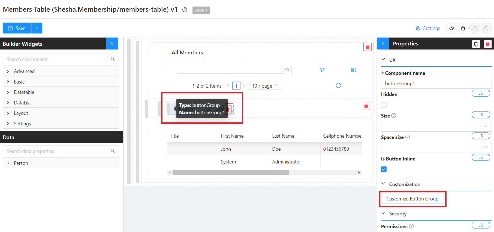

2. Edit the **Add** button:

| Field | Value |
|---|---|
| `Label` | `Create Member` |
| `Button Type` | `Link` |
| `Action Name` | `Common > Show Dialog` |
| `Title` | `Add New Member` |
| `Modal Form` | `member-create` |
| `Show Modal Buttons` | `True` |
| `Submit HTTP Verb` | `POST` |
| `Handle Success` | `True` |
| `Action Name (on success)` | `indexTable: Refresh table` |

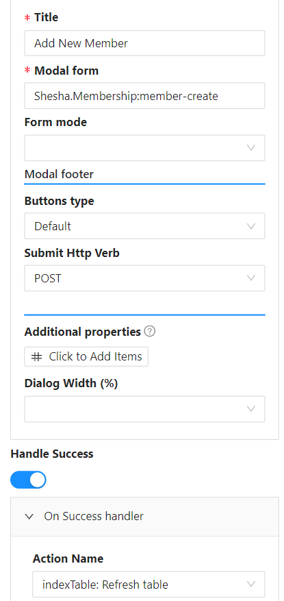

3. Save the **Button Group** customisation, then save the form.
4. From the main menu, navigate to the members table and refresh the page if needed.
5. Click **Create Member**, fill in member details, and click **OK**.

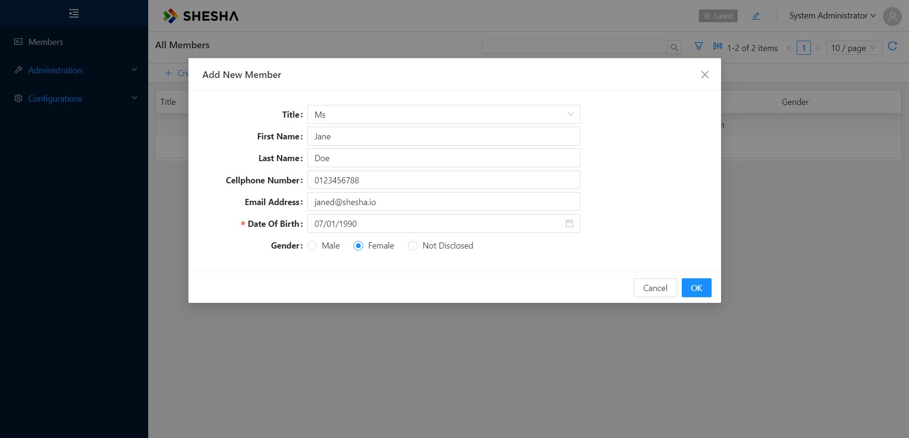

6. Once the table refreshes, the new record appears.

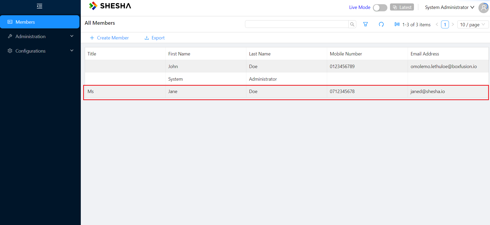

---

## Details View

Now add a form that shows and edits the details of a single member.

### 1. Create the Form

Create a new form with these values:

| Field | Value |
|---|---|
| `Module` | `Shesha.Membership` |
| `Entity` | `Shesha.Domain.Person` |
| `Template` | `details-view` |
| `Name` | `member-details` |
| `Label` | `Member Details` |
| `Description` | `This details view is used to view the details of a member` |

The details-view template comes with a default panel pre-configured. You only need to set up the layout and fields.

### 2. Lay Out the Form

1. Delete the default `name` text field that ships with the template.
2. For a cleaner layout, drag a **column** component from the **Builder Widgets** into the existing **Panel** component. The defaults give you a two-column layout. To customise further, see the [columns component reference](../../../front-end-basics/form-components/Layouts/columns.md).

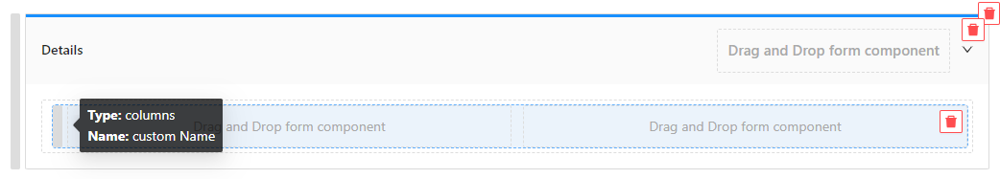

3. On the **Data Panel**, drag the following properties onto the columns:

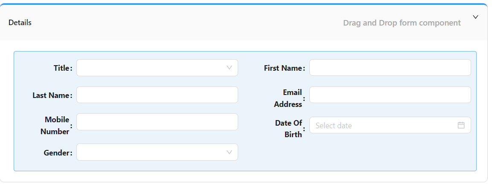

### 3. Add a Dynamic Title

Shesha uses **Mustache** templating syntax for dynamic text. Anywhere you can write a string in the designer, you can include `{{propertyName}}` tags that get replaced with the corresponding value from the form's data object.

1. Select the **text** component and set its **Content** to:

```
Membership for: {{fullName}}
```

The text component now reads from the loaded record and displays the person's full name.

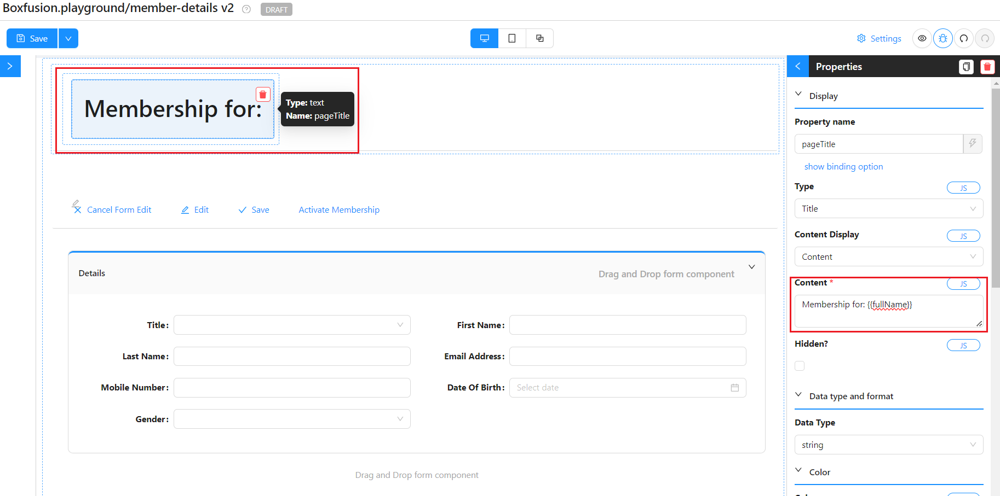

---

## Navigating from Table to Details View

The final step is to let users drill from the table into a specific member's details view.

1. Open the **members-table** form designer.
2. Select the **datatable** component and click **Customize Columns**.

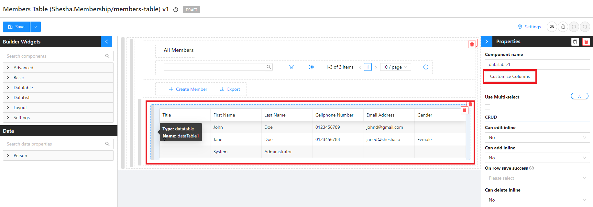

3. Add a new column:

| Field | Value |
|---|---|
| `Type` | `Action` |
| `Caption` | *(leave empty)* |
| `Icon` | `SearchOutlined` |
| `Min Width` | `50` |
| `Max Width` | `50` |
| `Action Name` | `Common > Navigate` |
| `Target Url` | `/dynamic/Shesha.Membership/member-details?id={{selectedRow.id}}` |

**How the Target URL is built:**

| Segment | What it means |
|---|---|
| `dynamic` | Tells Shesha this URL points at a configured form. |
| `Shesha.Membership` | The module the form lives in. |
| `member-details` | The form's `Name`. |
| `?id={{selectedRow.id}}` | Passes the selected row's id as a query parameter. See the [selectedRow reference](/front-end-basics/configured-views/client-side-scripting/shesha-objects/selectedRow.md) for the full object. |

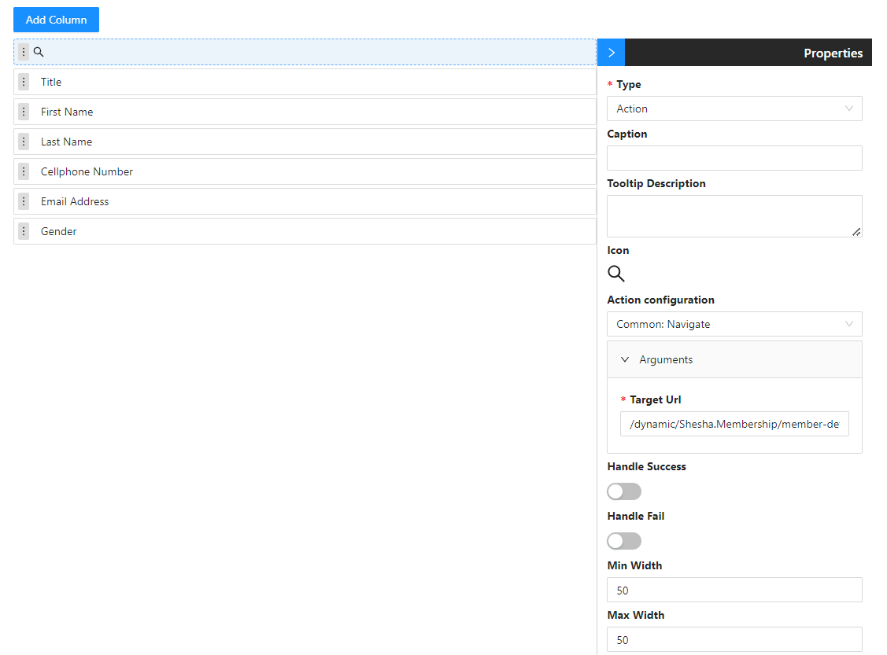

4. Save the column customisation, then save the form.
5. From the main menu, navigate to the members table and refresh the page if needed.

Clicking the search icon on a row now navigates to the details view for that member.

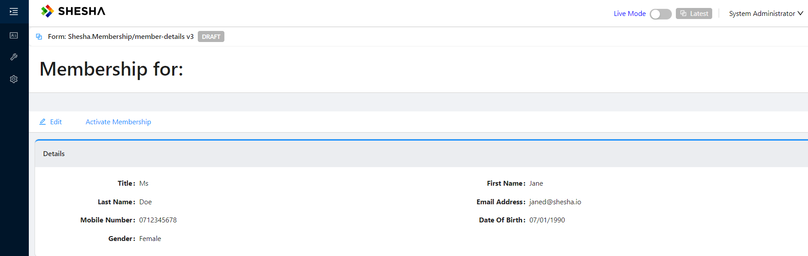

---

## Next Step

Continue with [Extending the Domain Model](./extending-model.md) to add a custom `Member` entity and a reference list for membership status.
