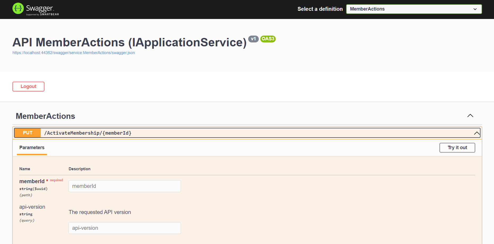
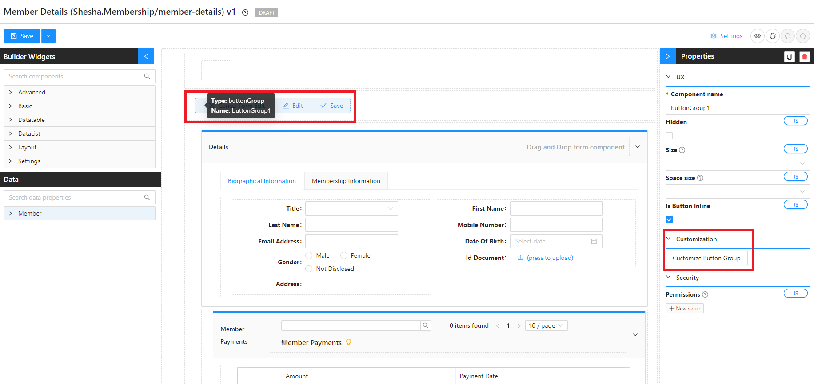
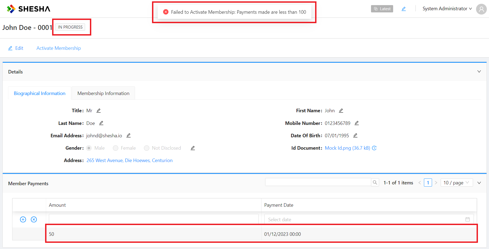
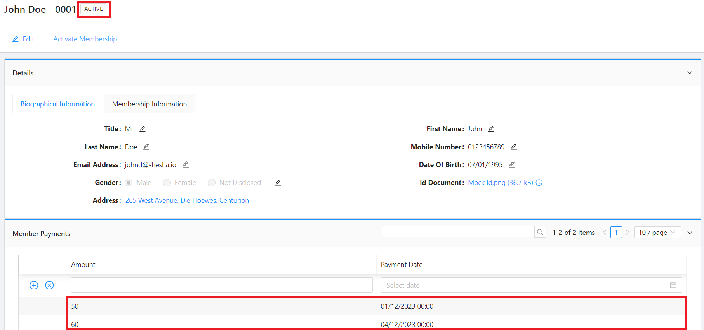
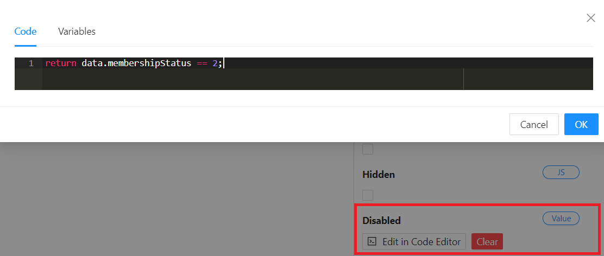
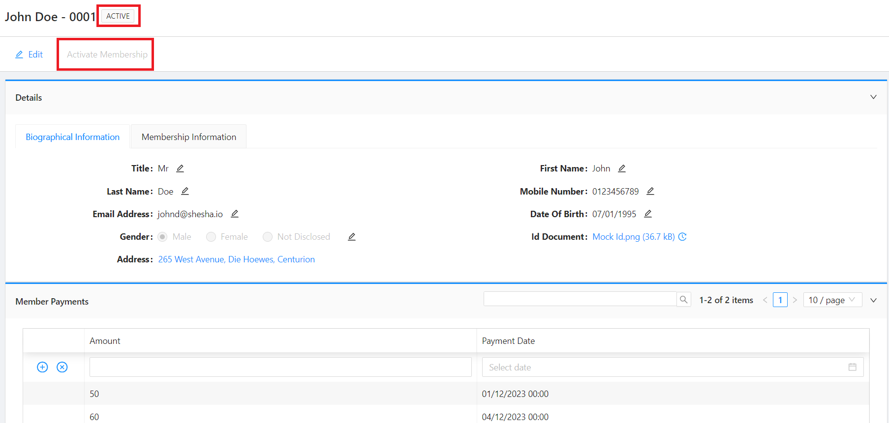

# Custom APIs

Until now, although the front-end application is clearly interacting with the back-end to retrieve data, you have not had to explicitly create any `APIs` for this to happen.

This is because Shesha, automatically creates `CRUD APIs` for all entities in your projects. However, if you want to enforce some custom logic you will need to create new APIs and call them from the front-end.

Imagine that we want `MembershipStatus` property to be updated through a more controlled process instead of allowing the end-user to simply select the status. E.g. Before activating the membership, you would check if an initial payment of **R100** has been received.

In this section, you learn how to:

    - Create a Custom App Service
    - Expose a New Endpoint
    - Test The App Service in Swagger
    - Configure an Action Button
    - Execute a Custom Action Script

## Creating an App Service

1. Navigate to `Boxfusion.Membership.Common.Application`
2. Create a new `Services` folder
3. Right click on the newly created `Services` folder, `Add` > `Class`
4. Give your class the name of: `MemberActions.cs`, and click on `Add`
5. Populate your app service with the following:

```csharp
using Abp.Domain.Repositories;
using Abp.UI;
using Microsoft.AspNetCore.Mvc;
using Shesha.DynamicEntities.Dtos;
using Shesha.Membership.Domain.Domain;
using Shesha.Membership.Domain.Domain.Enums;
using System;
using System.Threading.Tasks;

namespace Shesha.Membership.Common.Services
{
    public class MemberActionsAppService: SheshaAppServiceBase
    {
        private readonly IRepository<Member, Guid> _memberRepository;
        private readonly IRepository<MembershipPayment, Guid> _membershipPaymentRepository;

        public MemberActionsAppService(IRepository<Member, Guid> memberRepository, IRepository<MembershipPayment, Guid> membershipPaymentRepository)
        {
            _memberRepository = memberRepository;
            _membershipPaymentRepository = membershipPaymentRepository;
        }

        [HttpPut, Route("[action]/{memberId}")]
        public async Task<DynamicDto<Member, Guid>> ActivateMembership(Guid memberId)
        {
            var member = await _memberRepository.GetAsync(memberId);
            var payments = await _membershipPaymentRepository.GetAllListAsync(data => data.Member.Id == memberId);

            if (payments.Count == 0) throw new UserFriendlyException("There no payments made");

            double totalAmount = 0;

            payments.ForEach(a =>
            {
                totalAmount += a.Amount;
            });

            if (totalAmount < 100) throw new UserFriendlyException("Payments made are less than 100");


            member.MembershipStatus = RefListMembershipStatuses.Active;
            var updatedMember = await _memberRepository.UpdateAsync(member);

            return await MapToDynamicDtoAsync<Member, Guid>(updatedMember);
        }
    }
}

```

_Learn more about Shesha Dynamic Dtos amd Dynamic Dto Mapping [here](/docs/back-end-basics/custom-apis)_

6. Run and Check Swagger to see if the custom endpoint has been registered!



## Configurations

### Configuring an action button

We need to configure an action button in order to be able to call the `custom API` we just created. We will be doing this in a `member-details` to be able to activate membership for that specific member.

1. Navigate to the `member-details` [form designer](/docs/get-started/tutorial/the-basics/configuring-first-view#accessing-form-designer)
2. Select the 'Button Group` component` and `Customize Button Group` to include the following button:



- `Add New Item` with the following configurations:

  - Label : `Activate Membership`
  - Button Type : `Link`
  - Action Name : `Common` > `Execute Script` >

  ```javascript
  (function () {
    const PATH = `/ActivateMembership/${data.id}`;

    http.put(`${PATH}`).catch(onError);
  })();

  function onError(_e) {
    message.error(
      `Failed to Activate Membership: ${_e.response.data.error.message}`,
      10
    );
  }
  ```

  - Handle Success : `Designer Form` > `Refresh`

- Click `save` on the `customize button group` modal.

3. Save your form

### Test Cases

- Using the main menu, navigate to the `members-table` and refresh your page to make sure your changes have taken effect.
- Drill down into the `details view` of any member.

#### Not enough payments

- For the purposes of this tutorial, this member has only made a payment of R50, which is half of the `activation amount`
- When trying to activate the membership, it will throw an error



#### Adequate payments

- Add a `Membership Payment` of `R60`, using the configured `inline-editing` functionality on the `child table`
- Activate membership!
- The `status` should now be set to `Active`



## Disabling `Activate Membership` Button

After you have activated the membership, you will notice that the ‘Activate Membership’ button is still active, which should not be the case if the user already has an active membership. We have to disable this button in cases like these.

1. Navigate to the `member-details` [form designer](/docs/get-started/tutorial/the-basics/configuring-first-view#accessing-form-designer)
2. Select the 'Button Group` component` and `Customize Button Group` to update the `Activate Membership` button configurations to the following:
   - Disabled > `JS`:
     ```javascript
     return data.membershipStatus == 2;
     ```
3. Click `save` on the `customize button group` modal
4. Save your form



