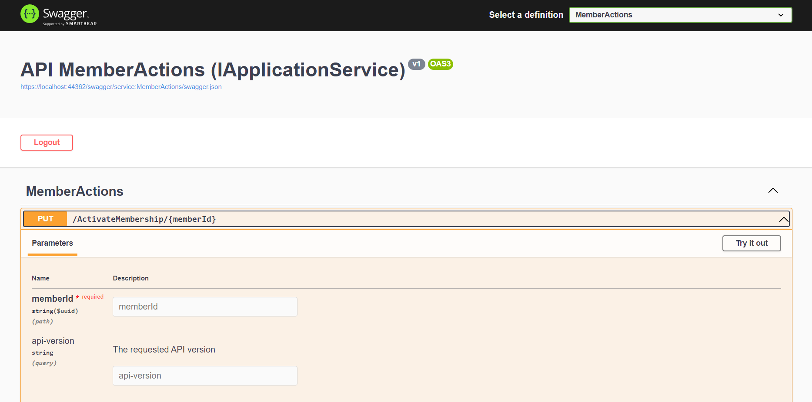
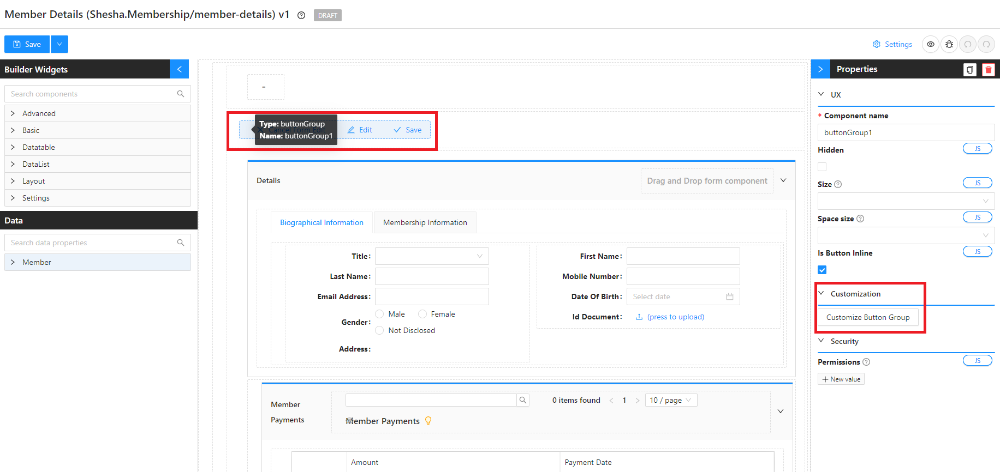
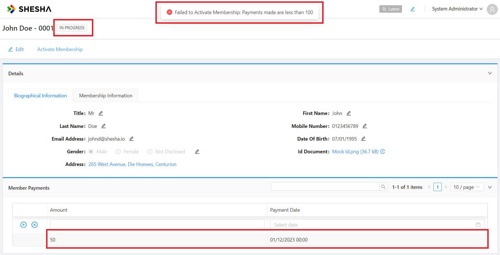
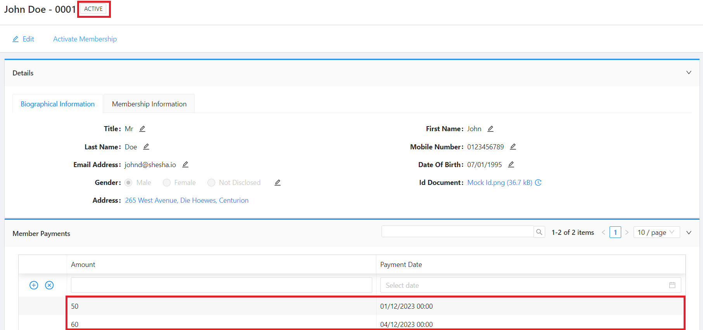
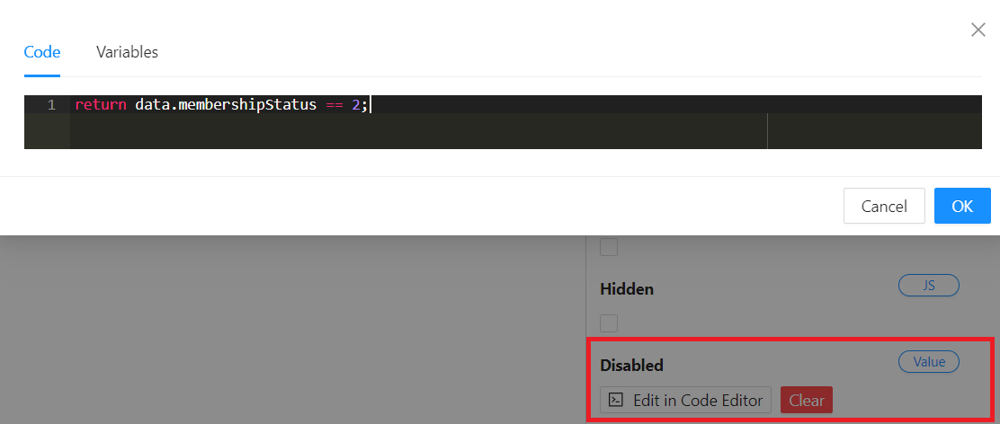
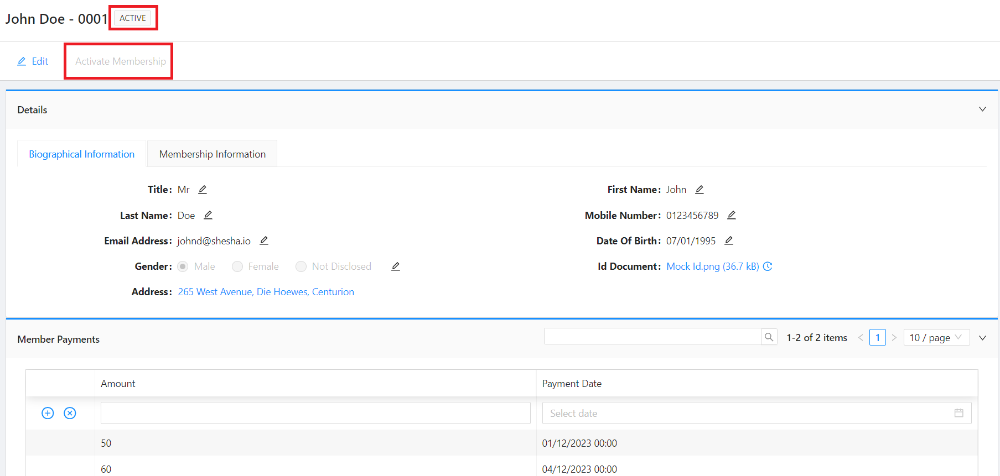

# Custom APIs

So far, every API call has hit the **CRUD endpoints** that Shesha generates automatically for each entity. Auto-generated CRUD is enough for a lot of use cases, but real applications usually have rules that go beyond "read this row" or "write this row". This step shows how to add a custom application service that enforces a business rule before performing an action.

The example: a member's `MembershipStatus` should not be flipped to `Active` just by toggling a dropdown. The rule is that the member must have paid at least **R100** in total before activation. You will build a custom endpoint that enforces this rule, then wire a button on the details view to call it.

---

## Create the App Service

In a Shesha project, custom logic lives in an **application service** in the `Application` project. The service inherits from `SheshaAppServiceBase`, which gives it access to Shesha's helpers, dynamic DTO mapping, and Abp's repository pattern.

### 1. Add the Service Class

1. Navigate to `Shesha.Membership.Application`.
2. Create a new folder called `Services`.
3. Right-click the folder and choose **Add > Class**.
4. Name the class `MemberAppService.cs`.

**Example - MemberAppService with an ActivateMembership endpoint:**

```cs
using Abp.Domain.Repositories;
using Abp.UI;
using Microsoft.AspNetCore.Mvc;
using Shesha.DynamicEntities.Dtos;
using Shesha.Membership.Domain.Domain;
using Shesha.Membership.Domain.Enums;
using System;
using System.Threading.Tasks;

namespace Shesha.Membership.Application.Services
{
    public class MemberAppService : SheshaAppServiceBase
    {
        private readonly IRepository<Member, Guid> _memberRepository;
        private readonly IRepository<MembershipPayment, Guid> _membershipPaymentRepository;

        public MemberAppService(
            IRepository<Member, Guid> memberRepository,
            IRepository<MembershipPayment, Guid> membershipPaymentRepository)
        {
            _memberRepository = memberRepository;
            _membershipPaymentRepository = membershipPaymentRepository;
        }

        [HttpPut, Route("[action]/{memberId}")]
        public async Task<DynamicDto<Member, Guid>> ActivateMembership(Guid memberId)
        {
            var member = await _memberRepository.GetAsync(memberId);
            var payments = await _membershipPaymentRepository
                .GetAllListAsync(p => p.Member.Id == memberId);

            if (payments.Count == 0)
                throw new UserFriendlyException("There are no payments made");

            double totalAmount = 0;
            payments.ForEach(p => totalAmount += p.Amount);

            if (totalAmount < 100)
                throw new UserFriendlyException("Payments made are less than 100");

            member.MembershipStatus = RefListMembershipStatuses.Active;
            var updatedMember = await _memberRepository.UpdateAsync(member);

            return await MapToDynamicDtoAsync<Member, Guid>(updatedMember);
        }
    }
}
```

For background on `DynamicDto` and how Shesha's automatic DTO mapping works, see [Custom APIs](/docs/back-end-basics/custom-apis).

:::info Why UserFriendlyException?
`UserFriendlyException` is an Abp exception that the framework translates into a clean error message in the API response. The frontend can then surface that message directly to the end user. Use it for any validation or rule-violation error that the user should see.
:::

### 2. Test in Swagger

1. Run the application (**Debug > Start Debugging** or **F5**).
2. Search Swagger for `ActivateMembership`.
3. The endpoint should appear under the auto-registered routes.



:::tip Shesha registers your services automatically
You do not need to add the service to a DI container or register it manually. Shesha discovers any class that inherits from `SheshaAppServiceBase` and exposes its public methods as endpoints.
:::

---

## Add an Action Button to the Details View

Now wire a button on the member's details view that calls the new endpoint.

### 1. Open the Form Designer

Open the [member-details form designer](./configuring-first-view.md#accessing-the-form-designer).

### 2. Configure the Button

1. Select the **Button Group** component and click **Customize Button Group**.



2. Click **Add New Item** and configure:

| Field | Value |
|---|---|
| `Label` | `Activate Membership` |
| `Button Type` | `Link` |
| `Action Name` | `Common > Execute Script` |
| `Handle Success` | `Designer Form > Refresh` |

**Form type to use:** Button on the member-details (details view) form.

**Example - Activate Membership button script:**

```javascript
const PATH = `/ActivateMembership/${data.id}`;

try {
  await http.put(PATH);
} catch (e) {
  message.error(
    `Failed to Activate Membership: ${e?.response?.data?.error?.message ?? e}`,
    10
  );
  throw e;
}
```

:::warning Always wrap http calls in try/catch
If the API call fails (for example because the activation rule is violated), you want the form to surface the error rather than swallow it silently. Always wrap `http.*` calls in `try/catch` and show the error message with `message.error(...)`.
:::

3. Click **Save** on the **Customize Button Group** modal.
4. Save the form.

---

## Test the Activation Rule

- From the main menu, navigate to the **members-table** and refresh.
- Drill into the details view of a member.

### Case 1: Not Enough Payments

For the purposes of this tutorial, this member has only made a payment of R50, which is half of the activation amount. If the member's total payments are below R100, clicking **Activate Membership** shows the `UserFriendlyException` message. 



### Case 2: Enough Payments

Add a `Membership Payment` of R60 (using the inline-editing flow from the previous step). The member now has R50 + R60 = R110 in total, which meets the R100 threshold. Click **Activate Membership** - the status switches to **Active**.



---

## Disable the Button for Already-Active Members

Once a member is active, the **Activate Membership** button is no longer relevant. Disable it conditionally based on the current status.

1. Open the [member-details form designer](./configuring-first-view.md#accessing-the-form-designer).
2. Select the **Button Group** component and click **Customize Button Group**.
3. On the **Activate Membership** button, set **Disabled** to **JS** and use:

**Form type to use:** `Disabled` (JS) on a Button inside the member-details form.

**Example - Disable the button when the membership is already active:**

```javascript
return data.membershipStatus == 2;
```

:::info Why the integer 2?
Reference list values are stored as integers on the backend. `2` is the `Active` value in `RefListMembershipStatuses` (verified from the enum in the previous step). Always use the integer value from the enum rather than the label - the label can change without affecting the integer.
:::

4. Click **Save** on the **Customize Button Group** modal.
5. Save the form.





---

## You're Done

You have now built a complete Shesha application end-to-end: a custom domain model, a child table, a custom API enforcing a business rule, and a UI that surfaces all of it. From here, dive into the [Fundamentals](/docs/category/fundamentals) section to understand the concepts at a deeper level, or jump straight to [Front-End Basics](/docs/category/front-end-basics) to see what else the form designer can do.
