# Extending the Domain Model

The starter project ships with a base `Person` entity that handles common person attributes (name, contact details, gender, and so on). In this step you will extend it with a `Member` entity that adds membership-specific properties, a reference list for membership status, and a database migration to apply the schema change.

You will then come back to the forms from the previous step and re-point them at the new `Member` entity.

---

## Extending an Existing Entity

Open the `backend/Shesha.Membership.sln` solution in Visual Studio 2022.

### 1. Set a Table Prefix

A table prefix is a short string added to the front of database table and column names. It groups your module's tables together visually, helps avoid naming conflicts with other modules, and makes it easy to see at a glance which schema a column belongs to.

1. Navigate to `Shesha.Membership.Domain > Properties > AssemblyInfo.cs`.
2. Change the table prefix to `Mem_`:

**Example - Setting the table prefix in AssemblyInfo.cs:**

```cs
[assembly: TablePrefix("Mem_")]
```

:::tip Keep prefixes short but meaningful
Three-or-four-character prefixes are usually the sweet spot. They are short enough to not clutter column names, but long enough to remain unique and recognisable.
:::

### 2. Create a Reference List

Reference lists are how Shesha represents controlled vocabularies (the equivalent of an enum on the database side). You define them as C# enums decorated with attributes that tell Shesha how to render them in forms.

1. In the `Shesha.Membership.Domain` project, create an `Enums` folder.
2. Right-click the folder and choose **Add > Class**.
3. Name the class `RefListMembershipStatuses.cs`.

**Example - The MembershipStatuses reference list:**

```cs
using Shesha.Domain.Attributes;
using System.ComponentModel;

namespace Shesha.Membership.Domain.Enums
{
    /// <summary>
    /// Statuses for a Member's Membership.
    /// </summary>
    [ReferenceList("MembershipStatuses")]
    public enum RefListMembershipStatuses : long
    {
        [Description("In Progress")]
        InProgress = 1,

        [Description("Active")]
        Active = 2,

        [Description("Cancelled")]
        Cancelled = 3
    }
}
```

:::note ReferenceList constructor
Use the single-parameter form `[ReferenceList("Name")]`. The two-parameter form that took a separate namespace is marked obsolete.

```cs
// Correct - single-parameter form
[ReferenceList("MembershipStatuses")]
public enum RefListMembershipStatuses : long { ... }

// Obsolete - two-parameter form with separate namespace
[ReferenceList("Shesha.Membership", "MembershipStatuses")]
public enum RefListMembershipStatuses : long { ... }
```
:::

### 3. Create the Member Entity

The `Member` class inherits from the base `Person` entity, so it picks up all of Person's existing properties (firstName, lastName, etc.) and adds new ones on top.

1. Navigate to `Shesha.Membership.Domain > Domain`.
2. Right-click the folder and choose **Add > Class**.
3. Name the class `Member.cs`.

**Example - The Member entity that extends Person:**

```cs
using Shesha.Domain.Attributes;
using Shesha.Domain;
using Shesha.Membership.Domain.Enums;
using System;

namespace Shesha.Membership.Domain.Domain
{
    /// <summary>
    /// A person within the application that is a Member.
    /// </summary>
    [Entity(TypeShortAlias = "Mem.Member")]
    public class Member : Person
    {
        public virtual string MembershipNumber { get; set; }

        public virtual DateTime? MembershipStartDate { get; set; }

        public virtual DateTime? MembershipEndDate { get; set; }

        public virtual StoredFile IdDocument { get; set; }

        [ReferenceList("MembershipStatuses")]
        public virtual RefListMembershipStatuses? MembershipStatus { get; set; }
    }
}
```

### 4. Create the Migration

Because `Member` inherits from `Person`, the new properties are stored as additional columns on the existing `Core_Persons` table. FluentMigrator runs migrations in date order, so name the class with a timestamp.

1. Navigate to `Shesha.Membership.Domain > Migrations`.
2. Right-click the folder and choose **Add > Class**.
3. Name the class using the format `M[YEAR][MONTH][DAY][HOUR][MINUTE][SECONDS].cs`, for example `M20231124085300.cs`.

**Example - Migration that adds the Member columns to Core_Persons:**

```cs
using FluentMigrator;
using Shesha.FluentMigrator;
using System;

namespace Shesha.Membership.Domain.Migrations
{
    /// <summary>
    /// Adds membership-specific columns to the Core_Persons table.
    /// </summary>
    [Migration(20231124085300)]
    public class M20231124085300 : Migration
    {
        public override void Up()
        {
            Alter.Table("Core_Persons")
                .AddColumn("Mem_MembershipNumber").AsString().Nullable()
                .AddForeignKeyColumn("Mem_IdDocumentId", "Frwk_StoredFiles").Nullable()
                .AddColumn("Mem_MembershipStartDate").AsDateTime().Nullable()
                .AddColumn("Mem_MembershipEndDate").AsDateTime().Nullable()
                .AddColumn("Mem_MembershipStatusLkp").AsInt64().Nullable();
        }

        public override void Down()
        {
            throw new NotImplementedException();
        }
    }
}
```

:::info FluentMigrator extensions
`AddForeignKeyColumn` is a Shesha extension over FluentMigrator. It creates the column and the foreign key constraint in a single call. For more migration options see the [FluentMigrator docs](https://fluentmigrator.github.io/index.html).
:::

5. Start the application (**Debug > Start Debugging** or **F5**).
6. The app should open on the Swagger page.
7. Search for **Member** in Swagger to see the auto-generated CRUD endpoints.

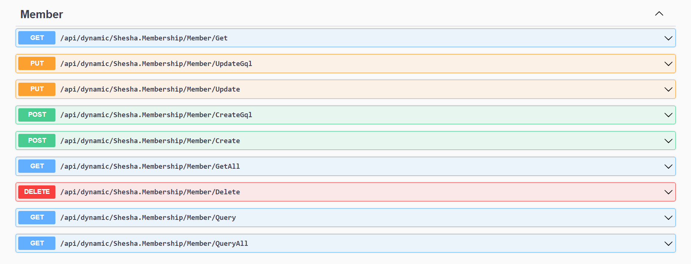

:::tip Want to learn more about the auto-generated APIs?
See [CRUD APIs](/docs/back-end-basics/crud-apis) for details on what endpoints Shesha exposes for each entity and how to customise them.
:::

---

## Updating the Front-End Configurations

Now that the domain model has been extended, the forms from the previous step need to be re-pointed at `Member` and updated to show the new properties.

The basic pattern is the same for each form:

1. Open the form's **Settings** in the designer.
2. Change the **Entity** from `Shesha.Domain.Person (Shesha.Core.Person)` to `Shesha.Membership.Domain.Member (Mem.Member)`.
3. Update any CRUD endpoints referenced on the form to match the new entity.
4. Add the new fields:

| Property | Component | Type |
|---|---|---|
| `MembershipNumber` | Textfield | `string` |
| `MembershipStatus` | RadioButton | `RefListMembershipStatuses` |
| `MembershipStartDate` | Datefield | `DateTime` |
| `MembershipEndDate` | Datefield | `DateTime` |
| `IdDocument` | File | `StoredFile` |

---

## Updating the Create View

The create form now needs to capture the new membership fields. To keep the form manageable you will split it into two wizard steps.

1. Open the [member-create form designer](./configuring-first-view.md#accessing-the-form-designer).
2. In **Settings**, change the **Entity** to `Shesha.Membership.Domain.Member (Mem.Member)`.

For more on the wizard component, see [the wizard component reference](../../../front-end-basics/form-components/Layouts/wizard.md).

3. Search for **wizard** in the **Builder Widgets** and drag it onto the form.
4. Drag the existing components into the wizard's draggable area.

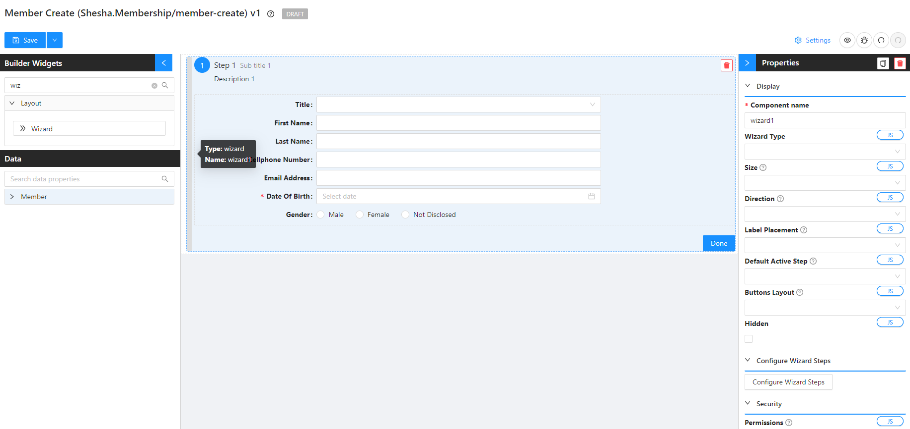

5. Click **Configure Wizard Steps** and set up two steps:

| Step | Name |
|---|---|
| `1` | Biographical Information |
| `2` | Membership Information |

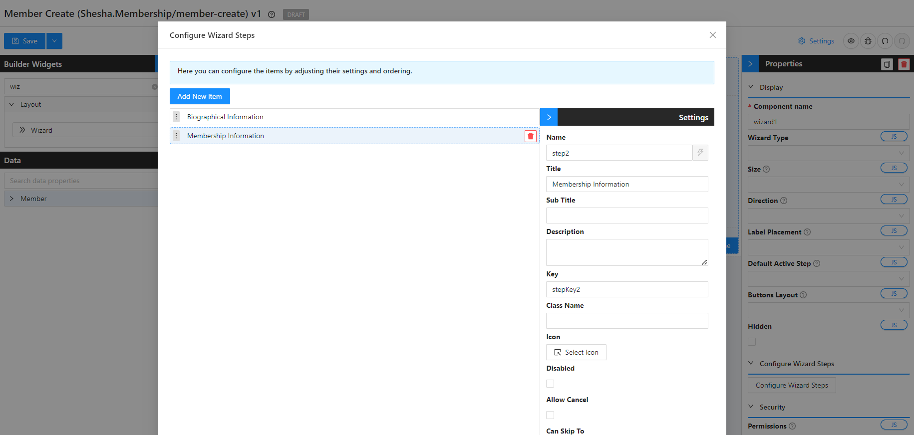

### Wizard Done Action

On the **Membership Information** step, configure the **Done** button to POST to the Member create endpoint and then navigate to the new member's details view.

**Form type to use:** Wizard step `After Done Action` on the member-create form.

**Example - Submitting the wizard and navigating to the new member:**

```javascript
const PATH = `/api/dynamic/Shesha.Membership/Member/Create`;

try {
  const resp = await http.post(PATH, data);
  // Navigate to the details view of the created member
  window.location.href = `/dynamic/Shesha.Membership/member-details?id=${resp.data.result.id}`;
} catch (e) {
  message.error(`Failed to create member: ${e}`, 10);
  console.error(e);
  throw e;
}
```

:::tip Why use window.location.href here?
The wizard's Done action runs in JavaScript, so this is a one-off custom script. For most navigation needs in the designer, use the built-in **Navigate** action type rather than writing scripted navigation.
:::

### Adding the File and Entity Picker Components

On the **Biographical Information** step:

1. Drag in a **File** component (see the [File component reference](/front-end-basics/form-components/Entity-References/files.md)):

| Field | Value |
|---|---|
| `Property Name` | `idDocument` |
| `Label` | `Id Document` |
| `Owner Id` | *(leave empty)* |

2. Drag in an **Entity Picker** (see the [Entity Picker reference](../../../front-end-basics/form-components/Entity-References/entity-picker.md)):

| Field | Value |
|---|---|
| `Property Name` | `address` |
| `Label` | `Address` |
| `Entity Type` | `Shesha.Domain.Address (Shesha.Core.Address)` |

3. Configure the Entity Picker's columns:

| Column |
|---|
| `addressLine1` |
| `suburb` |
| `town` |

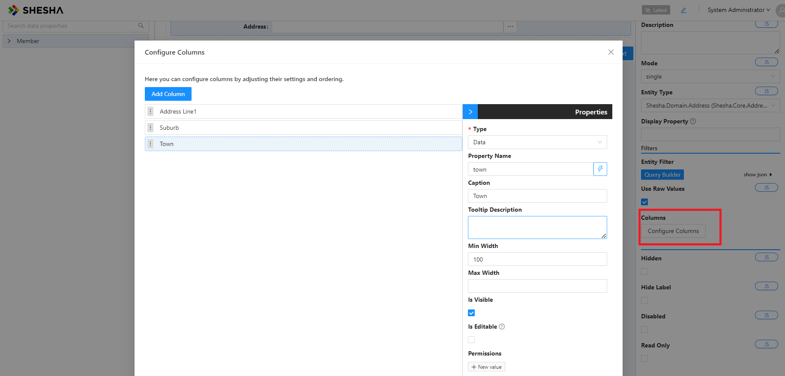

### Allowing New Addresses

The Entity Picker can let users add a new address inline if one doesn't already exist. First, build a quick form to capture a new address.

Create a new form with:

| Field | Value |
|---|---|
| `Module` | `Shesha` |
| `Template` | `blank-view` |
| `Name` | `address-create` |
| `Label` | `Address Create` |
| `Description` | `This create view is used to create a new address` |
| `Model Type` | `Shesha.Domain.Address (Shesha.Core.Address)` |

Add these fields to the form:

| Property |
|---|
| `addressLine1` |
| `suburb` |
| `town` |

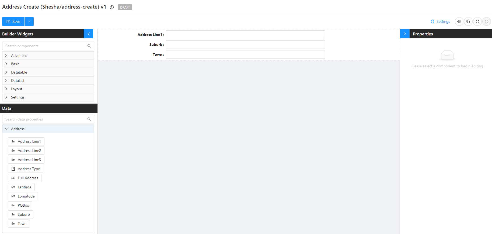

Save and head back to **member-create**.

1. Select the **Entity Picker**, enable **Allow New Record**, and populate the **Dialogue Settings**:

| Field | Value |
|---|---|
| `Title` | `Add Address` |
| `Modal Form` | `address-create` |
| `Show Modal Buttons` | `true` |

### Wizard Step Two: Membership Information

On the **Membership Information** step, drag in the following:

| Property |
|---|
| `membershipNumber` |
| `membershipStartDate` |
| `membershipEndDate` |
| `membershipStatus` |

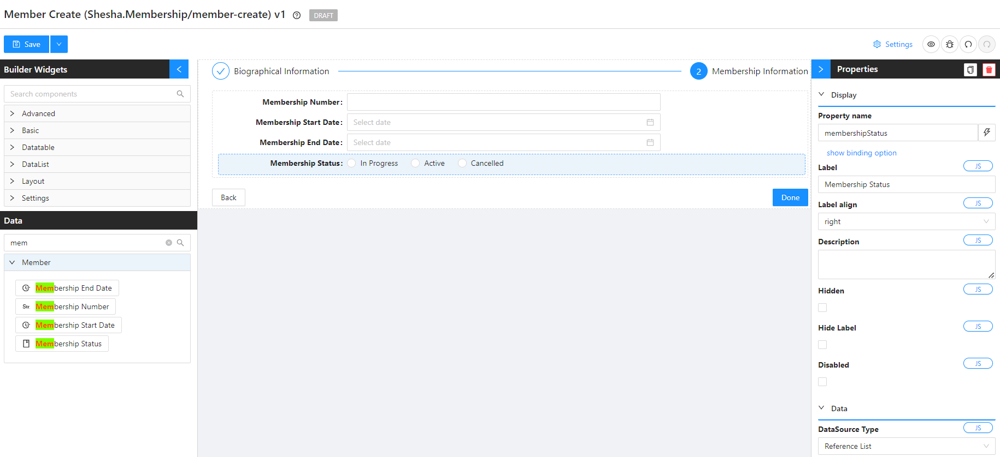

To stop users picking impossible dates, add validations:

| Property | Setting | Value |
|---|---|---|
| `membershipStartDate` | Disabled Date Mode | `Function Template` |
| `membershipStartDate` | Disabled Date Template | `Disable Past Dates` |
| `membershipEndDate` | Disabled Date Mode | `Function Template` |
| `membershipEndDate` | Disabled Date Template | `Disable Past Dates` |

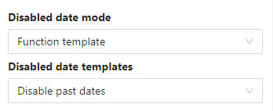

Save the form.

---

## Updating the Table View

1. Open the [members-table form designer](./configuring-first-view.md#accessing-the-form-designer).
2. In **Settings**, change the **Entity** to `Shesha.Membership.Domain.Member (Mem.Member)`.

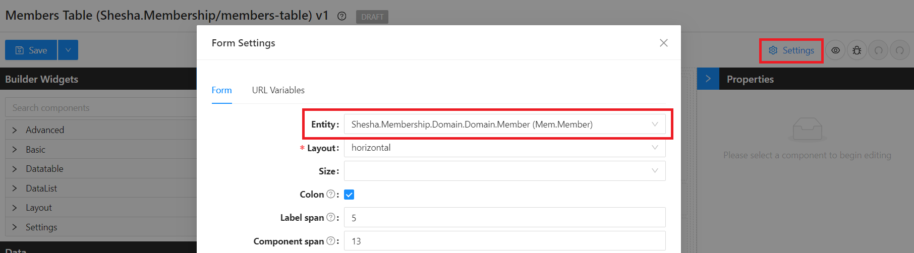

3. Select the **Datatable Context** component and change its **Entity Type** to `Shesha.Membership.Domain.Member (Mem.Member)`.

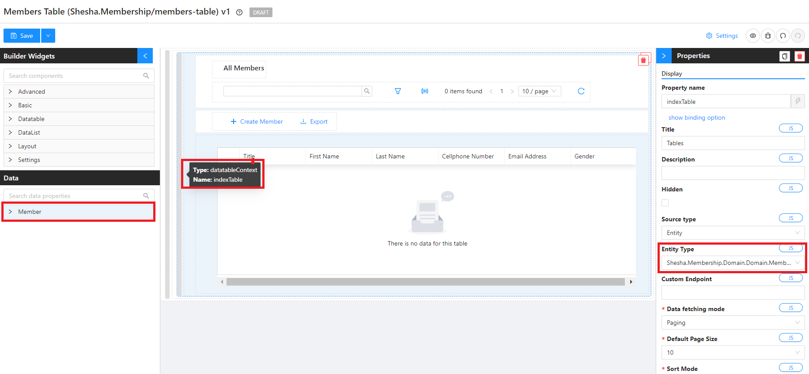

4. Select the **Datatable** component, click **Customize Columns**, and add the new membership columns.

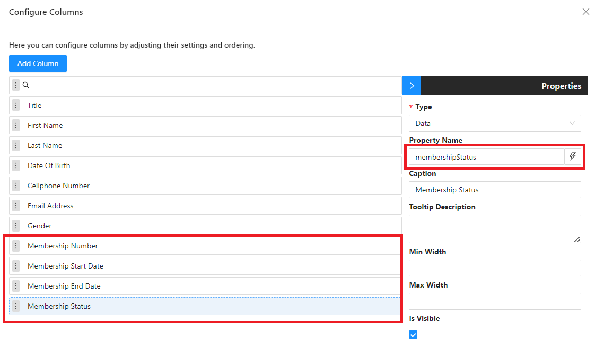

5. Select the **Button Group** component on the toolbar and update the **Create Member** button:

| Field | Value |
|---|---|
| `Button Type` | `None` |

This hides the button because the wizard's own buttons handle the submit flow now.

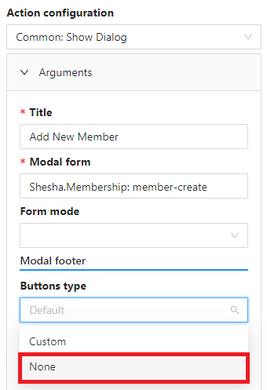

6. Save the form.

---

## Updating the Details View

1. Open the [member-details form designer](./configuring-first-view.md#accessing-the-form-designer).
2. In **Settings**, change the **Entity** to `Shesha.Membership.Domain.Member (Mem.Member)`.

For more on the tab component, see [the tab component reference](/docs/front-end-basics/form-components/Layouts/tabs).

3. Drag in a **tab** component from the **Builder Widgets** onto the details panel.
4. Drag the existing components into the tab's first pane.

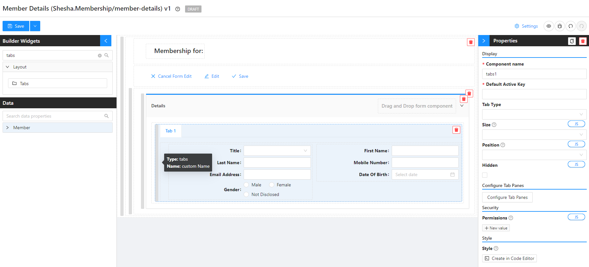

5. Click **Configure Tab Panes** and create two tabs:

| Tab | Name |
|---|---|
| `1` | Biographical Information |
| `2` | Membership Information |

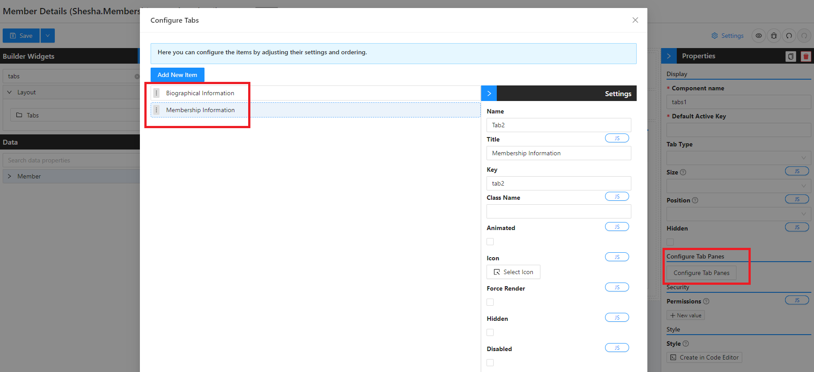

### Biographical Information Tab

Drag in a **File** component for the ID document (see the [File component reference](/docs/front-end-basics/form-components/Entity-References/files)):

| Field | Value |
|---|---|
| `Property Name` | `idDocument` |
| `Label` | `Id Document` |
| `Owner Id` | `{data.id}` |
| `Owner Type` | `Shesha.Membership.Domain.Domain.Member` |

To display the linked Address, you have several options:

| Option | When to use |
|---|---|
| `Autocomplete` | When users will search by typing. See [Autocomplete](/docs/front-end-basics/form-components/Advanced/autocomplete). |
| `Entity Picker` | When users will pick from a paged list. See [Entity Picker](/front-end-basics/form-components/Entity-References/entity-picker.md). |
| `Entity Reference` | When you want to display the value and optionally open a modal to edit it. See [Entity Reference](/front-end-basics/form-components/Entity-References/entity-references.md). |
| `Sub Form` | When you want to embed a full form for the related entity. See [Sub Form](/docs/front-end-basics/form-components/Layouts/subform). |

For this tutorial, use **Entity Reference**.

Drag in an **Entity Reference** and configure:

| Field | Value |
|---|---|
| `Property Name` | `address` |
| `Label` | `Address` |
| `Get Entity Url` | `/api/dynamic/Shesha/Address/Get` |
| `Entity Type` | `Shesha.Domain.Address (Shesha.Core.Address)` |
| `Display Property` | `fullAddress` |
| `Entity Reference Type` | `Modal Dialog Box` |
| `Form Selection Mode` | `Name` |
| `Form` | `address-create` |

Then set the **Dialog Settings**:

| Field | Value |
|---|---|
| `Title` | `Address` |
| `Show Modal Buttons` | `true` |
| `Submit Http Verb` | `PUT` |
| `Handle Success` | `Designer Form > Refresh` |

### Membership Information Tab

Switch to the **Membership Information** tab and drag in:

| Property |
|---|
| `membershipNumber` |
| `membershipStartDate` |
| `membershipEndDate` |
| `membershipStatus` |

### Personalising the Header

1. Select the **text** title component and change its **Content** to:

```
{{fullName}} - {{membershipNumber}}
```

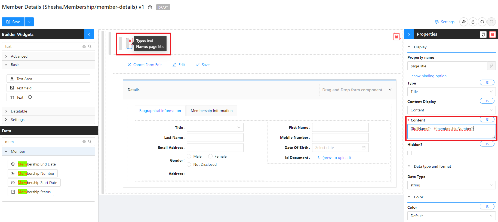

2. Drag a **Reference List Status** component (see the [Reference List Status reference](../../../front-end-basics/form-components/Advanced/reference-list-status.md)) next to the title.

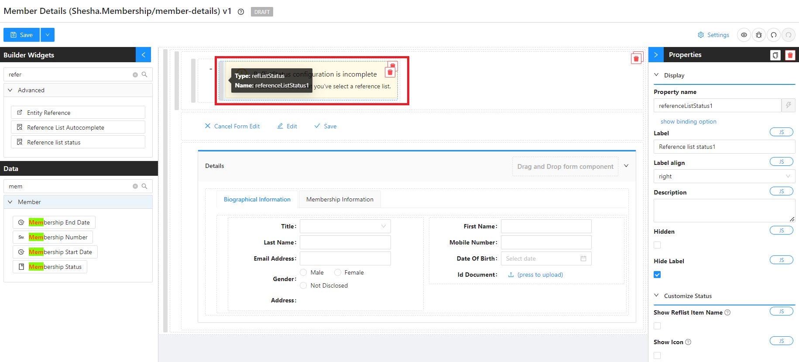

3. Configure the **Reference List Status**:

| Field | Value |
|---|---|
| `Property Name` | `membershipStatus` |
| `Reference List` | `MembershipStatuses` |

4. Save the form.

---

## Test It

- From the main menu, navigate to the **members-table** and refresh.
- Register a new member through the wizard.
- Confirm the new fields appear on both the table and the details view.

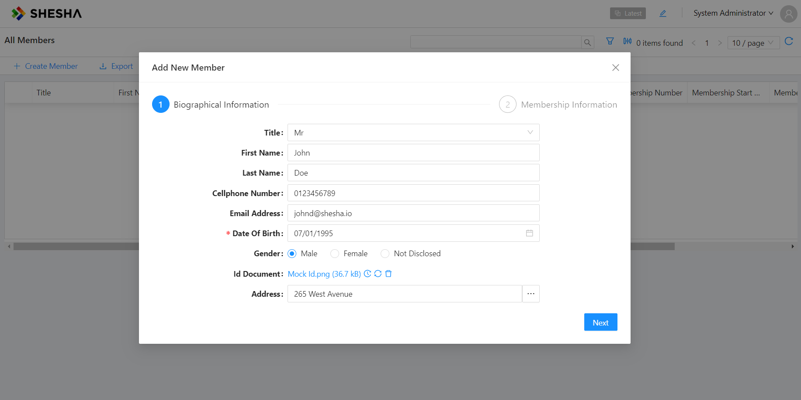

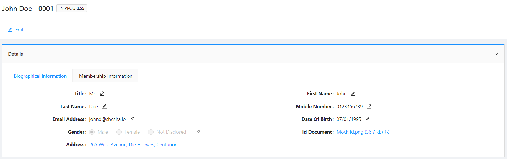

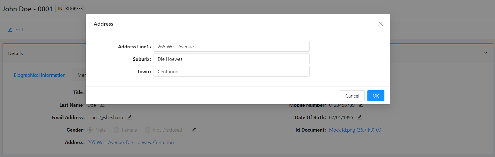

---

## Next Step

Continue with [Adding New Entities and Child Tables](./new-entities.md) to create a `MembershipPayment` entity and wire it up as a child table on the member's details view.
