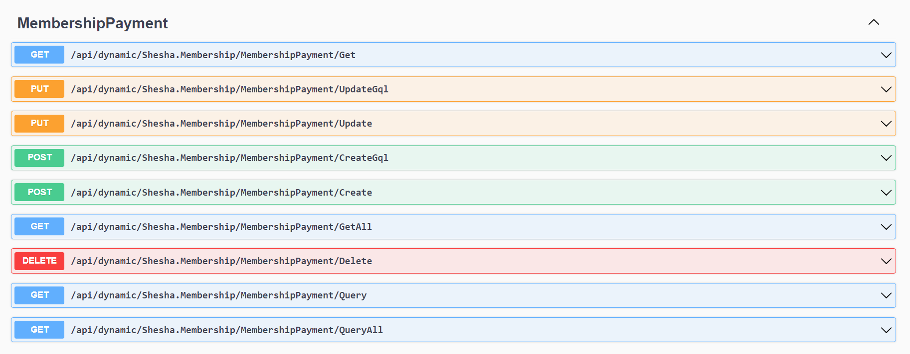
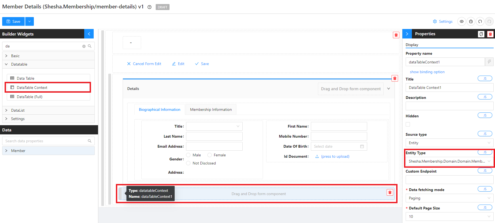
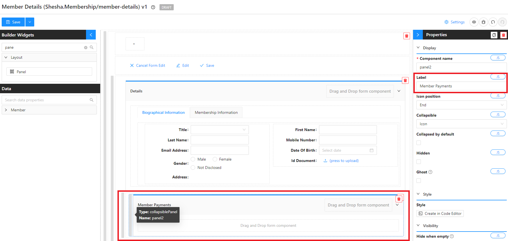
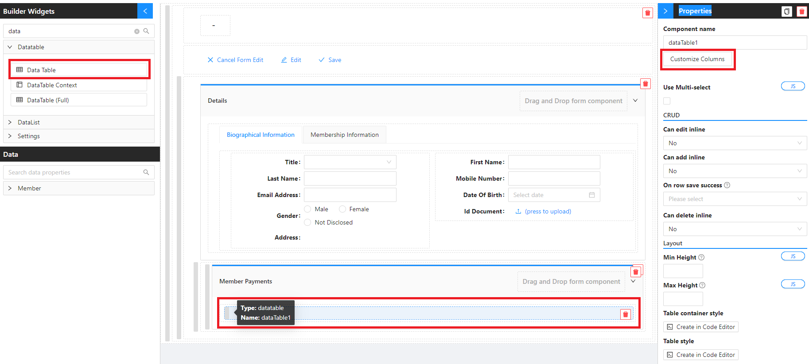
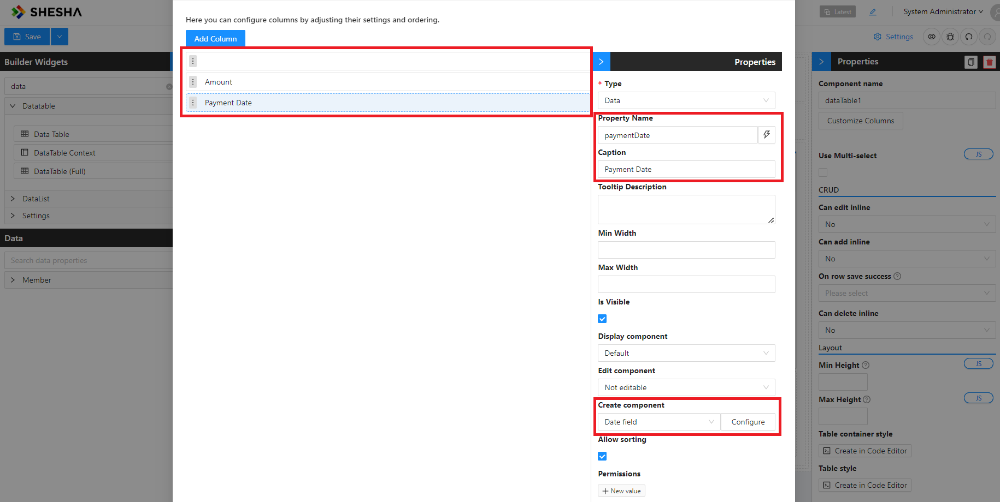
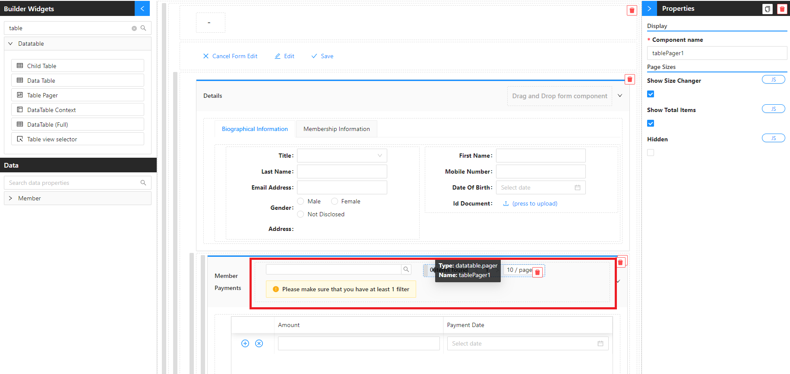
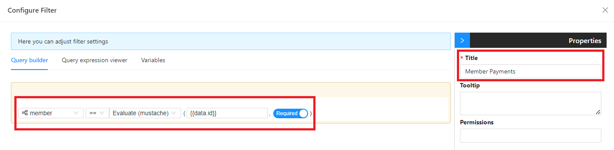
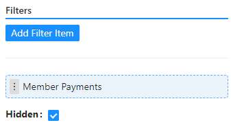
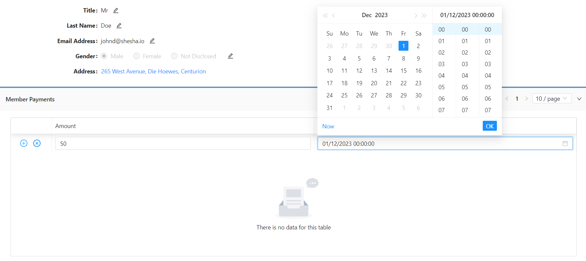
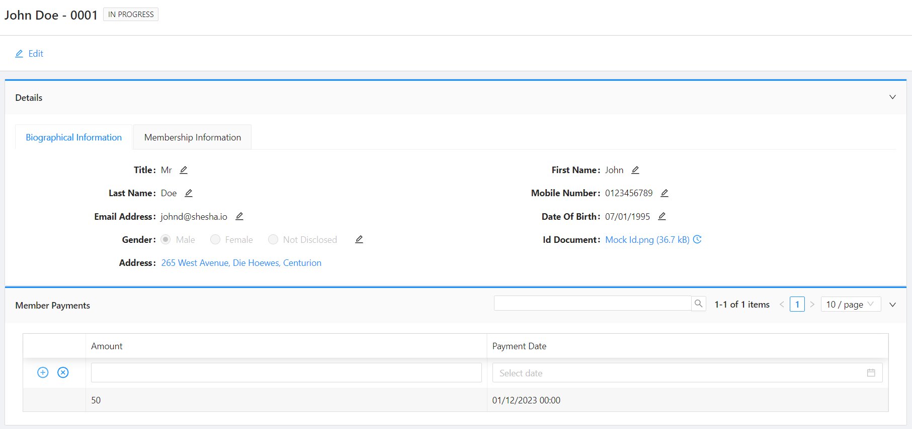

# Adding New Entities and Child Tables

This membership isn't free! Let's create a `Membership Payment` entity to track all the payments related to a Member.

In this section, you learn how to:

- Create a New Entity
- Create a Migration Class
- Configure a Child Table
- Configure a Filter for the Table
- Implement a Script to Call an Endpoint

## Create a New Entity

1. Navigate to `Boxfusion.Membership.Common.Domain` > `Domain`
2. Right click on the `Domain` folder, `Add` > `Class`
3. Give your class the name of: `MembershipPayment.cs`, and click on `Add`

This is how your class should be constructed:

```csharp
using Abp.Domain.Entities.Auditing;
using Shesha.Domain.Attributes;
using System;

namespace Shesha.Membership.Domain.Domain
{
    /// <summary>
    ///
    /// </summary>
    [Entity(TypeShortAlias = "Mem.MembershipPayment")]
    public class MembershipPayment : FullAuditedEntity<Guid>
    {
        /// <summary>
        ///
        /// </summary>
        public virtual Member Member { get; set; }
        /// <summary>
        /// The payment amount
        /// </summary>
        public virtual double Amount { get; set; }
        /// <summary>
        /// The date when the payment was made
        /// </summary>
        public virtual DateTime? PaymentDate { get; set; }
    }
}

```

## Create a Migration Class

1. Navigate to `Boxfusion.Membership.Common.Domain` > `Migrations`
2. Right click on the `Migrations` folder, `Add` > `Class`
3. Create a new migration class with a file name following this format: **M[YEAR][MONTH][DAY][HOUR][MINUTE][SECONDS].cs e.g. M20231124090300.cs for 24 November 2023 08:53:00**.
4. Add the below code:

```csharp
using FluentMigrator;
using Shesha.FluentMigrator;
using System;

namespace Boxfusion.Membership.Common.Domain.Migrations
{
    [Migration(20231124090300)]
    public class M20231124090300 : Migration
    {
        /// <summary>
        /// Code to execute when executing the migrations
        /// </summary>
        public override void Up()
        {
            Create.Table("Mem_MembershipPayments")
                .WithIdAsGuid()
                .WithFullAuditColumns()
                .WithForeignKeyColumn("MemberId", "Core_Persons").Nullable()
                .WithColumn("Amount").AsDouble().Nullable()
                .WithColumn("PaymentDate").AsDateTime().Nullable();
        }
        /// <summary>
        /// Code to execute when rolling back the migration
        /// </summary>
        public override void Down()
        {
            throw new NotImplementedException();
        }
    }
}
```

_You can check out [Fluent Migrator](https://fluentmigrator.github.io/index.html) for more options about database migrations._

5.  You can run your application by going to the menu and selecting `Debug` > `Start Debugging` or by clicking `F5`
6.  The application should open in your browser on the default Swagger API page.
7.  Search and navigate to the `Member` endpoints that have been dynamically created by Shesha.



_Read more about dynamic APIs [here](/docs/back-end-basics/crud-apis)_

## Updating Configurations

### Details View

1. Navigate to the `member-details` [form designer](/docs/get-started/tutorial/the-basics/configuring-first-view#accessing-form-designer)
2. Search and drag in a `Datatable Context` component from the `Builder Widgets` below the existing `details` panel

_You can find more information about implementation of the Datatable Context component [here](/docs/front-end-basics/form-components/data-display/data-table/datatable-context)_

3. Set the `Entity Type` property of the `Datatable Context` to the newly created `Membership Payment` entity



4. Search and drag in a `Panel` component from the `Builder Widgets` onto the `Datatable Context`
5. Give the panel component a label of `Member Payments`



_You can find more information about implementation of the Panel component [here](/docs/front-end-basics/form-components/Layouts/panel)_

6.  Search and drag in a `Datatable` component from the `Builder Widgets` onto the `Panel`
7.  Configure columns with the following information:

    | Type            | Property Name | Caption       | Create Component |
    | --------------- | ------------- | ------------- | ---------------- |
    | CRUD Operations | _N/A_         | _leave empty_ | _N/A_            |
    | Data            | amount        | Amount        | Number Field     |
    | Data            | paymentDate   | Payment Date  | Date Field       |





8.  Click `save` on the `configure columns` modal.

_You can find more information about implementation of the Datatable component [here](/docs/front-end-basics/form-components/data-display/data-table/datatable)_

Taking full advantage of Shesha's datatable functionalities, we are going to be utilizing the **inline-editing** to input the `Member Payments`.

_Check out the inline-editing [how-to-guide](/docs/front-end-basics/how-to-guides/inline-editing)_

9. Update the `datatable` configuration to the following:

- Can add inline: `Yes`
- New row init:
  ```javascript
  return {
    member: formData.id,
  };
  ```

_Let's accessorize our `datatable` and make it more flexible._

10. Search and drag in the following components from the `Builder Widgets` onto the the header of the `Member Payments` panel:
    - [Quick Search](/docs/front-end-basics/form-components/data-display/data-table/quick-search)
    - [Table Pager](/docs/front-end-basics/form-components/data-display/data-table/table-pager)
    - [Table View Selector](/docs/front-end-basics/form-components/data-display/data-table/table-view-selector)



11. Select the `Table View Selector` component and update the filter configurations to look like this:



_This filters all the `membership payments` to only show payments of the member whose details we are viewing._

12. Save your filter and toggle the `Hidden` property to `true`



13. Save your form

- Using the main menu, navigate to the `members-table` and refresh your page to make sure your changes have taken effect.
- Drill down into the `details view` of your recently created member.
- Create a `Membership Payment`



