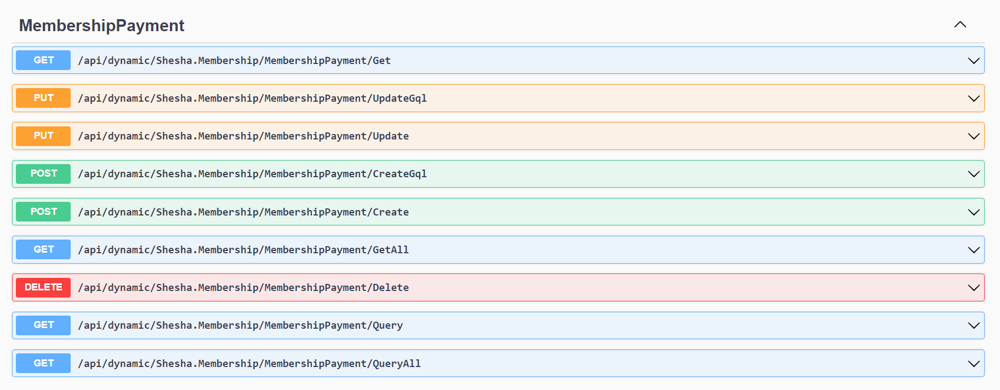
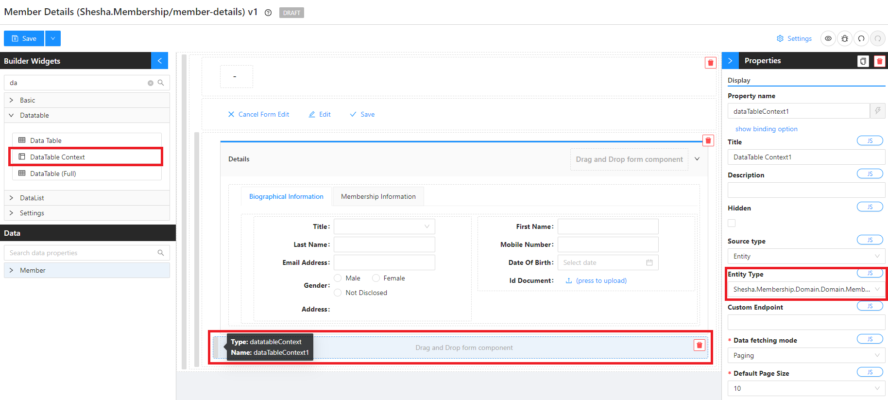
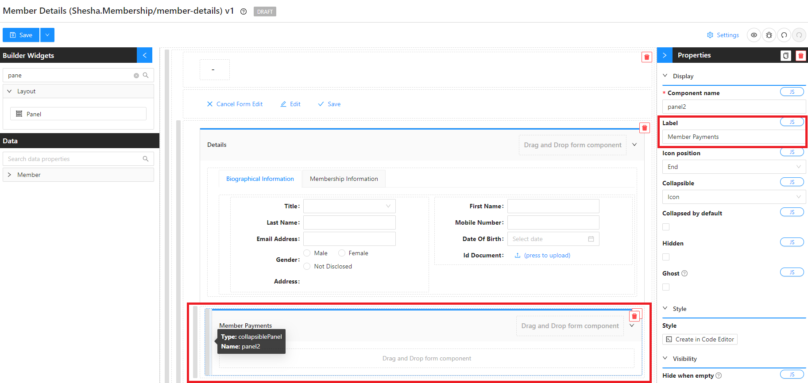
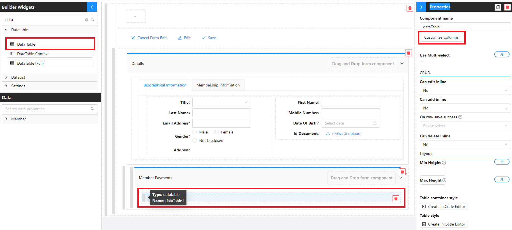
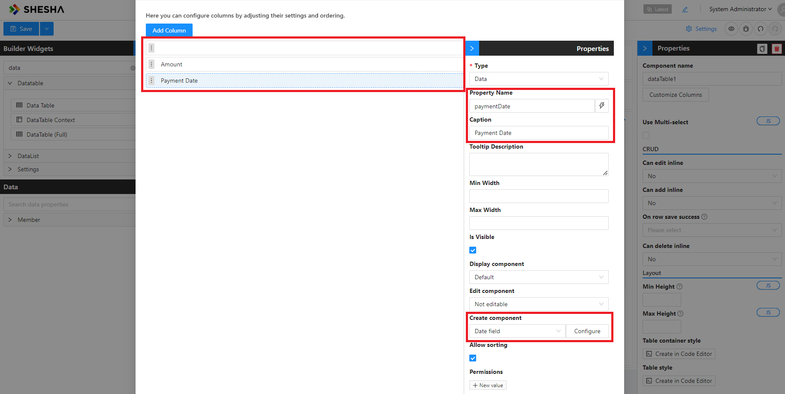
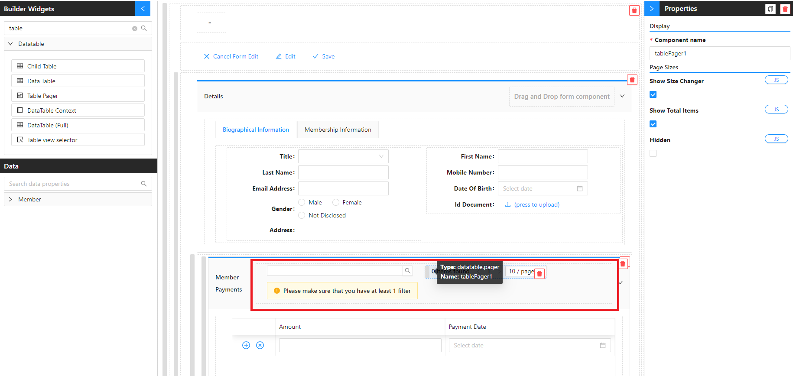
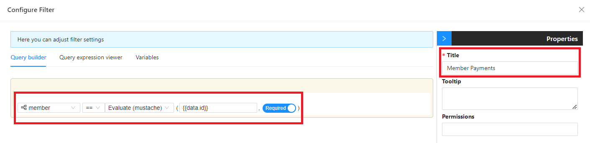
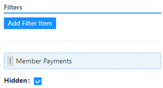
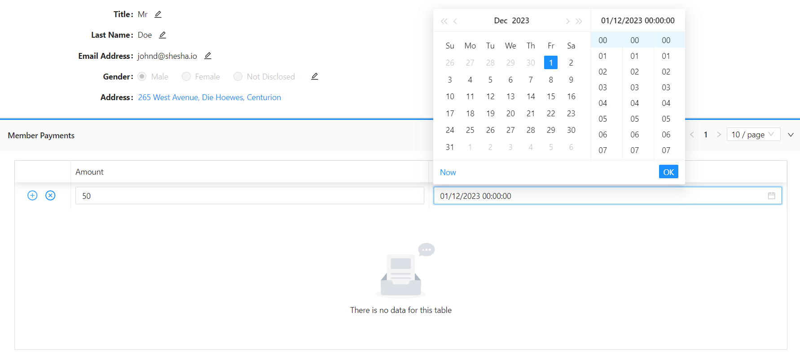
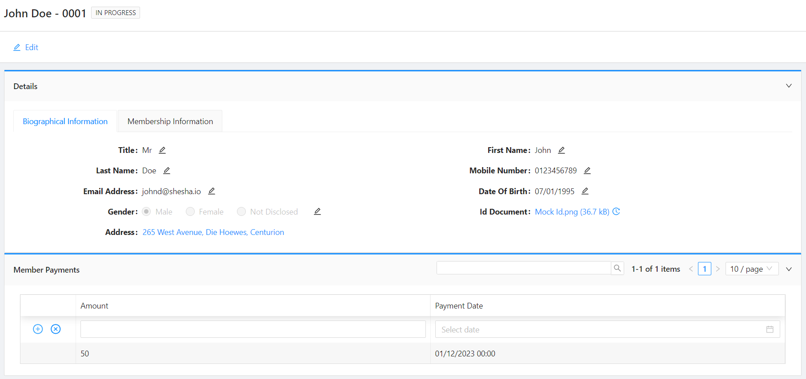

# Adding New Entities and Child Tables

This step shows how to add a brand-new entity (not just an extension of an existing one) and wire it up as a child table on the parent's details view. You will create a `MembershipPayment` entity that tracks all payments related to a Member, and surface those payments inline on the member details view.

This is the most common shape for "one-to-many" relationships in Shesha: a child entity with a foreign key back to the parent, and a child table on the parent's details view that supports inline editing.

---

## Create the MembershipPayment Entity

Open the `backend/Shesha.Membership.sln` solution in Visual Studio 2022.

### 1. Add the Entity Class

1. Navigate to `Shesha.Membership.Domain > Domain`.
2. Right-click the folder and choose **Add > Class**.
3. Name the class `MembershipPayment.cs`.

**Example - The MembershipPayment entity:**

```cs
using Abp.Domain.Entities.Auditing;
using Shesha.Domain.Attributes;
using System;

namespace Shesha.Membership.Domain.Domain
{
    /// <summary>
    /// A payment made by a Member towards their membership.
    /// </summary>
    [Entity(TypeShortAlias = "Mem.MembershipPayment")]
    public class MembershipPayment : FullAuditedEntity<Guid>
    {
        /// <summary>
        /// The Member who made the payment.
        /// </summary>
        public virtual Member Member { get; set; }

        /// <summary>
        /// The amount paid.
        /// </summary>
        public virtual double Amount { get; set; }

        /// <summary>
        /// The date the payment was made.
        /// </summary>
        public virtual DateTime? PaymentDate { get; set; }
    }
}
```

:::info Why FullAuditedEntity?
`FullAuditedEntity<Guid>` is an Abp base class that gives the entity a Guid primary key plus standard audit columns: CreatedBy, CreationTime, LastModifiedBy, LastModificationTime, IsDeleted, DeleterUserId, and DeletionTime. Use it whenever you need full audit history with soft-delete behaviour.
:::

### 2. Create the Migration

1. Navigate to `Shesha.Membership.Domain > Migrations`.
2. Right-click the folder and choose **Add > Class**.
3. Name the class with a timestamp, for example `M20231124090300.cs`.

**Example - Migration creating the Mem_MembershipPayments table:**

```cs
using FluentMigrator;
using Shesha.FluentMigrator;
using System;

namespace Shesha.Membership.Domain.Migrations
{
    [Migration(20231124090300)]
    public class M20231124090300 : Migration
    {
        public override void Up()
        {
            Create.Table("Mem_MembershipPayments")
                .WithIdAsGuid()
                .WithFullAuditColumns()
                .WithForeignKeyColumn("MemberId", "Core_Persons").Nullable()
                .WithColumn("Amount").AsDouble().Nullable()
                .WithColumn("PaymentDate").AsDateTime().Nullable();
        }

        public override void Down()
        {
            throw new NotImplementedException();
        }
    }
}
```

:::tip Shesha FluentMigrator helpers
`WithIdAsGuid` adds a Guid primary key. `WithFullAuditColumns` adds the audit columns that match `FullAuditedEntity<Guid>`. `WithForeignKeyColumn` creates a column and its foreign key in a single call. These helpers come from `Shesha.FluentMigrator`. For more options see the [FluentMigrator docs](https://fluentmigrator.github.io/index.html).
:::

4. Start the application (**Debug > Start Debugging** or **F5**).
5. The app opens on the Swagger page.
6. Search for **MembershipPayment** in Swagger to see the auto-generated CRUD endpoints.



See [CRUD APIs](/docs/back-end-basics/crud-apis) for what each endpoint does and how to customise the generated set.

---

## Wire the Child Table into the Details View

Now surface the payments inline on the member's details view, with a filter so each member only sees their own payments.

### 1. Add a DataTable Context

1. Open the [member-details form designer](./configuring-first-view.md#accessing-the-form-designer).
2. Drag a **DataTable Context** (see the [DataTable Context reference](/docs/front-end-basics/form-components/tables-lists/datatable-context)) onto the form, below the existing **details** panel.
3. Set its **Entity Type** to the new `MembershipPayment` entity.



### 2. Add a Panel and DataTable

1. Drag a **Panel** (see the [Panel reference](/front-end-basics/form-components/Layouts/panel.md)) onto the DataTable Context.
2. Label the panel `Member Payments`.



3. Drag a **DataTable** (see the [DataTable reference](/docs/front-end-basics/form-components/tables-lists/datatable)) onto the panel.
4. Configure the columns:

| Type | Property Name | Caption | Create Component |
|---|---|---|---|
| `CRUD Operations` | *N/A* | *(leave empty)* | *N/A* |
| `Data` | `amount` | `Amount` | `Number Field` |
| `Data` | `paymentDate` | `Payment Date` | `Date Field` |





5. Click **Save** on the **Configure Columns** modal.

### 3. Enable Inline Editing

Inline editing lets users add payments directly into the table without opening a separate dialog. See the [inline editing how-to](/docs/front-end-basics/how-to-guides/inline-editing) for the full flow.

Configure the DataTable:

| Setting | Value |
|---|---|
| `Can add inline` | `Yes` |

**Form type to use:** Configured on a DataTable inside a member-details (details view) form.

**Example - New row initialiser that links each payment to the current member:**

```javascript
return {
  member: form.data.id,
};
```

This sets the `member` foreign key on each new payment row to the currently displayed member.

### 4. Add Toolbar Components

To make the table easier to use, drag the following onto the **Member Payments** panel header:

| Component | Purpose |
|---|---|
| [Quick Search](/docs/front-end-basics/form-components/tables-lists/quick-search) | Free-text filter across columns. |
| [Table Pager](/docs/front-end-basics/form-components/tables-lists/table-pager) | Paging controls. |
| [Table View Selector](/docs/front-end-basics/form-components/tables-lists/table-view-selector) | Switches between named filters. |



### 5. Filter Payments to the Current Member

Select the **Table View Selector** and configure a filter that restricts the table to payments belonging to the current member:



Save the filter and set the **Table View Selector**'s **Hidden** property to `true` - users don't need to see it, but the filter still applies.



6. Save the form.

---

## Test It

- From the main menu, navigate to the **members-table** and refresh.
- Drill down into the details view of any member.
- Add a **Membership Payment** using inline editing.





---

## Next Step

Continue with [Custom APIs](./custom-api.md) to build a custom app service that enforces business rules before activating a membership.
