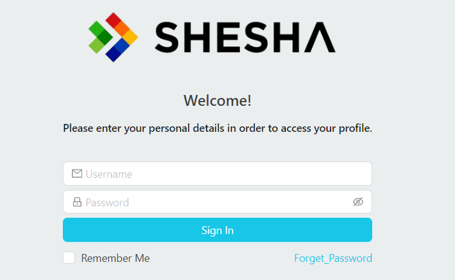

# Finding and Editing the Login Form

Shesha ships with a default login form. To customise it - change the layout, add fields, restyle elements - you first need to find it in the Forms list and open it in the designer. The login form lives in the standard forms table, but it is filtered out of the default view, so you also have to remove that filter before you can see it. This guide walks through both steps.

---

## 1. Open Configurations

From the home page, click the **Configurations** button in the top navigation.

---

## 2. Open the Forms Section

From the Configurations area, click **Forms**.

---

## 3. Switch to Edit Mode

The Forms list filters out a number of internal forms (including the login form) by default. To see and edit those, you need to switch the application from **Live Mode** to **Edit Mode** using the toggle button at the top.

---

## 4. Open the Forms Table Configuration

Hover over the **Forms** title - a small popup appears. Click the pencil icon to open the table's configuration.

You should now be on the popup configuration page:

---

## 5. Clear the Default Filter

Hover and click on the **DataTable Context** in the designer. A **Properties** panel appears on the right side.

- Click **Clear** to remove the default filter that hides the login form.
- Save the change.

---

## 6. Find and Open the Login Form

Close the popup tab (or navigate back to the Forms page) and search for **login** in the search bar. The table now shows the login form entries. Pick the one with **Module = shesha** and **Name = login** and click it.

On the left, click the designer button (the square-grid icon) to open the form in the designer.

---

## 7. Customise and Save

You can now edit the login form like any other configurable form. Make your changes and click **Save**.

:::tip
Once you have cleared the filter on the Forms table, you can come back and edit the login form at any time without going through Edit Mode again. The cleared filter is persisted with the table configuration.
:::
