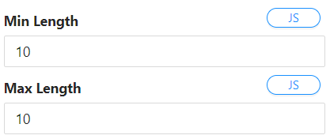

We can ensure the integrity of the Data in our application by enforcing logic to make sure users are guided on the type of information that is deemed correct.

Here are a couple of ways we can go about it:

### Validating South African phone numbers

This can be achieved in 2 ways:

1. **Min Length property:**

   - This will bring a default validation message using the component `Label` property for content.
     
     

2. **Custom Validator Script:**

   - Navigate to the `validator` property on the text field.
   - Copy the code and paste inside the given validator function to execute custom JavaScript code that returns a promise. 

     ```javascript
     function isValidPhoneNumber(number) {
       const regex = /^(?:\+27|0)[1-9]\d{8}$/; //South African phone number regex pattern
       return regex.test(number);
     }

     if (isValidPhoneNumber(value)) {
       return Promise.resolve();
     } else {
       return Promise.reject("Please enter a valid cellphone number");
     }
     ```

### Validating Email Addresses

**Custom Validator Script:**

- Navigate to the `validator` property on the text field.
- Copy the code and paste inside the given validator function to execute custom JavaScript code that returns a promise. 

  ```javascript
  function isValidEmailAddress(email) {
    const regex = /^[^\s@]+@[^\s@]+\.[^\s@]+$/; //South African phone number regex pattern
    return regex.test(email);
  }

  if (isValidEmailAddress(value)) {
    return Promise.resolve();
  } else {
    return Promise.reject("Please enter a valid email address");
  }
  ```