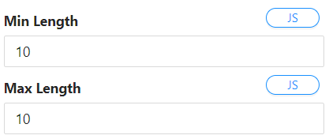
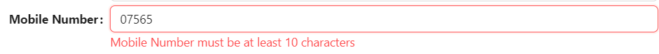

# Adding Custom Validation on the Frontend

Front-end validation guides users towards entering correct data before they hit Save. Shesha components support two main ways of doing this: declarative validation through the standard component properties (such as **Min Length**), and a fully scripted **Validator** that lets you express any rule in JavaScript. This guide shows both, using two common examples: validating South African phone numbers and validating email addresses.

:::warning Front-end validation is not a security boundary
Front-end validation prevents typos and accidental bad input. It does not stop a determined user from posting bad data directly to the API. Always pair front-end validation with server-side validation for any rule that matters - see the [Validation](/docs/fundamentals/validation) page for the back-end side.
:::

---

## Validating South African Phone Numbers

There are two ways to validate a South African phone number on a text field.

### Option 1 - Min Length

The simplest declarative check. Set the component's **Min Length** property to the minimum number of digits you expect. If the user enters fewer characters, Shesha displays a default validation message that references the component's **Label**.





### Option 2 - Custom Validator Script

When Min Length is not enough - for example, when you need to enforce a specific format - use a custom **Validator**.

1. Open the text field's properties.
2. Locate the **Validator** property.
3. Paste a JavaScript function that returns a `Promise`. Resolve to accept the value, reject to reject it.

**Form type to use:** Edit Form or Create Form - the same validator works on any form that captures the value.

**Example - Reject anything that is not a valid South African mobile number:**

```javascript
function isValidPhoneNumber(number) {
  // South African phone number: optional +27 country code or leading 0, then 9 digits
  const regex = /^(?:\+27|0)[1-9]\d{8}$/;
  return regex.test(number);
}

if (isValidPhoneNumber(value)) {
  return Promise.resolve();
} else {
  return Promise.reject('Please enter a valid cellphone number');
}
```

The string passed to `Promise.reject` is shown to the user as the validation message.

---

## Validating Email Addresses

### Custom Validator Script

Email validation is a near-perfect fit for a custom Validator - regex-based checking gives you precise feedback without the user having to guess what is expected.

1. Open the text field's properties.
2. Locate the **Validator** property.
3. Paste the script below.

**Form type to use:** Edit Form or Create Form.

**Example - Reject anything that does not look like an email address:**

```javascript
function isValidEmailAddress(email) {
  // Basic email format: something@something.something
  const regex = /^[^\s@]+@[^\s@]+\.[^\s@]+$/;
  return regex.test(email);
}

if (isValidEmailAddress(value)) {
  return Promise.resolve();
} else {
  return Promise.reject('Please enter a valid email address');
}
```

:::tip
The `value` variable in the validator is whatever is currently in the field. Use the rest of the form via the `data` object if your rule depends on another field.
:::
