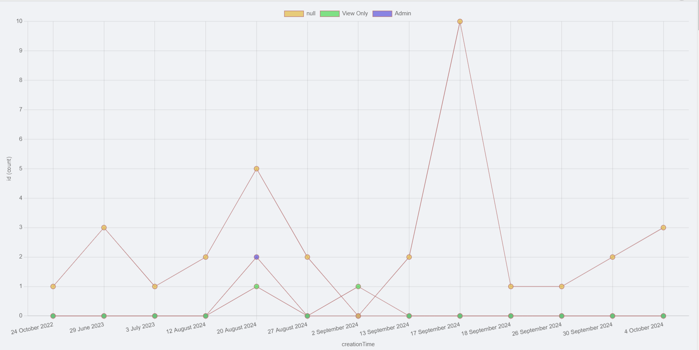
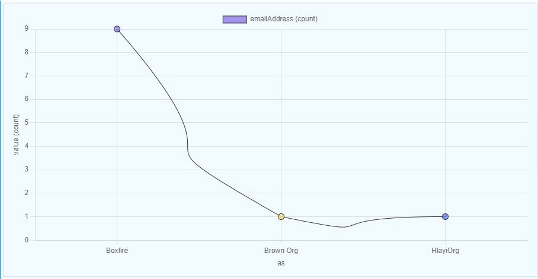
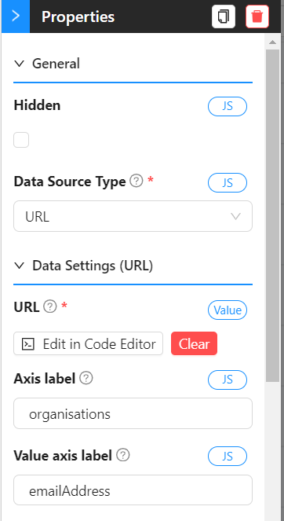
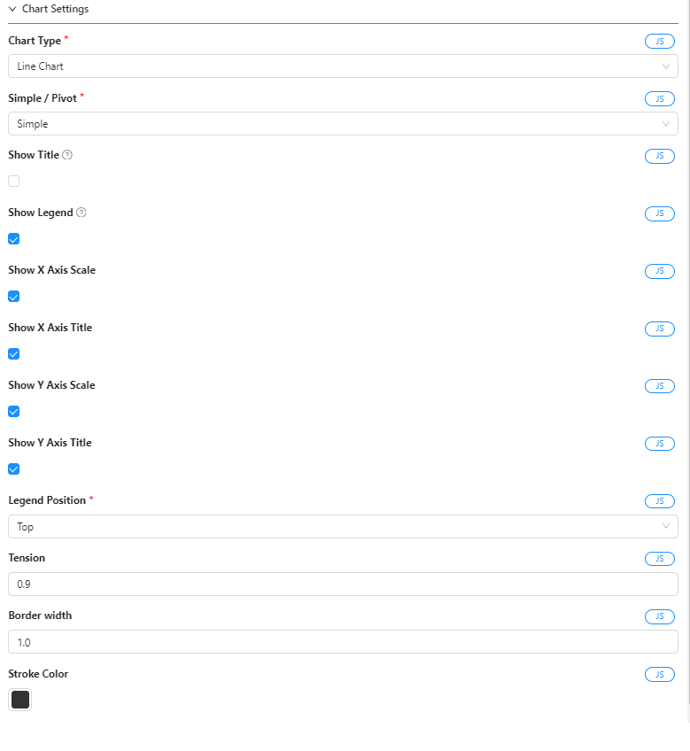
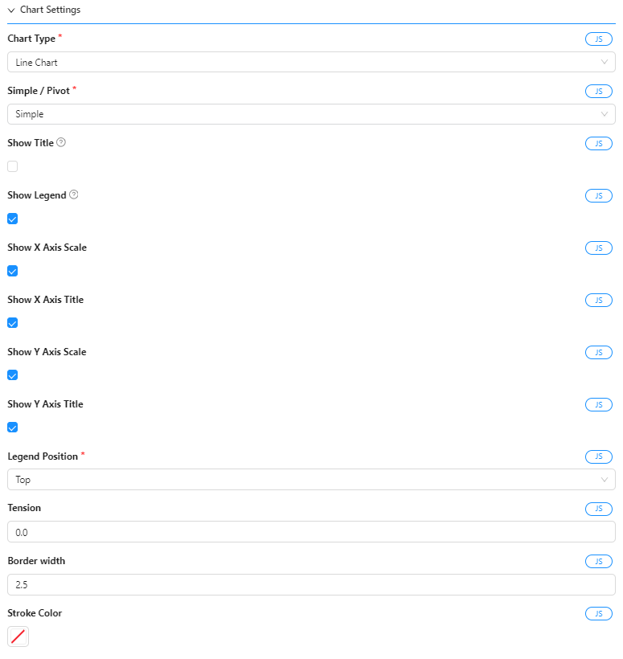
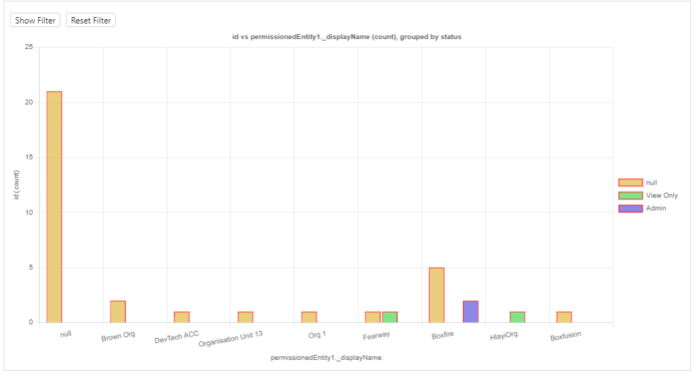
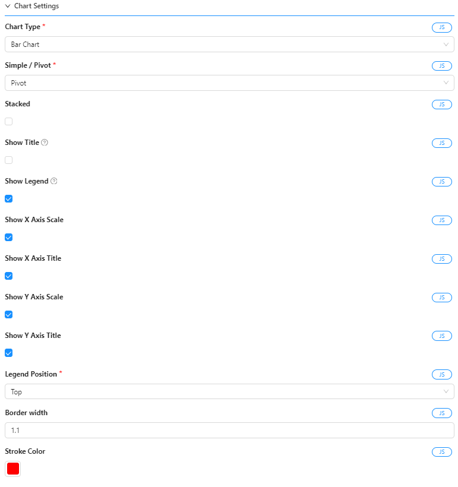
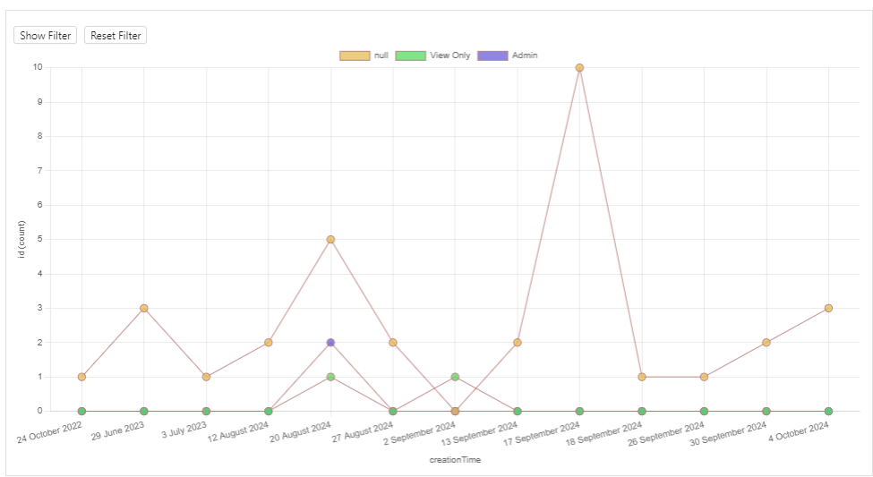
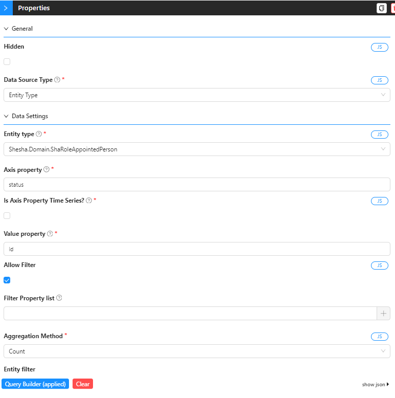

# Chart component

This is a chart component. It can be used to display data in a chart.  

The component allows for quick and easy creation of charts.  
Dynamic and shesha-native, the component can be used to display data from an `Entity` in your database or from a backend service `endpoint`.

_**Note:**_ The component uses the `Chart.js` library to display the charts.

  
**Example chart**

## Configuration

The component has the following properties:

### General Settings


- Hidden: If checked, the chart will not be displayed.
- Data Source Type: The source of the data. It can be an `Entity Type` or an `URL`.

### Data Settings `Entity Type`


- Entity Type: The `Entity` that contains the data to be displayed.
- Axis property: The property of the `Entity` that will be used as the X-axis.
- Is Axis Property Time Series?: If checked, the X-axis will be displayed as a time series.  
  This is useful when the X-axis is a date or time.  
  It is the responsibility of the configurator to ensure that this is checked when necessary only, i.e. when the data in this property is ISO string date time data.  
  
>**If `Time Series` is checked**  
>
> - Time Series Format: The format in which the time series data will be displayed.  
> Choose from the following options:
> - Day
> - Month
> - Year
> - Day-Month
> - Day-Month-Year
> - Month-Year

- Value property: The property of the `Entity` that will be used as the Y-axis.
- Legend property: The property of the `Entity` that will be used as the legend. (If chart data complexity is chosend as Pivot.. covered in the next section)
- Allow filter: If checked, the user can filter the data displayed in the chart dynamically.
- Filter property list: The properties of the `Entity` that can be used to filter the data displayed in the chart. (If `Allow filter` is checked)
- Aggregation Method: How the data must be aggregated when there are multiple data points for the same X-axis value.  
  Choose from the following options:
  - Sum
  - Average
  - Minimum
  - Maximum
  - Count (default)  
- Entity filter: How the data must be queried in the backend. You can use this to create complex filters that are using formdata or other data from the page.  
  The entity filter is a JSON object that will be used to filter the data in the backend.  
  The object should be in the following format:  
  ```json
  {
    "attribute": "value"
  }
  ```
  For example, if you want to filter the data where the `name` attribute is `John`, the entity filter should be:  
  ```json
  {
    "name": "John"
  }
  ```

### Data Settings `URL`


- URL: The URL of the backend service that will return the data to be displayed in the chart.
- Axis label: The label for the X-axis.
- Value axis label: The label for the Y-axis. 


The settings that will affect the look and feel of the chart.

- Chart type: The type of chart to be displayed.  
  Choose from the following options:
  - Line
  - Bar
  - Pie
  - Polar Area

- Simple / Pivot (Chart data complexity): The complexity of the data that will be displayed in the chart.
  - Simple: The data will be displayed as is.
  - Pivot: The data will be displayed in a pivot format.  
    This is useful when you have multiple data points for the same X-axis value.  
    The data will be grouped by the X-axis and the Y-axis will be displayed as a legend.  
    The user can select which data points to display in the chart.
    - Legend property (in the data settings, must be configured): The property of the `Entity` that will be used as the legend. (If chart data complexity is Pivot)
- Show Title: If checked, the title will be displayed.
- Title: The title of the chart. Will be calculated automatically if not provided.
- Show legend: If checked, the legend will be displayed.
- Show X Axis Scale: If checked, the X-axis scale will be displayed.
= Show X Axis Title: If checked, the X-axis title will be displayed.
- Show Y Axis Scale: If checked, the Y-axis scale will be displayed.
- Show Y Axis Title: If checked, the Y-axis title will be displayed.
- Legend Position: The position of the legend.  
  Choose from the following options:
  - Top
  - Bottom
  - Left
  - Right

- Tension: The tension of the line chart.  
  This will affect the curvature of the line.  
  The value should be between 0 and 1.  
  0 means no curvature and 1 means maximum curvature.
- Border Width: The width of the border of the chart.
- Stroke Color: The color of the stroke of the chart.

## Tips for preparing data on an custom endpoint

### How the data must look

If you want to prepare your own data for the chart from your own service, you need to make sure that you data comes already group and prepared in the following manner:  

- The endpoint must return an object with result property.  
- The result property point to an object with two properties: labels and datasets.

 ```json
 {
    result: {
      labels: [...],
      datasets: [...]
    }
 }
```

Example  

```json
  {
  result: {
    labels: ["January", "February", "March", "April", "May", "June", "July"],
    dataset: [
      {
        label: "Sales",
        data: [65, 59, 80, 81, 56, 55, 40],
        backgroundColor: [
          "rgba(255, 99, 132, 0.2)", 
          "rgba(54, 162, 235, 0.2)", 
          "rgba(255, 206, 86, 0.2)", 
          "rgba(75, 192, 192, 0.2)", 
          "rgba(153, 102, 255, 0.2)", 
          "rgba(255, 159, 64, 0.2)", 
          "rgba(99, 255, 132, 0.2)"
        ],
        borderColor: "rgba(255, 99, 132, 1)"       ],
        borderWidth: 1
      }
    ]
  }
}
```

### Example of an ASP.Net Core action
A ASP.Net Core action can look like this:

```csharp GetChartData (userd for Line Chart 1 below)
      public object GetChartData()
      {
          return new
          {
              labels = new[] { "Boxfire", "Brown Org", "HlayiOrg" },
              datasets = new[]
              {
                  new
                  {
                      label = "emailAddress (count)",
                      data = new[] { 9, 1, 1 },
                      backgroundColor = new[] { "hsla(250.84687042236328, 70.84687042236328%, 67.84687042236328%, 0.75)", "hsla(53.773223876953125, 83.77322387695312%, 70.77322387695312%, 0.75)", "hsla(227.58676147460938, 77.58676147460938%, 64.58676147460938%, 0.75)" },
                      borderColor = "white"
                  }
              }
          };
      }
```

## Examples

### Line Chart 1

  
**Line Chart (Simple)**


  
**Settings for Line Chart (Simple)**

### Line Chart 2

  
**Line Chart (Pivot)**


  
**Settings for Line Chart (Pivot)**

### Bar Chart 3 (Pivot)

  
**Bar Chart (Pivot)**


  
**Settings for Bar Chart (Pivot)**

### Line Chart 4 (Pivot)

  
**Line Chart (Pivot)**
 

  
**Settings for Line Chart (Pivot)**

### Pie Chart 5

  
**Simnle Pie Chart**


  
**Settings for Pie Chart**
