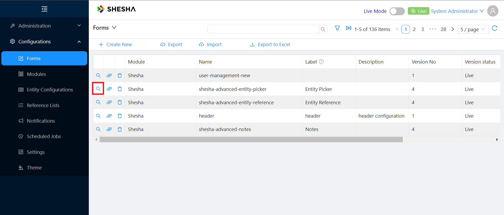
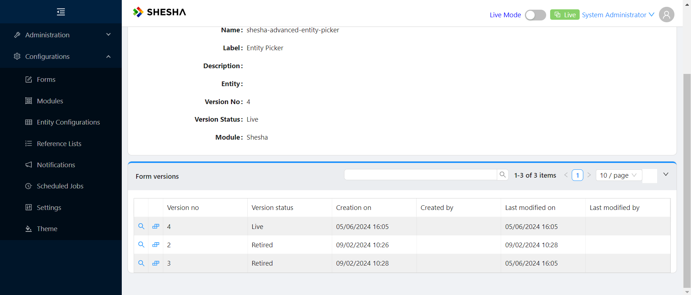
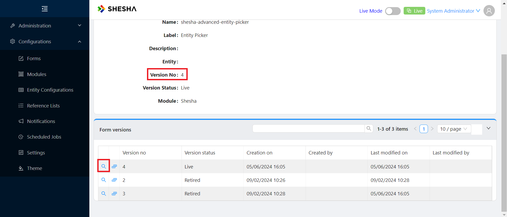
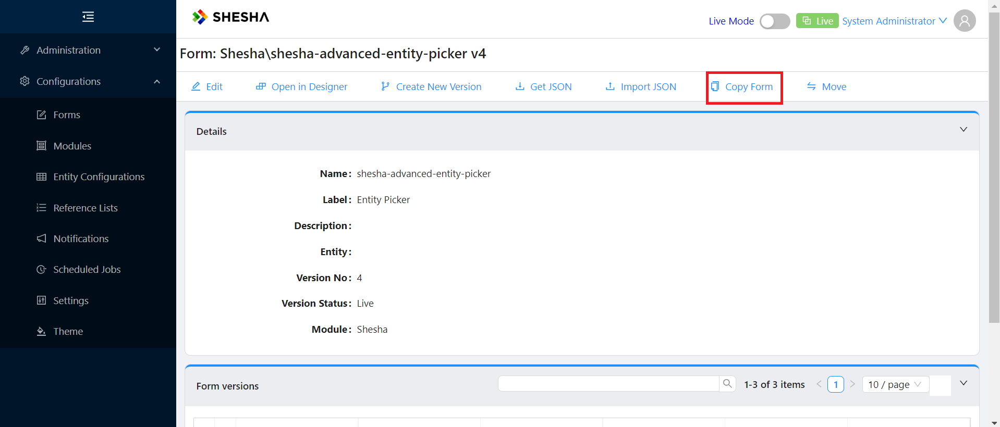
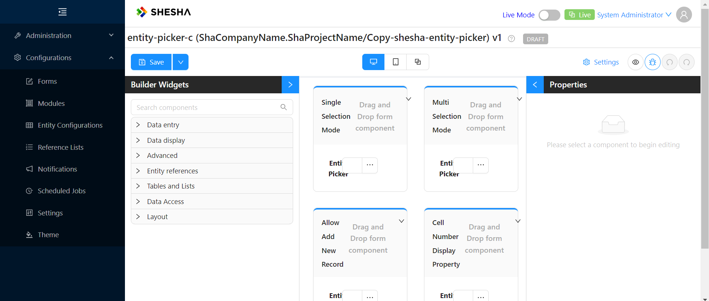
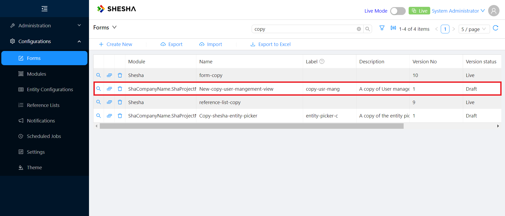

Hey there!

Shesha provides you with many cool features that make configuring your project much more seamless while catering to your exact need. One of such features is the ability to **Copy a Form**.

Let’s say you wanted to create your own version of a Shesha form. It could be a Default form or an existing form you have already created. 

Here’s how you can do that, all within a few small steps;

First, from your homepage, navigate to your forms page to see the list of forms available

If you don’t see the form in question simply search for it using the **search bar**.

We are going to copy the second form in the table above, **shesha-advanced-entity-picker**

To see further details about the form, click on the magnifier icon on the form row to open the details view.

When the details view opens up, scroll down to the bottom of the page to see all versions of the form

Depending on what version of the form you’d like to copy, you can select it again by clicking the magnifier icon to select a particular form version.

After that, at the top of the screen, simply click the **Copy Form** button

From there, simply choose the module name, Name, Label and description of your copied form and click **OK**

And viola! You have successfully created a copy of your form.

If you’d like to see your new copied form in the List of Forms, simply navigate back to the forms page and search for your form

This guide has shown you how to leverage Shesha's awesome Copy Form feature to enhance your productivity while working with forms. But there's so much more to discover! Check out the [documentation](../get-started/Introduction/).

### See Also:

-[Permission based security model](permission-based-security-model)