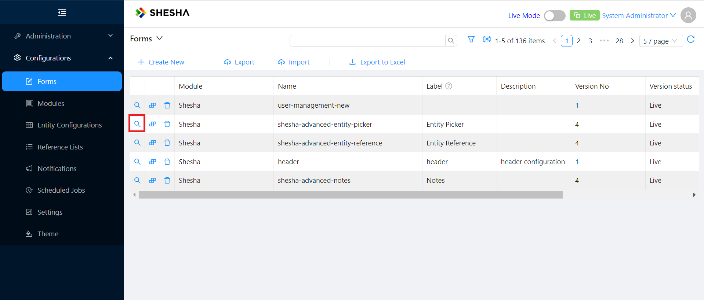
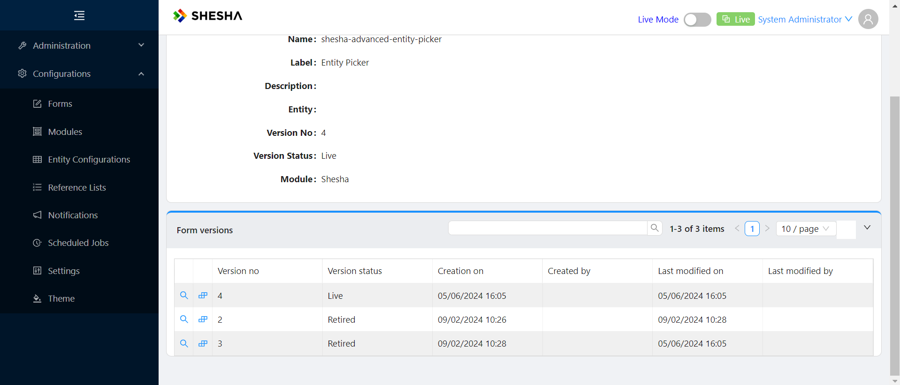
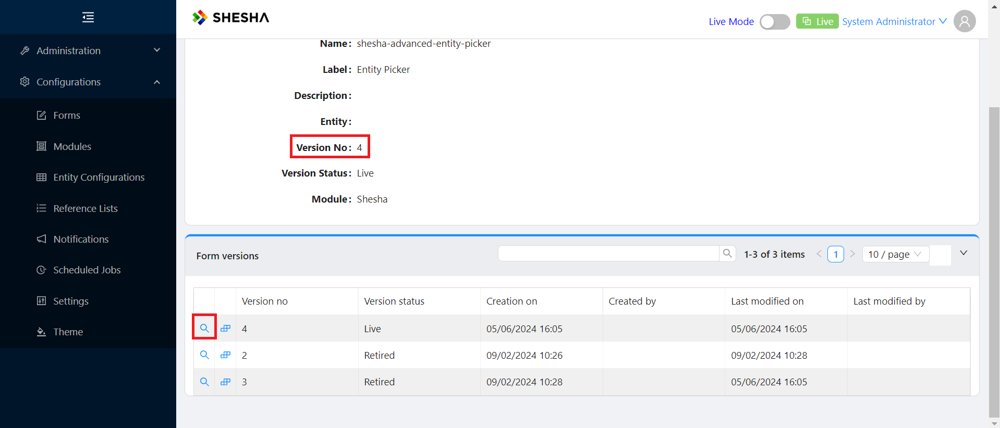
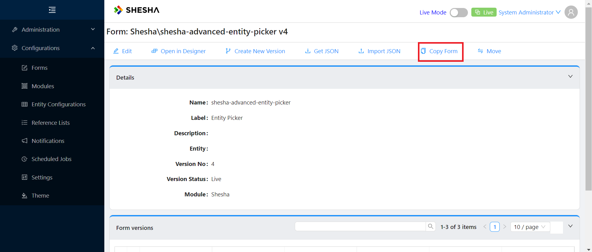
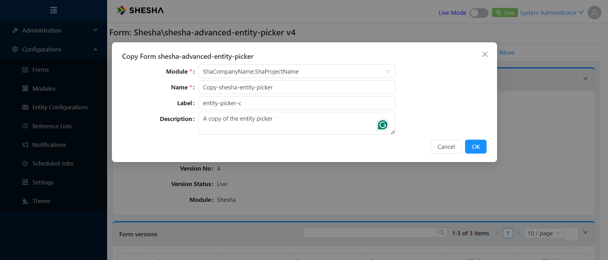
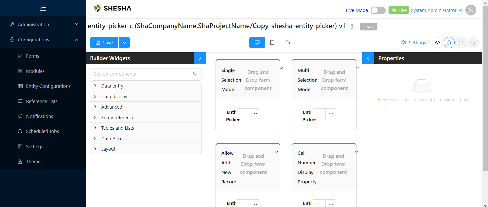
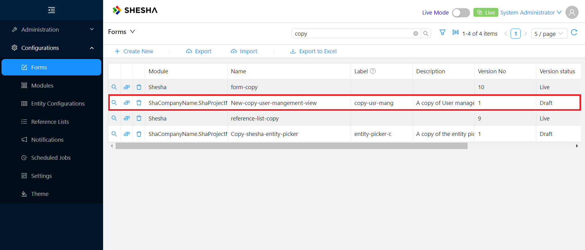

# Copy Form

Shesha makes it easy to create your own version of an existing form by **copying** it. This is useful when you want to start from one of Shesha's built-in forms (or a form already in your application) and customise it without affecting the original. This guide walks through finding the form you want to copy, picking the right version, and creating the copy.

---

## 1. Find the Form to Copy

From the home page, navigate to the forms list.

If the form you want is not visible, search for it using the search bar at the top of the list. For this example we will copy the `shesha-advanced-entity-picker` form.

---

## 2. Open the Form's Details View

Click the magnifier icon on the form's row to open its details view.

Scroll to the bottom of the details view to see all versions of the form.

---

## 3. Select the Version to Copy

Pick which version you want as the starting point. Click the magnifier icon next to the version to open it.

---

## 4. Click Copy Form

At the top of the screen, click the **Copy Form** button.

Enter the **Module name**, **Name**, **Label**, and **Description** for the new form, then click **OK**.

The copy is created.

---

## 5. Find the Copied Form in the List

To find your new form in the list, navigate back to the forms page and search for it.

:::tip
Copy Form duplicates the configuration of the form at the version you selected. The new form is independent - changes you make to it do not affect the original, and changes made to the original do not flow into the copy.
:::
