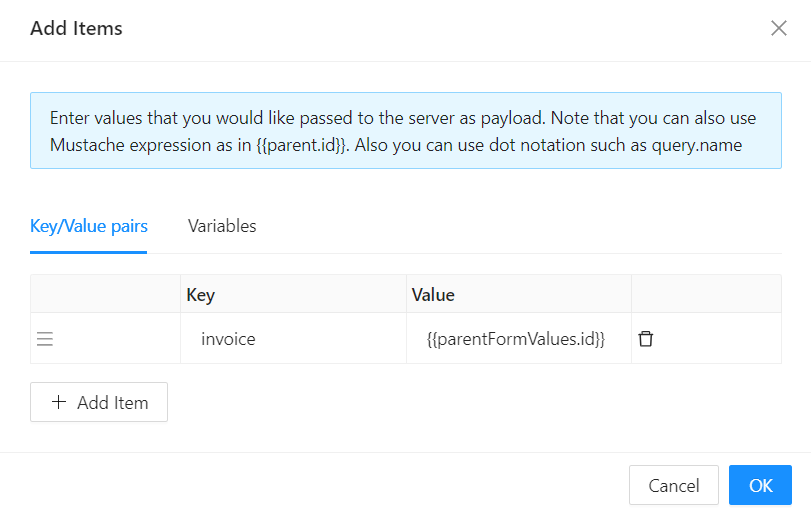
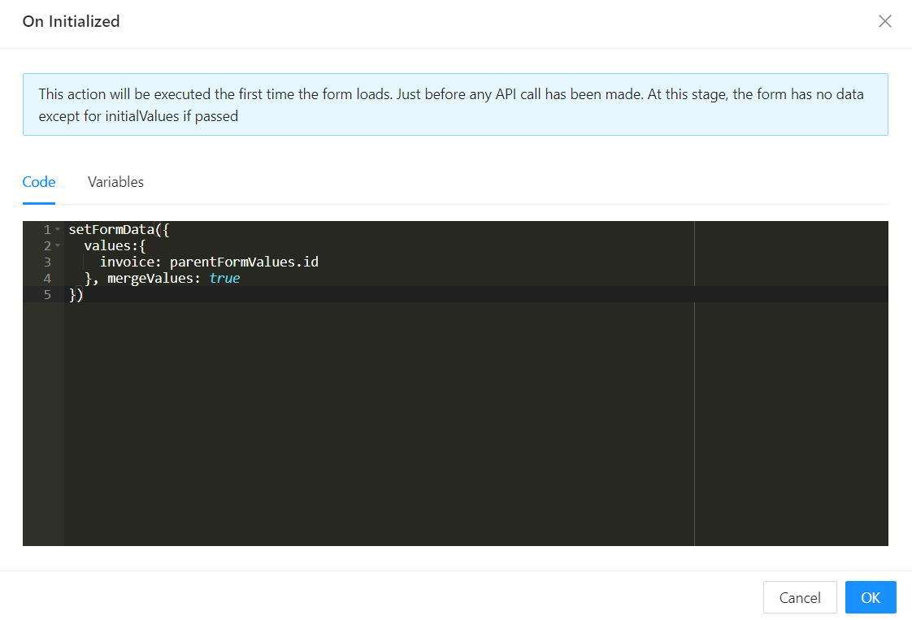

# Initialize Dialog with Values from Parent Form

In the example below, we are on an `invoice-details` view, which contains an `invoice-line-item` child table filtered to only view line items that belong to the currently viewed invoice. Populating data onto the child/dialog with a reference to the current `invoice` can be achieved in two ways, by using the [Parent Form Values](/docs/front-end-basics/configured-views/client-side-scripting/shesha-objects/parent-form-values) object, as explained in a previous section:

## 1. Using Initial Values

On the `invoice-line-items` create view form designer, navigate to `Settings` and select `Initial Values`. Since we are on the details view of the `invoice`, and the creation of the `line item` happens on a dialog, we can initialize the `invoice` foreign key on the `invoice-line-item` by using the `ParentFormValues` object.

## 2. Using "on Initialized" Event

On the `invoice-line-items` create view form designer, navigate to `Settings` and select `on Initialized`. This brings up a JavaScript code editor that determines the actions that will be executed the first time the form loads, just before any API call has been made. At this stage, the form has no data except for Initial Values, if passed.

The [SetFormData](/docs/front-end-basics/configured-views/client-side-scripting/set-form-data) function, as explained in an earlier section, can be used. For example:

