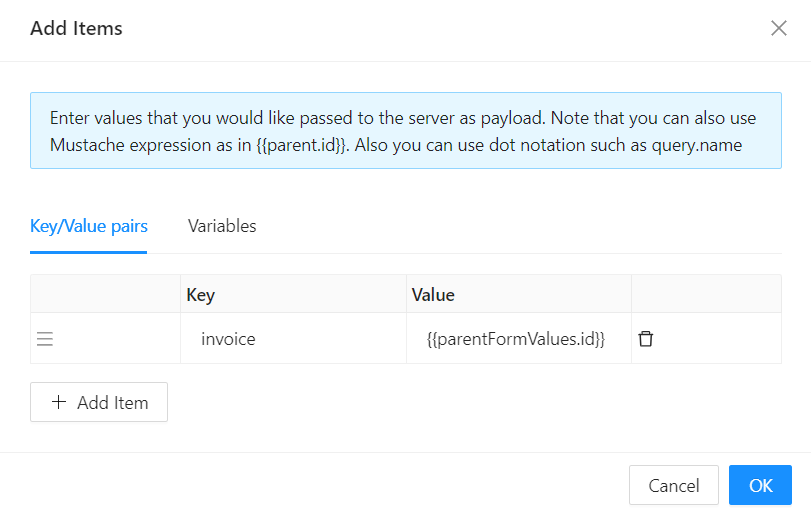
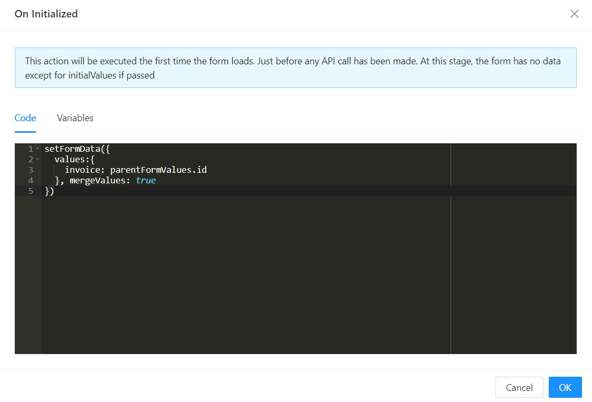

# Initialize Dialog with Values From Parent Form

When a user opens a child dialog from a details view, the dialog often needs to "know" which parent record it belongs to. For example, on an `invoice-details` view the **Add line item** button opens a child dialog that creates an `invoice-line-item` - but the line item must be linked to the invoice the user is currently looking at. This guide shows two ways to pass that parent-record context into the dialog's form.

Both approaches read from the [Parent Form Values](/docs/front-end-basics/configured-views/client-side-scripting/shesha-objects/parent-form-values) object, which Shesha exposes inside the child form whenever it is opened from a parent.

---

## Option 1 - Use Initial Values

The **Initial Values** setting on the child form lets you write a JavaScript expression that seeds the form's data when it opens. This is the simplest approach when you only need to copy a few foreign-key fields across.

1. Open the `invoice-line-item` **Create View** in the form designer.
2. Open **Settings** and locate the **Initial Values** field.
3. Reference `parentFormValues` to read the parent invoice's data.

**Form type to use:** Create Form - the child dialog is creating a new line item against the parent invoice.

---

## Option 2 - Use the On Initialized Event

When the seeding logic is more involved (multiple fields, conditional logic, or calls to the server), use the **On Initialized** event handler instead. This is a JavaScript editor that runs once, the first time the form loads, before any API call.

1. Open the `invoice-line-item` **Create View** in the form designer.
2. Open **Settings** and select **On Initialized**.
3. Use `form.setFieldsValue({ ... })` to seed the fields from `parentFormValues`.

At this point in the lifecycle the form has no data except whatever was set by Initial Values.

:::tip
For simple cases (one or two foreign keys), prefer Initial Values - it keeps the seeding right next to the field. Reach for On Initialized when the logic needs branching, multiple statements, or async work.
:::
