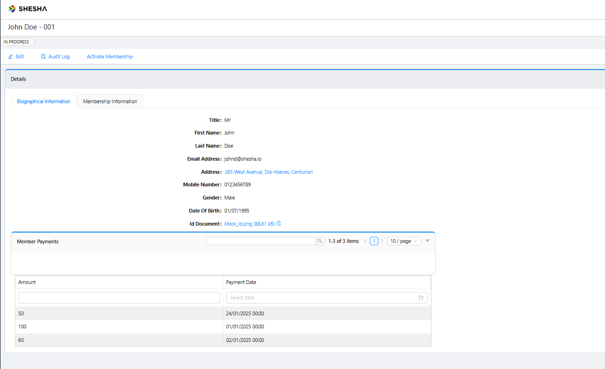
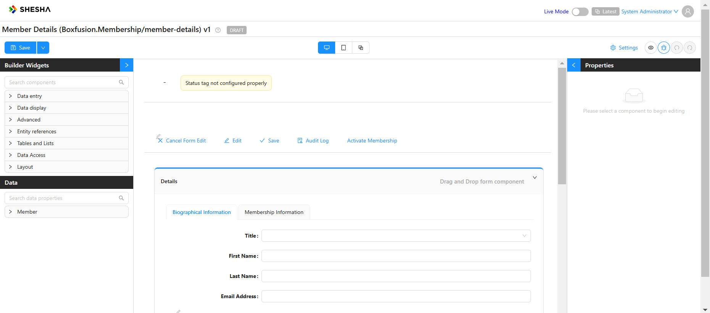
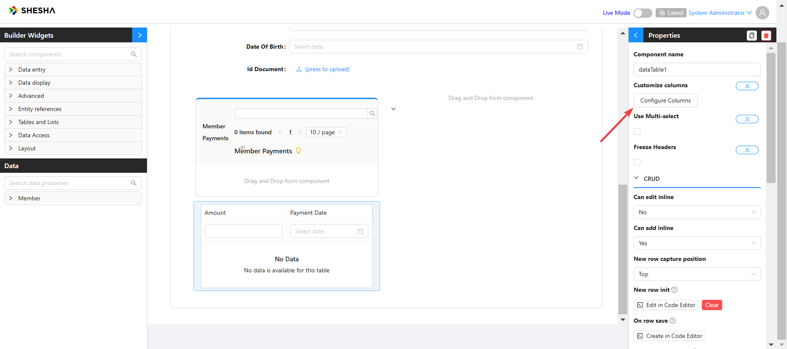
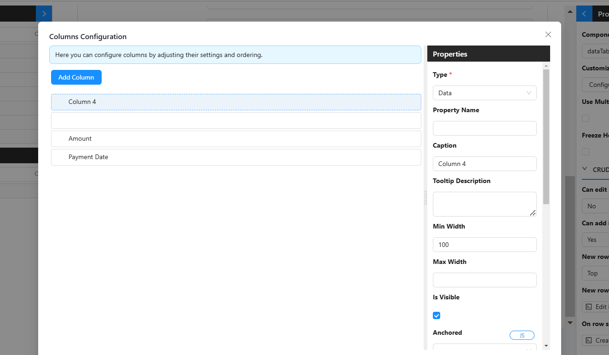
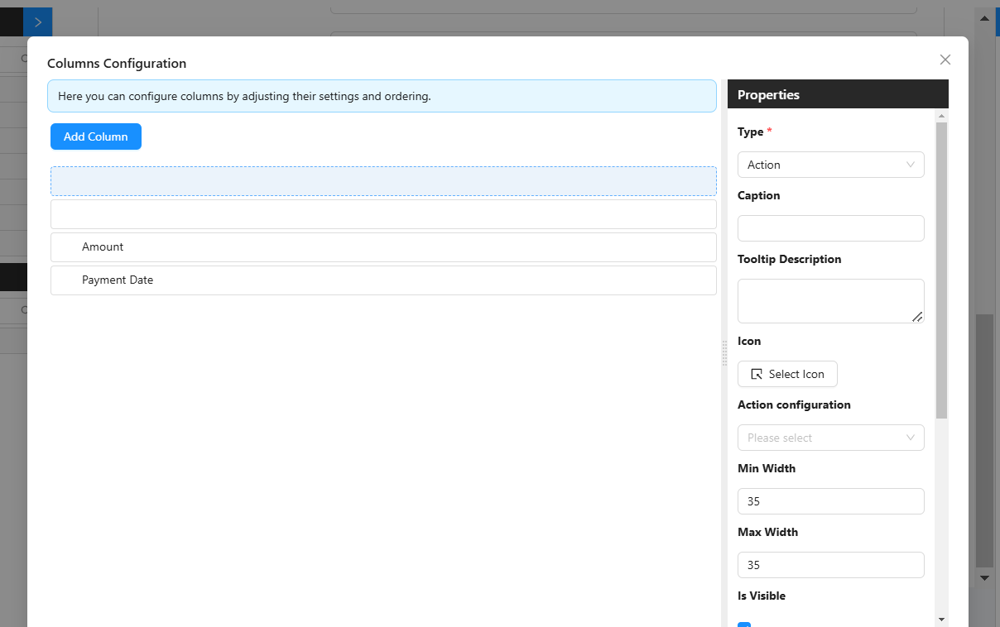
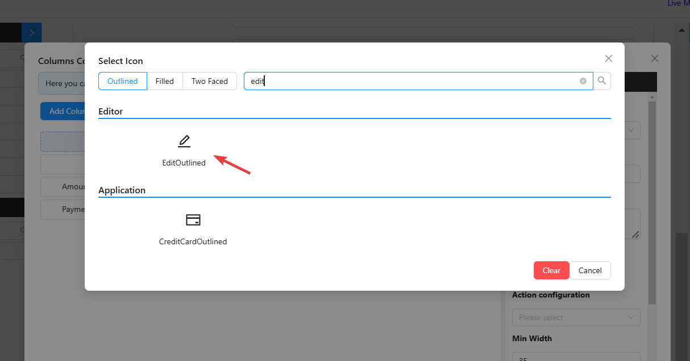
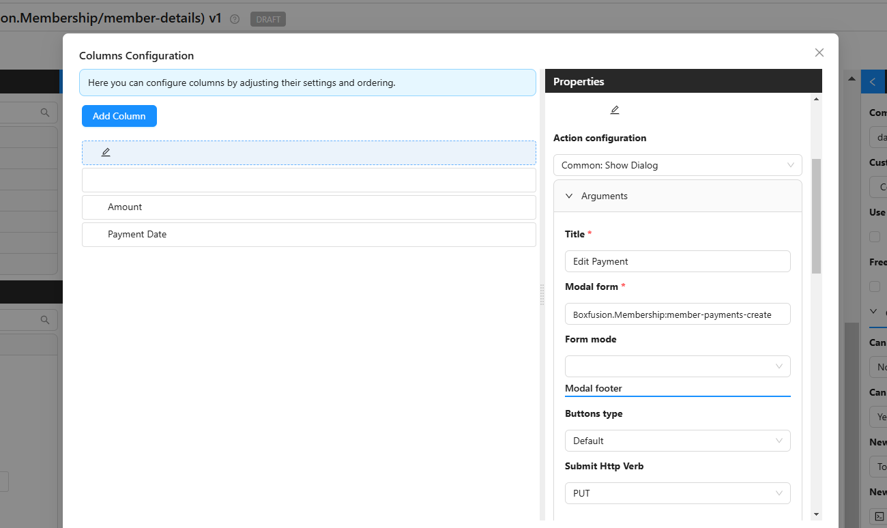
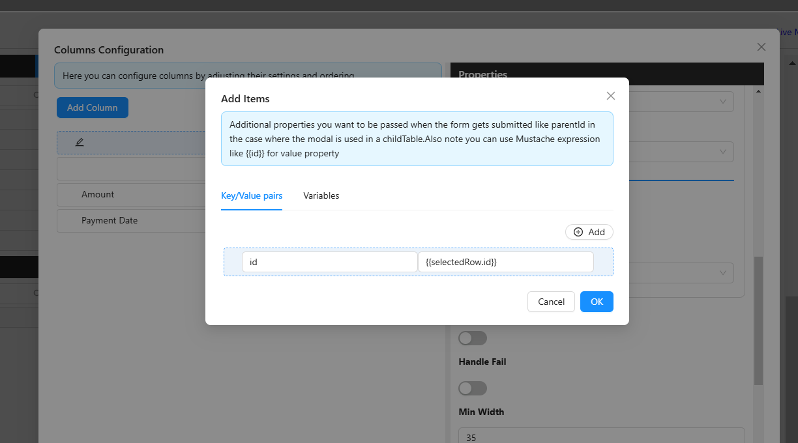
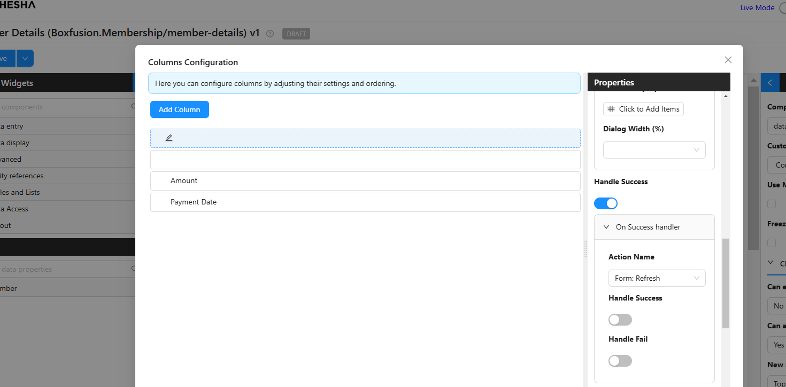
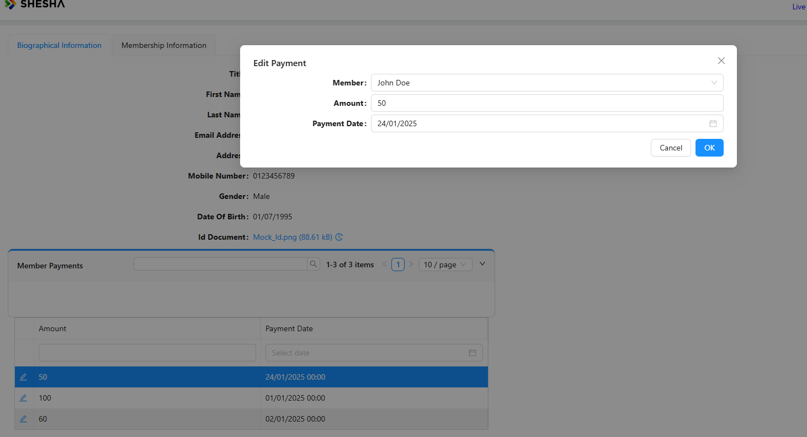

Consider a situation where you made an error on a table and you don't want to drill all the way down into the details view to be able to edit your information. 

If you need to edit your table row information on a dialogue, we need to initialize that dialogue with the following row information. We can do that by navigating to the specific form;

From there, click on the dataTable Component and then the **Configure Columns** button under properties

Once, there add a new Column and move it to the top of the list

Then, configure it by first setting the **Type** to **Action** and removing the column caption

Click the **Select Icon** button to add an Icon. On the Icon search screen, search *Edit* and use the *EditOutlined* icon.

Next add an **Action Configuration** of **Show Dialog**, a **Title** of **Edit Payment**, the **Modal form** will be the membership payment we created earlier and the **Submit Http Verb** will be **PUT**

Next, under the **Additional Properties** section, click the **Click to Add Items** button 

Then, add a new KeyValue pair of `id` and `{{selectedRow.id}}`

Finally, toggle the **Handle Success** property to true and set its Action Name to `Form: Refresh`

Then save the configuration and your form.

Now we can edit our payment Amount or Date

