# Initializing a Dialog With Edit Properties

Sometimes the user wants to edit a single row in a table without drilling all the way down to its details view. Shesha lets you add an inline **Edit** action column to the table that opens a pre-populated dialog seeded with the row's data. This guide walks through wiring up that action - adding the column, configuring the dialog, passing the row Id in, and refreshing the table on success.

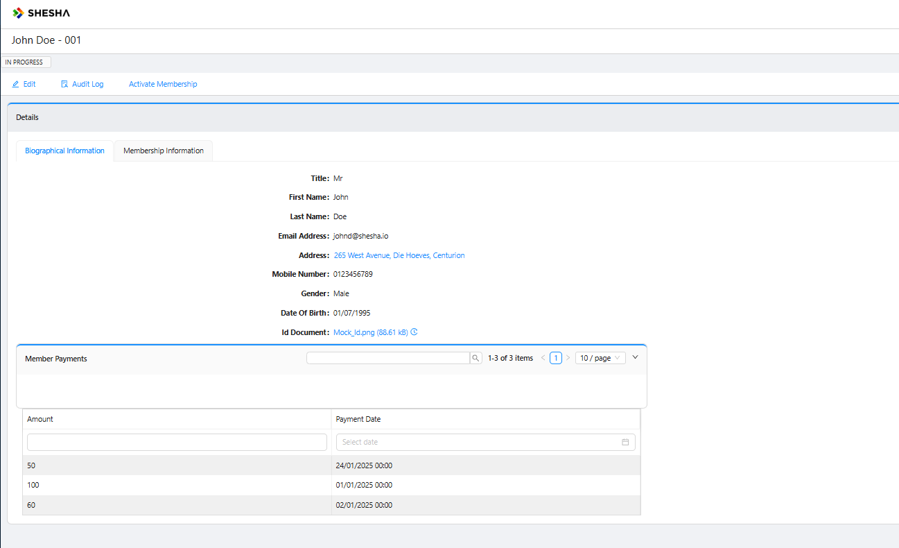

---

## 1. Open the Form and Configure the Table Columns

Navigate to the form in the designer:

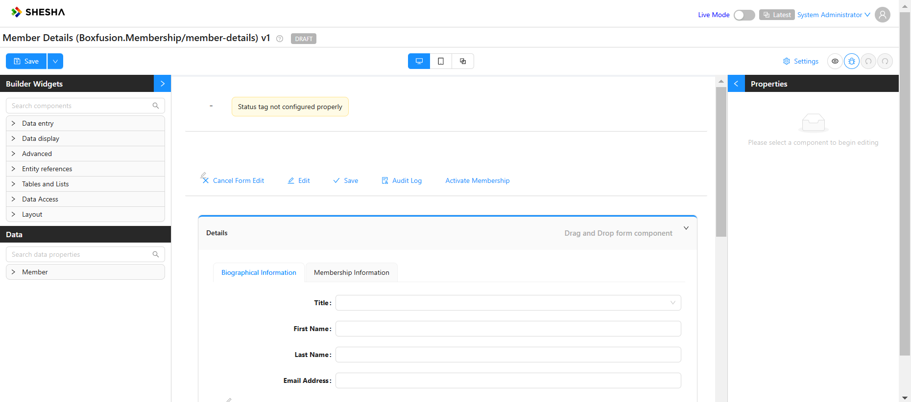

Select the data table component and click **Configure Columns** under its properties.

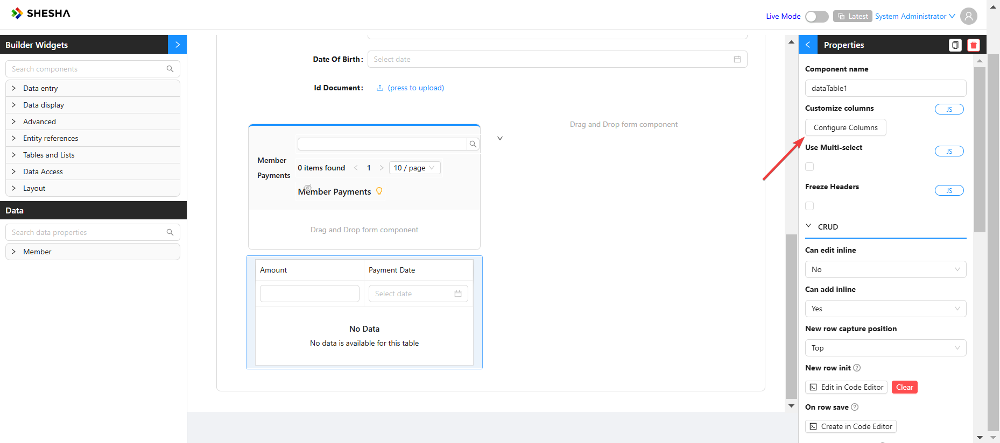

---

## 2. Add an Action Column

Add a new column and move it to the top of the list:

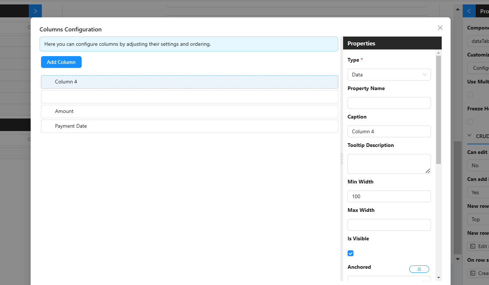

Configure the column:

- Set **Type** to **Action**.
- Clear the column caption (so the column shows just the icon).

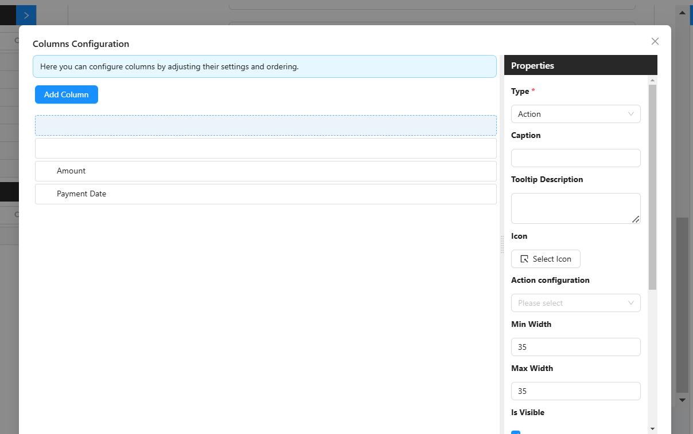

Click **Select Icon** to choose an icon. Search for **Edit** and pick **EditOutlined**.

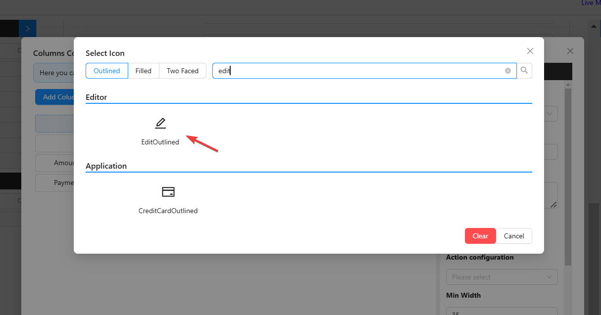

---

## 3. Configure the Show Dialog Action

Set the column's **Action Configuration** to **Show Dialog**, with:

- **Title:** `Edit Payment`
- **Modal form:** the Membership Payment form
- **Submit HTTP Verb:** `PUT`

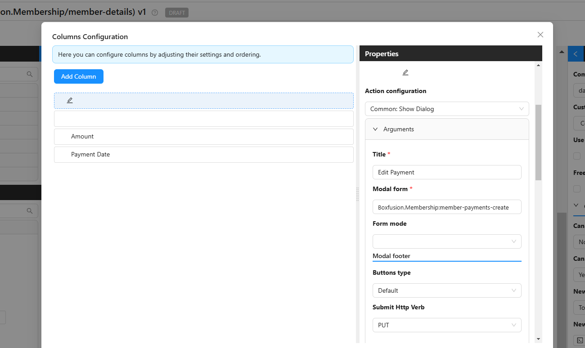

---

## 4. Pass the Selected Row's Id Into the Dialog

The dialog needs to know which record it is editing. Pass the Id through the **Additional Properties** section.

Click **Click to Add Items**:

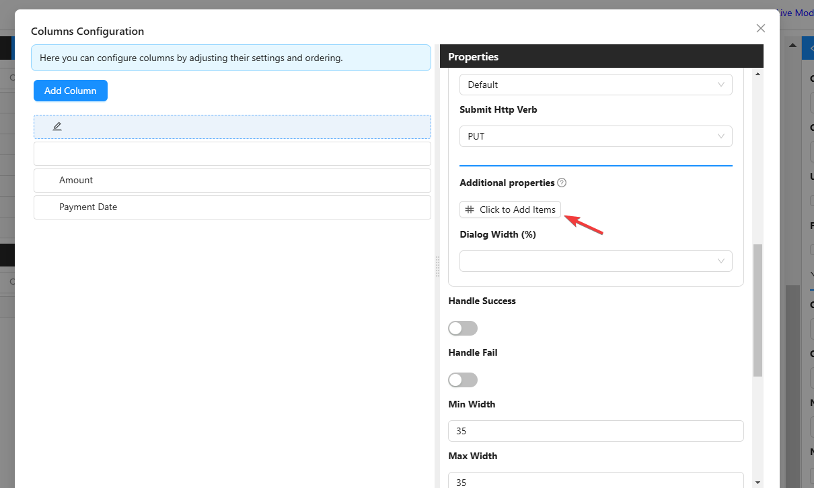

Add a new key/value pair:

- **Key:** `id`
- **Value:** `{{selectedRow.id}}`

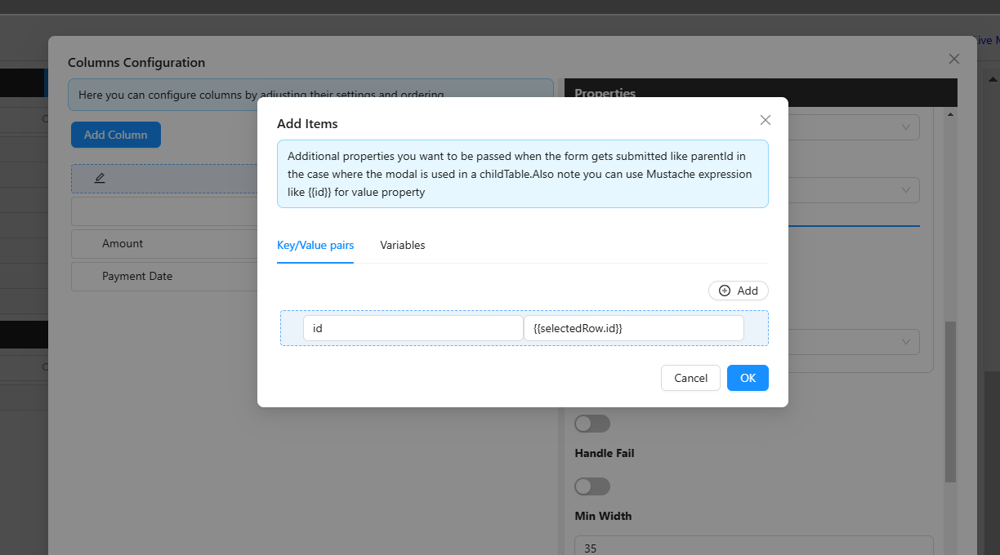

:::info
`selectedRow` is the data of the row whose Edit button was clicked. The `{{ ... }}` syntax substitutes the value into the dialog's arguments when the action fires.
:::

---

## 5. Refresh the Table on Success

Toggle **Handle Success** to true and set its action to **Form: Refresh**. This causes the table to re-fetch its data once the edit is saved, so the user immediately sees the updated row.

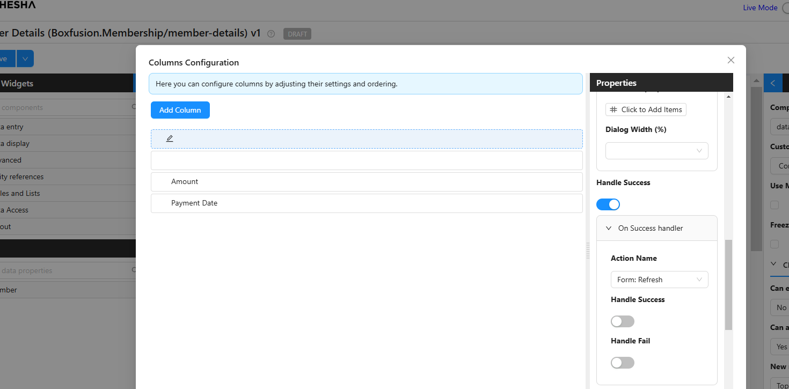

Save the column configuration and save the form.

---

## 6. Try It

Click the new Edit icon on any row. The dialog opens pre-populated with that row's data, and any changes are saved and reflected back in the table.

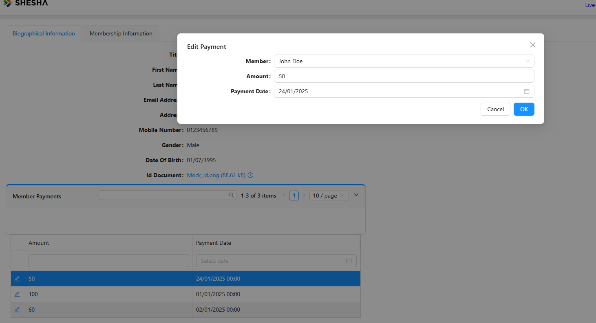
