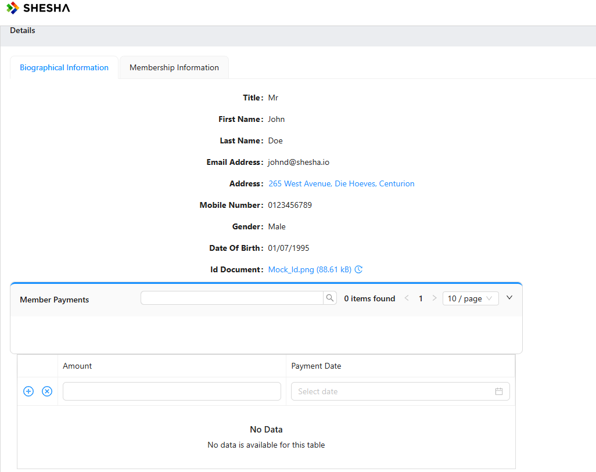
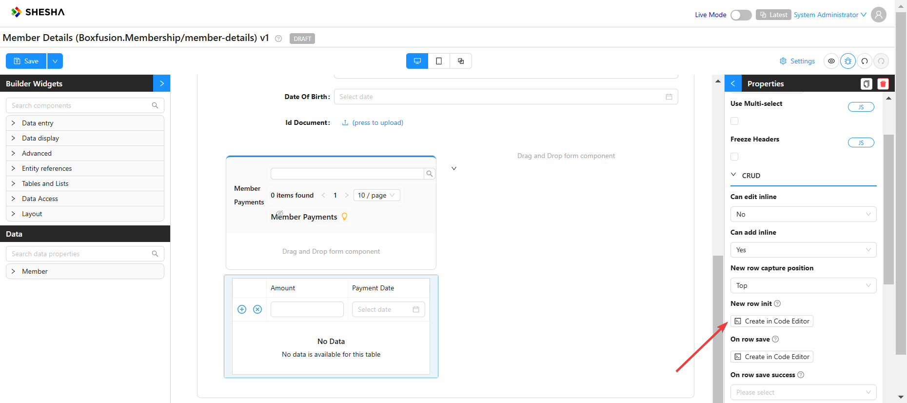
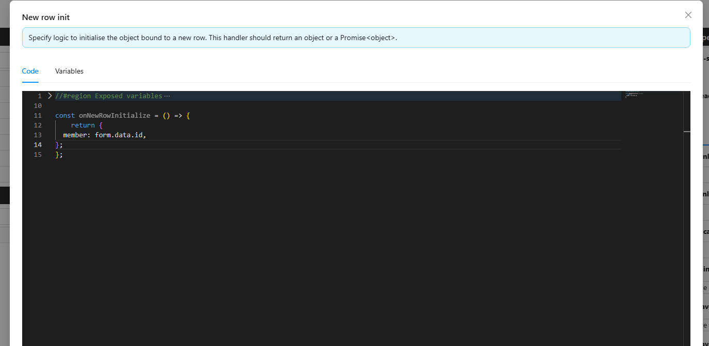
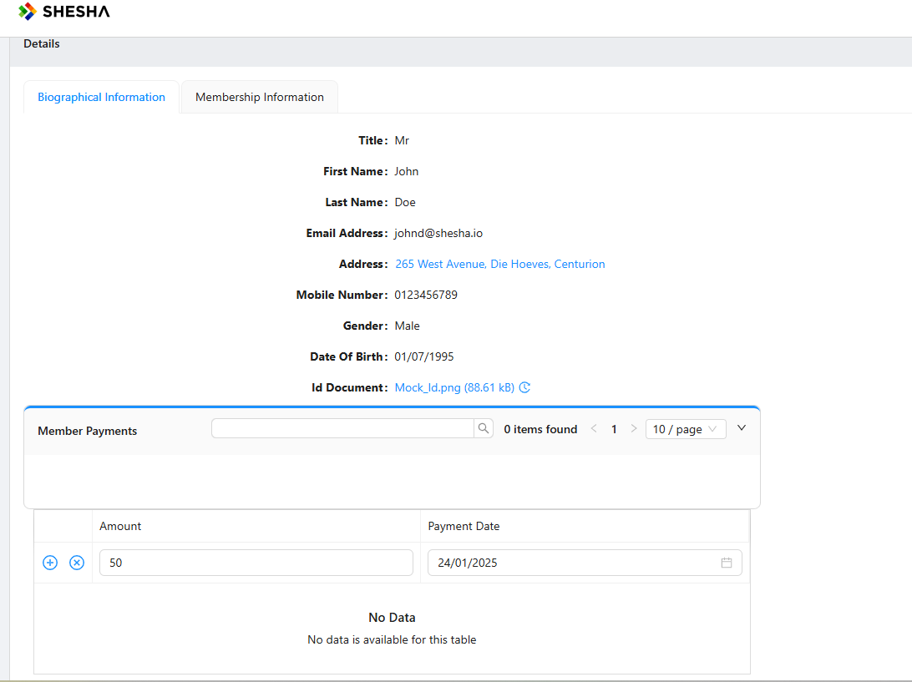
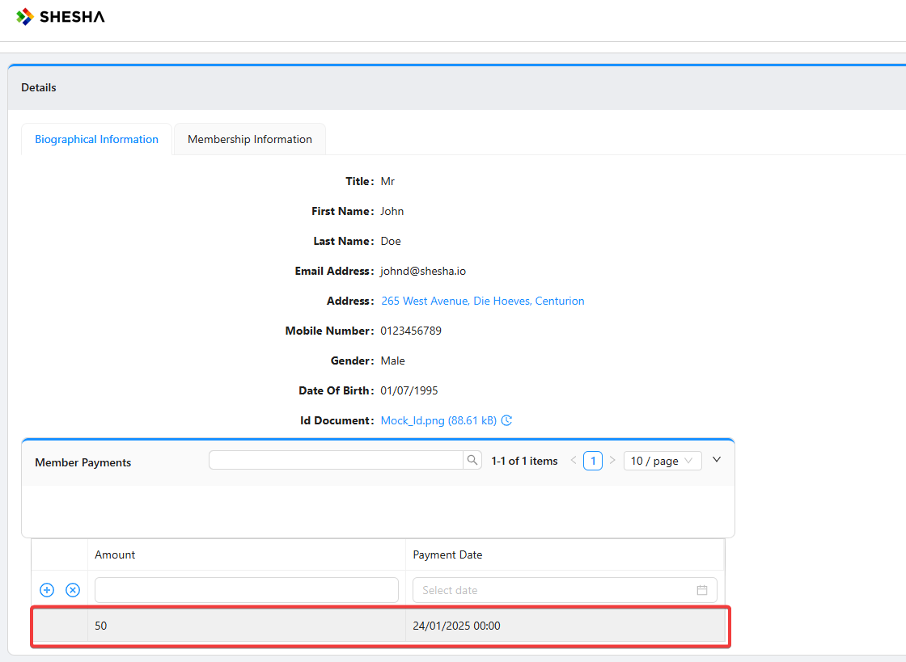

Let's say you're on a details view of a specific member, this details view has a Membership payments child table which ìs filtered to only display the payments made by that specific member.

How do we then link the Member to a membership payment if we're on a child table ?

We can navigate to that our form designer and click on the specific dataTable element, and then the **New row init** property.

It is important to note that, when you're on a child table that exists on a details view, while inline Editing, we can access our Main form inclination using the form data object to initialize each new row on the table with a member **Id** to bind the payment to the member whose details we are currently viewing.

We can then save our form and go create a new member payment.

And then we see that the Membership payment has been successfully created.

