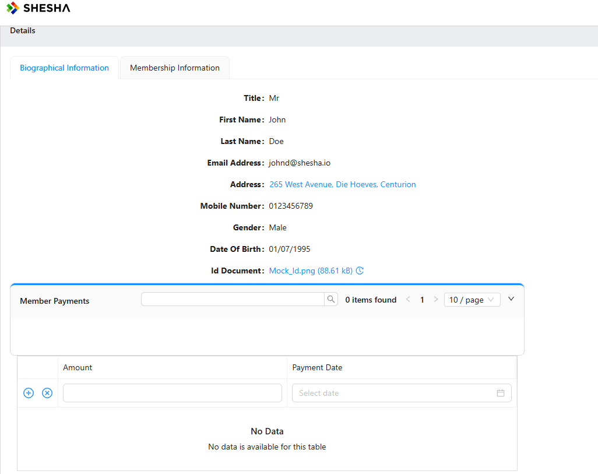
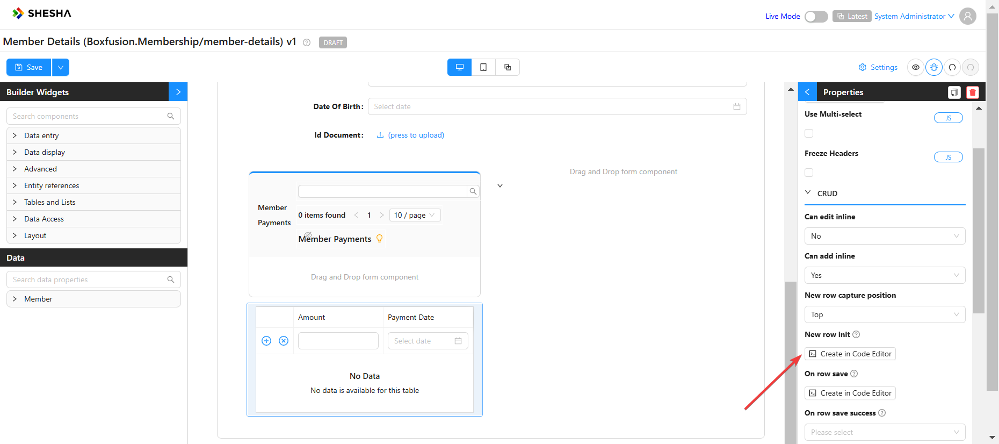
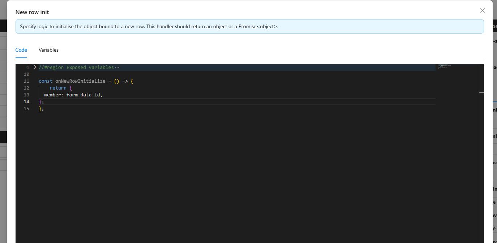
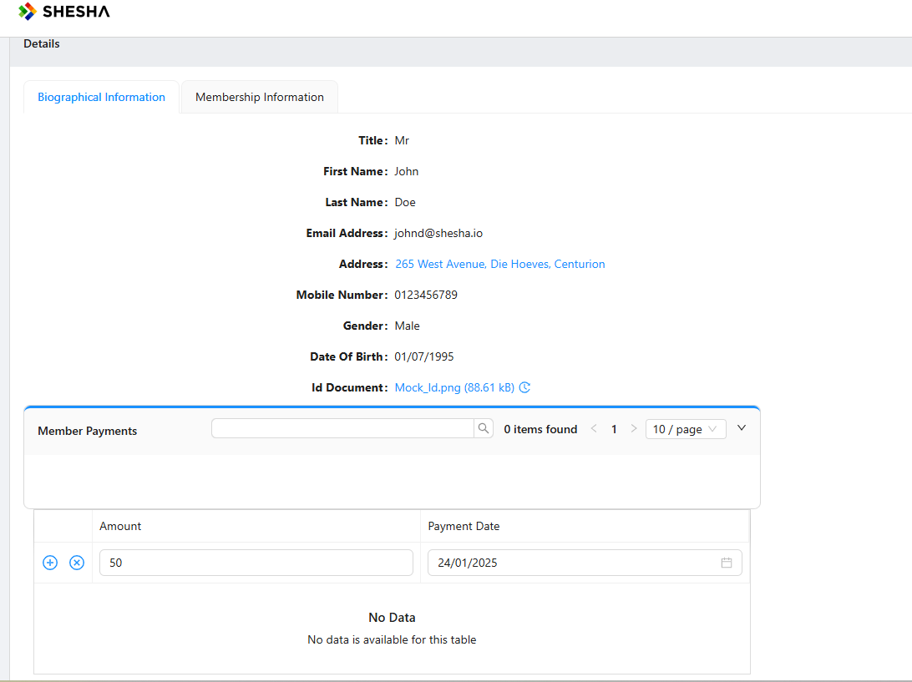
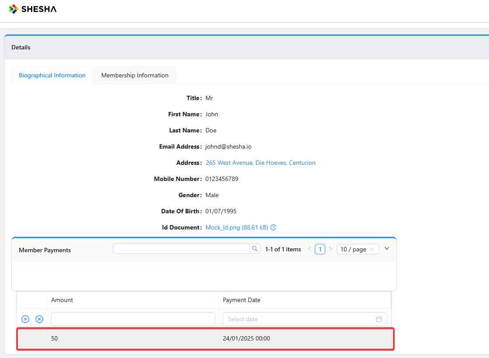

# Inline Editing Initialization

Inline editing lets users add or change rows directly in a table, without opening a separate dialog. When the table is a **child table** on a details view - for example, a Membership Payments table nested inside a Member details view - each new row needs to know which parent record it belongs to. This guide walks through wiring that up using the **New Row Init** property on the data table.

---

## The Scenario

Suppose you are on a Member details view, with a Membership Payments child table that is filtered to only show payments made by the current Member.

The question is: when the user adds a new payment row inline, how does that row get linked back to the Member whose details are open? The answer is the table's **New Row Init** property.

---

## Configure New Row Init

1. Open the form designer and select the data table component.
2. In the component's settings, locate the **New Row Init** property.

Inside New Row Init you have access to the parent form's `data` object - that is, the data of the Member details view the table is embedded in. Use it to seed any foreign-key fields the new row needs.

:::info
**New Row Init** runs once per new row, at the moment the user clicks **Add row**. The data the user types after that is merged on top of whatever you seeded here.
:::

---

## Test the Wiring

Save the form. When you add a new Membership Payment row inline, the parent Member Id is seeded automatically.

After saving, the payment appears in the table linked to the correct Member.

