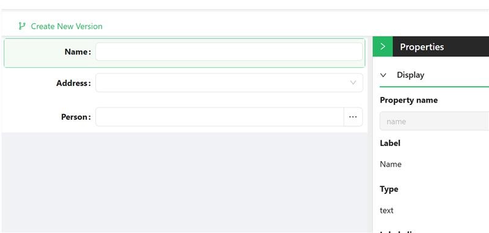
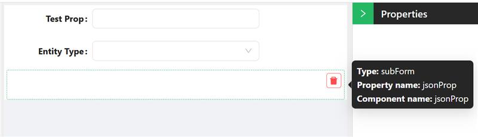
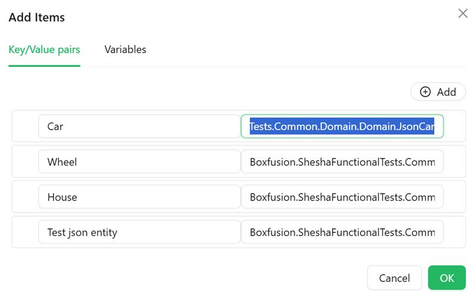
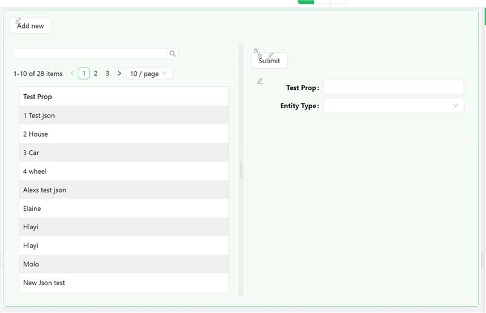
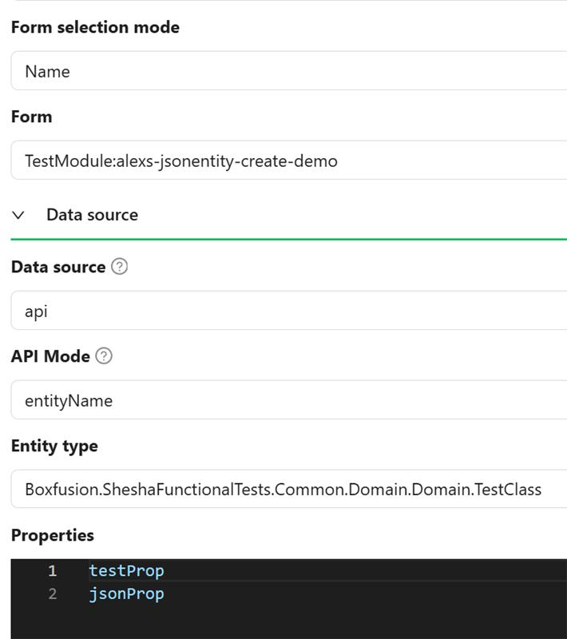
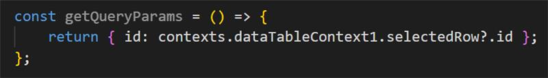
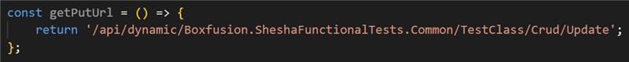
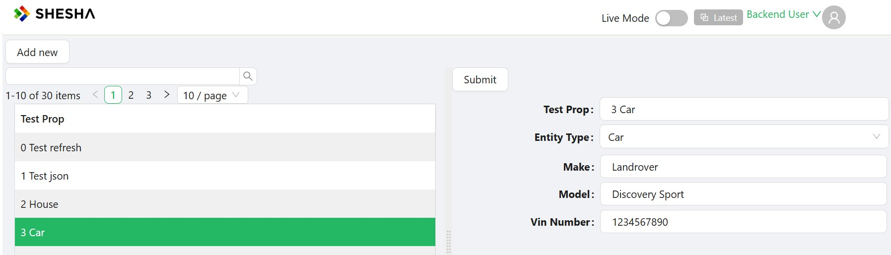

Forms can now automatically bind to JSON properties without additional code, preserving the Low-Code development experience.

### Configuring the Backend

We are using a Entity class that has a `JsonEntity` property. In the example, we use only two properties `TestProp` - as a text name and `JsonProp` - as storage of any `JsonEntity` objects.

```cs
    [Table("SheshFunctionalTests_TestClasses")]
    [Entity(TypeShortAlias = "Boxfusion.SheshFunctionalTests.Domain.TestClass")]
    public class TestClass : Entity<Guid>
    {
        public virtual string TestProp { get; set; }

        public virtual JsonEntity JsonProp { get; set; }
    }
```

We're going to use several classes created from `JsonEntity`

```cs
    public class JsonHouse : JsonEntity
    {
        public Address Address { get; set; }

        public string Name { get; set; }

        public Person Person { get; set; }
    }
```

```cs
    public class JsonCar
    {
        public virtual string Make { get; set; }

        public virtual string  Model { get; set; }

        public virtual string VinNumber { get; set; }

        public virtual IList<JsonWheel> Wheels { get; set; }
    }
```

```cs
    public class JsonWheel : JsonEntity
    {
        public virtual string Type { get; set; }

        public virtual long Size { get; set; }

        [SaveAsJson]
        public virtual IList<JsonSpoke> Spoke { get; set; }
    }
```

```cs
    public class JsonSpoke
    {
        public virtual double Length { get; set; } 
        public virtual string Material { get; set; } 
        public virtual double Thickness { get; set; }
    }
```

```cs
    public class TestJsonEntity : JsonEntity
    {
        public virtual Organisation SomeOrganisaion { get; set; }

        public virtual string SomeName { get; set; }
    }
```

These will be all the Entities we'll need for the backend.

### Configuring the Frontend

We need to create forms for each type of `JsonEntity`. The picture below shows an example of a form for a `JsonHouse` type



Then, we can use the `Entity configurator` to configure the `Views` and each type of `JsonEntity`


Next is to create a form for viewing/editing the main object(in our example - `TestClass`)

There are three(3) components on the form; `TextField` - for `testDrop`, `Dropdown` - to select the type of `JsonEntity`, `SubForm` - to display the details of specific `JsonEntity`



For the Dropdown, we'll configure the `Property name`=`jsonProp._className`, `DataSource type` = `Values` and `Values` as `Type name` + `Type class` 



For the `SubForm` property, we'll set `Property name` = `jsonProp`(bind the `SubForm` to the `JsonEntity` data). Set `Form selection mode` = `Dynamic` and `Form type` = `Create` (these settings mean that the `SubForm` will automatically determine which form to show based on the `_className` field of the data that we bind)

So, when selecting one of the values in the `Dropdown`, the name of the class of the specific `JsonEntity` will be added to the `jsonProp._className` field and `SubForm` will automatically change form.



### Adding work to the List

On the form:
1. `Add` button is configured to show a dialog box for adding a new `TestClass` object, using the previous form (the usual setting for any Entity creation dialog box)
2. `DataTable` for `TestClass` list (the usual setting for any `Entity`)
3. `SubForm` with settings

and the `Query Params` will look like

likewise, the `PUT Url` will have this structure

4. The `Submit` button with `Action configuration` = `subForm: Update form data`

When we select some record from the table, the data in `contexts.DataTableContext1.selectedRow` changes and therefore the `Query params` of the `SubForm` changes. The `SubForm` loads the data  of a specific `TestClass`, which has the  `_className` value of the `JsonEntity` object in `jsonProp`. Based on this value, the `SubForm` automatically changes form and the data is displayed.




