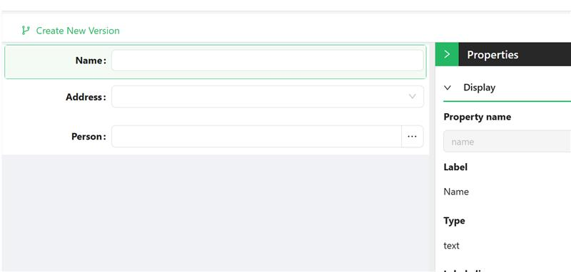
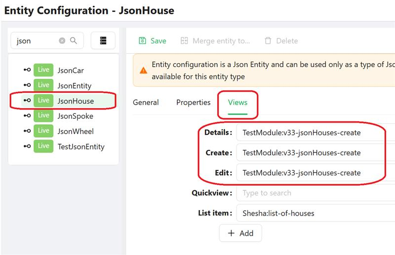
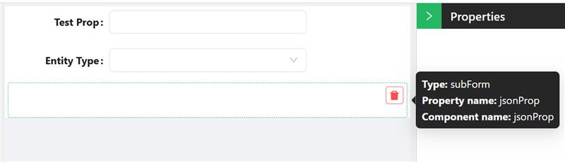
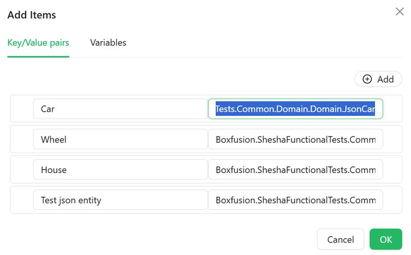
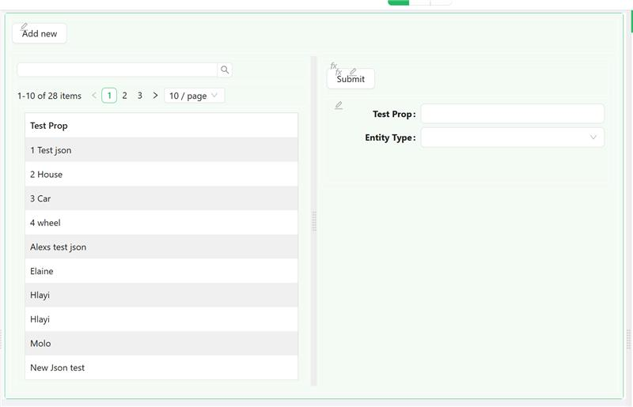
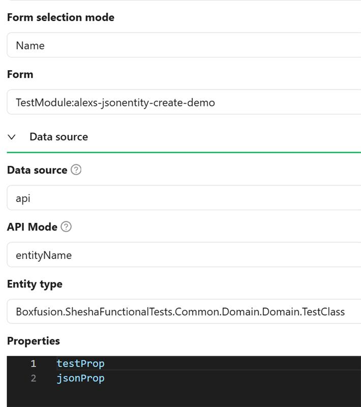
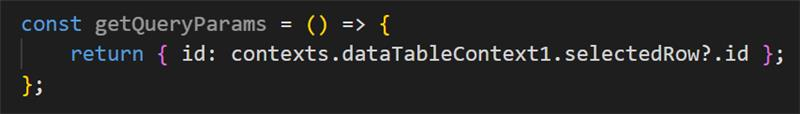
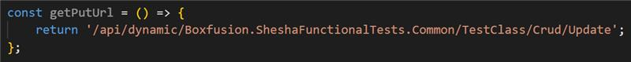
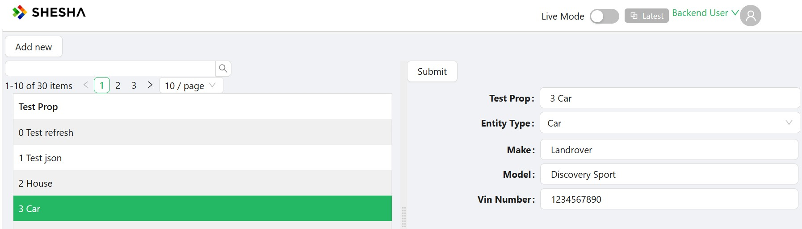

# JSON Entities to Form

A `JsonEntity` is a Shesha concept that lets you store a richly typed object inside a single JSON column on a parent entity, without giving that object its own database table. JSON entities are useful for embedded value objects (an address inside a person, a configuration block inside a workflow step) and for polymorphic content where different shapes can be stored under the same field.

This guide shows how to bind a Shesha form directly to a `JsonEntity` property, and how to switch between different concrete types of `JsonEntity` at runtime using a `SubForm` and a `Dropdown`.

---

## Configure the Back-End

The host entity has a regular property of type `JsonEntity`. The polymorphic content lives in subclasses of `JsonEntity`.

**Example - The host entity with a JsonEntity property:**

```cs
[Table("SheshFunctionalTests_TestClasses")]
[Entity(TypeShortAlias = "Boxfusion.SheshFunctionalTests.Domain.TestClass")]
public class TestClass : Entity<Guid>
{
    public virtual string TestProp { get; set; }

    public virtual JsonEntity JsonProp { get; set; }
}
```

The `JsonProp` column stores whichever concrete `JsonEntity` subclass you assign to it.

**Example - Several JsonEntity subclasses that the host can hold:**

```cs
public class JsonHouse : JsonEntity
{
    public Address Address { get; set; }
    public string Name { get; set; }
    public Person Person { get; set; }
}

public class JsonCar : JsonEntity
{
    public virtual string Make { get; set; }
    public virtual string Model { get; set; }
    public virtual string VinNumber { get; set; }
    public virtual IList<JsonWheel> Wheels { get; set; }
}

public class JsonWheel : JsonEntity
{
    public virtual string Type { get; set; }
    public virtual long Size { get; set; }

    [SaveAsJson]
    public virtual IList<JsonSpoke> Spoke { get; set; }
}

public class JsonSpoke
{
    public virtual double Length { get; set; }
    public virtual string Material { get; set; }
    public virtual double Thickness { get; set; }
}

public class TestJsonEntity : JsonEntity
{
    public virtual Organisation SomeOrganisation { get; set; }
    public virtual string SomeName { get; set; }
}
```

:::note The SaveAsJson attribute
`[SaveAsJson]` on a property tells the ORM to persist that property as JSON inside the parent JSON column rather than as its own column.
:::

That is everything needed on the back-end - no tables, no migrations, no custom DTOs.

---

## Configure the Front-End

You need two kinds of form:

- One **detail form per `JsonEntity` subclass** (one for `JsonHouse`, one for `JsonCar`, one for `JsonWheel`, and so on).
- One **host form** for the parent entity that contains the `JsonEntity` property.

### Detail Forms

Create one form for each concrete `JsonEntity` subclass. Each form is bound to its own type and contains the fields specific to that type.



Once the detail forms exist, register them in the **Entity Configurator** under **Views** so the framework knows which form to use for each `JsonEntity` type.



### Host Form

Now build the host form for the parent entity (`TestClass` in this example). It needs three components:

| Component | Purpose |
|---|---|
| `TextField` | Bound to the parent's plain `TestProp` field |
| `Dropdown` | Lets the user pick which `JsonEntity` type to store in `JsonProp` |
| `SubForm` | Renders the detail form for the selected `JsonEntity` type |



#### Configure the Dropdown

The Dropdown is bound to the special `_className` discriminator on the JSON property, so picking a value tells the framework which subclass is stored.

- **Property name:** `jsonProp._className`
- **DataSource type:** `Values`
- **Values:** for each option, the Label is the friendly type name and the Value is the fully qualified class name.



#### Configure the SubForm

The SubForm is bound to the JSON property itself, with **Dynamic** form selection so the framework picks the right detail form based on `_className`.

- **Property name:** `jsonProp` (binds the SubForm to the JsonEntity data)
- **Form selection mode:** `Dynamic`
- **Form type:** `Create`



When the user picks a value from the Dropdown, the `_className` field on `jsonProp` updates. The SubForm sees this change and swaps to the matching detail form automatically.

---

## Adding a List View

To list and edit existing records, build a separate list/detail form with the following pattern:

1. An **Add** button that opens a dialog using the host form above (the standard pattern for any new-record dialog).
2. A **DataTable** bound to the host entity (the standard pattern for any entity list).
3. A **SubForm** that displays the selected row's `JsonEntity` data.



The SubForm needs to fetch the JSON content for the currently selected row, so configure its **Query Params** to pass the selected row's Id:



The **PUT URL** for saving back follows the same structure:



4. A **Submit** button with **Action configuration** set to `subForm: Update form data`.

When the user picks a row in the table, `contexts.DataTableContext1.selectedRow` updates. This changes the SubForm's Query Params, which loads the JSON data for the selected `TestClass`. The SubForm reads `_className` off the loaded data and swaps to the matching detail form automatically.



:::tip Why this pattern works
The `_className` discriminator is what makes polymorphism over JSON work at runtime. As long as every detail form is bound to its concrete `JsonEntity` subclass and registered in the Entity Configurator, the SubForm can swap between them without any custom code on the host form.
:::
