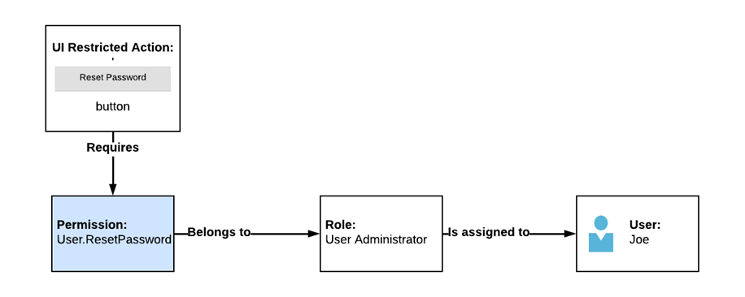
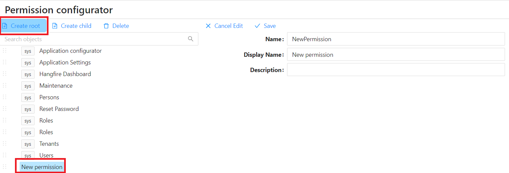
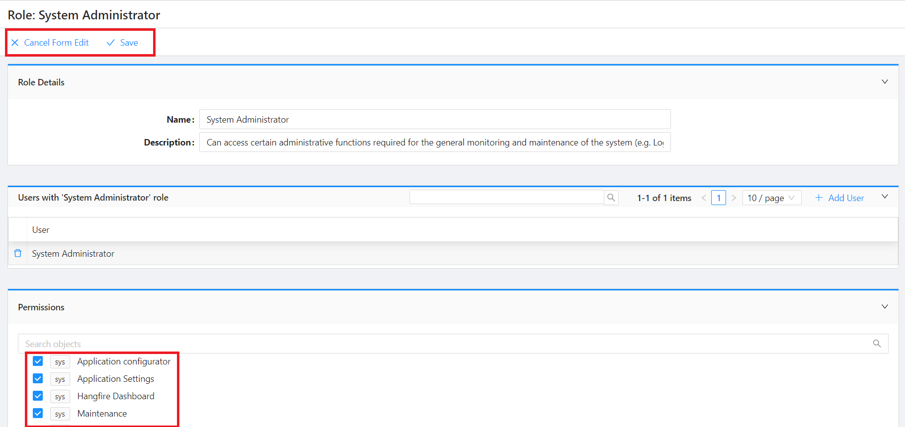
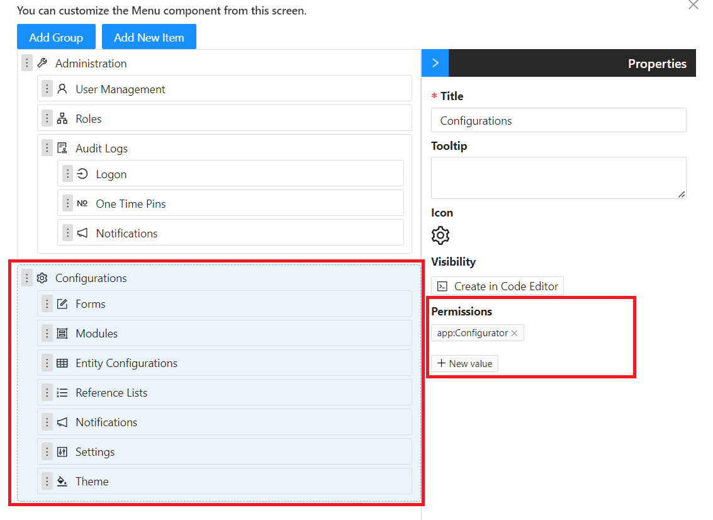
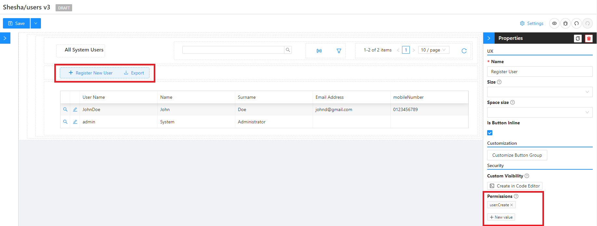
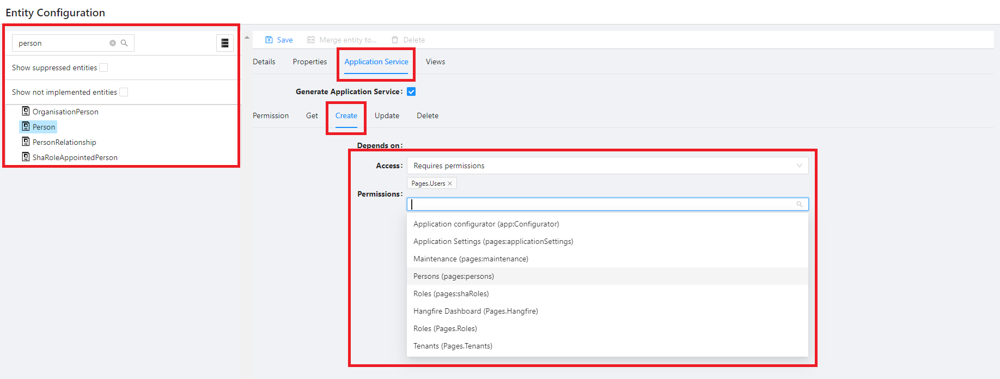

# Authorization and Authentication

## Permission Based Security Model

In more advanced applications, ensuring that specific actions are only performed by authorized users is crucial. This concept is commonly known as `Authorization` or `Access Control`. Shesha employs a `Permissions-based security model` to enforce authorization, where restricted actions can only be executed by users assigned the relevant permission. However, assigning permissions directly to users is not the standard practice; instead, it is done through roles. Roles are associated with one or more permissions, and by assigning a role to a user, the user automatically inherits all linked permissions.

Consider a scenario where access to the `Reset Password` functionality needs restriction. In this case, the 'Reset Password' button on the form configurator is a restricted action. The form configurator allows specifying the required permission(s) for a component to be visible through the 'Required permissions' property. For example, it could be set to the permission `User.ResetPassword`. This permission would then be linked to the role `User Administrator`. To grant user Joe the ability to reset passwords, you would assign the role `User Administrator` to Joe. The scenario is illustrated in the diagram below:

In addition to making the button invisible, proper application security requires restricting access to the Reset Password functionality at the API level. Shesha allows configurators to specify which permissions are necessary to access APIs through the configuration environment.

### Side note: Why not just use Roles on their own without Permissions?

Designing an application solely around role-based security can lead to an ever-expanding number of roles and complex logic to handle all possible scenarios, especially when users can be members of multiple roles. Role-based security is effective with a small and stable number of roles. For more complex scenarios, a permission-based security system provides a flexible solution with fewer maintenance challenges.

# Managing Roles and Permissions

## Managing Permissions

To manage permissions, including defining new ones, follow these steps:

1. Access the Permissions Configurator from the Configuration main menu, then select 'Permissions'.
2. Click on `Create Root`
3. Specify the `Name`, `Display Name`, and `Description` of the permission and `Save`.

### Permission Naming Conventions

2. Permission names must be unique within a module and follow the naming convention: `{Name of thing to secure}-{Action name}`. Examples include:

   - `User-View`
   - `User-Create`
   - `User-Update`
   - `User-Delete`
   - `User-ResetPassword`
   - `User-Suspend`

### Permission Granularity

3. For efficient management, consider permission granularity. Instead of creating separate permissions for every action, you can group related actions. For example:

   - `User-View`
   - `User-Manage` (combining Update, Delete, Reset Password, and Suspend permissions)

   This allows for both read-only and full user management capabilities.

## Managing Roles

To manage roles and associate permissions with each role:

1. Access the Roles Configurator from the Configuration main menu, then select 'Roles'.
2. On the Roles table, navigate into into the details view of the selected role and toggle edit to select the permissions associated to that role.

[More on Role vs. Permission-based Access Control](https://softwareengineering.stackexchange.com/questions/299729/role-vs-permission-based-access-control)

## Securing the Front-end

### Limiting visibility of Main Menu items and Toolbar buttons

To restrict access to views from the main menu based on user permissions:

1. Toggle Edit Mode and Open the Menu configurator
2. Select the menu item to restrict
3. Specify the required Permission(s) to access the view.

### Limiting visibility of Form Components

To restrict access to form components based on user permissions:

1. Open form designer
2. Select the component you want to restrict
3. Specify the required Permission(s) to access the form component.

## Securing APIs

### Limiting Access to APIs

To limit access to an API based on user permissions:

1. From the Configuration main menu, select 'Entity Configurations'
2. Search through the list of enities available in your application and select the applicable one
3. Navigate to the 'Application Service' tab and select the endpoint to secure

   - Ensure 'Requires permissions' is selected for the 'Access' property
   - Select the permission(s) required for users to access the endpoint.

     _Note: Users need any one of the specified permissions to access the API._

### Limiting Access to Data

While permissions define actions, Data Filters in Shesha are used to restrict what data a user can see. For example:

- A Salesperson may only see customers within a specific region.
- Administrators may only see users belonging to a particular organizational unit in decentralized User Administration.
