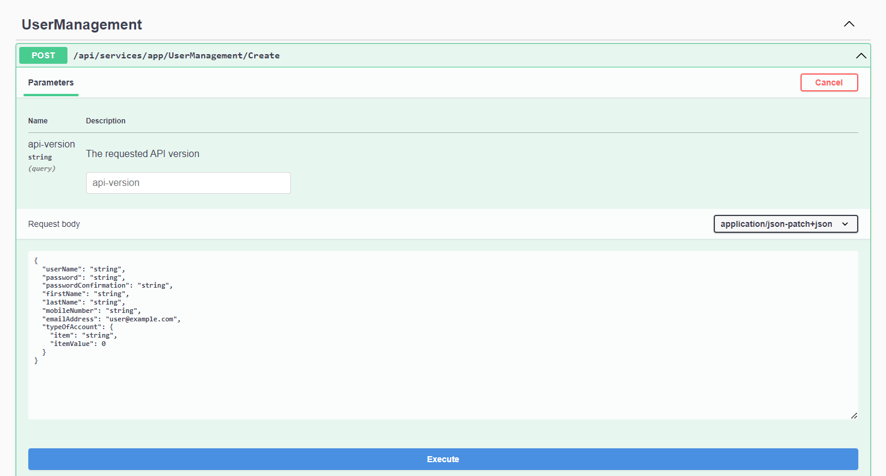
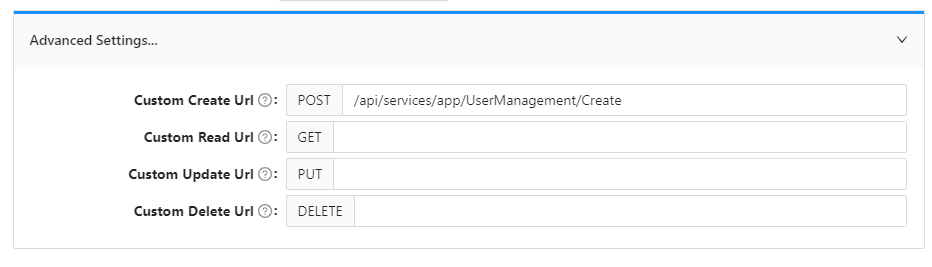
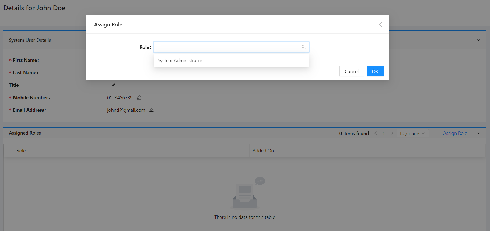
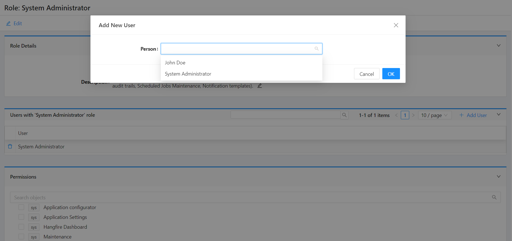

# User Management

## Understanding 'Person' and 'User' Entities

Shesha comes with both `Person` and `User` entities as part of its core domain model, and it is important to understand the difference and relationship between both. Whereas the `Person` entity is used to store and manage information relating to persons (whether the Person is a system user or not), the `User` entity is specifically used to manage system users.

In order for a person to be a system user, both a `Person` entity and a matching `User` record need to exist.

Since the information a system needs to store about a person will often differ depending on the requirements, it is expected that in most implementations, the `Person` entity will be extended by creating sub-classes with additional properties.

In contrast, since the `User` entity is used purely for managing the system accounts, it is not expected to be extended, as the framework should already provide all the necessary account management features required (e.g., creation, password management, lock-out, activation, etc...) via the `UserManager` class.

### Example

Imagine you are building a system used to manage client information but where only company employees should have access to the system.

Since both Clients and Employees are more specific types of persons, you would create `Client` and `Employee` sub-classes that inherit from the `Person` class and add the relevant properties to each. You would, however, only create matching User records for the Employee entities.

Should you in the future want to create a client portal so that your clients can also access some limited functions of your system, you could then create User records for them as they register onto the portal. You would limit their access to certain functions only by assigning them different roles than you would for your internal employees.

## Shesha User Management Endpoint

Shesha comes preloaded with a `User Management` endpoint, which manages the users of the system using both the `Person` and `User` entities.



In the cases where you want to extend the `Person` entity to make it more tailored to your application needs, _here is a sample `User Management` endpoint that can be adapted:_

### Health Information System Example

In the example below, we have a Health Information System, where the majority of system users are Healthcare Practitioners for whom it is important to also track additional information such as Speciality, Medical Qualifications, etc... To support this, a `Practitioner` class that inherits and extends the `Person` class with the appropriate properties would be created.

```csharp
public class HealthPractitioner : Person
{
    public virtual RefListSpeciality Speciality { get; set; }

    public virtual List<Qualification> Qualifications { get; set; }
}

```

### Custom User Creation

As a new Healthcare Practitioner gets created in the system, it could be important to perform additional validation logic and create the matching User record so that they immediately have access to the system. One could implement this through a custom application service as illustrated below.

```csharp
/// <summary>
/// Extending the default Crud AppService with a couple of User management related end-points.
/// </summary>
[AbpAuthorize]
[ApiVersion("1")]
[Route("api/v{version:apiVersion}/Common/[controller]")]
public class HealthPractitionerAppService : DynamicCrudAppService<HisPractitioner, DynamicDto<HealthPractitioner, Guid>, Guid>, ITransientDependency
{
    IRepository<HealthPractitioner, Guid> _repository;

    public HealthPractitionerAppService(IRepository<HealthPractitioner, Guid> repository) : base(repository)
    {
        _repository = repository;
    }

    [HttpPost, Route("CreateWithUserAccount")]
    [AbpAuthorize(CommonPermissions.UserManagement.Create)]
    public async Task<DynamicDto<HisPractitioner, Guid>> CreateWithUserAccountAsync(CreatePersonAccountDto input)
    {
        // Performing additional validations
        var validationResults = new List<ValidationResult>();

        if (input.TypeOfAccount == null)
            validationResults.Add(new ValidationResult("Type of account is mandatory"));

        if (string.IsNullOrWhiteSpace(input.FirstName))
            validationResults.Add(new ValidationResult("First Name is mandatory"));
        if (string.IsNullOrWhiteSpace(input.LastName))
            validationResults.Add(new ValidationResult("Last Name is mandatory"));

        // email and mobile number must be unique
        if (await MobileNoAlreadyInUse(input.MobileNumber, null))
            validationResults.Add(new ValidationResult("Specified mobile number already used by another person"));
        if (await EmailAlreadyInUse(input.EmailAddress, null))
            validationResults.Add(new ValidationResult("Specified email already used by another person"));

        if (validationResults.Any())
            throw new AbpValidationException("Please correct the errors and try again", validationResults);

        // Creating User Account to enable login into the application
        var userManager = IocManager.Resolve<UserManager>();
        User user = await userManager.CreateUser(
                input.UserName,
                input.TypeOfAccount?.ItemValue == (long)RefListTypeOfAccount.SQL,
                input.Password,
                input.PasswordConfirmation,
                input.FirstName,
                input.LastName,
                input.MobileNumber,
                input.EmailAddress);

        // Creating Person entity
        var practitioner = new HealthPractitioner()
        {
            FirstName = input.FirstName,
            LastName = input.LastName,
            MobileNumber1 = input.MobileNumber,
            EmailAddress1 = input.EmailAddress,
            User = user,
        };

        await _repository.InsertAsync(practitioner);

        CurrentUnitOfWork.SaveChanges();

        return await this.MapToDynamicDtoAsync<HealthPractitioner, Guid>(practitioner);
    }

    // ... (Continuation of the class, including helper methods)
}

```

## Frontend Implementation

To manage users in the frontend:

1. Access the `User Management` from the Administration main menu, click on `Register New User`.
2. In the cases where a `Custom Enpoint` has been created instead of using the default `/api/services/app/UserManagement/Create` that comes with Shesha:
   - Navigate to the `Form Designer` of the `user-create` form
   - Drag and Drop the addition properties needed as part of the payload
   - Select `Settings`
   - Replace the `Custom Create Url` with the Url of your new endpoint



### Assigning Roles

This can be achieved in 2 different ways:

1. Access the `User Management` from the Administration main menu:

   - Navigate into the details view of the user you would like to assign a role.
   - Click on `Assign Role` child table button.
   - Search and select the appropriate role from the dropdown.



2. Access the `Roles` from the Administration main menu:
   - Navigate into the details view of the role you would like to assign users to
   - Click on `Add User` child table button.
   - Search and select the appropriate user from the dropdown.


