# Application Settings

Application settings let you store configurable values — like feature flags, default numbers, API credentials, or complex option groups — that administrators can change at runtime without redeploying code. Think of them as a key-value store that is strongly typed, editable through the Shesha UI, and accessible from both back-end and front-end code.

**When to use settings:**
- You need a value that might change between environments or over time (e.g. a default debit day, an SLA duration, a toggle to enable/disable a feature).
- You want administrators to adjust behaviour from the Settings UI without involving a developer.
- You need user-specific preferences (e.g. notification frequency).

## Key Concepts

Before diving in, here are the building blocks you'll work with:

| Concept | What it is |
|---|---|
| **Setting accessor interface** | A C# interface (extending `ISettingAccessors`) that declares your settings as strongly typed properties. |
| **`ISettingAccessor<T>`** | The property type for each setting. `T` is the data type — `int`, `bool`, `string`, or a custom class for compound settings. |
| **Setting name** | A unique string identifier for each setting (e.g. `"Shesha.Membership.DebitDay"`). |
| **Module registration** | A one-line call in your module's `Initialize` (or `PreInitialize`) method that tells Shesha about your settings and their default values. |

## Creating a Simple Setting

A "simple" setting stores a single value — a number, a string, a boolean, etc. We'll walk through creating a **Debit Day** setting that controls which day of the month a membership payment is processed.

### Step 1 — Define setting names

In your **Domain** layer, create a folder structure like `Configuration/Membership` and add a class to hold your setting name constants:

```cs
namespace YourApp.Domain.Configuration.Membership
{
    public class MembershipSettingNames
    {
        public const string DebitDay = "Shesha.Membership.DebitDay";
    }
}
```

Using constants avoids typos and makes it easy to reference the same name everywhere.

### Step 2 — Define the setting accessor interface

In the same folder, create an interface that extends `ISettingAccessors`. Each property represents one setting:

```cs
using Shesha.Settings;
using System.ComponentModel;
using System.ComponentModel.DataAnnotations;

namespace YourApp.Domain.Configuration.Membership
{
    [Category("Membership")]
    public interface IMembershipSettings : ISettingAccessors
    {
        [Display(Name = "Debit day", Description = "Day of the month when membership payments are debited.")]
        [Setting(MembershipSettingNames.DebitDay)]
        ISettingAccessor<int> DebitDay { get; set; }
    }
}
```

**What the attributes do:**

| Attribute | Purpose |
|---|---|
| `[Category("Membership")]` | Groups this setting under "Membership" in the Settings UI. Can be applied at the interface or property level. |
| `[Display(Name, Description)]` | Sets the label and tooltip shown in the Settings UI. |
| `[Setting(...)]` | Links the property to its unique setting name. Also supports optional flags — see [Setting attribute options](#setting-attribute-options) below. |

### Step 3 — Register the accessor in your module

Open your module class (the class that extends `SheshaModule`) and register the setting accessor. This is also where you provide a default value:

```cs
public override void Initialize()
{
    var thisAssembly = Assembly.GetExecutingAssembly();
    IocManager.RegisterAssemblyByConvention(thisAssembly);

    // Register settings with default values
    IocManager.RegisterSettingAccessor<IMembershipSettings>(x =>
    {
        x.DebitDay.WithDefaultValue(1);
    });
}
```

The default value (`1`) is used when no value has been saved yet — in this case, payments default to the 1st of each month.

### Step 4 — Verify in the UI

Run your back-end, then navigate to **Configurations > Settings** in the Shesha UI. You should see the new **Debit day** setting under the **Membership** category:

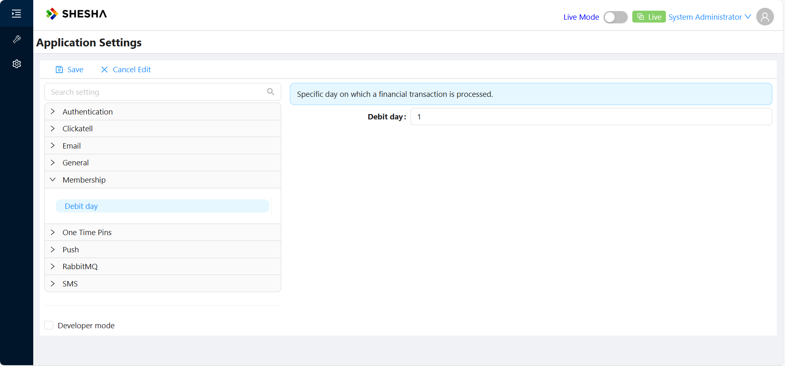

That's it — you have a working application setting.

---

## Reading and Writing Settings in Back-End Code

To use a setting in your services or jobs, inject the accessor interface via constructor injection. Shesha auto-generates the implementation when you call `RegisterSettingAccessor`.

```cs
public class PaymentReminderJob
{
    private readonly IMembershipSettings _membershipSettings;

    public PaymentReminderJob(IMembershipSettings membershipSettings)
    {
        _membershipSettings = membershipSettings;
    }

    public async Task ProcessReminders()
    {
        // Read the current value
        var debitDay = await _membershipSettings.DebitDay.GetValueAsync();

        // Update the value
        await _membershipSettings.DebitDay.SetValueAsync(15);
    }
}
```

| Method | Description |
|---|---|
| `GetValueAsync()` | Returns the stored value, or the default if none has been saved. |
| `SetValueAsync(value)` | Saves a new value to the database. |
| `GetValue()` | Synchronous version of `GetValueAsync()`. |
| `GetValueOrNullAsync()` | Returns `null` instead of the default when no value has been saved. |

In most cases you'll use `GetValueAsync` and `SetValueAsync`. The synchronous and nullable variants exist for edge cases where async isn't available or you need to distinguish "not set" from "default".

---

## Reading and Writing Settings on the Front-End

All registered settings are available in form script editors via the `application.settings` object. Settings are organized by module and group:

```
application.settings.[module].[group].[setting]
```

For example, to read and write the stars count setting from a module aliased as `functionalTests` with a group aliased as `common`:

```javascript
const settings = application.settings.functionalTests.common;

// Read
const starsCount = await settings.starsCount.getValueAsync();

// Write
await settings.starsCount.setValueAsync(starsCount + 1);
```

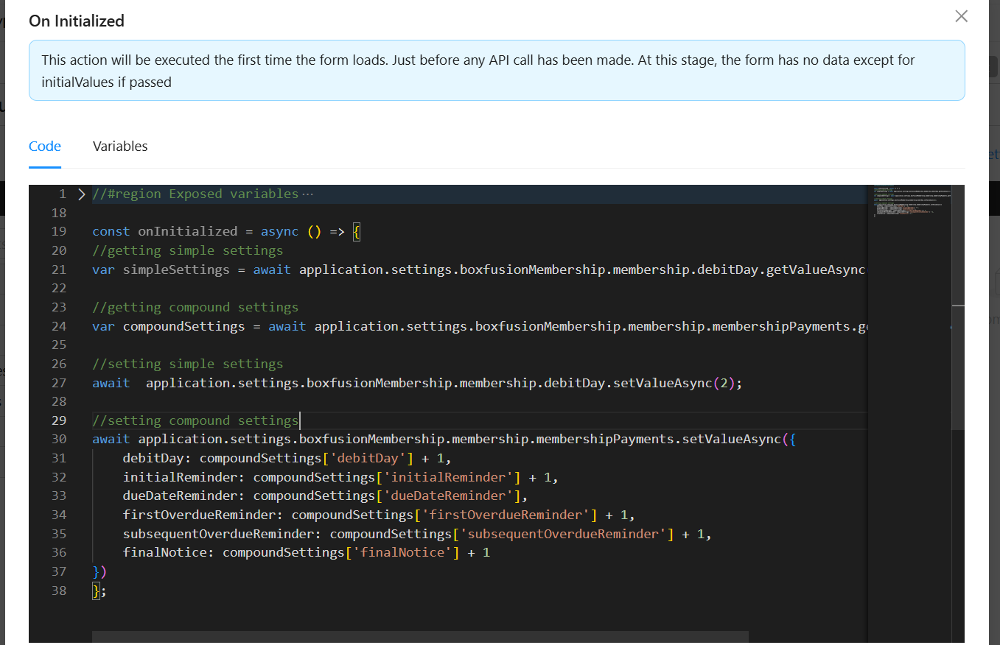

Simple-type settings (`number`, `string`, `boolean`) are strongly typed in the editor, so you get autocomplete and type checking.

:::tip How module and group names are resolved
- **Module**: uses the module's `Alias` (if set), otherwise the module name in camelCase.
- **Group**: uses the `[Alias]` attribute on the interface (if set), otherwise the interface name without the `I` prefix and `Settings` suffix, in camelCase.
- **Setting**: uses the `[Alias]` attribute on the property (if set), otherwise the property name in camelCase.
:::

---

## Compound Settings

Sometimes a single setting isn't enough — you need a group of related values managed together. For example, a payment configuration with a debit day, reminder intervals, and toggle flags. Shesha handles this with **compound settings**, where `T` in `ISettingAccessor<T>` is a custom class instead of a primitive type.

### Step 1 — Create the settings class

```cs
namespace YourApp.Domain.Configuration.Membership
{
    public class MembershipPaymentSettings
    {
        /// <summary>
        /// Day of the month when payments are debited.
        /// </summary>
        public int DebitDay { get; set; }

        /// <summary>
        /// Days before the due date to send the initial reminder.
        /// </summary>
        public int InitialReminder { get; set; }

        /// <summary>
        /// Whether to send a reminder on the due date itself.
        /// </summary>
        public bool DueDateReminder { get; set; }

        /// <summary>
        /// Days after the due date to send the first overdue reminder.
        /// </summary>
        public int FirstOverdueReminder { get; set; }

        /// <summary>
        /// Interval in days between subsequent overdue reminders.
        /// </summary>
        public int SubsequentOverdueReminder { get; set; }

        /// <summary>
        /// Days after which a final notice is sent.
        /// </summary>
        public int FinalNotice { get; set; }
    }
}
```

### Step 2 — Add the setting name and accessor property

Add a new constant:

```cs
public class MembershipSettingNames
{
    public const string DebitDay = "Shesha.Membership.DebitDay";
    public const string MembershipPayments = "Shesha.Membership.Payments";
}
```

Add a new property to the accessor interface. Note the `EditorFormName` — this tells Shesha which configurable form to use as the editor for this compound setting:

```cs
[Category("Membership")]
public interface IMembershipSettings : ISettingAccessors
{
    [Display(Name = "Debit day", Description = "Day of the month when membership payments are debited.")]
    [Setting(MembershipSettingNames.DebitDay)]
    ISettingAccessor<int> DebitDay { get; set; }

    [Display(Name = "Membership Payments", Description = "Payment debit days and reminder frequencies.")]
    [Setting(MembershipSettingNames.MembershipPayments, EditorFormName = "membership-payment-settings")]
    ISettingAccessor<MembershipPaymentSettings> MembershipPayments { get; set; }
}
```

### Step 3 — Register with default values

```cs
IocManager.RegisterSettingAccessor<IMembershipSettings>(x =>
{
    x.DebitDay.WithDefaultValue(1);
    x.MembershipPayments.WithDefaultValue(new MembershipPaymentSettings
    {
        DebitDay = 1,
        InitialReminder = 3,
        DueDateReminder = true,
        FirstOverdueReminder = 1,
        SubsequentOverdueReminder = 7,
        FinalNotice = 30
    });
});
```

### Step 4 — Create the editor form

For compound settings, you need a configurable form in Shesha whose **form name** matches the `EditorFormName` you specified (`membership-payment-settings` in this example).

1. Create a new form and set its name to `membership-payment-settings`:

   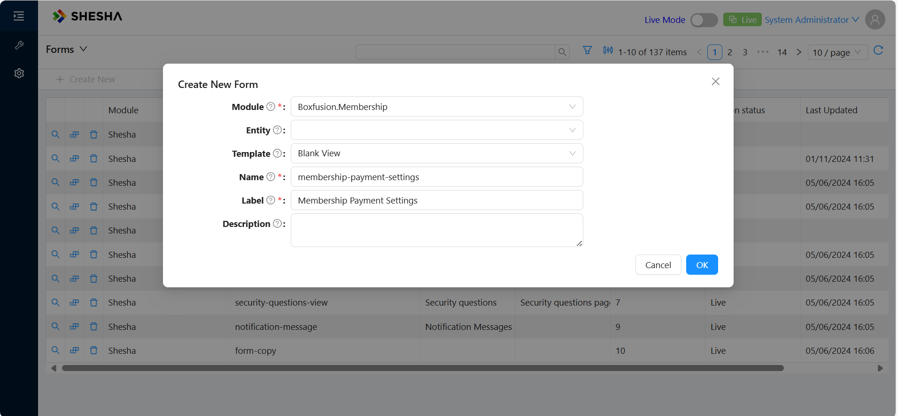

2. Add form fields for each property in `MembershipPaymentSettings`. Use camelCase for the property names (e.g. `debitDay`, `initialReminder`) and add descriptions so administrators understand what each field does:

   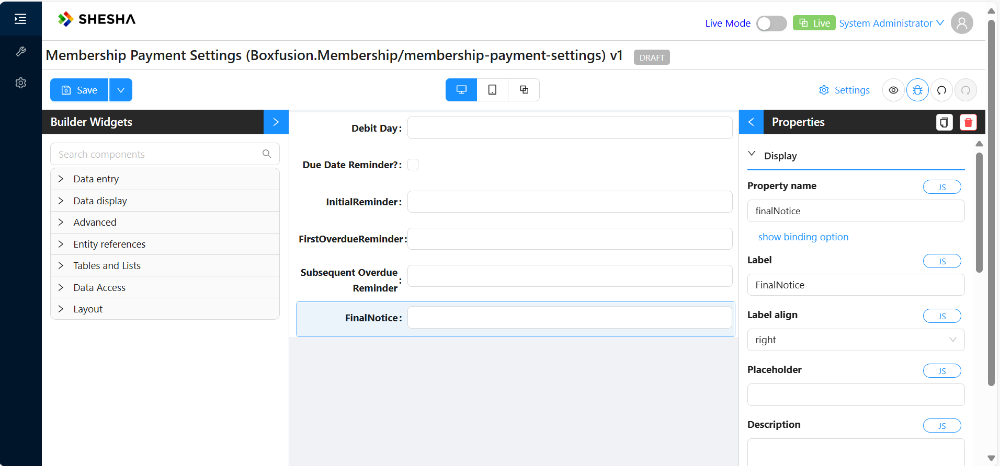

3. Navigate to **Configurations > Settings** to see your compound setting:

   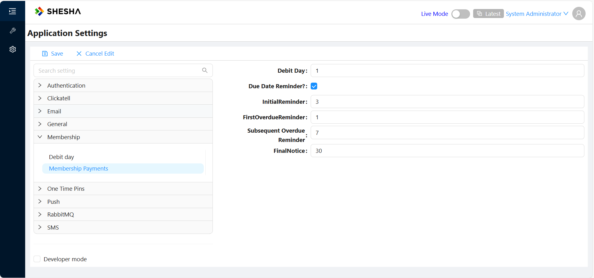

### Reading and writing compound settings in code

```cs
// Read — returns the full object
var paymentSettings = await _membershipSettings.MembershipPayments.GetValueAsync();
var finalNotice = paymentSettings.FinalNotice;

// Write — pass a new instance with updated values
await _membershipSettings.MembershipPayments.SetValueAsync(new MembershipPaymentSettings
{
    DebitDay = paymentSettings.DebitDay,
    InitialReminder = paymentSettings.InitialReminder + 1,
    DueDateReminder = paymentSettings.DueDateReminder,
    FirstOverdueReminder = paymentSettings.FirstOverdueReminder,
    SubsequentOverdueReminder = paymentSettings.SubsequentOverdueReminder,
    FinalNotice = paymentSettings.FinalNotice
});
```

---

## User-Specific Settings

By default, settings are global — they apply to the entire application. Shesha also supports **user-specific settings** that store a separate value per user. This is useful for personal preferences like notification frequency or UI preferences.

### Defining user-specific settings

The process is the same as global settings, with one addition: set `IsUserSpecific = true` on the `[Setting]` attribute.

```cs
public class UserSettingNames
{
    public const string NotificationFrequency = "Shesha.User.NotificationFrequency";
    public const string EnablePushNotifications = "Shesha.User.EnablePushNotifications";
}

[Category("Notification Preferences")]
public interface IUserNotificationPreferenceSettings : ISettingAccessors
{
    [Display(Name = "Notification Frequency",
             Description = "How often the user receives email updates (e.g. daily, weekly, instant).")]
    [Setting(UserSettingNames.NotificationFrequency, IsUserSpecific = true)]
    ISettingAccessor<string> NotificationFrequency { get; set; }

    [Display(Name = "Enable Push Notifications",
             Description = "Whether push notifications are enabled for this user.")]
    [Setting(UserSettingNames.EnablePushNotifications, IsUserSpecific = true)]
    ISettingAccessor<bool> EnablePushNotifications { get; set; }
}
```

Register with defaults as usual:

```cs
IocManager.RegisterSettingAccessor<IUserNotificationPreferenceSettings>(x =>
{
    x.NotificationFrequency.WithDefaultValue("Weekly");
    x.EnablePushNotifications.WithDefaultValue(true);
});
```

Reading and writing user-specific settings in back-end code works exactly the same way (`GetValueAsync` / `SetValueAsync`) — Shesha automatically scopes the value to the current user.

### Front-end API for user settings

User settings are accessible via the `application.user` object in form script editors:

```javascript
// Read a user setting
const frequency = await application.user.getUserSettingValueAsync(
    "NotificationFrequency",  // setting name
    "Shesha.User",            // module name
    "Weekly"                  // default value (optional)
);

// Update a user setting
await application.user.updateUserSettingValueAsync(
    "NotificationFrequency",
    "Shesha.User",
    "Daily"
);
```

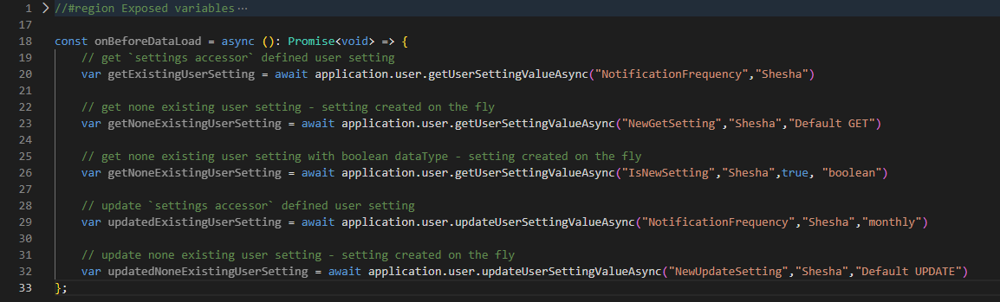

### REST API endpoints

If you need to call the API directly (e.g. from a custom front-end):

| Action | Method | URL | Key Parameters |
|---|---|---|---|
| Get value | `GET` | `/api/services/app/Settings/GetUserValue` | `moduleName`, `settingName`, `defaultValue` (optional), `dataType` (optional) |
| Update value | `POST` | `/api/services/app/Settings/UpdateUserValue` | `moduleName`, `settingName`, `defaultValue`, `dataType` (optional) |

Both endpoints automatically create the setting for the user if it doesn't exist yet, using the provided default or the registered default.

---

## Deploying Settings Across Environments (Configuration Migrations)

When you configure a compound setting's editor form in one environment (e.g. dev), you'll want to deploy it to other environments (test, QA, production) without manual re-creation.

1. Navigate to **Forms**, click **Export**, and select the version to export (use "Latest" if you haven't published yet):

   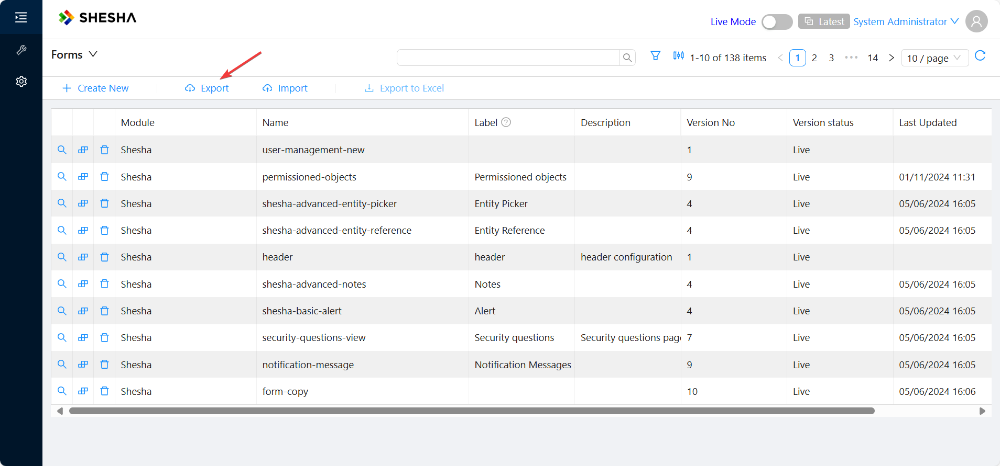
   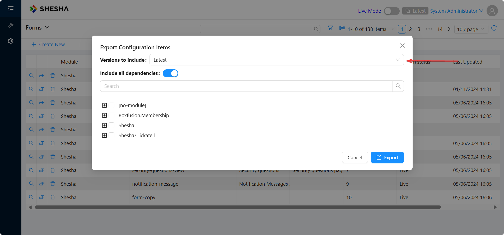

2. Select your module and form (e.g. `membership-payment-settings`), then click **Export**:

   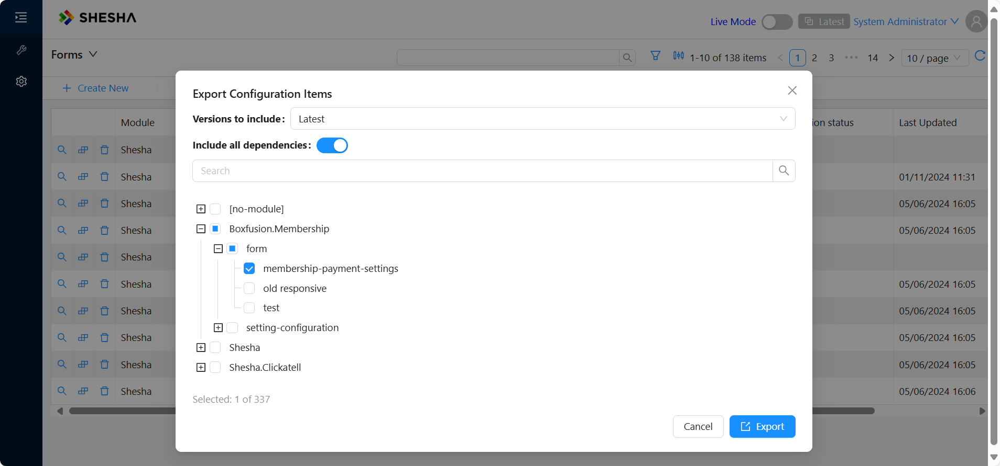

3. This downloads a `.shaconfig` file containing the form configuration as JSON:

   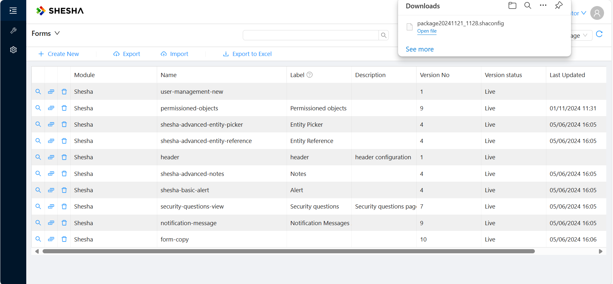

4. In your back-end **Application** layer, create a `ConfigMigrations` folder and add the `.shaconfig` file:

   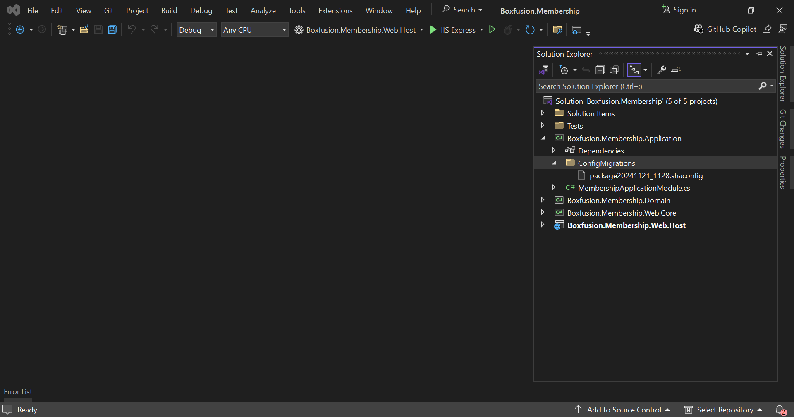

5. Set the file's **Build Action** to **Embedded Resource** in the file properties pane. This embeds it in the compiled DLL so it's automatically applied on startup:

   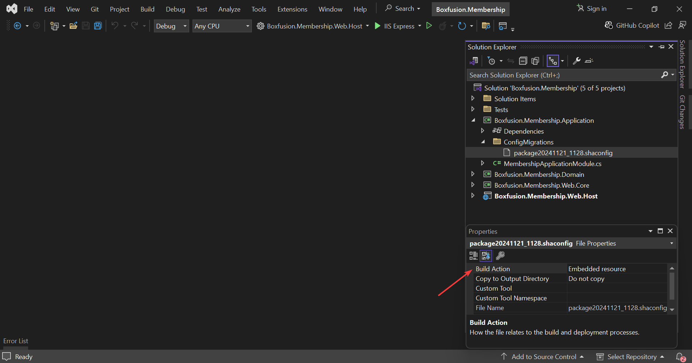

---

## Reference

### Setting attribute options

The `[Setting]` attribute supports the following properties:

| Property | Type | Description |
|---|---|---|
| `Name` | `string` | Unique name of the setting. Falls back to the property name if not specified. |
| `IsClientSpecific` | `bool` | Indicates the setting can have different values per front-end client. |
| `IsUserSpecific` | `bool` | Indicates the setting stores a separate value per user. |
| `EditorFormName` | `string` | Name of a configurable form used to edit compound settings in the UI. |

### Alias resolution for front-end access

When accessing settings from front-end code via `application.settings.[module].[group].[setting]`, names are resolved as follows:

| Level | Resolution |
|---|---|
| **Module** | `Alias` property of `SheshaModuleInfo`, or the module name in camelCase. |
| **Group** | `[Alias]` attribute on the `ISettingAccessors` interface, or the interface name without `I` prefix and `Settings` suffix in camelCase. |
| **Setting** | `[Alias]` attribute on the property, or the property name in camelCase. |

**Example:** An interface `ITestSetting` with `[Alias("common")]` in a module with `Alias = "functionalTests"`, and a property `StarsCount` with `[Alias("stars")]`, resolves to:

```javascript
application.settings.functionalTests.common.stars
```

### SettingManagementContext (advanced)

All `GetValueAsync` / `GetValue` methods accept an optional `SettingManagementContext` parameter. This lets you explicitly read a setting for a specific front-end app, tenant, or user — overriding the automatic context detection:

```cs
var context = new SettingManagementContext
{
    AppKey = "my-frontend-app",  // target a specific front-end application
    TenantId = 42,               // target a specific tenant
    UserId = 123                  // target a specific user
};

var value = await _settings.DebitDay.GetValueAsync(context);
```

You rarely need this — Shesha resolves the correct context automatically in most scenarios. It's mainly useful in background jobs or multi-tenant operations where the ambient context isn't available.
