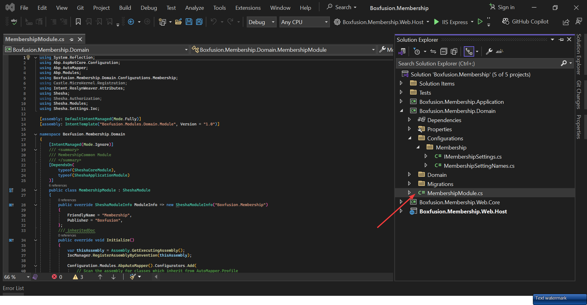
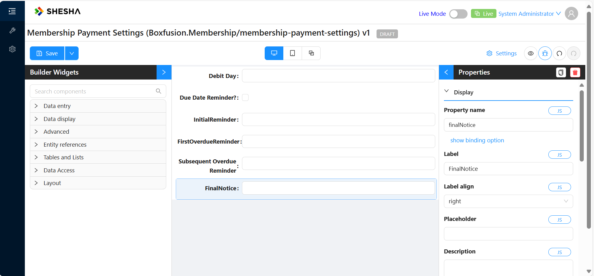
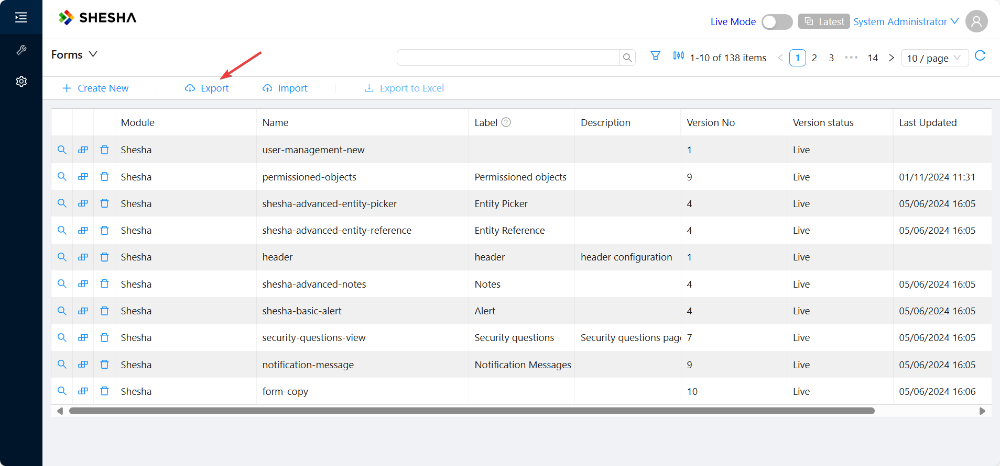
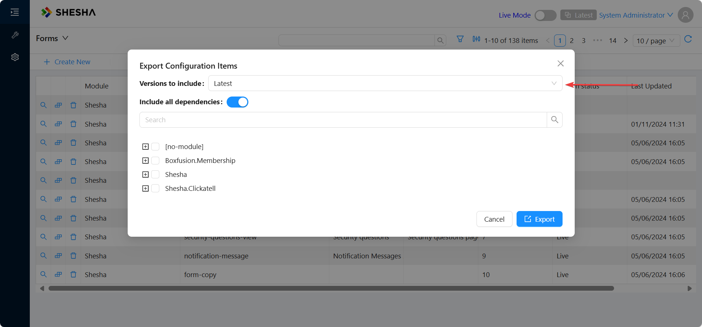
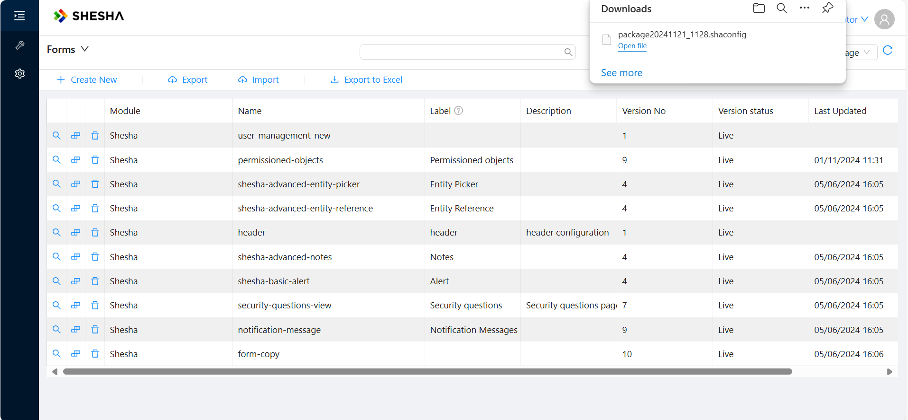
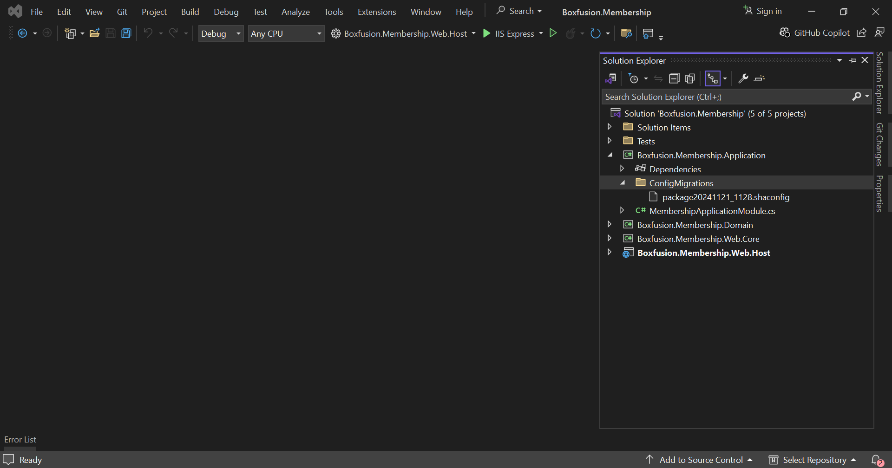
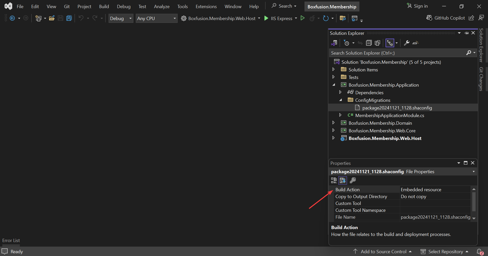
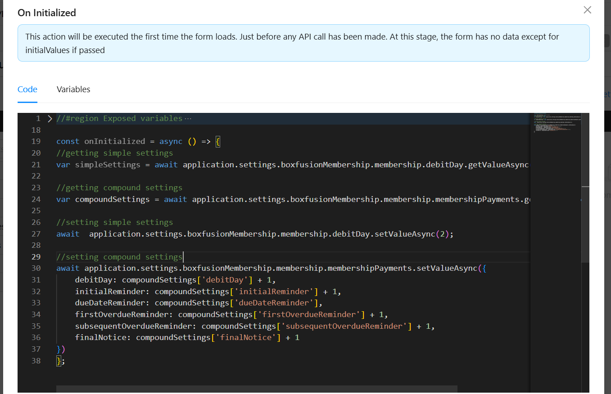

# Implementation of Settings

Shesha uses custom implementation of the application settings. Key features:
1. Settings are strongly typed on the back-end, a developer doesn't need to serialize/deserialize values from strings.
2. Auto-registration of setting accessors.
3. Setting definitions are stored in the DB.
4. Settings defined in the code gets saved to the DB at the application start.
4. Support of client specific settings.
5. Unlimited length of the setting value.

## How to define a setting
A setting must be defined before its use, it should be done in two steps:
1. Define a settings accessor.
2. Register accessors and provide default values.

### Define a settings accessor
Settings accessor is an interface that provides an access to settings values, also it's used to define setting details (display name, description etc.).
You just need to create and interface that extends `ISettingAccessors` and add property for each setting as `ISettingAccessor<T>` where T - type of the setting.

```cs
    [Category("Membership")]
    public interface IMembershipSettings : ISettingAccessors
    {
        ///<summary>
        ///
        ///</summary>
        [Display(Name = "Debit day", Description = "Specific day on which a financial transaction is processed.")]
        [Setting(MembershipSettingNames.DebitDay)]   
        ISettingAccessor<int> DebitDay { get; set; }

        ///<summary>
        ///
        ///</summary>
        [Display(Name = "Membership Payments", Description = "Membership Payment debit days and reminder frequencies.")]
        [Setting(MembershipSettingNames.MembershipPayments, EditorFormName = "membership-payment-settings")]
        ISettingAccessor<MembershipPaymentSettings> MembershipPayments { get; set; }
    }
``` 

On the example above you can see the `IMembershipSettings` interface, it has 2 strongly typed properties:
1. DebitDay - `int`
2. MembershipPayments - complex object of type `MembershipPaymentSettings`

Properties and the interface itself are decorated with the following attributes:
1. `DisplayAttribute` - is used to define a `Display Name`, `Description` and `Category` (using `GroupName` property)
2. `Category` - defines `Category` of the setting, can be applied on the interface level. Note: if the `CategoryAttribute` and `DisplayAttribute` are defined at the same time on the property level the value from `CategoryAttribute` will be applied.
3. `Setting` - defines setting-specific properties:
    - 3.1 `Name` - name of the setting. Property name is used when attribute is missing
    - 3.2 `IsClientSpecific` - indicates that the setting is a client-specific
    - 3.3 `EditorFormName` - name of the custom form that is used as a setting editor
    - 3.4 `IsUserSpecific` - settings that are tailored to individual users

### Register a settings accessor
After creating a settings accessor, we must register it in the PreInitialize method of our module:
```cs
            IocManager.RegisterSettingAccessor<IMembershipSettings>(x =>
            {
                x.DebitDay.WithDefaultValue(1);
                x.MembershipPayments.WithDefaultValue(new MembershipPaymentSettings
                {
                    DebitDay = 1,
                    InitialReminder = 3,
                    DueDateReminder = true,
                    FirstOverdueReminder = 1,
                    SubsequentOverdueReminder = 7,
                    FinalNotice = 30
                });
            });
```

## Simple Application Settings

We'll kick off this section by configuring the simple setting that describes a **Debit day**, which we have previously [defined](#define-a-settings-accessor). This is the day a customer's membership payment is debited from their bank account.

In your Shesha Backend Application, Navigate to the `domain` layer and create a folder called `Configurations`. Then while in the `Configurations` folder, add another folder called `Membership` which gives us some flexibility, in case we want to add other types of settings


In the `Membership` folder, create a new file called `MembershipSettingNames` and add the below code snippet to it 

```cs
    public class MembershipSettingNames
    {
        public const string DebitDay = "Shesha.Membership.DebitDay";
    }
```

This file will store our **Debit day** setting, as well as an additional setting we want to add to the module.

Next, create an Interface class called `IMembershipSettings` that extends the [ISettingAccessors](#define-a-settings-accessor) class and then add the code below to it; 

```cs
    [Category("Membership")]
    public interface IMembershipSettings : ISettingAccessors
    {
        ///<summary>
        ///
        ///</summary>
        [Display(Name = "Debit day", Description = "Specific day on which a financial transaction is processed.")]
        [Setting(MembershipSettingNames.DebitDay)]   
        ISettingAccessor<int> DebitDay { get; set; }

    }
```

Next is to head over to your Module file, depending on what your application name is;



And then in the `PreInitialize` method, add the following code;

```cs
    public override void PreInitialize()
    {
        base.PreInitialize();
        IocManager.RegisterSettingAccessor<IMembershipSettings>(x => x.DebitDay.WithDefaultValue(1));
    }
```

Here, we have registered the **Debit day** setting and given it a default value of One(1), which means we want the debit to occur on the first day of each month.

Now, run your backend and head over to your local build to see the setting we've just created.

Under `Configurations` and then `Settings` you should see the new **Debit day** setting under the module `Membership`.


## Compound Application Settings

Let's create some more settings to give the user more control of the application. We're going to create some Compound settings that will handle more of the payment model. This section builds upon the [Simple settings](#simple-application-settings) section to help differentiate and understand both more easily, so please review that that section first if you haven’t already.

First thing is to create a new `MembershipSettingName` called `MembershipPayments`, like so;

```cs
    public class MembershipSettingNames
    {
        public const string DebitDay = "Shesha.Membership.DebitDay";

        public const string MembershipPayments = "Shesha.Membership.Payments";
    }
```

**MembershipPayments** is the name of the Compound Setting, similar to how **Debit day** was the name of our simple setting. 

Next, in the Domain Layer, under the **Configuration** and then **Membership** folders, create a new class called `MembershipPaymentSettings` with this piece of code added;

```cs
    public class MembershipPaymentSettings
    {
        /// <summary>
        /// Specific day on which a financial transaction is processed, resulting in the withdrawal of funds from an account.
        /// </summary>
        public int DebitDay { get; set; }

        /// <summary>
        /// Sent a few days before the payment due date to remind the debtor of upcoming payment.
        /// </summary>
        public int InitialReminder { get; set; }

        /// <summary>
        /// Sent on the due date to remind the debtor that the payment is due today.
        /// </summary>
        public bool DueDateReminder { get; set; }

        /// <summary>
        /// Sent immediately after the payment is overdue, typically 1-3 days after the due date.
        /// </summary>
        public int FirstOverdueReminder { get; set; }

        /// <summary>
        /// Sent at regular intervals (e.g every 7, 14, or 30 days) until the payment is made or further action is taken.
        /// </summary>
        public int SubsequentOverdueReminder { get; set; }

        /// <summary>
        /// A stern reminder sent when the payment is significantly overdue, often indicating potential legal action.
        /// </summary>
        public int FinalNotice {  get; set; }
    }
```

Now, let's add a new property to the `IMembershipSettings` class;

```cs
    [Category("Membership")]
    public interface IMembershipSettings : ISettingAccessors
    {

        ......

        ///<summary>
        ///
        ///</summary>
        [Display(Name = "Membership Payments", Description = "Membership Payment debit days and reminder frequencies.")]
        [Setting(MembershipSettingNames.MembershipPayments, EditorFormName = "membership-payment-settings")]
        ISettingAccessor<MembershipPaymentSettings> MembershipPayments { get; set; }
    }
```

We have created a new property `MembershipPayments`, with its `ISettingAccessor<T>` type set to the `MembershipPaymentSettings` class we just created.

Please take note of the `EditorFormName` property, as with Compound settings, we'll need to bind that particular property to a configurable Form on the frontend, so the `EditorFormName` property name must match the exact form name that was configured.

Just like the Simple Settings before, the last step is to register our new Compound Settings in the module file with default values, so modify the `PreInitialize` method so it looks like this;

```cs
        public override void PreInitialize()
        {
            base.PreInitialize();
            IocManager.RegisterSettingAccessor<IMembershipSettings>(x =>
            {
                x.DebitDay.WithDefaultValue(1);
                x.MembershipPayments.WithDefaultValue(new MembershipPaymentSettings
                {
                    DebitDay = 1,
                    InitialReminder = 3,
                    DueDateReminder = true,
                    FirstOverdueReminder = 1,
                    SubsequentOverdueReminder = 7,
                    FinalNotice = 30
                });
            });
        }
```

To be able to check out the new Compound setting, create a new form and set its name to the same name as the `EditorFormName` we discussed earlier. 


Next, add all the properties in `MembershipPaymentSettings` class to the new form. Make sure to camelCase the property name and add tool descriptions so that the end user has an idea what a property does.



When you navigate to `Configurations` and then `Settings` you should see the new **Membership Payments** compound settings under the module `Membership`.


## Configuration Migrations

In this section, we'll look at how we can make configurations, which are available in one environment, and have them deployed to another(i.e Test, QA or Production)

We'll try to export the Compound Application Setting we just defined above and then have then deployed in any environment we want.

First, we'll navigate to our **Forms** view and click the **Export** button



Make sure to toggle the version of your Form to make what you're working with. In our case we will use **Latest** just because we have not published our form and there is not a live version as yet.



Next is select the module and then select our configured form, which in our case is the **membership-payment-settings** form and then click **Export**.


Clicking this create a *.shaconfig* file that provides the configuration in Json format.



To have the configuration available as part of our application, we need to add it as sort of a migration. 

Now, in the **Application** layer in your backend, create a folder called **ConfigMigrations** and paste in the downloaded *.shaconfig* file



Next, is to set the Build Action of the *.shaconfig* file to **Embedded Resource** in the file properties pane.
This makes sure the configuration file is embedded within the *.dll* that gets compiled.



## Read and write setting values on back-end
To read and write setting values you just need to resolve your settings interface (`IMembershipSettings` from the example above) and use it's properties. Shesha generates an implementation of the interface automatically when you call `RegisterSettingAccessor`.

In the example below we resolve `IMembershipSettings` using constructor injection. The `TestSetting` method reads and writes both the `DebitDay` and `MembershipPayments`, 

```cs
  private readonly IMembershipSettings _membershipSettings;

  public PaymentReminderJob(IMembershipSettings membershipSettings)
  {
          _membershipSettings = membershipSettings;
  }

  public async Task TestSetting()
  {
      //Get Simple application settings
      var simpleSettings = await _membershipSettings.DebitDay.GetValueAsync();

      //Get Compound application settings
      var compoundSettings = await _membershipSettings.MembershipPayments.GetValueAsync();

      var finalNotice =compoundSettings.FinalNotice;

      //Update Simple application settings
      await _membershipSettings.DebitDay.SetValueAsync(simpleSettings + 1);

      //Update Compound application settings
      await _membershipSettings.MembershipPayments.SetValueAsync(new MembershipPaymentSettings
      {
          DebitDay = compoundSettings.DebitDay + 1,
          InitialReminder = compoundSettings.InitialReminder + 1,
          DueDateReminder = compoundSettings.DueDateReminder,
          FirstOverdueReminder = compoundSettings.FirstOverdueReminder + 1,
          SubsequentOverdueReminder = compoundSettings.SubsequentOverdueReminder + 1,
          FinalNotice = compoundSettings.FinalNotice + 1
      });
  }
```

For Simple settings, it is enough to simply await the `GetValueAsync` method to get the values that have been set. However, for Compound settings, awaiting the `GetValueAsync` method returns an object that contains all the properties contained. This is the `compoundSettings` object from the snippet above.

Updating Settings follows a similar pattern. For Simple settings, we can await the `SetValueAsync` method and provide a single updated value by incrementing its current value by **1**. For Compound Settings, we need to create a new instance of the Compound setting object, in our case this is `MembershipPaymentSettings`, and set each property of the object individually.


Note: client-specific settings are handled automatically and you can use the same methods `GetValueAsync` and `SetValueAsync` for reading and writing.

## Read setting values on front-end
The read and write functionalities are accessible via the frontend under the **application** object, which is available on all the code editors across all forms.

The **application** object gives you access to the different settings that have been registered on the application, giving you flexibility to read or write to your settings from anywhere on your application.




## User Specific Settings
Shesha also supports user-specific settings, allowing you to define and manage settings that are tailored to individual users. These settings can be used for personal preferences or user-specific configurations, offering greater flexibility and personalization.

Practical examples of this implementation could be `Notification Preferences`
- `Email Notifications`: Users can configure how frequently they receive email updates (e.g., daily, weekly, or instant).
    - Example: LinkedIn lets users adjust email notifications for connections, messages, and job recommendations.
- `Push Notifications`: Allow users to enable or disable specific push notifications, such as reminders or promotional messages.
    - Example: A weather app like AccuWeather enables users to choose notifications for severe weather alerts.

### Define User Specific Settings
Defining user-specific settings is similar to the process for global settings but includes an additional step to specify that the setting is tied to a particular user.

#### 1. Define the User Setting Names
Add a static class to define the user-specific setting names. This helps ensure consistency when referencing the settings.

``` csharp
public class UserSettingNames
{
    public const string NotificationFrequency = "Shesha.User.NotificationFrequency";
    public const string EnablePushNotifications = "Shesha.User.EnablePushNotifications";
}

```

#### 2. Define a User-Specific Settings Accessor

Create an interface that extends `ISettingAccessors`, just like other settings. Use the `IsUserSpecific` property of the `Setting` attribute to indicate that the setting is user-specific.

Example: 
```csharp
[Category("Notification Preferences")]
public interface IUserNotificationPreferenceSettings : ISettingAccessors
{
    ///<summary>
    /// 
    ///</summary>
    [Display(Name = "Notification Frequency", Description = "Users can configure how frequently they receive email updates (e.g., daily, weekly, or instant).")]
    [Setting(UserSettingNames.NotificationFrequency, IsUserSpecific = true)]
    ISettingAccessor<string> NotificationFrequency { get; set; }

    ///<summary>
    /// 
    ///</summary>
    [Display(Name = "Enable Push Notifications", Description = "Allow users to enable or disable specific push notifications, such as reminders or promotional messages.")]
    [Setting(UserSettingNames.EnablePushNotifications, IsUserSpecific = true)]
    ISettingAccessor<bool> EnablePushNotifications { get; set; }
}
```
#### 3. Register the User Settings Accessor
Just like with global settings, register the user-specific settings accessor in the PreInitialize method of your module. Provide default values that will be applied if a user-specific value has not been set.

```csharp
public override void PreInitialize()
{
    base.PreInitialize();

    IocManager.RegisterSettingAccessor<IUserSettings>(x =>
    {
        x.NotificationFrequency.WithDefaultValue("Weekly");
        x.EnablePushNotifications.WithDefaultValue(true);
    });
}
```

### Back-End API Design

#### Get Endpoint
- URL: `/api/services/app/Settings/GetUserValue`
- Method: `GET`
- Parameters:
    - `moduleName` (string) - Specifies the module name to which the setting belongs.
    - `settingName` (string) - Name of the setting to retrieve.
    - `defaultValue` (optional, string) - Value to use if the setting does not already exist.
    - `dataType` (optional, string) - Specifies the data type for validation before saving.

- Behavior:
    - Check if the setting exists for the user in the database - these are settings created by defined [settings accessors](/docs/fundamentals/app-settings#2-define-a-user-specific-settings-accessor)
    - If it does not exist:
        - Create the setting with the provided `defaultValue`,  if specified.
        - If `defaultValue` is not provided, use the `defaultValue` from the [UserSettingConfig](/docs/fundamentals/app-settings#3-register-the-user-settings-accessor) (if it exists).
        - If no `defaultValue` is found, use an empty string ("").

#### Update Endpoint
- URL: `/api/services/app/Settings/UpdateUserValue`
- Method: `POST`
- Parameters:
    - `moduleName` (string) - Specifies the module name to which the setting belongs.
    - `settingName` (string) - Name of the setting to update.
    - `defaultValue` (optional, string) - Value to set for the setting.
    - `dataType` (optional, string) - Specifies the data type for validation before saving.
    
- Behavior:
    - Check if the setting exists for the user in the database - these are settings created by defined [settings accessors](/docs/fundamentals/app-settings#2-define-a-user-specific-settings-accessor)
    - If it does not exist:
        - Create the setting with the provided `defaultValue`.
        - Validate the `defaultValue` by attempting to deserialize it into the `dataType` (if provided). If validation fails, return an error.
    - If it exists, update the setting with the new value.
    - Save the updated setting in the database.

### Read user setting values on front-end
The read and write functionalities are accessible via the frontend under the application object, which is available on all the code editors across all forms.

The `application.user` object gives you access to the different endpoints exposed for reading and updating user specific settings, giving you flexibility to read or write to your settings from anywhere on your application.

#### Get Endpoint
``` javascript
(method) UserApi.getUserSettingValueAsync(name: string, module: string, defaultValue?: any, dataType?: string): Promise<any>
Get User Setting
```

#### Update Endpoint
``` javascript
(method) UserApi.updateUserSettingValueAsync(name: string, module: string, value: any, dataType?: string): Promise<void>
Update User Setting
```

