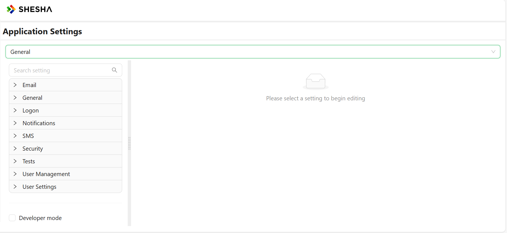
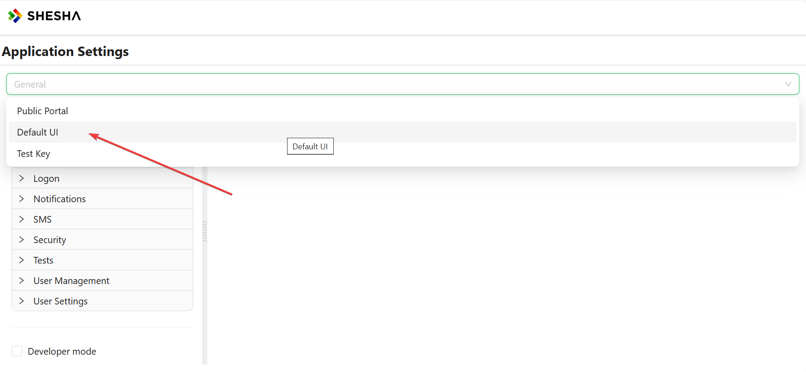
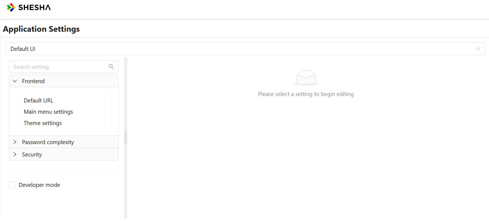
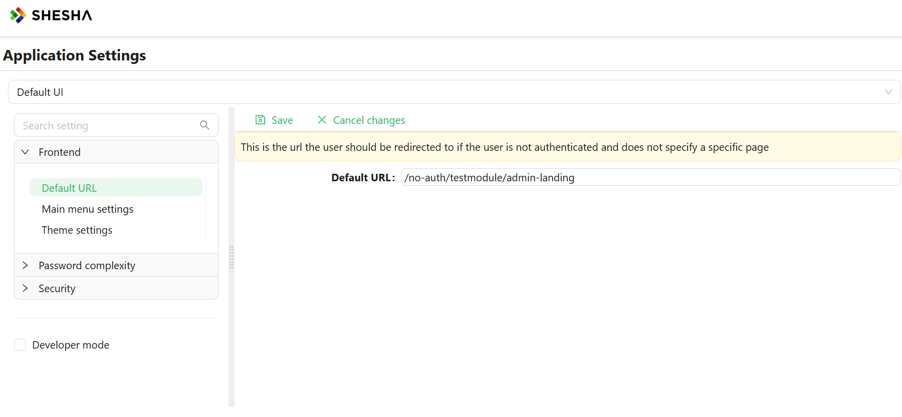
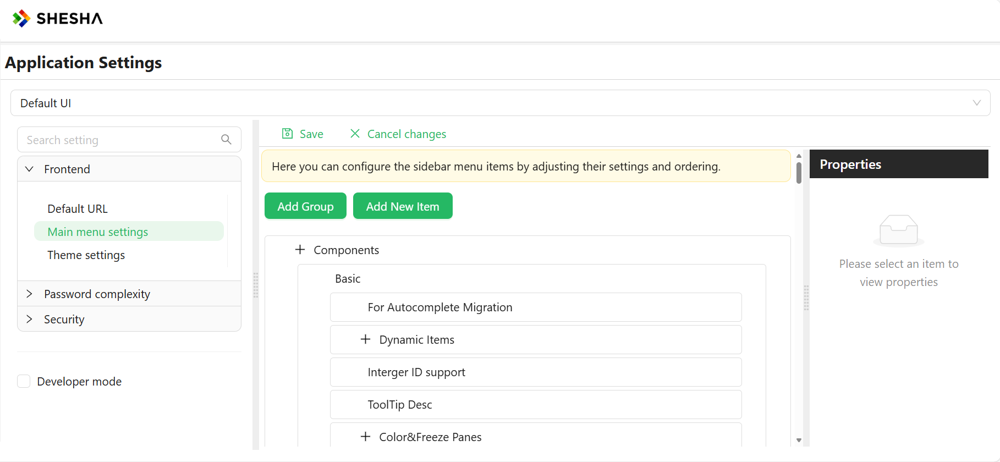
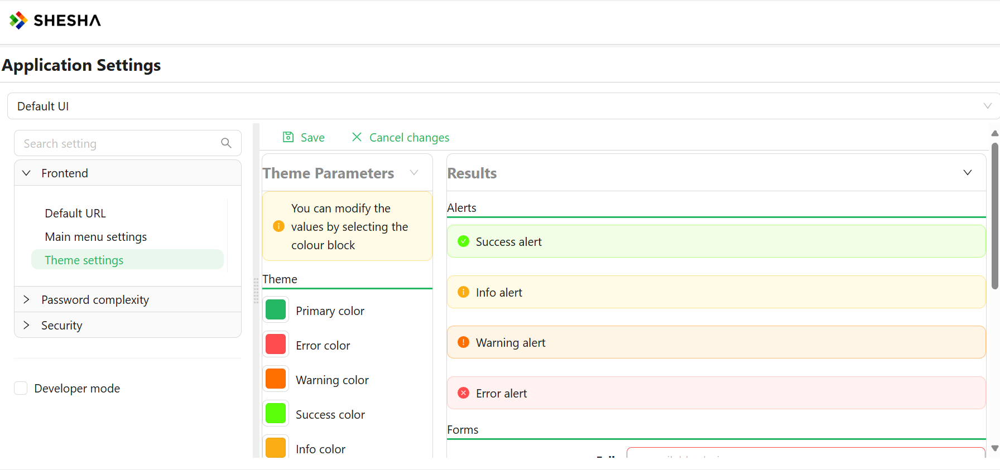
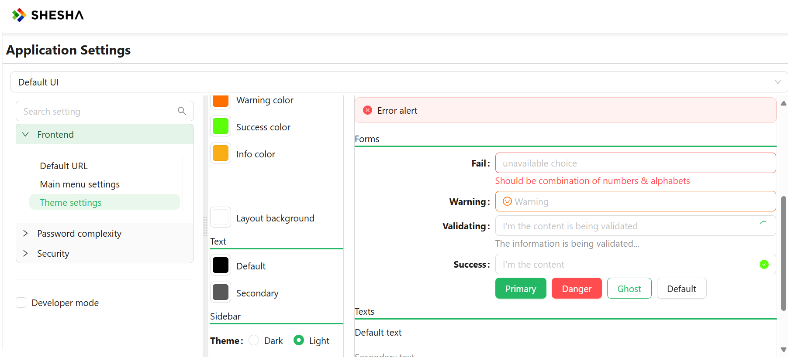

# General Settings

The general settings page displays all settings supported across all frontends in the application.

# Frontend-Specific settings
Shesha allows users to select any  registered front-ends in the application. 

Upon selecting a frontend application from the dropdown, the front-end specific settings are listed.

In our case, our selected Frontend from the dropdown will be **Default UI**

Upon selecting the desired frontend, The **Frontend** tab is displayed with the following options:
    - **Default URL**
    - **Main Menu Settings**
    - **Theme settings**

## Default URL

This is the URL the user will be redirected to if user is not authenticated to access a specific page.

## Main Menu Settings

The main menu is the primary means of navigating through the system. It is highly configurable, allowing you to edit which menu items are visible to the user, as well as which roles and permissions have visibility of these menu items and groups.

To modify the main menu, use edit mode. Refer to [this article](../front-end-basics/configured-views/toggling-edit-mode) for instructions on accessing edit mode.

Groups and items share several editable properties, listed below:

- **Title:** The text for the menu item displayed to the user.
- **Tooltip:** Information displayed when the user hovers over the menu item.
- **Icon:** An icon from the icons library describing the menu item.
- **Visibility:** Used to modify the visibility of the menu item using scripting.
- **Permissions:** Appropriate permissions for viewing and interacting with the menu item. Detailed information is available in the [Permission Based Security Model](/docs/manage-apps-and-users/permisson-based-model) article.

While in the edit menu option, you can add groups and buttons using the "Add Group" or "Add New Item" buttons.

## Groups

Groups are container menu items that do not redirect, navigate, or execute any code upon being clicked. They are used solely to arrange common logical items together to enhance navigation.

## Items

Items are interactive menu items designed to allow the user to navigate through the system when clicked or perform certain actions based on the item type.

- **Line and Separator:** Visual elements used to separate items.
- **Button:** Navigates and executes scripts or code, introducing three new properties that can be configured based on the selected Button Action.

# Theming

App theming allows you to style your pages and widgets using global controls, making it easy to change the visual layout with a single click.

Customize the look and feel of your Shesha applications with our comprehensive theming guide. Discover how to create visually stunning interfaces by manipulating color schemes, typography, and other design elements. This section walks you through the process of applying and customizing themes, allowing you to tailor the user experience to match your brand or project requirements seamlessly.

