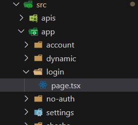

# Implementation

If your project's login page is not yet wired up to the configurable `Shesha/login` form, open `src/app/login/page.tsx` in your frontend project, remove its entire content, and replace it with the snippet below.

---

## Locate the File

The file lives under your project's `src/app` folder, alongside the other route folders such as `account` and `dynamic`.



---

## Replace the Content

```tsx
'use client';

import React from 'react';
import {
  ConfigurableForm,
  FormFullName,
  LOGIN_CONFIGURATION,
  PageWithLayout,
} from '@shesha-io/reactjs';

interface IProps {}

const Login: PageWithLayout<IProps> = () => (
  <ConfigurableForm mode={'edit'} formId={LOGIN_CONFIGURATION as FormFullName} />
);

export default Login;
```

`LOGIN_CONFIGURATION` is a constant exported by `@shesha-io/reactjs` that points at the `Shesha/login` form described in [Design](./design.md). Passing it to `ConfigurableForm` in `edit` mode renders that form as the login page, so any changes you make to the form in the designer are reflected here without touching this file again.
