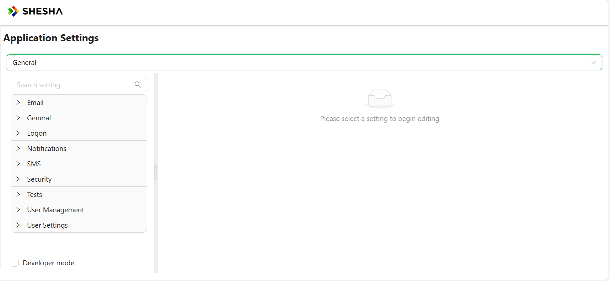
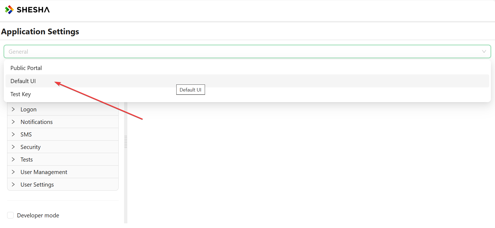
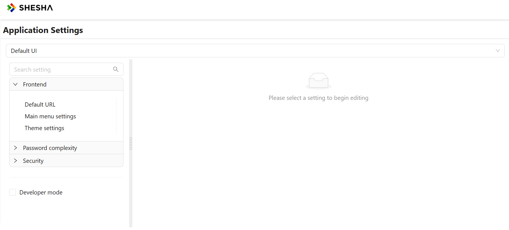
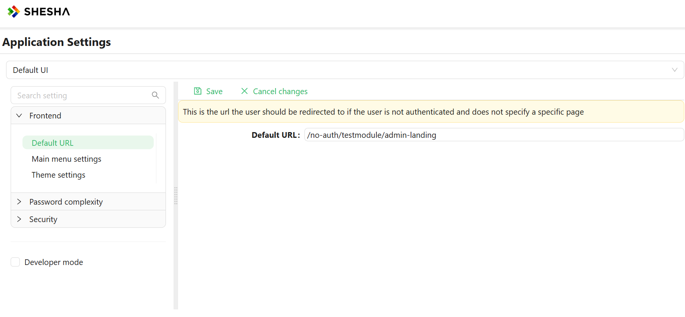
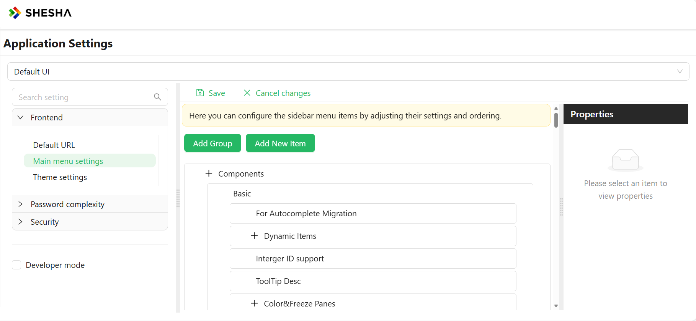
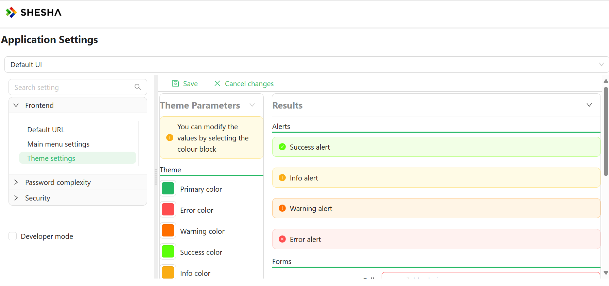
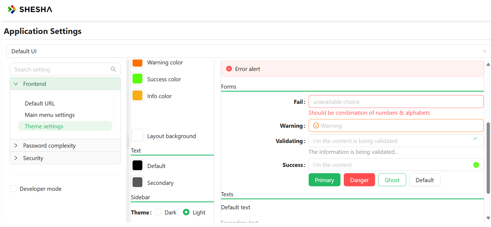

# Settings Page Overview

The Settings page lets administrators change how a Shesha application behaves without editing code or redeploying it. Every setting is either global, meaning it applies once across the whole application, or scoped to a single registered front-end application, meaning it can hold a different value for each front-end you've registered (for example, a web portal versus a mobile app). This page explains how to move between the two views, and shows how settings you'll recognise, like account lockout, are split across them.

---

## General Settings

The **General** view is what you land on when you open the Settings page. It lists every setting that has not been marked as specific to a front-end application, grouped into categories such as Security, Password complexity, or any custom category your own modules register.

A setting appears under General when its definition does not mark it as specific to a front-end application. That single value applies no matter which front-end, web, mobile, or otherwise, is calling the application.

For example, in the built-in **Security** category, the following settings live under General because they represent one application-wide policy:

- Auto logoff timeout
- Whether password reset via email link is enabled, and the link's lifetime
- Whether password reset via SMS OTP is enabled, and the OTP's lifetime
- Whether password reset via security questions is enabled, and how many questions are allowed
- The [default endpoint access](/docs/fundamentals/security/endpoint-permissions) used when an API endpoint's access is set to "Inherited"

<LayoutBanners url="https://app.guideflow.com/embed/1pzw2oltmp" type={1}/>
---

## Frontend-Specific Settings

Shesha lets more than one front-end application register against the same back end, for example a web portal alongside a companion mobile app. Selecting one of these from the dropdown at the top of the Settings page switches the list to that front-end's own settings.

In our case, our selected Frontend from the dropdown will be **Default UI**, the front-end Shesha ships with out of the box.

A setting appears under a selected front-end, instead of under General, when its definition marks it as specific to a front-end application, meaning it can be given a different value for each front-end you've registered. Returning to the **Security** category as an example, its account lockout settings (`Is user lockout enabled`, `Max failed login attempts before lockout`, `User lockout (sec)`) live under a selected front-end instead of General, because each front-end can enforce its own lockout policy. See [Password Policy and Account Lockout](/docs/fundamentals/security/authentication) for what each of these settings controls.

:::tip Deciding where a setting belongs
Ask whether the value could reasonably differ between two front-ends. If it could, it is front-end specific and shows up under that front-end's tab. If it should always be a single value for the whole application, it belongs under General.
:::

<LayoutBanners url="https://app.guideflow.com/embed/ok8ve9ysqp" type={1}/>

Upon selecting the desired frontend, the **Frontend** tab is displayed with the following options: **Default URL**, **Main Menu Settings**, and **Theme settings**.

### Default URL

This is the URL the user is redirected to if they are not authenticated to access a specific page.

### Main Menu Settings

The main menu is the primary means of navigating through the system. It is highly configurable, allowing you to edit which menu items are visible to the user, as well as which roles and permissions have visibility of these menu items and groups.

To modify the main menu, use edit mode. Refer to [this article](../front-end-basics/configured-views/toggling-edit-mode) for instructions on accessing edit mode.

Groups and items share several editable properties, listed below:

- **Title:** The text for the menu item displayed to the user.
- **Tooltip:** Information displayed when the user hovers over the menu item.
- **Icon:** An icon from the icons library describing the menu item.
- **Visibility:** Used to modify the visibility of the menu item using scripting.
- **Permissions:** Appropriate permissions for viewing and interacting with the menu item. Detailed information is available in the [Permission Based Security Model](/docs/manage-apps-and-users/permission-based-model) article.

While in the edit menu option, you can add groups and buttons using the "Add Group" or "Add New Item" buttons.

#### Groups

Groups are container menu items that do not redirect, navigate, or execute any code upon being clicked. They are used solely to arrange common logical items together to enhance navigation.

#### Items

Items are interactive menu items designed to allow the user to navigate through the system when clicked or perform certain actions based on the item type.

- **Line and Separator:** Visual elements used to separate items.
- **Button:** Navigates and executes scripts or code, introducing three new properties that can be configured based on the selected Button Action.

---

## Theming

App theming allows you to style your pages and widgets using global controls, making it easy to change the visual layout with a single click.

Customize the look and feel of your Shesha applications with our comprehensive theming guide. Discover how to create visually stunning interfaces by manipulating color schemes, typography, and other design elements. This section walks you through the process of applying and customizing themes, allowing you to tailor the user experience to match your brand or project requirements seamlessly.

