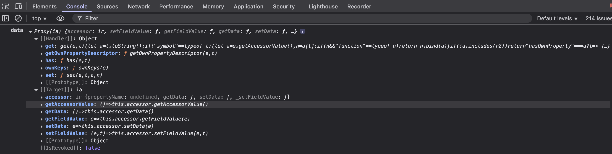

# Proxying Input Variables

Component settings such as Visible and Interaction Mode can be configured with a switch or calculated with a JavaScript expression. When Shesha runs one of those expressions, it does not hand your code the raw objects. It hands you proxies that track which values you actually read, so a setting is only recalculated when something it depends on changes. This page explains what that means for the scripts you write.

---

## Why the Values Are Proxied

Consider a form with `firstName`, `lastName`, and `description` fields, where the **Visible** setting on `description` is configured as:

```javascript
return formData.firstName?.length > 3;
```

The expression reads `firstName` and nothing else, so Shesha re-evaluates it only when `firstName` changes. Editing `lastName` does not trigger it.



Without this, changing any field would re-run every expression on every component, and re-render the whole form with it. That is unnoticeable on a form with two or three components. On a form with twenty fields, tabs, and subforms it produces a visible lag on every keystroke.

To make the tracking possible, every input variable in an expression is wrapped in a proxy that records which properties are read. Accessing a property returns the real value, so your code behaves exactly as written.

---

## Logging a Proxied Variable

Because the variables are proxies, logging one directly shows the proxy rather than the data.

```javascript
// Both of these log the proxy object, not the underlying values.
console.log(formData);
console.log(JSON.stringify(formData));
```

Every scripted setting runs inside an implicit object named `context` that holds all the values available to the script. The hidden `test.getArguments(...)` helper unwraps it, returning an array with one small object per exposed value, each already free of its proxy.

```javascript
const getVisible = () => {
  console.log(test.getArguments(context));
  return true;
};
```

:::warning Pass context, not arguments
`test.getArguments(arguments)` does not return the individual values. It returns a single-element array holding the whole, still-wrapped `context` object, which is no more readable than logging the proxy directly. Pass the `context` identifier itself.
:::

See [Output the Data Object](../../debugging-scripts/output-the-data-object.md) for more on inspecting script data.

---

## Writing Data Directly

Proxying is also what lets you assign to form data and contexts directly, rather than calling a setter.

**Form type to use:** Edit Form - use when the user is updating an existing record.

**Example - Append to a field's value:**

```javascript
formData.firstName = formData.firstName + ' test';
```

The same applies to context data:

```javascript
page.state.selectedRegion = formData.region;
```

:::note Setters still work
`form.setFieldsValue({ ... })` remains the right choice when you are setting several fields at once, or setting values from an event handler rather than an expression. See [Form Instance API](../../javascript-api/form.md).
:::
