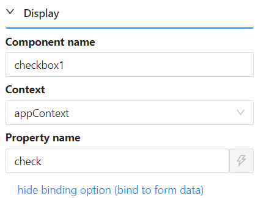

# App Context

App Context is a storage area shared by the whole application, useful for settings, configuration, or a value that needs to be shared across different parts of the application rather than kept on a single form. In scripts you reach it through `application.state`.

See [Data Contexts](../../../javascript-api/data-contexts.md) for how it compares to page and form scope, and [Application API](../../../javascript-api/application/application.md) for the full reference. This page covers binding a component directly to it.

---

## Binding a Component to App Context

A component is bound to App Context the same way as any other context: give it a [Property Name](../../../form-components/common-component-properties.md#property-name-string), then set its **Context** property to `appContext`.



---

## Reading the Bound Value in a Script

Suppose a Checkbox component's Property Name is `check` and its Context is set to `appContext`, as in the screenshot above. Its value is then available anywhere in a script as:

```javascript
application.state.check
```

:::info Driving conditional logic across forms
Binding several components to App Context lets one field's value, a checkbox for example, drive conditional logic on others: how many fields are shown, which are required, or whether they can be edited. Because every component bound to `appContext` shares the same storage across the whole application, that logic keeps working after the user navigates to a different page.
:::

:::note contexts.appContext still resolves
Scripts written against earlier versions used `contexts.appContext.check`. That still works at runtime, so existing forms keep running, but it is no longer suggested or type-checked in the editor. Use `application.state` in new scripts.
:::
