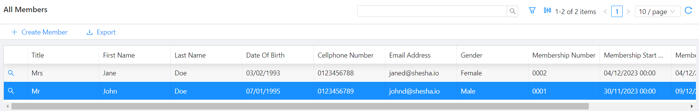

# Selected Row

When a user clicks a row in a DataTable or DataList, that row becomes the component's selected row. A script can read it to find out which record the user is working with, which is what drives actions such as opening the selected record, deleting it, or passing its id to another form.

---

## Reading the Selected Row

The selected row belongs to the table, so you read it from the table component through [`form.components`](../../../javascript-api/form.md), keyed by the component's [Property Name](../../../form-components/common-component-properties.md#property-name-string).

Assuming a [DataTable Context](../../../form-components/tables-lists/datatable-context.md) component with a Property Name of `indexTable`:

```javascript
form.components.indexTable.selectedRow
```



:::warning Always check that a row is selected
Nothing is selected until the user clicks a row, so `selectedRow` is undefined when a page first loads. Guard on it before reading anything off it, or the script fails the moment someone clicks the button without picking a row.
:::

**Form type to use:** Table / List View - use when showing multiple records.

**Example - Open the selected record:**

```javascript
const onClickAsync = async () => {
  const selected = form.components.indexTable?.selectedRow;
  if (!selected) {
    actions.showMessage.warning('Select a row first.');
    return;
  }

  actions.navigateToForm(
    { name: 'member-details', module: 'Shesha.Membership' },
    { id: selected.id }
  );
};
```

---

## What the Table Exposes

`selectedRow` is one of several values a DataTable publishes. The others are useful when a script needs to act on more than the current row.

| Value | What it holds |
|---|---|
| `selectedRow` | The row the user last clicked, including its `id`, its `index`, and the row's field values under `row` |
| `selectedRows` | Every row selected, when the table allows multiple selection |
| `selectedIds` | The ids of the selected rows |
| `tableData` | The rows currently loaded into the table |
| `totalRows` | The total number of rows matching the current filter |
| `currentPage` | The page number currently shown |
| `quickSearch` | The text currently in the quick search box |
| `api` | Actions you can call on the table, such as `refreshTable()` |

**Example - Refresh the table after acting on the selected row:**

```javascript
const onClickAsync = async () => {
  const selected = form.components.indexTable?.selectedRow;
  if (!selected) return;

  await actions.callApi.delete(`/api/dynamic/Shesha/Person/Crud/Delete?id=${selected.id}`);
  form.components.indexTable.api.refreshTable();
};
```

---

## Inside a Row Action

A button in a table's action column, and a row event such as On Row Double Click, already run against the row they were triggered from. In those places `selectedRow` is available directly, without going through `form.components`, and `{{selectedRow.id}}` resolves in a Target Url template.

```javascript
// In a row action's Arguments script:
return { id: selectedRow?.id };
```

:::note The standalone selectedRow variable
Outside a table's own row actions, Shesha no longer offers a bare `selectedRow` variable pointing at the nearest table. Read the table you mean through `form.components`, which stays unambiguous when a page carries more than one table.
:::
