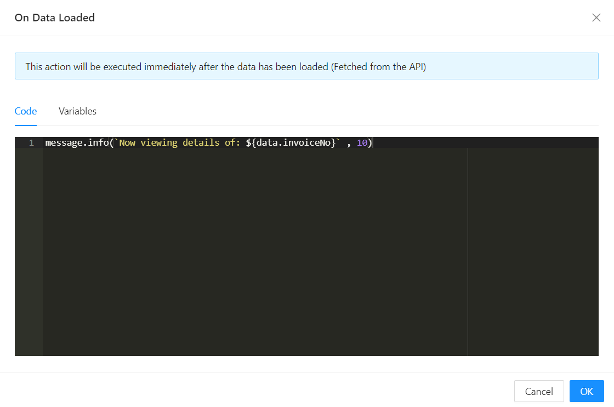

# On After Data Load

Shesha's actual label for this setting is **On After Data Load** (`onAfterDataLoad`), found in the Form Settings panel's Data tab, right next to a sibling **On Before Data Load** (`onBeforeDataLoad`) setting. It's a form-level lifecycle script, not a per-component event - use it to run logic once the form's data has finished loading and has been applied to the fields.



---

## When It Fires

`onAfterDataLoad` runs once each time the form loads or reloads its data - after the antd form's fields have been reset and populated with the loaded values, and after the form's data-loading state has been marked ready. `onBeforeDataLoad` fires just before that same data load starts, giving you a hook on both sides of the load.

Both are declared as `async` functions, so you can `await` inside them.

**Form type to use:** Edit Form or Details View - any form type where data is loaded for an existing record.

**Example - Show a toast once the record has loaded:**

```javascript
actions.showMessage.info(`Viewing invoice ${data.invoiceNumber}`);
```

:::note
Available inside this script are the standard script variables also used elsewhere in Shesha (`data`, `form`, `actions`, `utils`, `page`, `user`, and others) - see [Events](../../form-components/common-component-properties.md#events) in the common properties for the baseline set. At this point, `data` reflects the values just loaded onto the form.
:::
