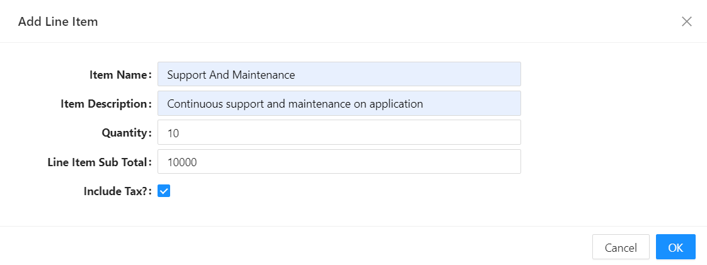

# Prepare Submit Data

:::note Also known as Prepared Values
`Prepared Values` is the legacy name for this event. In the current Form Designer, the same lifecycle point is labelled **Prepare Submit Data** (`onPrepareSubmitData`) on the form's Data tab, with the tooltip "Here you can modify data before the form submission". If you're maintaining an older form that still uses `preparedValues`, it is automatically migrated to `onPrepareSubmitData` the next time the form is opened, and behaves the same way.
:::

Prepare Submit Data lets you customise or transform the data that will be submitted from a form, right before the submission happens. This is useful whenever you need to perform additional processing, validation, or transformation of the form values before they reach the backend - for example, calculating a value that shouldn't be a visible field, or removing a helper field that only existed to drive other logic on the form.

Centralising this logic in one event, rather than scattering it across several field-level scripts, keeps data preparation consistent every time the form submits, and makes the same pattern reusable across other forms that need similar preparation.

---

## When It Fires

`onPrepareSubmitData` runs just before the application makes the API call to submit the form, using the form's configured `Submit Http Verb`. It runs after `On Values Update` has already applied the user's edits, and shortly before the `On Before Submit` step and the actual HTTP call.

:::danger Whatever you return replaces the entire payload
Unlike a typical merge helper, the object your script returns from `onPrepareSubmitData` **becomes the entire submit payload as-is** - it is not automatically combined with the form's other data. If you return an object containing only the fields you changed, every other field on the form is dropped from the request. Always spread the existing `data` first, then add, remove, or overwrite the fields you need to change.
:::

**Form type to use:** Edit Form or Create Form - any form type where an API call submits the form's data.

**Example - Calculate a tax amount and drop a helper field from the payload:**

In the example below, there is a checkbox on the UI named `includeTax` that should not be sent to the backend - it only exists to decide whether this invoice line item should be taxed. The script computes the tax, removes the helper field, and returns the rest of the form's data alongside the two new calculated fields.



```javascript
const tax = data.includeTax ? data.lineItemSubTotal * 0.15 : 0;

// Spread the existing data first, or every other field is dropped from the payload.
const { includeTax, ...payload } = data;

return {
  ...payload,
  taxAmount: tax,
  lineItemSubTotalInclTax: data.lineItemSubTotal + tax,
};
```
